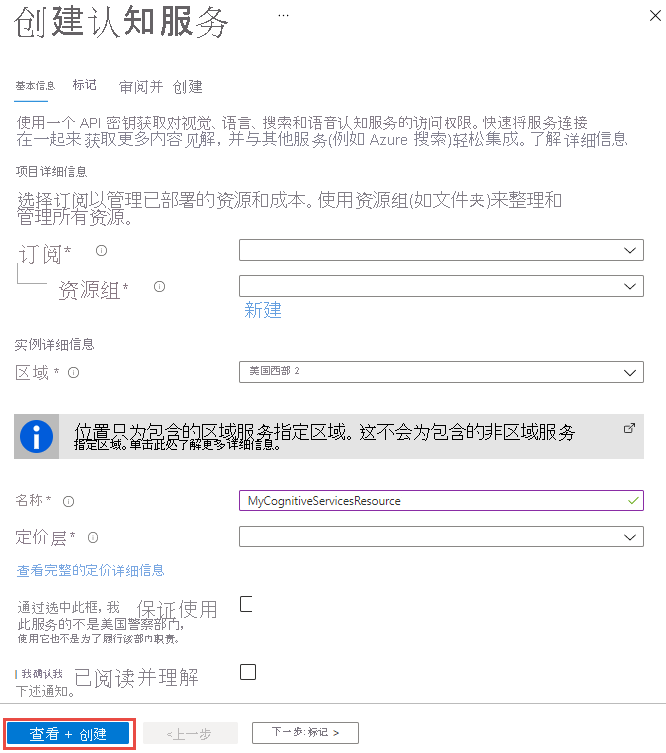
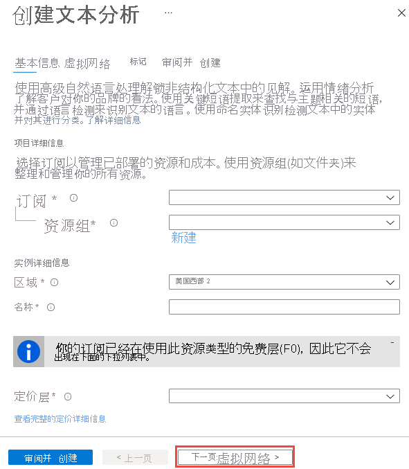

# 快速入门：使用 Azure 门户创建认知服务资源

使用此快速入门开始使用 Azure 认知服务。 在 Azure 门户中创建认知服务资源后，你将获得用于验证应用程序的终结点和密钥。

Azure 认知服务是包含 REST API 和客户端库 SDK 的基于云的服务，可帮助开发人员将认知智能内置于应用程序，而无需具备直接的人工智能 (AI) 或数据科学技能或知识。 借助 Azure 认知服务，开发人员可以通过能够看、听、说、理解甚至开始推理的认知解决方案，轻松将认知功能添加到他们的应用程序中。

[!INCLUDE [cognitive-services-subscription-types](../../includes/cognitive-services-subscription-types.md)]

## 先决条件

* 一个有效的 Azure 订阅 - [免费创建订阅](https://azure.microsoft.com/free/cognitive-services/)。
* [!INCLUDE [contributor-requirement](./includes/quickstarts/contributor-requirement.md)]

## 新建 Azure 认知服务资源

1. 创建资源。

### [多服务资源](#tab/multiservice)

多服务资源在门户中名为“认知服务”。 [创建认知服务资源](https://ms.portal.azure.com/#create/Microsoft.CognitiveServicesAllInOne)。

此时，多服务资源允许访问以下认知服务：

* **视觉** - 计算机视觉、自定义视觉、表单识别器、人脸
* **语音** - 语音
* **语言** - 语言理解 (LUIS) 、文本分析、翻译器
* **决策** - 内容审查器

### [单服务资源](#tab/singleservice)

使用以下链接为可用的认知服务创建资源：

| 影像                      | 语音                  | 语言                          | 决策             |
|-----------------------------|-------------------------|-----------------------------------|----------------------|
| [计算机视觉](https://ms.portal.azure.com/#create/Microsoft.CognitiveServicesComputerVision)         | [语音服务](https://ms.portal.azure.com/#create/Microsoft.CognitiveServicesSpeechServices)     | [沉浸式阅读器](https://ms.portal.azure.com/#create/Microsoft.CognitiveServicesImmersiveReader)              | [异常检测器](https://ms.portal.azure.com/#create/Microsoft.CognitiveServicesAnomalyDetector) | 
| [自定义视觉服务](https://ms.portal.azure.com/#create/Microsoft.CognitiveServicesCustomVision) |  | [语言理解 (LUIS)](https://ms.portal.azure.com/#create/Microsoft.CognitiveServicesLUISAllInOne) | [内容审查器](https://ms.portal.azure.com/#create/Microsoft.CognitiveServicesContentModerator) | 
| [人脸](https://ms.portal.azure.com/#create/Microsoft.CognitiveServicesFace)                    |                         | [QnA Maker](https://ms.portal.azure.com/#create/Microsoft.CognitiveServicesQnAMaker)                     | [个性化体验创建服务](https://ms.portal.azure.com/#create/Microsoft.CognitiveServicesPersonalizer)     |
| [表单识别器](https://ms.portal.azure.com/#create/Microsoft.CognitiveServicesFormRecognizer)        |                         | [文本分析](https://ms.portal.azure.com/#create/Microsoft.CognitiveServicesTextAnalytics)                |  [指标顾问](https://go.microsoft.com/fwlink/?linkid=2142156)                    |
| | | [翻译](https://ms.portal.azure.com/#create/Microsoft.CognitiveServicesTextTranslation) | |

---

2. 在“创建”页中提供以下信息： 
<!-- markdownlint-disable MD024 -->

### [多服务资源](#tab/multiservice)

|项目详细信息| 说明   |
|--|--|
| **订阅** | 选择一个可用的 Azure 订阅。 |
| **资源组** | 将包含认知服务资源的 Azure 资源组。 可以创建新组或将其添加到预先存在的组。 |
| **区域** | 认知服务实例的位置。 不同位置可能会导致延迟，但不会影响资源的运行时可用性。 |
| **名称** | 认知服务资源的描述性名称。 例如，*MyCognitiveServicesResource*。 |
| **定价层** | 认知服务帐户的费用取决于你所选的选项和你的使用情况。 有关详细信息，请参阅 API [定价详细信息](https://azure.microsoft.com/pricing/details/cognitive-services/)。

<!---->
:::image type="content" source="media/cognitive-services-apis-create-account/resource_create_screen-multi.png" alt-text="“创建多服务资源”屏幕":::

阅读并接受条件（适用于您），然后选择 **评审 + 创建**。

### [单服务资源](#tab/singleservice)

|项目详细信息| 说明   |
|--|--|
| **订阅** | 选择一个可用的 Azure 订阅。 |
| **资源组** | 将包含认知服务资源的 Azure 资源组。 可以创建新组或将其添加到预先存在的组。 |
| **区域** | 认知服务实例的位置。 不同位置可能会导致延迟，但不会影响资源的运行时可用性。 |
| **名称** | 认知服务资源的描述性名称。 例如，*MyCognitiveServicesResource*。 |
| **定价层** | 认知服务帐户的费用取决于你所选的选项和你的使用情况。 有关详细信息，请参阅 API [定价详细信息](https://azure.microsoft.com/pricing/details/cognitive-services/)。

<!---->
:::image type="content" source="media/cognitive-services-apis-create-account/resource_create_screen.png" alt-text="单服务资源创建屏幕":::

选择 **下一步：虚拟网络**，并选择要允许访问资源的网络访问类型，然后选择 **评审 + 创建**。

---

[!INCLUDE [Register Azure resource for subscription](./includes/register-resource-subscription.md)]

## 获取资源的密钥

1. 成功部署资源后，单击“后续步骤”下的“转到资源”。

    

2. 从打开的快速入门窗格中，可以访问密钥和终结点。

    

[!INCLUDE [cognitive-services-environment-variables](../../includes/cognitive-services-environment-variables.md)]

## 清理资源

如果想要清理并删除认知服务订阅，可以删除资源或资源组。 删除资源组也会删除该组中包含的任何其他资源。

1. 在 Azure 门户中展开左侧的菜单，打开服务菜单，然后选择“资源组”以显示资源组的列表。
2. 找到包含要删除的资源的资源组。
3. 右键单击资源组列表。 选择“删除资源组”并进行确认。

如果需要恢复已删除的资源，请参阅[恢复已删除的认知服务资源](manage-resources.md)。

## 另请参阅

* 有关如何安全地使用认知服务的说明，请参阅 **[对 Azure 认知服务的请求进行身份验证](authentication.md)** 。
* 请参阅 **[什么是 Azure 认知服务？](./what-are-cognitive-services.md)** ，以获取认知服务中不同类别的列表。
* 若要查看认知服务支持的自然语言列表，请参阅 **[自然语言支持](language-support.md)** 。
* 请参阅 **[使用认知服务作为容器](cognitive-services-container-support.md)** 以了解如何使用本地认知服务。
* 请参阅 **[计划和管理认知服务的成本](plan-manage-costs.md)** ，以估计使用认知服务的成本。
