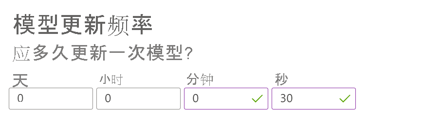

### 更改模型更新频率

在 Azure 门户的“配置”页上的个性化体验创建服务资源中，将“模型更新频率”更改为 30 秒。  此短暂持续时间可快速训练服务，使你可以看到顶部操作如何针对每次迭代而变化。

首次实例化个性化体验创建服务循环时，由于没有奖励 API 调用可供训练，因此没有模型。 排名调用将为每个项返回相等的概率。 你的应用程序仍应始终使用 RewardActionId 的输出对内容进行排名。