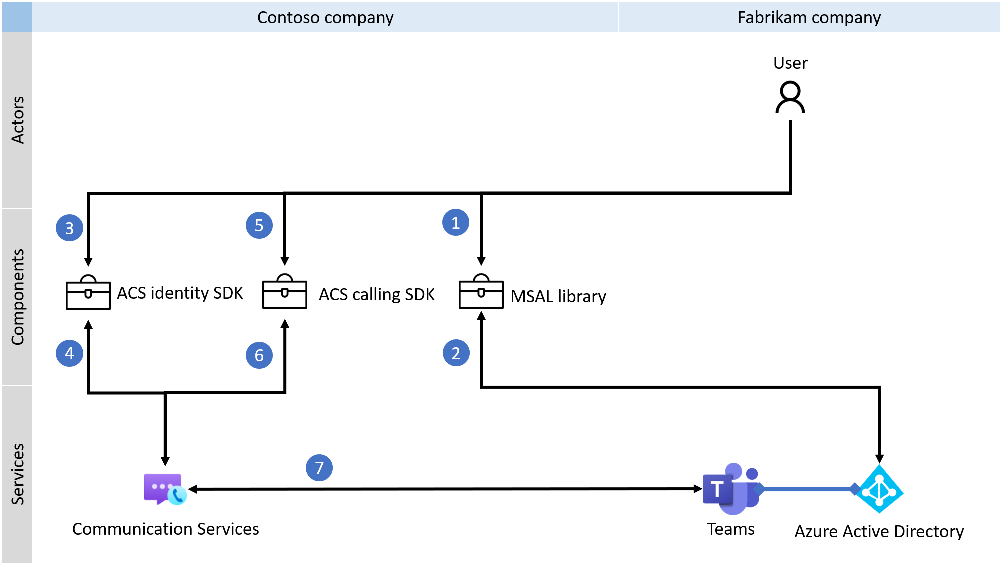
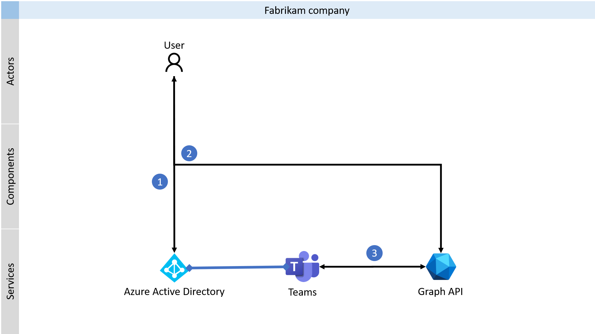

# 生成自定义 Teams 终结点

> [!IMPORTANT]
> 若要启用/禁用自定义 Teams 终结点体验，请[填写并提交此表单](https://forms.office.com/r/B8p5KqCH19)。

可使用 Azure 通信服务生成自定义 Teams 终结点，以便与 Microsoft Teams 客户端或其他自定义 Teams 终结点进行通信。 利用自定义 Teams 终结点，可以为 Teams 用户自定义语音、视频、聊天和屏幕共享体验。

你可以使用 Azure 通信服务标识 SDK，将 Azure Active Directory (Azure AD) 用户令牌换成 Teams 的访问令牌。 下图演示了多租户用例，其中虚构公司 Fabrikam 是虚构公司 Contoso 的客户。

## 调用 

语音、视频和屏幕共享功能是通过 Azure 通信服务呼叫 SDK 提供的。 下图显示了在将呼叫体验与自定义 Teams 终结点集成时要遵循的过程的概述。

## 聊天

还可以选择使用自定义 Teams 终结点，通过图形 API 集成聊天功能。 有关图形 API 的详细信息，请参阅[聊天资源类型](/graph/api/channel-post-messages)文档。 

## Azure 通信服务权限

### 委托的权限

|   权限    |  显示字符串   |  说明 | 需要管理员同意 | 支持 Microsoft 帐户 |
|:--- |:--- |:--- |:--- |:--- |
| _`https://auth.msft.communication.azure.com/VoIP`_ | 管理 Teams 中的呼叫 | 开始、加入、转接、转移或保留 Teams 呼叫和更新呼叫属性。 | 否 | 否 |

### 应用程序权限

无。

### 代表公司授予同意的角色

- 全局管理员
- 应用程序管理员（仅提供个人预览版）
- 云应用程序管理员（仅提供个人预览版）

## 后续步骤

> [!div class="nextstepaction"]
> [颁发 Teams 访问令牌](../quickstarts/manage-teams-identity.md)

了解 [Teams 互操作性](./teams-interop.md)。
