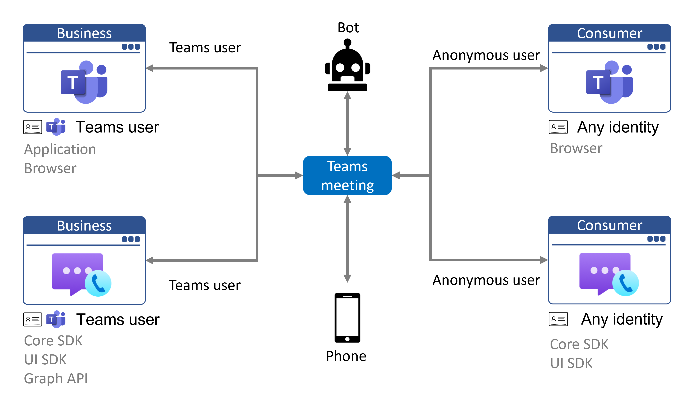
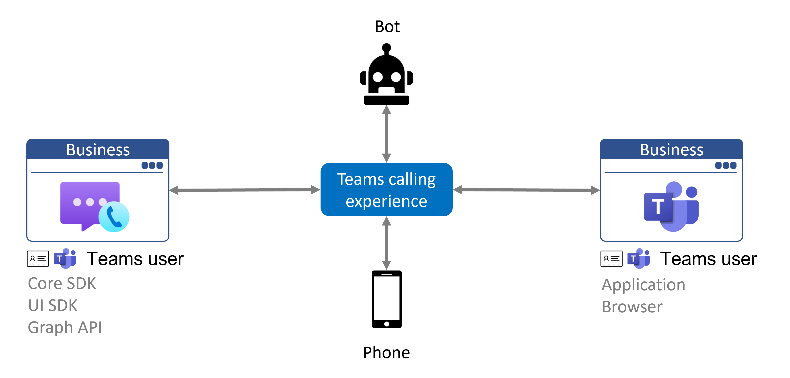

# Teams 互操作性

> [!IMPORTANT]
> BYOI 互操作性处于公共预览阶段，可供所有通信服务应用程序和 Teams 组织使用。
>
> Microsoft 365 已验证的互操作性提供个人预览版，并且仅限 Azure 通信服务早期采用者使用服务控制。 若要加入早期访问计划，请完成[此表单](https://forms.office.com/Pages/ResponsePage.aspx?id=v4j5cvGGr0GRqy180BHbR8MfnD7fOYZEompFbYDoD4JUMkdYT0xKUUJLR001ODdQRk1ITTdOMlRZNSQlQCN0PWcu)。
>
> 预览 API 和 SDK 在提供时没有附带服务级别协议，不建议用于生产工作负载。 某些功能可能不受支持或者受限。 有关详细信息，请参阅 [Microsoft Azure 预览版补充使用条款](https://azure.microsoft.com/support/legal/preview-supplemental-terms/)。

Azure 通信服务可用于构建与 Microsoft Teams 交互的自定义应用程序。 通信服务应用程序的最终用户可以通过语音、视频、聊天和屏幕共享与 Teams 参与者进行交互。 以下视频演示了此功能：

 
 

> [!VIDEO https://www.microsoft.com/en-us/videoplayer/embed/RWGTqQ]

Azure 通信服务支持两种类型的 Teams 互操作性，具体取决于最终用户的标识：

- **自带标识。** 你可以控制用户身份验证，并且自定义应用程序的用户无需拥有 Azure Active Directory 标识或 Teams 许可证即可加入 Teams 会议。 Teams 将你的应用程序视为匿名外部用户。
- **Microsoft 365 Teams 标识。** 你的应用程序代表最终用户的 Microsoft 365 标识及其 Teams 配置的资源行动。 这些经过身份验证的应用程序可以代表 Microsoft 365 用户无缝地拨打电话和加入会议。

应用程序可以同时实现这两种身份验证方案，并让最终用户选择身份验证。

## 概述

用户可以通过两种方式访问 Teams 通话体验：

- 作为 Teams 用户通过 Teams 客户端访问。 这包括桌面、移动设备和 Web Teams 客户端。 
- 作为 Teams 匿名用户通过应用程序的 Web 体验访问。 

Teams 匿名用户无需是 Teams 用户。 使用 Azure 通信服务，可以为 Teams 用户和 Teams 匿名用户生成和自定义新的 Teams 通话终结点。 可以使用通信服务调用 SDK 和用户界面库进行自定义并集成到任何现有的应用程序或产品。 下图演示了如何通过多个终结点加入 Teams 会议：

当终结点通过 Azure 通信服务客户端库使用 Teams 标识连接到 Teams 会议时，终结点将被视为具有 Teams 客户端的 Teams 用户。 与 Team 匿名用户相比，Team 用户可以访问更多的功能。 Teams 用户可以加入 Teams 会议、向其他 Teams 用户发出呼叫、接收来自电话号码的呼叫，还可以将正在进行的呼叫转移到 Teams 呼叫队列。 下图显示了具有 Teams 标识的通信服务终结点的连接。

## 自带标识

自带标识 (BYOI) 是使用 Azure 通信服务和 Teams 互操作性的常见模型。 它支持任何标识提供者和身份验证方案。 启用的第一个方案允许你的应用程序加入 Microsoft Teams 会议，并且 Teams 会将这些用户视为匿名外部帐户，与使用 Teams 匿名 Web 应用程序加入的用户相同。 这非常适用于将员工（熟悉 Teams）和外部用户（使用自定义应用程序体验）聚集到会议体验中的企业对使用者应用程序。 今后，我们将启用其他方案，包括直接呼叫和聊天，让你的应用程序可以在 Teams 会议的上下文之外发起与 Teams 用户的呼叫和聊天。

通信服务用户以匿名用户身份加入 Teams 会议的功能由现有的“允许匿名会议加入”配置控制，该配置还控制现有 Teams 匿名会议加入。  此设置可在 Teams 管理中心（ https://admin.teams.microsoft.com/meetings/settings) ）或通过 Teams PowerShell cmdlet Set-CsTeamsMeetingConfiguration（ https://docs.microsoft.com/powershell/module/skype/set-csteamsmeetingconfiguration) ）进行更新。 与 Teams 匿名会议加入一样，应用程序必须具有要加入的会议链接，该链接可通过图形 API 或 Microsoft Teams 中的日历来检索。  Teams 中显示的通信服务用户的名称可通过通信服务通话 SDK 进行配置。

外部用户将能够通过 Azure 通信服务 SDK 使用核心音频、视频、屏幕共享和聊天功能。 举手、一起模式和分组讨论室等功能仅适用于 Teams 用户。 通信服务用户只能在参加 Teams 会议并且该会议未计划为频道时发送和接收消息。

自定义应用程序应考虑使用用户身份验证和其他安全措施来保护 Teams 会议。 请注意允许匿名用户加入会议的安全影响，并使用 [Teams 安全指南](/microsoftteams/teams-security-guide#addressing-threats-to-teams-meetings)配置匿名用户可用的功能。

有关加入 Teams 会议所需数据流的更多信息，请访问[客户端和服务器体系结构页面](client-and-server-architecture.md)。 [群组通话特大示例](../samples/calling-hero-sample.md)提供了用于从 Web 应用程序加入 Teams 会议的示例代码。

## Microsoft 365 Teams 标识
Azure 通信服务通话 SDK 可与 Microsoft 365 Teams 标识一起使用，以支持类似 Teams 的 Teams 互操作性体验。 Microsoft 365 Teams 标识由 Azure Active Directory 提供和验证。 你的应用可以使用常规 Microsoft 365 标识拨打或接听电话。 有关用户的所有属性和详细信息都绑定到 Azure Active Directory 用户。

此标识模型非常适用于需要自定义用户界面、Teams 客户端不适用于你的平台或 Teams 客户端不支持足够级别的自定义的用例。 例如，应用程序可用于代表最终用户的 Teams 预配 PSTN 号码接听电话，并具有针对接待员或呼叫中心业务流程优化的用户界面。  

通话和屏幕共享功能可通过通信服务通话 SDK 获得。 通话管理可通过图形 API、Teams 客户端或 Teams 管理门户中的配置获得。 聊天功能可通过图形 API 获得。

Teams 用户通过 MSAL 库针对客户端应用程序中的 Azure Active Directory 进行身份验证。 身份验证令牌通过通信服务标识 SDK 交换为 Microsoft 365 Teams 令牌。 建议在后端服务中实现令牌交换，因为交换请求由 Azure 通信服务的凭据签名。 在后端服务中，可以要求任何其他身份验证。

若要详细了解该功能，请通过完成[此表单](https://forms.office.com/Pages/ResponsePage.aspx?id=v4j5cvGGr0GRqy180BHbR8MfnD7fOYZEompFbYDoD4JUMkdYT0xKUUJLR001ODdQRk1ITTdOMlRZNSQlQCN0PWcu)加入 TAP 计划以提前访问。

## 比较

|条件|自带标识| Microsoft 365 Teams 标识|
|---|---|---|
|适用| 在使用者应用程序的企业对使用者方案中 | 在企业应用程序上的企业对企业或企业对使用者方案中 |
|标识提供者|任意|Azure Active Directory|
|身份验证和授权|自定义*| Azure Active Directory 和自定义*|
|可通过以下方式通话 | 通信服务通话 SDK | 通信服务通话 SDK |
|可通过以下方式聊天 | 通信服务聊天 SDK | 图形 API |
|PSTN 支持| 出站语音呼叫、出站直接路由、[详细信息](./telephony-sms/telephony-concept.md) | 分配给 Teams 标识的入站呼叫、使用呼叫计划的出站呼叫|

\* 发布访问令牌的服务器逻辑可以对请求执行任何自定义身份验证和授权。

## 隐私
通过 Azure 通信服务与 Microsoft Teams 之间的互操作性，应用程序和用户可以参与 Teams 调用、会议和聊天。 你需要负责确保，在 Teams 调用或会议中启用录制或听录时，要通知应用程序的用户。

Microsoft 会通过 Azure 通信服务 API 向你指示录制或听录已开始，你需要在应用程序的用户界面中向用户实时传达这一信息。 你同意赔偿 Microsoft 因自己未能遵守此义务而产生的所有费用和损失。

## 定价
Azure 通信服务 API 和 SDK 的所有使用情况都会递增 [Azure 通信服务计费表](https://azure.microsoft.com/pricing/details/communication-services/)。 与 Microsoft Teams 的交互（例如使用 Teams 分配的号码加入会议或发起电话呼叫）将递增这些计费表，但 Teams 互操作性功能本身没有额外费用，并且 BYOI 和 Microsoft 365 身份验证选项之间没有定价差异。

如果 Azure 应用程序有一个最终用户与 Microsoft Teams 用户在会议中用时 10 分钟，那么这两个用户总共消耗了 20 分钟的通话时间。 通过自定义应用程序以及使用 Azure API 和 SDK 进行的 10 分钟将计入你的资源。 但是，最终用户在本机 Teams 应用程序中使用的 10 分钟由适用的 Teams 许可证涵盖，并且不由 Azure 计费。

## 政府云中的 Teams (GCC)
Azure 通信服务互操作性与目前使用 [Microsoft 365 政府云 (GCC)](/MicrosoftTeams/plan-for-government-gcc) 的 Teams 部署不兼容。

## 后续步骤

> [!div class="nextstepaction"]
> [将 BYOI 通话应用加入 Teams 会议](../quickstarts/voice-video-calling/get-started-teams-interop.md)
> [对 Microsoft 365 用户进行身份验证](../quickstarts/manage-teams-identity.md)
