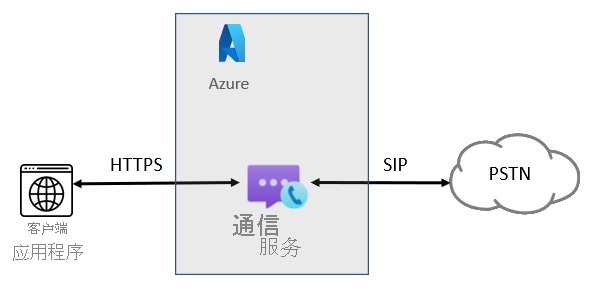
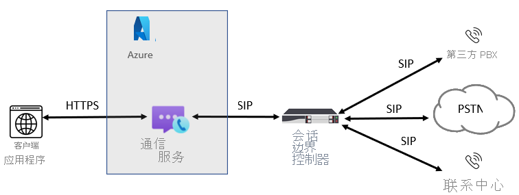

# 电话服务概念

[!INCLUDE [Regional Availability Notice](../../includes/regional-availability-include.md)]

使用 Azure 通信服务呼叫 SDK 可在应用程序中添加电话网络和公用电话交换网接入点。 此页汇总了重要的电话服务概念和功能。 若要详细了解特定 SDK 语言和功能，请参阅[通话库](../../quickstarts/voice-video-calling/calling-client-samples.md)。

## 电话服务概述
每当你的用户与传统电话号码交互时，将通过 PSTN（公用电话交换网）语音呼叫来辅助完成呼叫。 若要拨打和接收 PSTN 呼叫，需要向 Azure 通信服务资源添加电话功能。 在这种情况下，信令和媒体结合使用基于 IP 和基于 PSTN 的技术来连接用户。 通信服务提供两种不同的方式来连接 PSTN 网络：语音呼叫 (PSTN) 和 Azure 直接路由。

### 语音呼叫 (PSTN)

这是向应用或服务添加 PSTN 连接的一种简单方法，在这种情况下，Microsoft 是你的电信提供商。 可以直接从 Microsoft 购买号码。 Azure 云呼叫是用于通信服务的完全通过云实现的电话服务解决方案。 这是将通信服务连接到公用电话交换网 (PSTN) 以呼叫座机和移动电话的最简单选项。 Microsoft 将充当你的 PSTN 运营商，如下图所示：

如果你对以下问题的回答为“是”，那么语音呼叫 (PSTN) 解决方案适合你：
- 可在你的区域中使用语音呼叫 (PSTN)。
- 你不需要保留当前的 PSTN 运营商。
- 你想对 PSTN 使用 Microsoft 管理的访问。

使用此选项：
- 你直接从 Microsoft 获得号码，且可拨打世界各地的电话。
- 你不需要部署或维护本地部署，因为语音呼叫 (PSTN) 在 Azure 通信服务之外运行。
- 注意：如有必要，可选择通过 Azure 直接路由连接受支持的会话边界控制器 (SBC)，来与第三方 PBX、模拟设备和 SBC 支持的其他第三方电话服务设备进行互操作。

此选项要求与 Azure 通信服务的连接不间断。  

对于云通话，出站呼叫按每分钟费率计费，具体取决于目标国家/地区。 请参阅 [PSTN 呼叫的当前费率列表](https://github.com/Azure/Communication/blob/master/pricing/communication-services-pstn-rates.csv)。

### Azure 直接路由

[!INCLUDE [Public Preview](../../includes/public-preview-include-document.md)]

利用此选项，可将旧的本地电话服务和所选的运营商连接到 Azure 通信服务。 即使你所在国家/地区未提供语音呼叫 (PSTN)，此选项也可提供对通信服务应用程序的 PSTN 呼叫功能。 

如果你对以下问题的回答为“是”，那么 Azure 直接路由解决方案适合你：

- 你想要使用具有 PSTN 呼叫功能的通信服务。
- 你需要保留当前的 PSTN 运营商。
- 你需要混合路由，即一部分通话通过语音呼叫 (PSTN) 进行，一部分通过运营商进行。
- 你需要与第三方 PBX 和/或设备（如空中寻呼机、模拟设备等）进行互操作。

使用此选项：

- 你不需要额外的本地软件即可将自己受支持的 SBC 连接到 Azure 通信服务。
- 可以将任何电话服务运营商的服务与通信服务配合使用。
- 可以选择配置和管理此选项，也可以由运营商或合作伙伴来配置和管理（询问运营商或合作伙伴是否提供此选项）。
- 可以配置电话服务设备（例如第三方 PBX 和模拟设备）和通信服务之间的互操作性。

此选项需要：

- 不间断连接到 Azure。
- 部署和维护受支持的 SBC。
- 与第三方运营商的合约。 （除非为使用通信服务的用户部署为选项，以提供与第三方 PBX、模拟设备或其他电话服务设备的连接。）

## 后续步骤

### 概念文档

- [Azure 通信服务中的电话号码类型](./plan-solution.md)
- [规划 Azure 直接路由](./direct-routing-infrastructure.md)
- [为 Azure 通信服务直接路由认证的会话边界控制器](./certified-session-border-controllers.md)
- [定价](../pricing.md)

### 快速入门

- [获取电话号码](../../quickstarts/telephony-sms/get-phone-number.md)
- [拨打电话](../../quickstarts/voice-video-calling/pstn-call.md)
