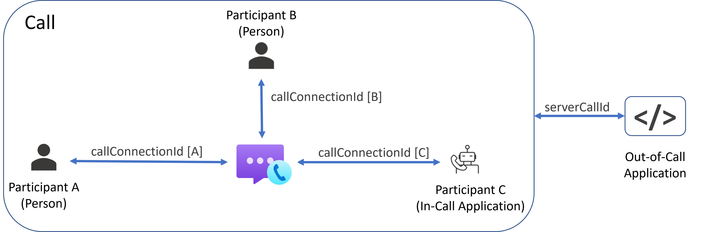
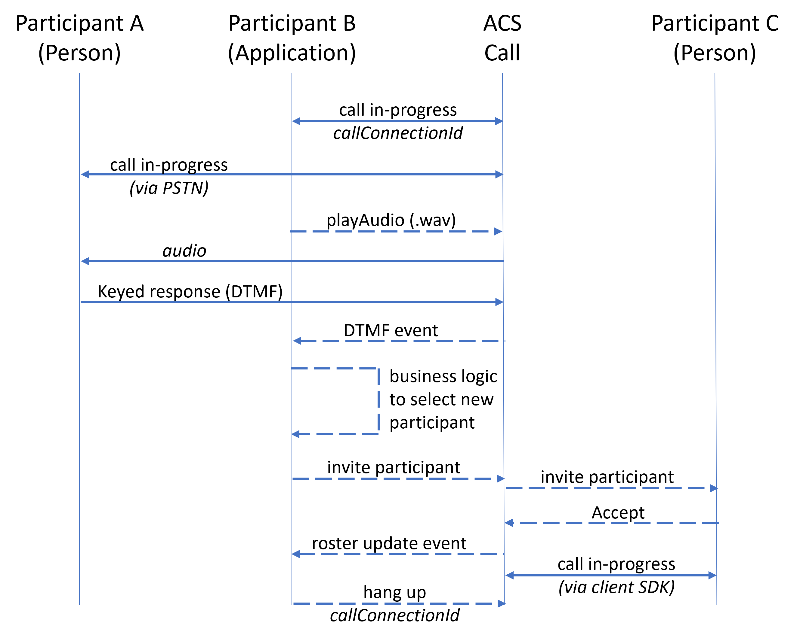
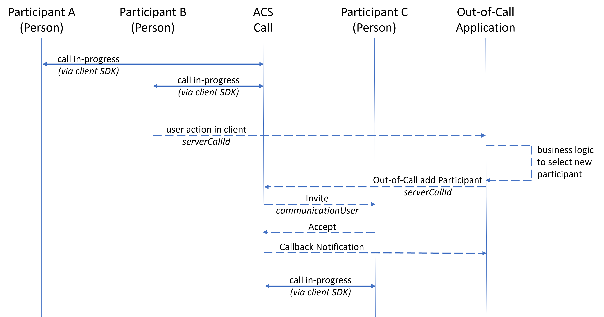

# 呼叫自动化概述

[!INCLUDE [Public Preview](../../includes/public-preview-include-document.md)]

使用呼叫自动化 API 可以从服务访问语音和视频呼叫功能。 可以使用这些 API 创建服务应用程序，以针对约会提供自动出站提醒呼叫，或针对诸如停电或野火等事件提供主动通知。 加入呼叫的服务应用程序可以监视最新状态（例如参与者加入或离开），使你可以实现丰富的报告和日志记录功能。

呼叫自动化 API 是为参与呼叫（应用程序参与者或应用参与者）操作和不参与呼叫操作提供的。 这两组 API 之间的两个主要差别是：
- 参与呼叫 API 要求应用程序以参与者身份加入呼叫。 应用参与者按照[标准 PSTN 和 VoIP 费率](https://azure.microsoft.com/pricing/details/communication-services/)计费。
- 参与呼叫 API 使用与应用参与者关联的 `callConnectionId`，而不参与呼叫 API 则使用与呼叫实例关联的 `serverCallId`。 

## 用例
| 用例                                                       | 参与呼叫（应用参与者） | 不参与呼叫   |
| ---------------------------------------------------------------| ------------------------- | ------------- |
| 在机器人与人类参与者之间拨打或接听一对一的呼叫  | X                         |               |
| 播放音频提示并收听应答                    | X                         |               |
| 监视参与呼叫事件                                         | X                         |               |
| 创建具有多个参与者的呼叫                        | X                         |               |
| 获取呼叫参与者和参与者详细信息                  | X                         |               |
| 添加或删除呼叫参与者                                | X                         | X             |
| 对等呼叫中的服务器端操作（例如录音）     |                           | X             |
| 向所有参与者播放音频公告                   |                           | X             |
| 启动和管理通话记录                                |                           | X             |

## 参与呼叫（应用参与者）API

通过参与呼叫 API，应用程序可以在呼叫中以应用参与者的身份执行操作。 当应用程序应答或加入呼叫时，将会分配 `callConnectionId` 用于执行如下所述的参与呼叫操作：
- 添加或删除呼叫参与者
- 播放音频提示并收听 DTMF 应答
- 收听呼叫名单更新和事件
- 挂断呼叫

### In-Call 事件
事件通知将通过加入呼叫时设置的 `callbackUri` 以 JSON 有效负载的形式发送到呼叫应用程序。 发送到参与呼叫应用参与者的事件包括：
- CallState 事件（正在建立、已建立、正在终止、已终止）
- 已接听 DTMF
- 播放音频结果
- 取消媒体处理
- 邀请参与者结果
- 参与者已更新

## Out-of-Call API
通过不参与呼叫 API，可以针对呼叫或会议执行操作，而无需应用参与者在场。 不参与呼叫 API 使用呼叫客户端 SDK 提供的，或者在通过呼叫自动化 API 创建呼叫时生成的 `serverCallId`。 由于不参与呼叫 API 不需要应用参与者，因此可用于在对等呼叫中实现服务器端业务逻辑。 例如，假设某个支持呼叫场景是以对等呼叫的形式启动的，客服（参与者 B）想要接入一位主题专家来给予协助。 参与者 B 在客户端界面中触发一个事件，让服务器应用程序找出一位有空的主题专家并邀请该专家加入呼叫。 下面显示的流程图的最终状态是建立了小组通话，其中有三位人类参与者。

不参与呼叫 API 可用于如下所述的操作：
- 添加或删除呼叫参与者
- 启动/停止/暂停/继续通话记录
                                                       
### 不参与呼叫事件
事件通知将通过发起 API 呼叫时提供的 `callbackUri` 以 JSON 有效负载的形式发送到呼叫应用程序。 操作和相应的不参与呼叫事件包括：
- 通话记录（启动、停止、暂停、继续）
- 邀请参与者结果

## 后续步骤
有关详细信息，请查看[呼叫自动化快速入门](../../quickstarts/voice-video-calling/call-automation-api-sample.md)。
