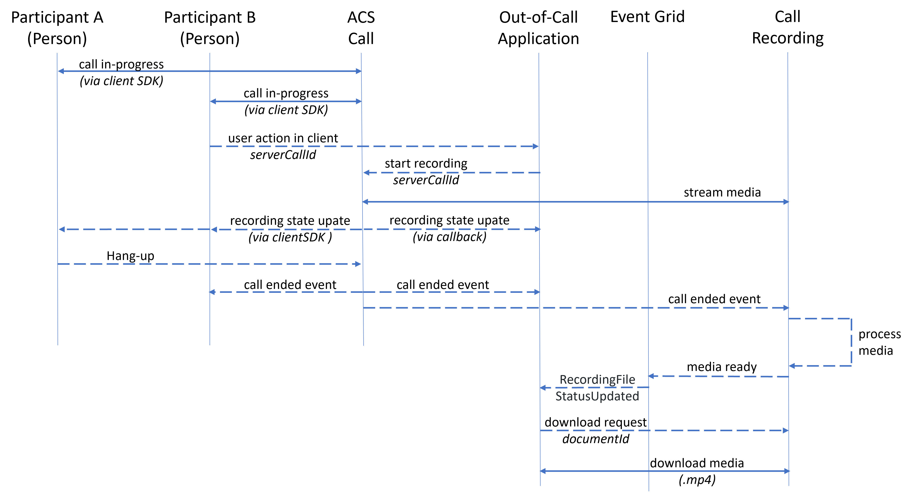

# <a name="calling-recording-overview"></a>通话录制概述

[!INCLUDE [Public Preview](../../includes/public-preview-include-document.md)]

> [!NOTE]
> 通话记录仅适用于在美国、英国、欧洲、亚洲和澳大利亚境内创建的通信服务资源。

通话录制提供一组 API，用于启动、停止、暂停和继续录制。 这些 API 可通过服务器端业务逻辑访问，也可通过用户操作触发的事件访问。 录制的媒体输出采用 MP4 音频+视频格式，Teams 也使用这种格式录制媒体。 通过事件网格发出与媒体和元数据相关的通知。 录制在内置临时存储中存储 48 小时，以便检索以及移动到所选的长期存储解决方案。 



## <a name="media-output-types"></a>媒体输出类型
目前，通话记录支持混合音频 + 视频的 MP4 和仅有混合音频的 MP3/WAV 输出格式。 混合音频 + 视频输出媒体与通过 Microsoft Teams 录制生成的会议录像相同。

| 信道类型 | 内容格式 | 视频 | 音频 |
| :----------- | :------------- | :---- | :--------------------------- |
| audioVideo | mp4 | 所有参与者采用默认磁贴排列的 1920x1080 8 FPS 视频 | 所有参与者的 16kHz mp4a 混合音频 |
| audioOnly| mp3/wav | 空值 | 所有参与者的 16kHz mp3/wav 混合音频 |


## <a name="run-time-control-apis"></a>运行时控件 API
通过内部业务逻辑触发器（例如创建群组通话并录制对话的应用程序）或用户触发的操作（告知服务器应用程序开始录制），可使用运行时控件 API 管理记录。 通话记录 API 为 [Out-of-Call API](./call-automation-apis.md#out-of-call-apis)，使用 `serverCallId` 启动录制。 创建通话时，会在建立通话后通过 `serverCallId` 事件返回 `Microsoft.Communication.CallLegStateChanged`。 可以在 `data.serverCallId` 字段中找到 `serverCallId`。 请参阅我们的[通话记录快速入门示例](../../quickstarts/voice-video-calling/call-recording-sample.md)，了解如何从通话客户端 SDK 检索 `serverCallId`。 当录制开始时，将返回 `recordingOperationId`，然后将其用于后续操作（如暂停和继续）。   

| 操作                            | 操作对象            | 注释                       |
| :-------------------- | :--------------------- | :----------------------------- |
| 开始记录       | `serverCallId`         | 返回 `recordingOperationId` | 
| 获取录制状态   | `recordingOperationId` | 返回 `recordingState`       | 
| 暂停录制       | `recordingOperationId` | 通过暂停和恢复通话录制，可以跳过录制通话或会议的某一部分，并继续录制到单个文件。 | 
| 继续录制      | `recordingOperationId` | 恢复暂停的录制操作。 内容与暂停前的内容包含在同一文件中。 | 
| 停止录制        | `recordingOperationId` | 停止录制，并启动最终媒体处理以便文件下载。 | 


## <a name="event-grid-notifications"></a>事件网格通知

> Azure 通信服务为录像提供短期媒体存储。 请在 48 小时内导出要保留的任何录制内容。 48 小时后，录像将不再可用。

通常在录制过程完成（例如会议结束，录制停止）后几分钟可检索录像，此时会发布事件网格通知 `Microsoft.Communication.RecordingFileStatusUpdated`。 录制事件通知包括 `contentLocation` 和 `metadataLocation`，用于检索录制的媒体和录制元数据文件。

### <a name="notification-schema-reference"></a>通知架构引用
```typescript
{
    "id": string, // Unique guid for event
    "topic": string, // Azure Communication Services resource id
    "subject": string, // /recording/call/{call-id}
    "data": {
        "recordingStorageInfo": {
            "recordingChunks": [
                {
                    "documentId": string, // Document id for retrieving from storage
                    "index": int, // Index providing ordering for this chunk in the entire recording
                    "endReason": string, // Reason for chunk ending: "SessionEnded", "ChunkMaximumSizeExceeded”, etc.
                    "metadataLocation": <string>, // url of the metadata for this chunk
                    "contentLocation": <string>   // url of the mp4, mp3, or wav for this chunk
                }
            ]
        },
        "recordingStartTime": string, // ISO 8601 date time for the start of the recording
        "recordingDurationMs": int, // Duration of recording in milliseconds
        "sessionEndReason": string // Reason for call ending: "CallEnded", "InitiatorLeft", etc.
    },
    "eventType": string, // "Microsoft.Communication.RecordingFileStatusUpdated"
    "dataVersion": string, // "1.0"
    "metadataVersion": string, // "1"
    "eventTime": string // ISO 8601 date time for when the event was created
}
```
## <a name="regulatory-and-privacy-concerns"></a>法规和隐私问题

许多国家和地区都有适用于录制 PSTN、语音通话和视频通话的法律和法规，通常要求用户同意录制其通话。 你有责任在遵守法律的前提下使用通话录制功能。 必须以符合适用于每个参与者的法律的方式获得录制的通信的参与方的同意。

针对个人数据维护的法规要求能够导出用户数据。 为了满足这些要求，在 `participants` 数组中记录包含每个通话参与者 participantId 的元数据文件。 可以在 `participants` 中交叉引用 MRI，通过内部用户标识来标识通话中的参与者。 下面提供了一个记录元数据文件的示例供你参考。

## <a name="next-steps"></a>后续步骤
有关详细信息，请查看[通话录制快速入门](../../quickstarts/voice-video-calling/call-recording-sample.md)。

详细了解[通话自动化 API](./call-automation-apis.md)。
