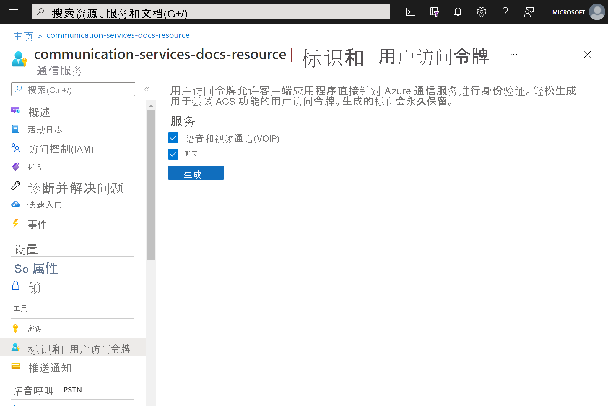
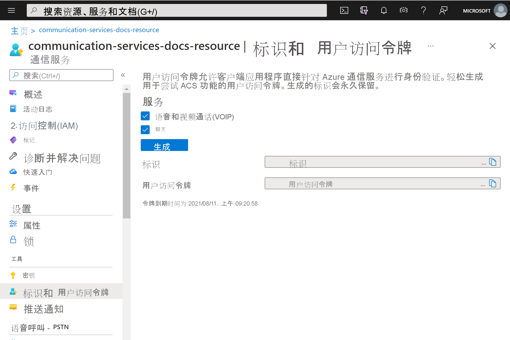

# <a name="quickstart-quickly-create-azure-communication-services-access-tokens-for-testing"></a>快速入门：快速创建用于测试的 Azure 通信服务访问令牌

在 [Azure 门户](https://portal.azure.com)通信服务扩展中，你可生成通信服务标识和访问令牌。 这样你就可跳过创建身份验证服务，以便更轻松地测试示例应用和简单开发方案。 此功能适用于小规模验证和测试，而不应用于生产场景。 有关生产代码，请参阅[创建访问令牌快速入门](../access-tokens.md)。

此工具展示在简单的用户体验中 ```Identity SDK``` 的行为。 通过此工具创建的令牌和标识遵循的行为和规则与使用 ```Identity SDK``` 创建它们时的行为和规则相同。  例如，访问令牌在 24 小时后过期。

## <a name="prerequisites"></a>必备条件

- 一个 [Azure 通信服务资源](../create-communication-resource.md)

## <a name="create-the-access-tokens"></a>创建访问令牌

在 [Azure 门户](https://portal.azure.com)中，导航到通信服务资源中的“标识和用户访问令牌”。 

选择访问令牌的作用域。 可全部不选，或选择一个、多个。 单击“生成”  。



你会看到生成的标识和对应的用户访问令牌。 可以复制这些字符串，将其用于[示例应用](../../samples/overview.md)和其他测试场景。



## <a name="next-steps"></a>后续步骤


你可能还想要：

 - [了解身份验证](../../concepts/authentication.md)
 - [了解客户端和服务器体系结构](../../concepts/client-and-server-architecture.md)
