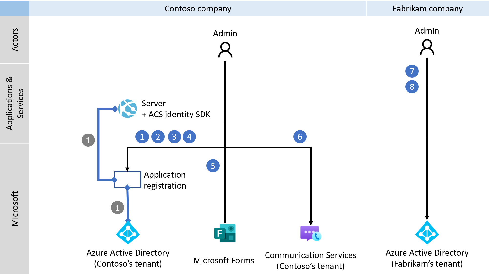
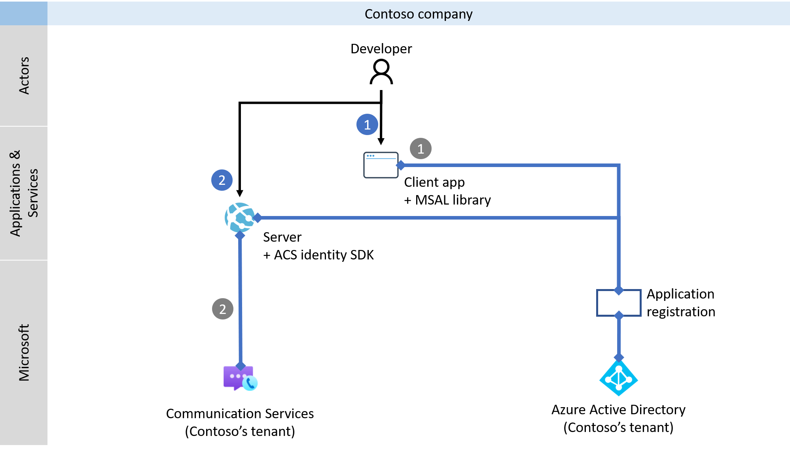
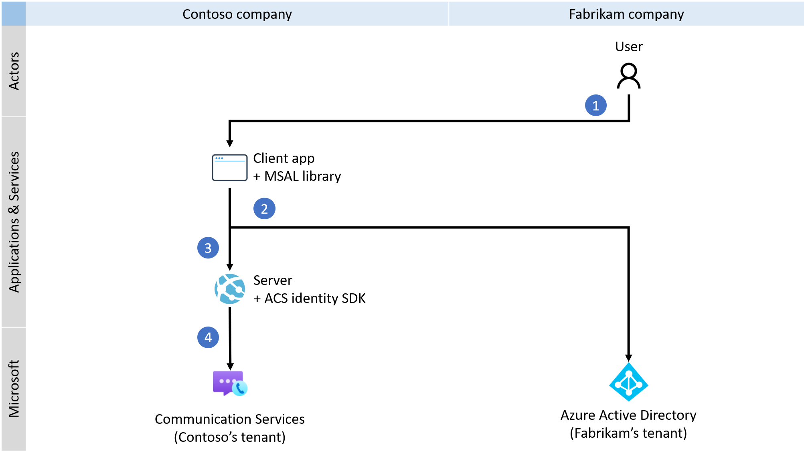

# <a name="quickstart-set-up-and-manage-teams-access-tokens"></a>快速入门：设置和管理 Teams 访问令牌

> [!IMPORTANT]
> 若要启用或禁用自定义 Teams 终结点体验，请[填写并提交此表单](https://forms.office.com/r/B8p5KqCH19)。

在本快速入门中，你将生成一个 .NET 控制台应用程序，以通过使用 Microsoft 身份验证库 (MSAL) 并检索 Azure Active Directory (Azure AD) 用户令牌来对 Microsoft 365 用户进行身份验证。 接下来，你将使用 Azure 通信服务标识 SDK 将该令牌交换为 Teams 访问令牌。 然后，通信服务调用 SDK 可以使用 Teams 访问令牌来生成自定义 Teams 终结点。

> [!NOTE]
> 在生产环境中，我们建议在后端服务中实现此交换机制，因为交换请求是使用机密签名的。

## <a name="prerequisites"></a>必备条件
- 具有活动订阅的 Azure 帐户。 [免费创建帐户](https://azure.microsoft.com/free/?WT.mc_id=A261C142F)。
- 一个有效的 Azure 通信服务资源和连接字符串。 有关详细信息，请参阅[创建 Azure 通信服务资源](./create-communication-resource.md)。
- [填写并提交此表单](https://forms.office.com/r/B8p5KqCH19)以启用自定义 Teams 终结点体验。
- 一个 Azure Active Directory 实例，其中的用户拥有 Teams 许可证。

## <a name="introduction"></a>简介

Teams 标识已绑定到 Azure Active Directory 中的租户。 来自同一租户或其他租户的用户可以使用你的应用程序。 在本快速入门中，你将与多个参与者（来自虚构公司 Contoso 和 Fabrikam 的用户、开发人员和管理员）一起完成多租户用例。 在此用例中，Contoso 是一家为 Fabrikam 构建服务型软件 (SaaS) 解决方案的公司。 

以下部分将指导你完成管理员、开发人员和用户的步骤。 这些关系图演示了多租户用例。 如果使用单个租户，请从单个租户中的 Contoso 和 Fabrikam 执行所有步骤。

## <a name="administrator-actions"></a>管理员操作

管理员角色在 Azure AD 中拥有扩展权限。 此角色的成员可以设置资源，以及从 Azure 门户读取信息。 在下图中，可以看到必须由管理员执行的所有操作。



1. Contoso 管理员在 Azure Active Directory 中创建或选择现有应用程序。 属性“支持的帐户类型”定义不同租户中的用户是否可以向应用程序进行身份验证。 属性“重定向 URI”将成功的身份验证请求重定向到 Contoso 的服务器 。
1. Contoso 管理员使用通信服务 VoIP 权限扩展应用程序的清单。 
1. Contoso 管理员允许应用程序的公共客户端流。
1. Contoso 管理员可以选择性地进行更新。
1. Contoso 管理员通过[填写并提交此表单](https://forms.office.com/r/B8p5KqCH19)来启用体验。
1. Contoso 管理员创建或选择用于对交换请求进行身份验证的现有通信服务。 Azure AD 用户令牌将交换为 Teams 访问令牌。 有关详细信息，请参阅[创建和管理通信服务资源](./create-communication-resource.md)。
1. Fabrikam 管理员为 Fabrikam 租户中的通信服务设置新的服务主体。
1. Fabrikam 管理员为 Contoso 应用程序授予通信服务 VoIP 权限。 仅当 Contoso 应用程序未经验证时，才需要执行此步骤。 

### <a name="step-1-create-an-azure-ad-application-registration-or-select-an-azure-ad-application"></a>步骤 1：创建 Azure AD 应用程序注册或选择 Azure AD 应用程序 

用户必须向带有 Azure 通信服务 VoIP 权限的 Azure AD 应用程序进行身份验证。 如果你没有要用于本快速入门的现有应用程序，可以创建新的应用程序注册。 

以下应用程序设置会影响体验：
- “支持的帐户类型”属性定义应用程序是单租户（“仅此组织目录中的帐户”）还是多租户（“任何组织目录中的帐户”）。 对于本方案，可以使用多租户。
- “重定向 URI”定义在完成身份验证后要将身份验证请求重定向到的 URI。 对于本方案，可以使用“公共客户端/本机(移动和桌面)”并输入 `http://localhost` 作为 URI 。

有关详细信息，请参阅[将应用程序注册到 Microsoft 标识平台](../../active-directory/develop/quickstart-register-app.md#register-an-application)。 

注册应用程序后，你将在概述中看到标识符。 以下步骤中将使用此标识符，即“应用程序(客户端) ID”：

### <a name="step-2-allow-public-client-flows"></a>步骤 2：允许公共客户端流

在应用程序的“身份验证”窗格中，可以看到为“公共客户端/本机(移动和桌面)”配置的平台，其重定向 URI 指向 localhost 。 在该窗格的底部，可以看到“允许公共客户端流”切换控件，在本快速入门中，它应该设置为“是”。

### <a name="step-3-optional-update-the-publisher-domain"></a>步骤 3（可选）：更新发布者域 
在“品牌”窗格中，可以更新应用程序的发布者域。 这适用于多租户应用程序，其中应用程序将被标记为已由 Azure 验证。 有关详细信息，请参阅[配置应用程序的发布者域](../../active-directory/develop/howto-configure-publisher-domain.md)。

### <a name="step-4-define-the-communication-services-voip-permission-in-the-application"></a>步骤 4：在应用程序中定义通信服务 VoIP 权限

转到应用程序的详细信息，选择“清单”窗格，然后找到“requiredResourceAccess”属性。 该属性是一个对象数组，用于定义应用程序的权限。 使用第一方应用程序“通信服务”的 VoIP 权限扩展清单。 将以下对象添加到该数组：

> [!NOTE] 
> 请不要更改代码片段中的 GUID，因为它们唯一标识应用程序和权限。

```json
{
   "resourceAppId": "1fd5118e-2576-4263-8130-9503064c837a",
   "resourceAccess": [
      {
         "id": "31f1efa3-6f54-4008-ac59-1bf1f0ff9958",
         "type": "Scope"
      }
   ]
}
```

若要保存更改，请选择“保存”。 现在可以在“API 权限”窗格中看到“Azure 通信服务 - VoIP”权限。

### <a name="step-5-enable-a-custom-teams-endpoint-experience-for-the-application"></a>步骤 5：为应用程序启用自定义 Teams 终结点体验

若要为应用程序启用自定义 Teams 终结点体验，Azure AD 管理员需[填写并提交此表单](https://forms.office.com/r/B8p5KqCH19)。

### <a name="step-6-create-or-select-a-communication-services-resource"></a>步骤 6：创建或选择通信服务资源

通信服务资源用于对将 Azure AD 用户令牌交换为 Teams 访问令牌的所有请求进行身份验证。 可以使用通信服务标识 SDK（你可使用访问密钥或使用 Azure 基于角色的访问控制 (RBAC) 对其进行身份验证）来触发这种交换。 可以在 Azure 门户中获取访问密钥，也可以通过在“访问控制(IAM)”窗格配置 Azure RBAC 来获取访问密钥。

如果要创建新的通信服务资源，请参阅[创建和管理通信服务资源](./create-communication-resource.md)。

### <a name="step-7-set-up-a-communication-services-service-principal"></a>步骤 7：设置 Azure 通信服务的服务主体

若要在 Fabrikam 租户中启用自定义 Teams 终结点体验，Fabrikam Azure AD 管理员必须设置应用程序 ID 为 1fd5118e-2576-4263-8130-9503064c837a 且名为“Azure 通信服务”的服务主体。 如果在 Azure Active Directory 的“企业应用程序”窗格中看不到此应用程序，则需要手动添加该应用程序。

Fabrikam Azure AD 管理员通过 PowerShell 连接到 Azure 租户。 

> [!NOTE]
> 在以下命令中，请将 [Tenant_ID] 替换为你的租户 ID，可以在 Azure 门户中 Azure AD 实例的概述页上找到该 ID。

```azurepowershell
Connect-AzureAD -TenantId "[Tenant_ID]"
```

如果收到“找不到命令”错误，则原因是 PowerShell 中未安装 AzureAD 模块。 关闭 PowerShell，然后以管理员身份将其重新打开。 现在，可以运行以下命令安装 AzureAD 包：

```azurepowershell
Install-Module AzureAD
```

连接到 Azure 门户并向其进行身份验证后，运行以下命令来设置通信服务的服务主体： 

> [!NOTE]
> 参数 AppId 是指第一方应用程序“通信服务”。 请勿更改此值。

```azurepowershell
New-AzureADServicePrincipal -AppId "1fd5118e-2576-4263-8130-9503064c837a"
```

### <a name="step-8-provide-administrator-consent"></a>步骤 8：提供管理员同意

如果 Contoso 应用程序未经验证，Azure AD 管理员必须向 Contoso 应用程序授予对 Azure 通信服务 VoIP 的权限。 Fabrikam Azure AD 管理员通过唯一的 URL 提供同意。 

若要构造管理员同意 URL，Fabrikam Azure AD 管理员需执行以下操作：

1. 在 URL https://login.microsoftonline.com/{Tenant_ID}/adminconsent?client_id={Application_ID} 中，管理员将 {Tenant_ID} 替换为 Fabrikam 租户 ID，并将 {Application_ID} 替换为 Contoso 应用程序 ID。
1. 管理员登录并代表组织授予权限。

如果授予了同意，则会在 Fabrikam 租户中创建 Contoso 应用程序的服务主体。 Fabrikam 管理员可通过执行以下操作来查看 Azure AD 中的同意：

1. 以管理员身份登录到 Azure 门户。
1. 转到 Azure Active Directory。
1. 在“企业应用程序”窗格中，将“应用程序类型”筛选器设置为“所有应用程序”  。
1. 在用于筛选应用程序的字段中，输入 Contoso 应用程序的名称。
1. 选择“应用”。
1. 使用所需的名称选择服务主体。 
1. 转到“权限”窗格。

可以看到，通信服务 VoIP 权限的状态为“已为 {Directory_name} 授予”。

## <a name="developer-actions"></a>开发人员操作

Contoso 开发人员需要设置客户端应用程序来对用户进行身份验证。 然后，开发人员需要在后端服务器上创建终结点，以在重定向后处理 Azure AD 用户令牌。 收到 Azure AD 用户令牌后，它会交换为 Teams 访问令牌，并返回到客户端应用程序。 

下图显示了开发人员所需的操作：



1. Contoso 开发人员配置 MSAL 库，以便对前面由管理员创建的、拥有通信服务 VoIP 权限的应用程序的用户进行身份验证。
1. Contoso 开发人员初始化通信服务标识 SDK，并通过该 SDK 将传入的 Azure AD 用户令牌交换为 Teams 访问令牌。 Teams 访问令牌随后将返回到客户端应用程序。

开发人员可以使用 Microsoft 身份验证库从 Microsoft 标识平台终结点获取 Azure AD 用户令牌，以便对用户进行身份验证并访问安全的 Web API。 使用该库可以安全访问通信服务。 MSAL 支持许多不同的应用程序体系结构和平台，包括 .NET、JavaScript、Java、Python、Android 和 iOS。

有关设置环境的详细信息，请参阅公共文档 [Microsoft 身份验证库概述](../../active-directory/develop/msal-overview.md)。

> [!NOTE]
> 以下部分介绍如何为 .NET 控制台应用程序将 Azure AD 访问令牌交换为 Teams 访问令牌。

### <a name="create-a-new-application"></a>创建新应用程序

在控制台窗口（例如 cmd、PowerShell 或 Bash）中，使用 `dotnet new` 命令创建名为 `TeamsAccessTokensQuickstart` 的新控制台应用。 此命令将创建包含单个源文件 (Program.cs) 的简单“Hello World”C# 项目。

```console
dotnet new console -o TeamsAccessTokensQuickstart
```

将目录更改为新建的应用文件夹，并使用 `dotnet build` 命令编译应用程序。

```console
cd TeamsAccessTokensQuickstart
dotnet build
```
#### <a name="install-the-package"></a>安装包
仍在应用程序目录中时，使用 `dotnet add package` 命令安装适用于 .NET 的 Azure 通信服务标识库包。

```console
dotnet add package Azure.Communication.Identity
dotnet add package Microsoft.Identity.Client
```

#### <a name="set-up-the-app-framework"></a>设置应用框架

在项目目录中执行以下操作：

1. 在文本编辑器中，打开“Program.cs”  文件。
1. 添加 `using` 指令以包含以下命名空间： 
    - Azure.Communication
    - Azure.Communication.Identity
    - Microsoft.Identity.Client
1. 更新 `Main` 方法声明以支持 `async` 代码。

若要开始，请使用以下代码：

```csharp
using System;
using System.Text;
using Azure.Communication;
using Azure.Communication.Identity;
using Microsoft.Identity.Client;

namespace TeamsAccessTokensQuickstart
{
    class Program
    {
        static async System.Threading.Tasks.Task Main(string[] args)
        {
            Console.WriteLine("Azure Communication Services – Teams access tokens quickstart");

            // Quickstart code goes here
        }
    }
}
```

### <a name="step-1-receive-the-azure-ad-user-token-via-the-msal-library"></a>步骤 1：通过 MSAL 库接收 Azure AD 用户令牌

使用 MSAL 库将用户身份向 Azure AD 进行验证，以便用户可以访问拥有通信服务 VoIP 权限的 Contoso 应用程序。 在公有云（参数 authority）中为 Contoso 应用程序（参数 applicationId）配置客户端 。 Azure AD 用户令牌将返回到重定向 URI（参数 redirectUri）。 凭据将取自在默认浏览器中打开的交互式弹出窗口。

> [!NOTE] 
> 重定向 URI 必须与应用程序中定义的值匹配。 请查看管理员指南中的第一个步骤，了解如何配置重定向 URI。

```csharp
const string applicationId = "Contoso's_Application_ID";
const string authority = "https://login.microsoftonline.com/common";
const string redirectUri = "http://localhost";

var client = PublicClientApplicationBuilder
                .Create(applicationId)
                .WithAuthority(authority)
                .WithRedirectUri(redirectUri)
                .Build();

const string scope = "https://auth.msft.communication.azure.com/VoIP";

var aadUserToken = await client.AcquireTokenInteractive(new[] { scope }).ExecuteAsync();

Console.WriteLine("\nAuthenticated user: " + aadUserToken.Account.Username);
Console.WriteLine("AAD user token expires on: " + aadUserToken.ExpiresOn);
```

aadUserToken 变量现在带有用于交换的有效 Azure AD 用户令牌。

### <a name="step-2-exchange-the-azure-ad-user-token-for-the-teams-access-token"></a>步骤 2：将 Azure AD 用户令牌交换为 Teams 访问令牌

有效的 Azure AD 用户令牌将用户身份向 Azure AD 进行验证，以便用户可以访问拥有通信服务 VoIP 权限的第三方应用程序。 通信服务标识 SDK 使用以下代码来简化将 Azure AD 用户令牌交换为 Teams 访问令牌的过程。

> [!NOTE]
> 在以下代码中，请将“\<Connection-String>”替换为有效的连接字符串，或使用 Azure RBAC 进行身份验证。 有关详细信息，请参阅[快速入门：创建和管理访问令牌](./access-tokens.md)。

```csharp
var identityClient = new CommunicationIdentityClient("<Connection-String>");
var teamsAccessToken = identityClient.ExchangeTeamsToken(aadUserToken.AccessToken);

Console.WriteLine("\nTeams access token expires on: " + teamsAccessToken.Value.ExpiresOn);
```

如果满足所有必要条件，你将获得一个有效期为 24 小时的 Teams 访问令牌。

#### <a name="run-the-code"></a>运行代码
从应用程序目录使用 `dotnet run` 命令运行应用程序。

```console
dotnet run
```

应用的输出描述了每个已完成的操作：

```console
Azure Communication Services - Teams access tokens quickstart

Authenticated user: john.smith@contoso.com
Azure AD user token expires on: 6/10/2021 10:13:17 AM +00:00

Teams access token expires on: 6/11/2021 9:13:18 AM +00:00
```

## <a name="user-actions"></a>用户操作

用户表示 Contoso 应用程序的 Fabrikam 用户。 下图显示了用户体验：



1. Fabrikam 用户使用 Contoso 客户端应用程序，并会被提示进行身份验证。
1. Contoso 客户端应用程序使用 MSAL 库将用户身份向 Fabrikam Azure AD 租户进行验证，以便用户可以访问拥有通信服务 VoIP 权限的 Contoso 应用程序。 
1. 身份验证将根据 MSAL 和 Contoso 应用程序的“重定向 URI”属性中的定义重定向到服务器 。
1. Contoso 服务器使用通信服务标识 SDK 将 Azure AD 用户令牌交换为 Teams 访问令牌，并将 Teams 访问令牌返回到客户端应用程序 。

使用客户端应用程序中的有效 Teams 访问令牌，开发人员可以集成通信服务呼叫 SDK 并生成自定义的 Teams 终结点。

## <a name="next-steps"></a>后续步骤

在此快速入门中，读者学习了如何：

> [!div class="checklist"]
> * 在 Azure AD 中创建和配置应用程序。
> * 使用 MSAL 库颁发 Azure AD 用户令牌。
> * 使用通信服务标识 SDK 将 Azure AD 用户令牌交换为 Teams 访问令牌。

了解以下概念：

- [自定义 Teams 终结点](../concepts/teams-endpoint.md)
- [Teams 互操作性](../concepts/teams-interop.md)