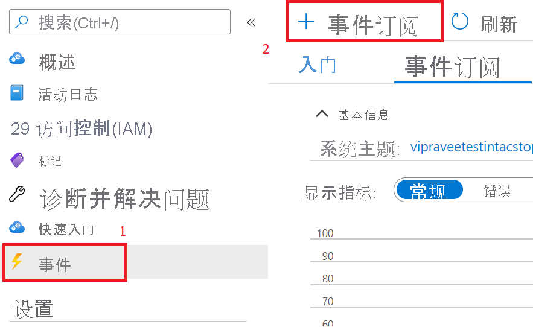
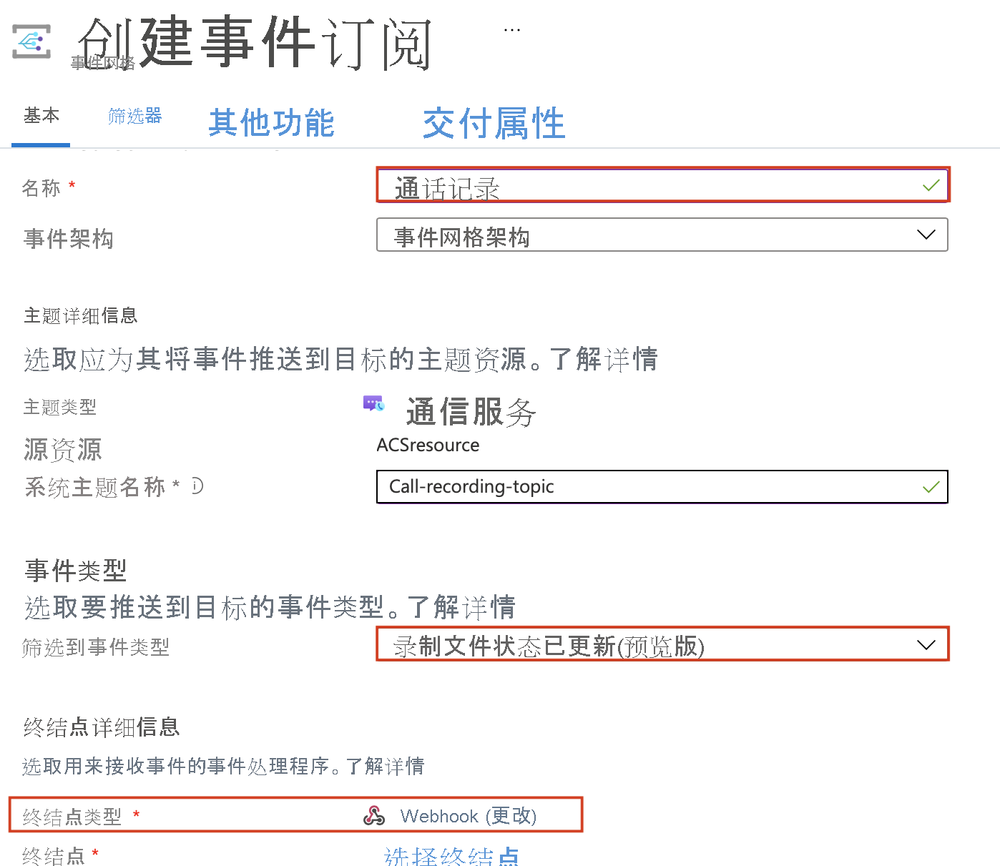

# <a name="record-and-download-calls-with-event-grid"></a>使用事件网格录制和下载通话

[!INCLUDE [Private Preview Notice](../../includes/private-preview-include.md)]

从使用 Azure 事件网格录制通信服务通话，开始使用 Azure 通信服务。

## <a name="prerequisites"></a>必备条件
- 具有活动订阅的 Azure 帐户。 [免费创建帐户](https://azure.microsoft.com/free/?WT.mc_id=A261C142F)。
- 活动的通信服务资源。 [创建通信服务资源](../create-communication-resource.md?pivots=platform-azp&tabs=windows)。
- [`Microsoft.Azure.EventGrid`](https://www.nuget.org/packages/Microsoft.Azure.EventGrid/) NuGet 包。

## <a name="create-a-webhook-and-subscribe-to-the-recording-events"></a>创建 webhook 并订阅录制事件
我们将使用 webhook 和事件来辅助通话录制和媒体文件下载。  

首先，我们将创建一个 webhook。 当触发 `recording` 事件时，通信服务资源将使用事件网格通知此 webhook，然后在录制的媒体可供下载时再次通知。

可以编写自定义 webhook 来接收这些事件通知。 对于通过验证代码响应入站消息以成功将 webhook 订阅到事件服务，此 webhook 非常重要。

```csharp
[HttpPost]
public async Task<ActionResult> PostAsync([FromBody] object request)
  {
   //Deserializing the request 
    var eventGridEvent = JsonConvert.DeserializeObject<EventGridEvent[]>(request.ToString())
        .FirstOrDefault();
    var data = eventGridEvent.Data as JObject;

    // Validate whether EventType is of "Microsoft.EventGrid.SubscriptionValidationEvent"
    if (string.Equals(eventGridEvent.EventType, EventTypes.EventGridSubscriptionValidationEvent, StringComparison.OrdinalIgnoreCase))
   {
        var eventData = data.ToObject<SubscriptionValidationEventData>();
        var responseData = new SubscriptionValidationResponseData
        {
            ValidationResponse = eventData.ValidationCode
        };
        if (responseData.ValidationResponse != null)
        {
            return Ok(responseData);
        }
    }

    // Implement your logic here.
    ...
    ...
  }
```

上述代码依赖于 `Microsoft.Azure.EventGrid` NuGet 包。 若要了解有关事件网格终结点验证的详细信息，请访问[终结点验证文档](../../../event-grid/receive-events.md#endpoint-validation)

接下来，我们将此 webhook 订阅到 `recording`：

1. 从 Azure 通信服务资源中选择 `Events` 边栏选项卡。
2. 选择 `Event Subscription`，如下所示。

3. 配置事件订阅，并选择 `Call Recording File Status Update` 作为 `Event Type`。 选择 `Webhook` 作为 `Endpoint type`。

4. 将 webhook 的 URL 输入到 `Subscriber Endpoint`。


现在，每次使用通信服务资源来录制通话时，都会通知 webhook。

## <a name="notification-schema"></a>通知架构
当录像可供下载时，通信服务资源将发出包含以下事件架构的通知。 可以从每个 `documentId` 的 `recordingChunk` 字段提取录像的文档 ID。

```json
{
    "id": string, // Unique guid for event
    "topic": string, // Azure Communication Services resource id
    "subject": string, // /recording/call/{call-id}
    "data": {
        "recordingStorageInfo": {
            "recordingChunks": [
                {
                    "documentId": string, // Document id for retrieving from AMS storage
                    "index": int, // Index providing ordering for this chunk in the entire recording
                    "endReason": string, // Reason for chunk ending: "SessionEnded", "ChunkMaximumSizeExceeded”, etc.
                }
            ]
        },
        "recordingStartTime": string, // ISO 8601 date time for the start of the recording
        "recordingDurationMs": int, // Duration of recording in milliseconds
        "sessionEndReason": string // Reason for call ending: "CallEnded", "InitiatorLeft”, etc.
    },
    "eventType": string, // "Microsoft.Communication.RecordingFileStatusUpdated"
    "dataVersion": string, // "1.0"
    "metadataVersion": string, // "1"
    "eventTime": string // ISO 8601 date time for when the event was created
}

```

## <a name="download-the-recorded-media-files"></a>下载录制的媒体文件

获取要下载的文件的文档 ID 后，我们将调用以下 Azure 通信服务 API，以使用 HMAC 身份验证下载录制的媒体和元数据。

最大录制文件大小为 1.5 GB。 超过此文件大小时，录制器会自动将录制的媒体拆分为多个文件。

客户端应能够使用单个请求下载所有媒体文件。 如果出现问题，客户端可以使用 range 标头重试，以避免重复下载已下载的段。

下载录制的媒体： 
- 方法：`GET` 
- URL： https://contoso.communication.azure.com/recording/download/{documentId}?api-version=2021-04-15-preview1

下载录制的媒体元数据： 
- 方法：`GET` 
- URL： https://contoso.communication.azure.com/recording/download/{documentId}/metadata?api-version=2021-04-15-preview1


### <a name="authentication"></a>身份验证
若要下载录制的媒体和元数据，请使用 HMAC 身份验证对针对 Azure 通信服务 API 的请求进行身份验证。

使用以下提供的 `HttpClient` 创建 `HmacAuthenticationUtils` 并添加所需的标头：

```csharp
  var client = new HttpClient();

  // Set Http Method
  var method = HttpMethod.Get;
  StringContent content = null;

  // Build request
  var request = new HttpRequestMessage
  {
      Method = method, // Http GET method
      RequestUri = new Uri(<Download_Recording_Url>), // Download recording Url
      Content = content // content if required for POST methods
  };

  // Question: Why do we need to pass String.Empty to CreateContentHash() method?
  // Answer: In HMAC authentication, the hash of the content is one of the parameters used to generate the HMAC token.
  // In our case our recording download APIs are GET methods and do not have any content/body to be passed in the request. 
  // However in this case we still need the SHA256 hash for the empty content and hence we pass an empty string. 


  string serializedPayload = string.Empty;

  // Hash the content of the request.
  var contentHashed = HmacAuthenticationUtils.CreateContentHash(serializedPayload);

  // Add HMAC headers.
  HmacAuthenticationUtils.AddHmacHeaders(request, contentHashed, accessKey, method);

  // Make a request to the Azure Communication Services APIs mentioned above
  var response = await client.SendAsync(request).ConfigureAwait(false);
```

#### <a name="hmacauthenticationutils"></a>HmacAuthenticationUtils 
以下实用程序可用于管理 HMAC 工作流。

**创建内容哈希**

```csharp
public static string CreateContentHash(string content)
{
    var alg = SHA256.Create();

    using (var memoryStream = new MemoryStream())
    using (var contentHashStream = new CryptoStream(memoryStream, alg, CryptoStreamMode.Write))
    {
        using (var swEncrypt = new StreamWriter(contentHashStream))
        {
            if (content != null)
            {
                swEncrypt.Write(content);
            }
        }
    }

    return Convert.ToBase64String(alg.Hash);
}
```

**添加 HMAC 标头**

```csharp
public static void AddHmacHeaders(HttpRequestMessage requestMessage, string contentHash, string accessKey)
{
    var utcNowString = DateTimeOffset.UtcNow.ToString("r", CultureInfo.InvariantCulture);
    var uri = requestMessage.RequestUri;
    var host = uri.Authority;
    var pathAndQuery = uri.PathAndQuery;

    var stringToSign = $"{requestMessage.Method}\n{pathAndQuery}\n{utcNowString};{host};{contentHash}";
    var hmac = new HMACSHA256(Convert.FromBase64String(accessKey));
    var hash = hmac.ComputeHash(Encoding.ASCII.GetBytes(stringToSign));
    var signature = Convert.ToBase64String(hash);
    var authorization = $"HMAC-SHA256 SignedHeaders=date;host;x-ms-content-sha256&Signature={signature}";

    requestMessage.Headers.Add("x-ms-content-sha256", contentHash);
    requestMessage.Headers.Add("Date", utcNowString);
    requestMessage.Headers.Add("Authorization", authorization);
}
```

## <a name="clean-up-resources"></a>清理资源
如果想要清理并删除通信服务订阅，可以删除资源或资源组。 删除资源组同时也会删除与之相关联的任何其他资源。 了解有关[清理资源](../create-communication-resource.md?pivots=platform-azp&tabs=windows#clean-up-resources)的详细信息。


## <a name="next-steps"></a>后续步骤
有关详细信息，请参阅以下文章：

- 查看[网络呼叫示例](../../samples/web-calling-sample.md)
- 了解如何[调用 SDK 功能](./calling-client-samples.md?pivots=platform-web)
- 了解有关[呼叫工作原理](../../concepts/voice-video-calling/about-call-types.md)的详细信息
