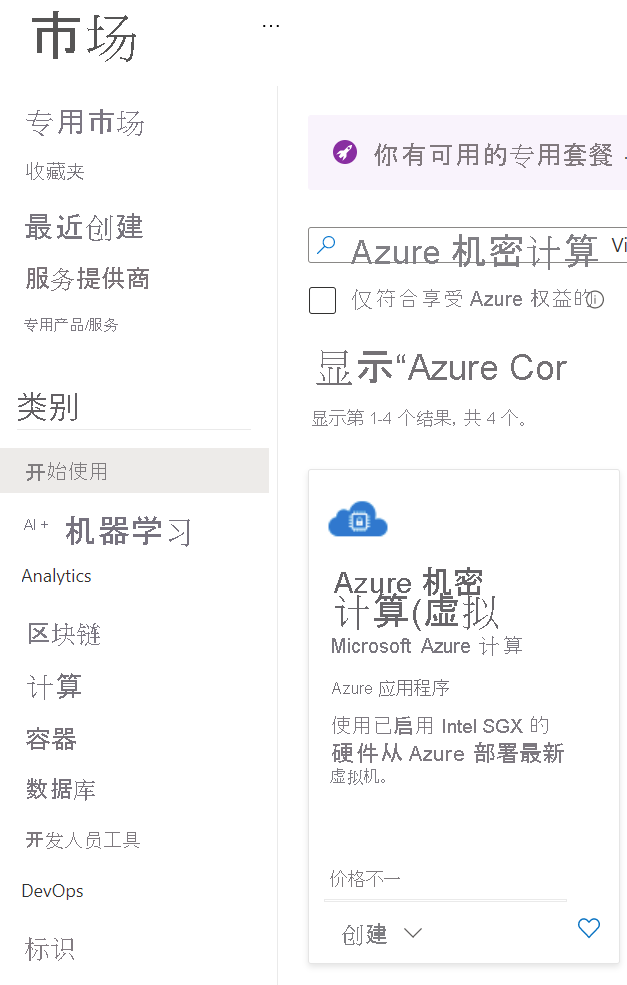

# <a name="quickstart-deploy-an-azure-confidential-computing-vm-in-the-marketplace"></a>快速入门：在市场中部署 Azure 机密计算 VM

使用 Azure 门户创建由 Intel SGX 提供支持的虚拟机 (VM)，以便开始使用 Azure 机密计算。 （可选）可以测试通过 Open Enclave Software (SDK) 生成的 enclave 应用程序。 

如果你对使用模板配置部署机密计算虚拟机感兴趣，建议参考本教程。 否则，建议[使用端口或 CLI](quick-create-portal.md) 执行标准的 Azure 虚拟机部署流。

## <a name="prerequisites"></a>先决条件

如果还没有 Azure 订阅，可以在开始前[创建一个帐户](https://azure.microsoft.com/pricing/purchase-options/pay-as-you-go/)。

> [!NOTE]
> 免费试用帐户无法访问本教程中使用的虚拟机。 请升级为即用即付订阅。


## <a name="sign-in-to-azure"></a>登录 Azure

1. 登录 [Azure 门户](https://portal.azure.com/)。

1. 在顶部，选择“创建资源”。

1. 在“开始使用”默认窗格中，搜索“Azure 机密计算(虚拟机)”。

1. 单击“Azure 机密计算(虚拟机)”模板。

    

1. 在虚拟机登陆页面上，选择“创建”。


## <a name="configure-a-confidential-computing-virtual-machine"></a>配置机密计算虚拟机

1. 在“基本信息”选项卡中，选择“订阅”和“资源组”（组必须为空才能部署此模板）。

1. 在“虚拟机名称”中，为新 VM 输入一个名称。

1. 键入或选择以下值：

   * **区域**：选择合适的 Azure 区域。

        > [!NOTE]
        > 机密计算虚拟机仅在特定区域中可用的专用硬件上运行。 有关 DCsv2 系列 VM 的最新可用区域，请参阅[可用区域](https://azure.microsoft.com/global-infrastructure/services/?products=virtual-machines)。

1. 配置要用于虚拟机的操作系统映像。 此设置仅支持第 2 代 VM 和映像部署

    * 选择映像：对于本教程，请选择 Ubuntu 18.04 LTS（第 2 代）。 还可以选择 Windows Server Datacenter 2019、Windows Server Datacenter 2016 或 Ubuntu 16.04 LTS。 如果选择这样做，则本教程会对你进行相应的重定向。
   
1. 在“基本信息”选项卡中，填写以下信息：

   * **身份验证类型**：若要创建 Linux VM，请选择“SSH 公钥”。 

        > [!NOTE]
        > 可以选择使用“SSH 公钥”或“密码”进行身份验证。 SSH 更安全。 有关如何生成 SSH 密钥的说明，请参阅[在 Linux 和 Mac 上为 Azure 中的 Linux VM 创建 SSH 密钥](../virtual-machines/linux/mac-create-ssh-keys.md)。

    * **用户名**：输入 VM 的管理员名称。

    * **SSH 公钥**：如果适用，请输入你的 RSA 公钥。
    
    * 密码：在适用情况下输入你的身份验证密码。
    
1. 在“虚拟机设置”选项卡中，填写以下信息：

   * 选择 VM SKU 大小
   * 如果选择了“DC1s_v2”、“DC2s_v2”、“DC4s_V2”虚拟机，请选择“标准 SSD”或“高级 SSD”作为磁盘类型。 对于“DC8_v2”虚拟机，只能选择“标准 SSD”作为磁盘类型。

   * **公共入站端口**：选择“允许所选的端口”，然后在“选择公共入站端口”列表中选择“SSH (22)”和“HTTP (80)”。    如果要部署 Windows VM，请选择“HTTP (80)”和“RDP (3389)” 。 在本快速入门中，必须执行此步骤才能连接到 VM。
   
    >[!Note]
    > 对于生产部署，不建议使用 RDP/SSH 端口。  

     


1. 如有需要，请选择“监视”选项

1. 选择“查看 + 创建”。

1. 在“查看 + 创建”窗格中，选择“创建”。 

> [!NOTE]
> 如果已部署了 Linux VM，请转到下一部分继续学习本教程。 如果已部署 Windows VM，请[按照这些步骤连接到 Windows VM](../virtual-machines/windows/connect-logon.md)


## <a name="connect-to-the-linux-vm"></a>连接到 Linux VM

如果已使用 BASH shell，请通过 ssh 命令连接到 Azure VM。 在以下命令中，替换连接到 Linux VM 所需的 VM 用户名和 IP 地址。

```bash
ssh azureadmin@40.55.55.555
```

可以在 Azure 门户中虚拟机的“概览”部分找到 VM 的公共 IP 地址。

:::image type="content" source="media/quick-create-portal/public-ip-virtual-machine.png" alt-text="Azure 门户中的 IP 地址":::

如果在 Windows 上运行且没有 BASH shell，请安装 SSH 客户端，例如 PuTTY。

1. [下载并安装 PuTTY](https://www.chiark.greenend.org.uk/~sgtatham/putty/download.html)。

1. 运行 PuTTY。

1. 在 PuTTY 配置屏幕上，输入 VM 的公共 IP 地址。

1. 选择“打开”，并根据提示输入用户名和密码。

若要详细了解如何连接到 Linux VM，请参阅[使用门户在 Azure 上创建 Linux VM](../virtual-machines/linux/quick-create-portal.md)。

> [!NOTE]
> 如果出现有关不会在注册表中缓存服务器主机密钥的 PuTTY 安全警报，请从以下选项中进行选择。 如果你信任此主机，请选择“是”将密钥添加到 PuTTy 缓存并继续进行连接。 如果你只想建立连接一次，而无需将密钥添加到缓存，请选择“否”。 如果你不信任此主机，请选择“取消”以放弃连接。

## <a name="intel-sgx-drivers"></a>Intel SGX 驱动程序

> [!NOTE]
> Intel SGX 驱动程序已是 Ubuntu 和 Windows Azure 库映像的一部分。 无需专门安装这些驱动程序。 （可选）也可以通过访问 [Intel SGX DCAP 驱动程序列表](https://01.org/intel-software-guard-extensions/downloads)，更新映像中随附的现有驱动程序。

## <a name="optional-testing-enclave-apps-built-with-open-enclave-sdk-oe-sdk"></a>可选：测试用 Open Enclave SDK (OE SDK) 生成的 enclave 应用<a id="Install"></a>

按照分步说明在运行 Ubuntu 18.04 LTS Gen 2 映像的 DCsv2 系列虚拟机上安装 [OE SDK](https://github.com/openenclave/openenclave)。 

如果虚拟机在 Ubuntu 18.04 LTS Gen 2 上运行，则需要按照[适用于 Ubuntu 18.04 的安装说明](https://github.com/openenclave/openenclave/blob/master/docs/GettingStartedDocs/install_oe_sdk-Ubuntu_18.04.md)进行操作。


> [!NOTE]
> Intel SGX 驱动程序已是 Ubuntu 和 Windows Azure 库映像的一部分。 无需专门安装这些驱动程序。 （可选）还可以更新映像中随附的现有驱动程序。

## <a name="clean-up-resources"></a>清理资源

当不再需要时，可以删除资源组、虚拟机和所有相关资源。 

选择虚拟机的资源组，然后选择“删除”  。 确认资源组名称，以完成资源删除。

## <a name="next-steps"></a>后续步骤

在本快速入门中，你部署了一个机密计算虚拟机，并安装了 Open Enclave SDK。 有关 Azure 上的机密计算虚拟机的详细信息，请参阅[有关虚拟机的解决方案](virtual-machine-solutions.md)。 

继续参阅 GitHub 上的 Open Enclave SDK 示例，了解如何生成机密计算应用程序。 

> [!div class="nextstepaction"]
> [生成 Open Enclave SDK 示例](https://github.com/openenclave/openenclave/blob/master/samples/README.md)
