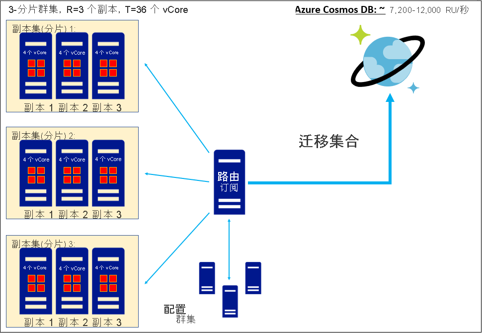

# 将非关系数据库中的 vCore 或 vCPU 数转换为 Azure Cosmos DB RU/s
[!INCLUDE[appliesto-sql-api](includes/appliesto-sql-api.md)]
[!INCLUDE[appliesto-mongodb-api](includes/appliesto-mongodb-api.md)]

本文说明在考虑数据迁移，但是只知道现有数据库副本集中的 vCore 或 vCPU 总计数时，如何估算 Azure Cosmos DB 请求单位 (RU/s)。 将一个或多个副本集迁移到 Azure Cosmos DB 时，这些副本集中保存的每个集合都会存储为 Azure Cosmos DB 集合（由具有 4x 复制因子的分片群集组成）。 可在此[分区和缩放指南](partitioning-overview.md)中详细了解我们的体系结构。 请求单位是在集合上预配吞吐量容量的方式；可以[阅读请求单位指南](request-units.md)和 RU/s [预配指南](set-throughput.md)以了解详细信息。 迁移集合时，Azure Cosmos DB 会预配足够的分片，以便为预配的请求单位提供服务并存储数据。 因此在迁移之前，为集合估算 RU/s 是确定计划 Azure Cosmos DB 数据资产规模的重要步骤。 根据我们与数千个客户合作的经验，我们发现以下公式可帮助我们通过 vCore 或 vCPU 数得出大致的起始 RU/s 估算值： 

`
Provisioned RU/s = C*T/R
`

* T：现有数据库数据承载副本集中的 vCore 和/或 vCPU 总数。 
* R：现有数据承载副本集的复制因子。 
* C：每个 vCore 或 vCPU 的建议预配 RU/s。 此值派生自 Azure Cosmos DB 的体系结构：
    * 对于 Azure Cosmos DB SQL API，C = 600 RU/s/vCore
    * 对于 Azure Cosmos DB API for MongoDB v4.0，C = 1000 RU/s/vCore
    * 目前无法提供 Cassandra API、Gremlin API 或其他 API 的 C 估算值

上面提供了 C 的值。 必须通过检查现有数据库的每个数据承载副本集中的 vCore 或 vCPU 数并求和获取总数来确定 T；如果无法估算 T，请考虑按照我们[使用 Azure Cosmos DB 容量规划器估算 RU/s 的指南](estimate-ru-with-capacity-planner.md)（而不是本指南）。 T 不应包含与现有数据库路由服务器或配置群集关联的 vCore 或 vCPU（如果具有这些组件）  。 

对于 R，建议插入数据库副本集的平均复制因子；如果此信息不可用，则 R=3 是一个良好的经验法则 。 

Azure Cosmos DB 互操作 API 在 SQL API 的基础上运行并实现自己独特的体系结构；因此，Azure Cosmos DB API for MongoDB v4.0 的 C 值与 Azure Cosmos DB SQL API 不同。

## 工作示例：为单个副本集迁移估算 RU/s

考虑基于四核服务器 SKU 且复制因子为 R=3 的单个副本集。 Then
* T = 12 个 vCore
* R = 3

因而 Azure Cosmos DB SQL API 的建议请求单位是

`
Provisioned RU/s, SQL API = (600 RU/s/vCore) * (12 vCores) / (3) = 2,400 RU/s
`

Azure Cosmos DB API for MongoDB 的建议请求单位是

`
Provisioned RU/s, API for MongoDB = (1,000 RU/s/vCore) * (12 vCores) / (3) = 4,000 RU/s
`

## 工作示例：在迁移同类副本集的群集时估算 RU/s

考虑由三个副本集组成的分片复制群集，每个副本集的复制因子都是三，其中每台服务器都是四核 SKU。 Then
* T = 36 个 vCore
* R = 3

因而 Azure Cosmos DB SQL API 的建议请求单位是

`
Provisioned RU/s, SQL API = (600 RU/s/vCore) * (36 vCores) / (3) = 7,200 RU/s
`

Azure Cosmos DB API for MongoDB 的建议请求单位是

`
Provisioned RU/s, API for MongoDB = (1,000 RU/s/vCore) * (36 vCores) / (3) = 12,000 RU/s
`

## 工作示例：在迁移异类副本集的群集时估算 RU/s

考虑由三个副本集组成的分片复制群集，其中每台服务器都基于四核 SKU。 这些副本集之所以是“异类”，是因为各自具有不同的复制因子：分别为 3x、1x 和 5x。 建议方法是在计算请求单位时使用平均复制因子。 Then
* T = 36 个 vCore
* R 平均值 = (3+1+5)/3 = 3

因而 Azure Cosmos DB SQL API 的建议请求单位是

`
Provisioned RU/s, SQL API = (600 RU/s/vCore) * (36 vCores) / (3) = 7,200 RU/s
`

Azure Cosmos DB API for MongoDB 的建议请求单位是

`
Provisioned RU/s, API for MongoDB = (1,000 RU/s/vCore) * (36 vCores) / (3) = 12,000 RU/s
`

## 有关获取最准确 RU/s 估算值的提示

从云托管数据库迁移：如果当前使用云托管数据库，则这些服务通常表现为以 vCore 或 vCPU 数为单位（即 T ）进行预配，但实际上预配的核心计数对于 R 节点副本集会设置 vCore/副本或 vCPU/副本值 (T/R)；实际核心数是显式预配值的 R 倍       。 建议确定此说明是否适用于当前云托管数据库，如果适用，则必须将预配的 vCore 或 vCPU 名义数量乘以 R，才能获取 T 的准确估算值   。

vCore 与 vCPU：在本文中，我们将“vCore”和“vCPU”视为同义词，因此 C 的单位为 RU/s/vCore 或 RU/s/vCPU，两者没有区别   。 但在实践中，这种简化在某些情况下可能并不准确。 这些术语可能具有不同的含义；例如，如果物理 CPU 支持超线程，则可能 1 个 vCPU = 2 个 vCore 或是其他情况。 通常，vCore/vCPU 关系依赖于硬件，建议对现有群集硬件调查该关系是怎样的，以及是根据 vCore 还是 vCPU 预配群集计算 。 如果 vCPU 和 vCore 在硬件上的含义不同，则建议将以上 C 估算值视为采用 RU/s/vCore 单位，并在必要时使用适合于硬件的转换因子将 T 从 vCPU 转换为 vCore    。

## 总结

通过 vCore 或 vCPU 估算 RU/s  需要从现有数据库副本集收集有关 vCore/vCPU 总数和复制因子的信息。 随后可以使用 vCore/vCPU 和吞吐量之间的已知关系来估算 Azure Cosmos DB 请求单位 (RU/s)。 得出此请求单位估算值是预测迁移后 Azure Cosmos DB 数据资产规模的重要步骤。

下表总结了适用于 Azure Cosmos DB SQL API 和 API for MongoDB v4.0 的 vCore 和 vCPU  之间的关系：

| vCore 数 | RU/s (SQL API)  （复制因子=3） | RU/s (API for MongoDB v4.0)  （复制因子=3） |
|-------------|----------------|------------------|
| 3           | 600            |            1000  |
| 6           | 1200            |            2000  |
| 12           | 2400            |            4000  |
| 24           | 4800            |            8000  |
| 48           | 9600            |            16000  |
| 96           | 19200            |            32000  |
| 192           | 38400            |            64000  |
| 384           | 76800            |            128000  |

## 后续步骤
* [了解 Azure Cosmos DB 定价](https://azure.microsoft.com/pricing/details/cosmos-db/)
* [了解如何计划和管理 Azure Cosmos DB 的成本](plan-manage-costs.md)
* [查看用于迁移到 Azure Cosmos DB 的选项](cosmosdb-migrationchoices.md)
* [迁移到 Azure Cosmos DB SQL API](import-data.md)
* [规划迁移到 Azure Cosmos DB API for MongoDB](mongodb/pre-migration-steps.md)。 本文档包含指向完成规划后可以使用的不同迁移工具的链接。

[regions]: https://azure.microsoft.com/regions/