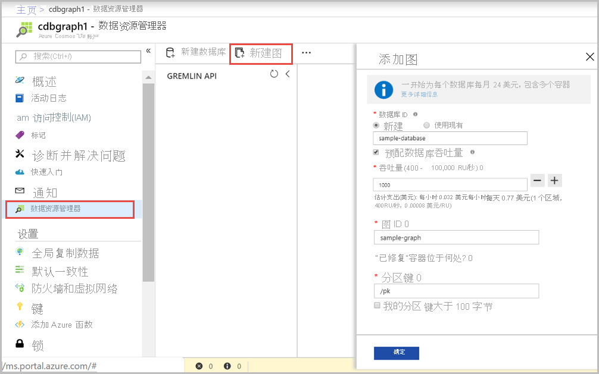

现在可以在 Azure 门户中使用数据资源管理器工具来创建图形数据库。 

1. 依次选择“数据资源管理器” > “新建图”。

    此时，最右侧显示“添加图形”区域，可能需要向右滚动才能看到。

    

2. 在“添加图形”页上，输入新图形的设置。

    设置|建议的值|说明
    ---|---|---
    数据库 ID|sample-database|输入“sample-database”作为新数据库的名称。 数据库名称的长度必须为 1 到 255 个字符，不能包含 `/ \ # ?` 或尾随空格。
    吞吐量|400 RU|将吞吐量更改为每秒 400 个请求单位 (RU/s)。 如果想要减少延迟，以后可以增加吞吐量。
    图形 ID|sample-graph|输入“sample-graph”作为新集合的名称。 图形名称与数据库 ID 的字符数要求相同。
    分区键| /pk |所有 Cosmos DB 帐户都需要一个分区键才能进行水平缩放。 在[图形数据分区](../graph-partitioning.md)一文中了解如何选择适当的分区键。

3. 填写表单后，请选择“确定”。