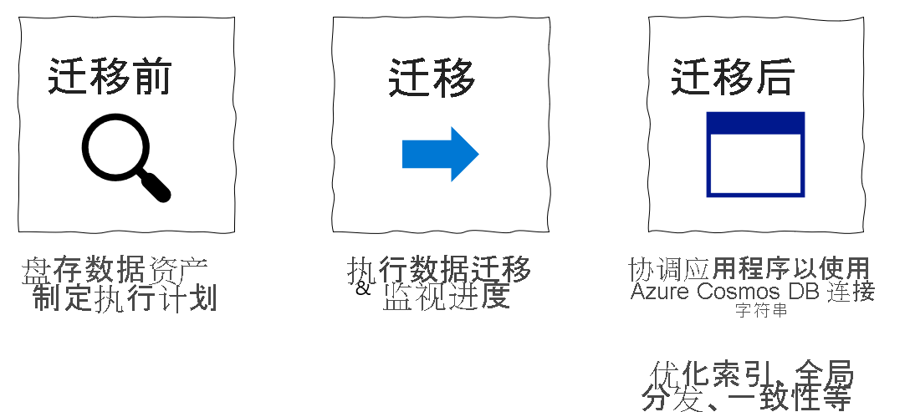
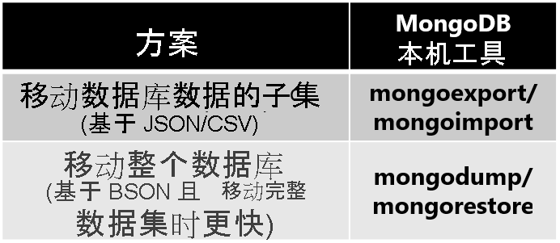
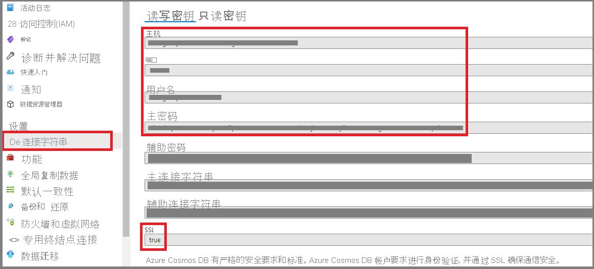
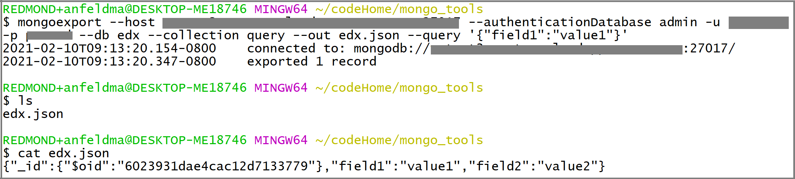
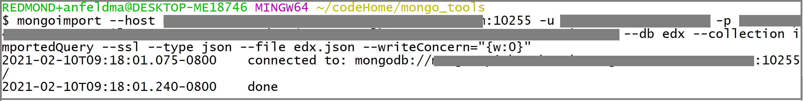
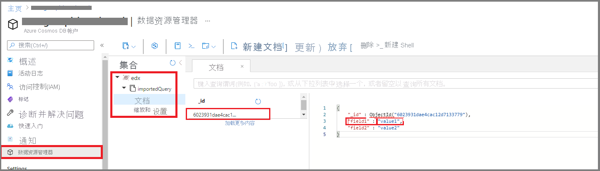
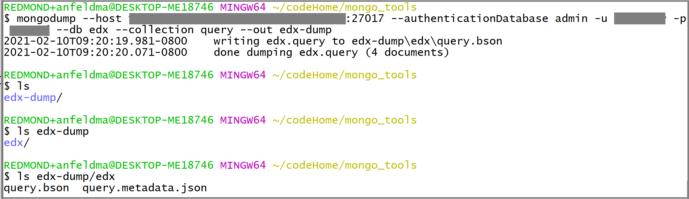
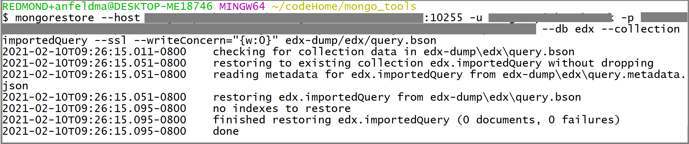
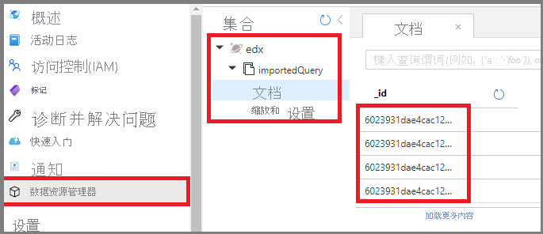

# Tutorial:使用 MongoDB 本机工具将 MongoDB 脱机迁移到 Azure Cosmos DB 的用于 MongoDB 的 API
[!INCLUDE[appliesto-mongodb-api](../includes/appliesto-mongodb-api.md)]

> [!IMPORTANT]  
> 在执行迁移步骤之前，请完整阅读本指南。
>

本 MongoDB 迁移指南是 MongoDB 迁移系列的一部分。 关键的 MongoDB 迁移步骤包括[迁移前步骤](pre-migration-steps.md)、迁移步骤和[迁移后步骤](post-migration-optimization.md)，如下所示。

## 使用 MongoDB 原生工具迁移数据概述

可以使用 MongoDB 本机工具将数据库从 MongoDB 的本地或云实例脱机（一次性）迁移到 Azure Cosmos DB 的用于 MongoDB 的 API。

在本教程中，你将了解如何执行以下操作：
> [!div class="checklist"]
>
> * 为用例选择适当的 MongoDB 本机工具
> * 运行迁移。
> * 监视迁移。
> * 验证迁移是否成功。

在本教程中，你将使用 MongoDB 本机工具，将 Azure 虚拟机中托管的 MongoDB 中的某个数据集迁移到 Azure Cosmos DB 的用于 MongoDB 的 API。 MongoDB 本机工具是一组二进制文件，有助于对现有 MongoDB 实例进行数据操作。 由于 Azure Cosmos DB 公开了 Mongo API，因此 MongoDB 本机工具能够将数据插入 Azure Cosmos DB。 此文档的重点是使用 mongoexport/mongoimport 或 mongodump/mongorestore 将数据从 MongoDB 实例中迁移出来 。 由于本机工具使用连接字符串连接到 MongoDB，因此你可以在任何位置运行这些工具，但建议在与 MongoDB 实例相同的网络中运行这些工具，以避免出现防火墙问题。 

MongoDB 本机工具只能在主机硬件允许的速度下移动数据。对于不考虑总迁移时间的小型数据集，本机工具可能是最简单的解决方案。 如果需要可缩放的迁移管道，那么 [MongoDB Spark 连接器](https://docs.mongodb.com/spark-connector/current/)、[Azure 数据迁移服务 (DMS)](../../dms/tutorial-mongodb-cosmos-db.md) 或 [Azure 数据工厂 (ADF)](../../data-factory/connector-azure-cosmos-db-mongodb-api.md) 可能是更好的选择。

如果尚未设置 MongoDB 源，请参阅[在 Azure 中的 Windows VM 上安装和配置 MongoDB](/previous-versions/azure/virtual-machines/windows/install-mongodb) 一文。

## 先决条件

要完成本教程，需要：

* [完成迁移前](pre-migration-steps.md)步骤，例如估计吞吐量、选择分区键和索引策略。
* [创建 Azure Cosmos DB 的用于 MongoDB 的 API 帐户](https://ms.portal.azure.com/#create/Microsoft.DocumentDB)。
* 登录到 MongoDB 实例
    * [从此链接下载并安装 MongoDB 本机工具](https://www.mongodb.com/try/download/database-tools)。
        * **请确保你的 MongoDB 本机工具版本与现有的 MongoDB 实例匹配。**
        * 如果 MongoDB 实例的版本与 Azure Cosmos DB Mongo API 的版本不同，则请安装这两个 MongoDB 本机工具版本，并分别为 MongoDB 和 Azure Cosmos DB Mongo API 使用适当的工具版本。
    * 添加具有 `readWrite` 权限的用户，除非已存在这样的用户。 在本教程后面的内容中，将此用户名/密码提供给 mongoexport 和 mongodump 工具 。

## 配置 Azure Cosmos DB 服务器端重试

资源治理功能有利于从 MongoDB 迁移到 Azure Cosmos DB 的客户，它保证能够充分利用对吞吐量预配的每秒处理请求单位 (RU/秒)。 如果某指定请求超出了容器预配的每秒处理请求单位（RU/秒），Azure Cosmos DB 可能会在迁移过程中限制该请求；随后，需要重试该请求。 迁移工具和 Azure Cosmos DB 之间的网络跃点所涉及的往返时间会影响该请求的总体响应时间。此外，MongoDB 本机工具可能无法处理重试。 借助 Azure Cosmos DB 的服务器端重试功能，服务可截获限制错误代码，并以更短的往返时间重试，从而显著缩短请求响应时间。 从 MongoDB 本机工具的角度来看，将处理重试的需求降至最低会对迁移期间的体验产生积极影响。

你可在 Azure Cosmos DB 门户的“功能”边栏选项卡中找到服务器端重试功能

如果该功能被禁用，建议你如下所示将其启用

## 选择适当的 MongoDB 本机工具

* mongoexport/mongoimport 是迁移 MongoDB 数据库子集的最佳迁移工具组合。
    * mongoexport 将现有的数据导出为可读的 JSON 或 CSV 文件。 mongoexport 通过一个参数来指定要导出的现有数据的子集。 
    * mongoimport 会打开 JSON 或 CSV 文件，并将内容插入到目标数据库实例中（在本例中为 Azure Cosmos DB。）。 
    * 请注意，JSON 和 CSV 不是压缩格式，mongoimport 将数据发送到 Azure Cosmos DB 时，可能会产生额外的网络费用。
* mongodump/mongorestore 是迁移整个 MongoDB 数据库的最佳迁移工具组合。 在 Azure Cosmos DB 中插入数据时，压缩 BSON 格式将更有效地利用网络资源。
    * mongodump 会将现有数据导出为 BSON 文件。
    * mongorestore 会将 BSON 文件转储导入 Azure Cosmos DB。
* 另外，如果只想要将小型 JSON 文件导入 Azure Cosmos DB Mongo API，则 mongoimport 工具是用于引入数据的快速解决方案。

## 收集 Azure Cosmos DB Mongo API 凭据

Azure Cosmos DB Mongo API 提供了 MongoDB 本机工具可以利用的兼容访问凭据。 若要将数据迁移到 Azure Cosmos DB Mongo API 中，需要具有这些访问凭据。 要查找这些凭证，请执行以下操作：

1. 打开 Azure 门户
1. 导航到你的 Azure Cosmos DB Mongo API 帐户
1. 在左侧导航栏中，选择“连接字符串”边栏选项卡，应会看到如下所示的显示内容：

    

    * HOST - Azure Cosmos DB 终结点充当 MongoDB 主机名
    * PORT - MongoDB 本机工具连接到 Azure Cosmos DB 时，必须显式指定此端口
    * USERNAME - Azure Cosmos DB 终结点域名的前缀充当 MongoDB 用户名
    * PASSWORD - Azure Cosmos DB 主密钥充当 MongoDB 密码
    * 此外，请注意 SSL 字段，该字段为 `true` - MongoDB 本机工具在将数据写入 Azure Cosmos DB 时，必须启用 SSL

## 执行迁移

1. 选择要迁移的数据库和集合。 在此示例中，我们要将 edx 数据库中的查询集合从 MongoDB 迁移到 Azure Cosmos DB 。

本部分的其余内容将介绍如何使用在上一部分中选择的工具组合。

### mongoexport/mongoimport

1. 若要从源 MongoDB 实例导出数据，请在 MongoDB 实例计算机上打开一个终端。 如果该终端是 Linux 计算机，请键入

    `mongoexport --host HOST:PORT --authenticationDatabase admin -u USERNAME -p PASSWORD --db edx --collection query --out edx.json`

    在 Windows 上，可执行文件为 `mongoexport.exe`。 应根据现有 MongoDB 数据库实例的属性填写 HOST、PORT、USERNAME 和 PASSWORD   。 
    
    还可以选择仅导出 MongoDB 数据集的子集。 实现此操作的一种方法是添加一个额外的筛选器参数：
    
    `mongoexport --host HOST:PORT --authenticationDatabase admin -u USERNAME -p PASSWORD --db edx --collection query --out edx.json --query '{"field1":"value1"}'`

    将仅导出与筛选器 `{"field1":"value1"}` 匹配的文档。

    执行调用后，应会看到生成了 `edx.json` 文件：

    
1. 可以使用同一终端将 `edx.json` 导入 Azure Cosmos DB。 如果在 Linux 机器上运行 `mongoimport`，请键入

    `mongoimport --host HOST:PORT -u USERNAME -p PASSWORD --db edx --collection importedQuery --ssl --type json --writeConcern="{w:0}" --file edx.json`

    在 Windows 上，可执行文件为 `mongoimport.exe`。 应根据先前收集的 Azure Cosmos DB 凭据填写 HOST、PORT、USERNAME 和 PASSWORD   。 
1. 监视 mongoimport 的终端输出。 应会看到它在终端上打印了文本行，其中包含有关迁移状态的更新：

        

1. 最后，检查 Azure Cosmos DB，验证迁移是否成功。 打开 Azure Cosmos DB 门户，并导航到“数据资源管理器”。 应会看到 (1) 已创建了具有 importedQuery 集合的 edx 数据库，并且 (2) 如果仅导出数据的一个子集，则 importedQuery 应该只包含与所需的数据子集匹配的文档   。 在以下示例中，只有一个文档与筛选器 `{"field1":"value1"}` 相匹配：

        

### mongodump/mongorestore

1. 若要创建 MongoDB 实例的 BSON 数据转储，请在 MongoDB 实例计算机上打开一个终端。 如果该终端是 Linux 计算机，请键入

    `mongodump --host HOST:PORT --authenticationDatabase admin -u USERNAME -p PASSWORD --db edx --collection query --out edx-dump`

    应根据现有 MongoDB 数据库实例的属性填写 HOST、PORT、USERNAME 和 PASSWORD   。 应会看到生成了 `edx-dump` 目录，并且 `edx-dump` 的目录结构再现了源 MongoDB 实例的资源层次结构（数据库和集合结构）。 每个集合都由一个 BSON 文件表示：

    
1. 可以使用同一终端将 `edx-dump` 的内容还原到 Azure Cosmos DB 中。 如果在 Linux 机器上运行 `mongorestore`，请键入

    `mongorestore --host HOST:PORT --authenticationDatabase admin -u USERNAME -p PASSWORD --db edx --collection importedQuery --ssl edx-dump/edx/query.bson`

    在 Windows 上，可执行文件为 `mongorestore.exe`。 应根据先前收集的 Azure Cosmos DB 凭据填写 HOST、PORT、USERNAME 和 PASSWORD   。 
1. 监视 mongorestore 的终端输出。 应会看到它在终端上打印行，用于显示迁移状态更新：

        

1. 最后，检查 Azure Cosmos DB，验证迁移是否成功。 打开 Azure Cosmos DB 门户，并导航到“数据资源管理器”。 应会看到 (1) 已创建了具有 importedQuery 集合的 edx 数据库，以及 (2) importedQuery 应包含源集合中的整个数据集   ：

        

## 迁移后优化

将 MongoDB 数据库中存储的数据迁移到 Azure Cosmos DB 的 API for MongoDB 后，你可以连接到 Azure Cosmos DB 并管理数据。 你还可以执行其他迁移后优化步骤，例如优化索引策略，为你的 Azure Cosmos DB 帐户更新默认一致性级别或配置全局分发。 有关详细信息，请参阅[迁移后优化](post-migration-optimization.md)一文。

## 其他资源

* [Cosmos DB 服务信息](https://azure.microsoft.com/services/cosmos-db/)
* [MongoDB 数据库工具文档](https://docs.mongodb.com/database-tools/)
* 尝试为迁移到 Azure Cosmos DB 进行容量规划？
    * 若只知道现有数据库群集中的 vcore 和服务器数量，请阅读[使用 vCore 或 vCPU 估算请求单位](../convert-vcore-to-request-unit.md) 
    * 若知道当前数据库工作负载的典型请求速率，请阅读[使用 Azure Cosmos DB 容量计划工具估算请求单位](estimate-ru-capacity-planner.md)

## 后续步骤

* 在 Microsoft 的 [Database Migration Guide](https://datamigration.microsoft.com/)（数据库迁移指南）中查看迁移指南以了解其他方案。