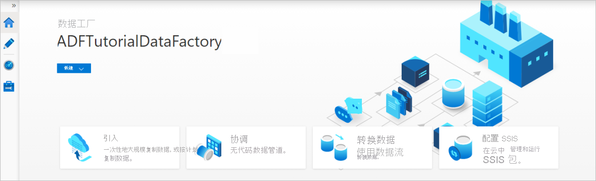

# 使用 Azure 数据工厂将数据从 Azure Data Lake Storage Gen1 复制到 Gen2

[!INCLUDE[appliesto-adf-asa-md](includes/appliesto-adf-asa-md.md)]

Azure Data Lake Storage Gen2 是一组专用于大数据分析的功能，内置于 [Azure Blob 存储](../storage/blobs/storage-blobs-introduction.md)中。 它可使用文件系统和对象存储范例与数据进行交互。

如果当前使用 Azure Data Lake Storage Gen1，则可以使用 Azure 数据工厂将数据从 Data Lake Storage Gen1 复制到 Gen2，以便对 Azure Data Lake Storage Gen2 进行评估。

Azure 数据工厂是一个完全托管的基于云的数据集成服务。 通过该服务，可使用丰富的本地数据存储和基于云的数据存储中的数据填充数据湖，并更快速地生成分析解决方案。 若要查看受支持的连接器的列表，请参阅[支持的数据存储](copy-activity-overview.md#supported-data-stores-and-formats)表。

Azure 数据工厂提供可横向扩展的托管数据移动解决方案。 得益于数据工厂的横向扩展体系结构，它能以较高的吞吐量引入数据。 有关详细信息，请参阅[复制活动性能](copy-activity-performance.md)。

本文介绍如何使用数据工厂的复制数据工具将数据从 Azure Data Lake Storage Gen1 复制到 Azure Data Lake Storage Gen2。 可以遵循类似步骤，从其他类型的数据存储中复制数据。

## 先决条件

* Azure 订阅。 如果没有 Azure 订阅，请在开始之前创建一个[免费帐户](https://azure.microsoft.com/free/)。
* 其中有数据的 Azure Data Lake Storage Gen1 帐户。
* 启用了 Data Lake Storage Gen2 的 Azure 存储帐户。 如果没有存储帐户，请[创建一个帐户](https://ms.portal.azure.com/#create/Microsoft.StorageAccount-ARM)。

## 创建数据工厂

1. 在左侧菜单中，选择“创建资源” > “数据 + 分析” > “数据工厂”。
   
   

2. 在“新建数据工厂”页中，为下图中所示的字段提供值： 
      
   
 
    * **名称**：输入 Azure 数据工厂的全局唯一名称。 如果收到错误“数据工厂名称 \"LoadADLSDemo\" 不可用”，请输入不同的数据工厂名称。 例如，使用名称 _**yourname**_**ADFTutorialDataFactory**。 再次创建数据工厂。 有关数据工厂项目的命名规则，请参阅[数据工厂命名规则](naming-rules.md)。
    * **订阅**：选择要在其中创建数据工厂的 Azure 订阅。 
    * **资源组**：从下拉列表选择现有的资源组。 也可以选择“新建”选项，然后输入资源组的名称。 若要了解资源组，请参阅[使用资源组管理 Azure 资源](../azure-resource-manager/management/overview.md)。 
    * **版本**：选择“V2”。
    * **位置**：选择数据工厂的位置。 下拉列表中仅显示支持的位置。 数据工厂使用的数据存储可以在其他位置和区域中。 

3. 选择“创建”  。
4. 完成创建操作后，请转到数据工厂。 此时会看到“数据工厂”主页，如下图所示： 
   
   :::image type="content" source="./media/doc-common-process/data-factory-home-page.png" alt-text="Azure 数据工厂主页，其中包含“打开 Azure 数据工厂工作室”磁贴。":::

5. 在“打开 Azure 数据工厂工作室”磁贴上选择“打开”，以便在单独选项卡中启动“数据集成应用程序”。

## 将数据加载到 Azure Data Lake Storage Gen2 中

1. 在主页中，选择“引入”磁贴启动复制数据工具。 

   

2. 在“属性”页上，在“任务类型”下选择“内置复制任务”，在“任务节奏或任务计划”下选择“现在运行一次”，然后选择“下一页”。

3. 在“源数据存储”页中，选择“+ 新建连接”。
    
4. 从连接器库中选择“Azure Data Lake Storage Gen1”，然后选择“继续” 。
    
    
    
5. 在“新建连接(Azure Data Lake Storage Gen1)”页中，按以下步骤操作：
   1. 选择你的 Data Lake Storage Gen1 作为帐户名称，并指定或验证 **租户**。
   1. 选择“测试连接”以验证设置。 然后选择“创建”。
  
   > [!IMPORTANT]
   > 在本演练中，使用 Azure 资源的托管身份来对 Azure Data Lake Storage Gen1 进行身份验证。 请按照[这些说明](connector-azure-data-lake-store.md#managed-identity)授予托管身份在 Azure Data Lake Storage Gen1 中的适当权限。
   
   
      
6. 在“源数据存储”页上，完成以下步骤。 
    1. 在“连接”部分中选择新建的连接。
    1. 在“文件或文件夹”下，浏览到要复制的文件夹和文件。 选择文件夹或文件，然后选择“确定”。
    1. 选择“以递归方式”和“以二进制方式复制”选项，指定复制行为。 选择“**下一页**”。
    
    :::image type="content" source="./media/load-azure-data-lake-storage-gen2-from-gen1/source-data-store-page.png" alt-text="屏幕截图显示“源数据存储”页。":::
    
7. 在“目标数据存储”页中，选择“+ 新建连接” > “Azure Data Lake Storage Gen2” > “继续”。

    

8. 在“新建连接(Azure Data Lake Storage Gen2)”页中，按以下步骤操作：
   1. 从“存储帐户名称”下拉列表中选择能使用 Data Lake Storage Gen2 的帐户。
   1. 选择“创建”以创建连接。 

   

9. 在“目标数据存储”页上，完成以下步骤。 
    1. 在“连接”块中选择新建的连接。 
    1. 在“文件夹路径”下，输入“copyfromadlsgen1”作为输出文件夹名称，然后选择“下一步”。 数据工厂会在复制过程中创建相应的 Azure Data Lake Storage Gen2 文件系统和子文件夹（如果不存在）。

    :::image type="content" source="./media/load-azure-data-lake-storage-gen2-from-gen1/destination-data-store-page.png" alt-text="屏幕截图显示“目标数据存储”页。":::

10. 在“设置”页中，为“任务名称”字段指定“CopyFromADLSGen1ToGen2”，然后选择“下一步”，以使用默认设置。

11. 在“摘要”页中检查设置，然后选择“下一步”。

    

12. 在“部署”页中，选择“监视”以监视管道。 

    

13. 请注意，界面中已自动选择左侧的“监视”选项卡。  “管道名称”列中包含用于查看活动运行详细信息以及用于重新运行管道的链接。

    

14. 若要查看与管道运行关联的活动运行，请选择“管道名称”列中的链接。 该管道只包含一个活动（复制活动），因此只显示了一个条目。 若要切换回“管道运行”视图，请选择顶部痕迹导航菜单中的“所有管道运行”链接。 选择“刷新”可刷新列表。 

    

15. 若要监视每个复制活动的执行详细信息，请在活动监视视图中选择“活动名称”列下的“详细信息”链接（眼镜图标）。 可以监视详细信息，例如，从源复制到接收器的数据量、吞吐量、执行步骤以及相应的持续时间和使用的配置。

    :::image type="content" source="./media/load-azure-data-lake-storage-gen2-from-gen1/monitor-activity-run-details.png" alt-text="屏幕截图显示活动运行详细信息。":::

16. 验证数据是否已复制到 Azure Data Lake Storage Gen2 帐户。

## 最佳做法

若要对从 Azure Data Lake Storage Gen1 到 Azure Data Lake Storage Gen2 的升级进行常规性评估，请参阅[将大数据分析解决方案从 Azure Data Lake Storage Gen1 升级到 Azure Data Lake Storage Gen2](../storage/blobs/data-lake-storage-migrate-gen1-to-gen2.md)。 以下部分介绍了使用数据工厂将数据从 Data Lake Storage Gen1 升级到 Data Lake Storage Gen2 的最佳做法。

### 初始快照数据迁移

#### 性能

ADF 提供一个可在不同级别实现并行度的无服务器体系结构，使开发人员能够生成管道，以充分利用网络带宽以及存储 IOPS 和带宽将环境的数据移动吞吐量最大化。 

客户已成功将由数亿个文件组成的 PB 级数据从 Data Lake Storage Gen1 迁移到 Gen2，同时保持 2 GBps 及更高的吞吐量。

可通过不同的并行度实现极佳的数据移动速度：

- 单个复制活动可以利用可缩放的计算资源：使用 Azure Integration Runtime 时，能够以无服务器方式为每个复制活动指定最多 256 个[数据集成单元 (DIU)](copy-activity-performance-features.md#data-integration-units)；使用自承载集成运行时时，可以手动纵向扩展计算机或横向扩展为多个计算机（最多 4 个节点），单个复制活动会在所有节点之间将其文件集分区。
- 单个复制活动使用多个线程读取和写入数据存储。
- ADF 控制流可以并行启动多个复制活动（例如，使用 For Each 循环）。

#### 数据分区

如果 Data Lake Storage Gen1 中的总数据大小小于 10 TB，且文件数低于一百万个，则可以在单个复制活动运行中复制所有数据。 如果要复制的数据量较大，或者想要灵活地按批管理数据迁移并使每批数据在特定期限内是完整的，请对数据进行分区。 分区还会降低发生任何意外问题的风险。 

对文件进行分区的方法是使用[复制活动属性](connector-azure-data-lake-store.md#copy-activity-properties)中的 name range- listAfter/listBefore。 可以将每个复制活动配置为一次复制一个分区，以便多个复制活动可以同时从单个 Data Lake Storage Gen1 帐户复制数据。

#### 速率限制 

最佳做法是使用有代表性的示例数据集执行性能 POC，以便确定适当的分区大小。

1. 一开始使用单个分区，以及采用默认 DIU 设置的单个复制活动。 [并行复制](copy-activity-performance-features.md#parallel-copy)始终建议设置为“空（默认）”。 如果复制吞吐量对你有影响，请遵循[性能优化步骤](copy-activity-performance.md#performance-tuning-steps)来确定并解决性能瓶颈问题。 

2. 逐渐增大 DIU 设置，直到达到网络的带宽限制或数据存储的 IOPS/带宽限制，或者达到单个复制活动允许的最大 DIU 数目 (256)。 

3. 如果你已将单个复制活动的性能最大化，但还没有达到环境的吞吐量上限，那么可以并行运行多个复制活动。  

如果看到[复制活动监视](copy-activity-monitoring.md#monitor-visually)中出现大量限制错误，则表明已达到存储帐户的容量上限。 ADF 将自动重试以克服每个限制错误，从而确保不会丢失任何数据，但重试次数过多也会影响复制吞吐量。 在这种情况下，建议减少同时运行的复制活动数量，以避免大量限制错误。 如果一直在使用单个复制活动来复制数据，则建议减少 DIU 的数量。

### 增量数据迁移

可以使用多种方法仅加载 Data Lake Storage Gen1 中的新文件或已更新的文件：

- 按时间分区的文件夹或文件名加载新文件或更新的文件。 例如 /2019/05/13/*。
- 按 LastModifiedDate 加载新文件或更新的文件。 如果要复制大量文件，请首先执行分区，以避免由于单个复制活动扫描整个 Data Lake Storage Gen1 帐户来识别新文件而导致低复制吞吐量。 
- 通过任何第三方工具或解决方案标识新文件或更新的文件。 然后通过参数、表或文件将文件或文件夹名称传递到数据工厂管道。 

执行增量加载的正确频率取决于 Azure Data Lake Storage Gen1 中的文件总数以及每次加载的新文件或已更新文件的数量。 

### 网络安全

ADF 默认通过 HTTPS 协议使用加密的连接将数据从 Azure Data Lake Storage Gen1 传输到 Gen2。 HTTPS 提供传输中数据加密，并可防止窃听和中间人攻击。

如果不希望通过公共 Internet 传输数据，可以通过专用网络传输数据，以此实现更高的安全性。

### 保留 ACL

若要在从 Data Lake Storage Gen1 升级到 Data Lake Storage Gen2 时复制 ACL 和数据文件，请参阅[从 Data Lake Storage Gen1 保留 ACL](connector-azure-data-lake-storage.md#preserve-acls)。 

### 复原能力

在单个复制活动运行中，ADF 具有内置的重试机制，因此，它可以处理数据存储或底层网络中特定级别的暂时性故障。 如果迁移的数据超过 10 TB，建议将数据分区，以降低出现任何意外问题的风险。

还可以在复制活动中启用[容错](copy-activity-fault-tolerance.md)以跳过预定义的错误。 也可在复制活动中启用[数据一致性验证](copy-activity-data-consistency.md)以进行附加验证，确保数据不仅成功地从源存储复制到目标存储，而且经验证在源存储和目标存储之间保持一致。

### 权限 

在数据工厂中，[Data Lake Storage Gen1 连接器](connector-azure-data-lake-store.md)支持将服务主体和托管身份用于 Azure 资源身份验证。 [Data Lake Storage Gen2 连接器](connector-azure-data-lake-storage.md)支持将帐户密钥、服务主体和托管身份用于 Azure 资源身份验证。 若要使数据工厂能够导航并复制所有文件或所需的访问控制列表，请为提供的帐户授予足够高的权限来访问、读取或写入所有文件和设置 ACL 帐户（如果你选择这样做）。 在迁移期间向其授予超级用户或所有者角色。 

## 后续步骤

> [!div class="nextstepaction"]
> [复制活动概述](copy-activity-overview.md)
> [Azure Data Lake Storage Gen1 连接器](connector-azure-data-lake-store.md)
> [Azure Data Lake Storage Gen2 连接器](connector-azure-data-lake-storage.md)