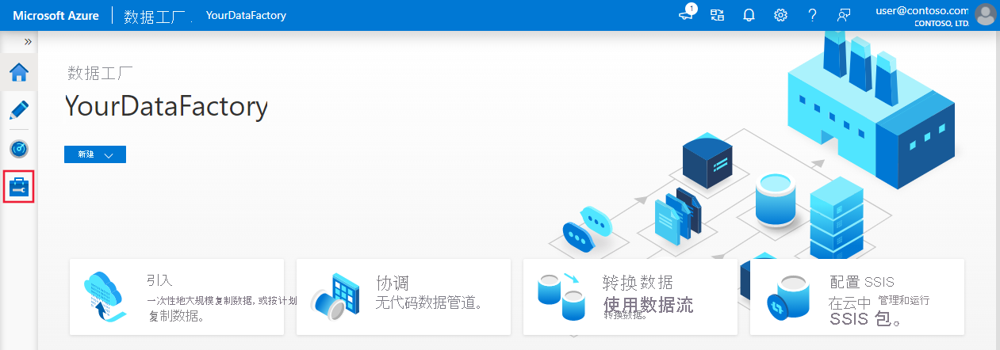
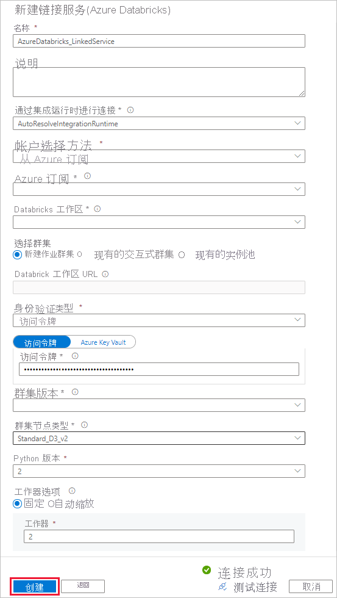
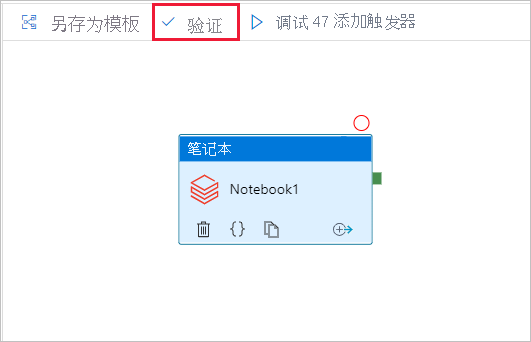
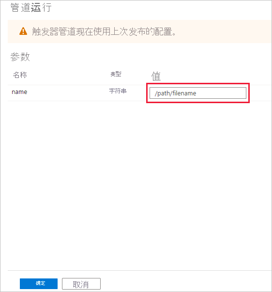

# <a name="run-a-databricks-notebook-with-the-databricks-notebook-activity-in-azure-data-factory"></a>使用 Azure 数据工厂中的 Databricks Notebook 活动运行 Databricks Notebook

[!INCLUDE[appliesto-adf-xxx-md](includes/appliesto-adf-xxx-md.md)]

本教程介绍如何使用 Azure 门户创建 Azure 数据工厂管道，以便针对 Databricks 作业群集执行 Databricks Notebook， 并在执行过程中向 Databricks Notebook 传递 Azure 数据工厂参数。

在本教程中执行以下步骤：

  - 创建数据工厂。

  - 创建使用 Databricks Notebook 活动的管道。

  - 触发管道运行。

  - 监视管道运行。

如果没有 Azure 订阅，请在开始之前创建一个[免费帐户](https://azure.microsoft.com/free/)。

有关此功能的十一分钟介绍和演示，请观看以下视频：

> [!VIDEO https://channel9.msdn.com/Shows/Azure-Friday/ingest-prepare-and-transform-using-azure-databricks-and-data-factory/player]

## <a name="prerequisites"></a>先决条件

  - **Azure Databricks 工作区**。 [创建 Databricks 工作区](/azure/databricks/scenarios/quickstart-create-databricks-workspace-portal)或使用现有的 Databricks 工作区。 在 Azure Databricks 工作区中创建 Python Notebook。 然后使用 Azure 数据工厂执行 Notebook 并向其传递参数。

## <a name="create-a-data-factory"></a>创建数据工厂

1. 启动 **Microsoft Edge** 或 **Google Chrome** Web 浏览器。 目前，仅 Microsoft Edge 和 Google Chrome Web 浏览器支持数据工厂 UI。

1. 在 Azure 门户菜单上选择“创建资源”，选择“集成”，然后选择“数据工厂”  。

    :::image type="content" source="./media/doc-common-process/new-azure-data-factory-menu.png" alt-text="显示“新建”窗格中的“数据工厂”选择的屏幕截图。":::

1. 在“创建数据工厂”页上的“基本”选项卡下，选择要在其中创建数据工厂的 Azure 订阅  。

1. 对于“资源组”，请执行以下步骤之一：
    
    1. 从下拉列表中选择现有资源组。
    
    1. 选择“新建”，并输入新资源组的名称。

    若要了解有关资源组的详细信息，请参阅 [使用资源组管理 Azure 资源](../azure-resource-manager/management/overview.md)。

1. 对于“区域”，选择数据工厂所在的位置。

    该列表仅显示数据工厂支持的位置，以及 Azure 数据工厂元数据要存储到的位置。 数据工厂使用的关联数据存储（如 Azure 存储和 Azure SQL 数据库）和计算（如 Azure HDInsight）可以在其他区域中运行。

1. 对于“名称”，输入“ADFTutorialDataFactory” 。
    
    Azure 数据工厂的名称必须 *全局唯一*。 如果出现以下错误，请更改数据工厂的名称（例如，使用 &lt;yourname&gt;ADFTutorialDataFactory）。 有关数据工厂项目的命名规则，请参阅[数据工厂 - 命名规则](./naming-rules.md)一文。

    :::image type="content" source="./media/doc-common-process/name-not-available-error.png" alt-text="显示当名称不可用时出现错误的屏幕截图。":::

1. 对于“版本”，选择“V2”。 

1. 在完成时选择“下一步:Git 配置”，然后选择“稍后配置 Git”复选框。

1. 选择“查看 + 创建”，然后在通过验证后选择“创建” 。 

1. 创建完成后，选择“转到资源”导航到“数据工厂”页。 选择“打开 Azure 数据工厂工作室”磁贴，在单独的浏览器标签页上启动 Azure 数据工厂用户界面 (UI) 应用程序。

    :::image type="content" source="./media/doc-common-process/data-factory-home-page.png" alt-text="显示 Azure 数据工厂主页的屏幕截图，其中包含“打开 Azure 数据工厂工作室”磁贴。":::

## <a name="create-linked-services"></a>创建链接服务

在本部分，请创作 Databricks 链接服务。 此链接服务包含 Databricks 群集的连接信息：

### <a name="create-an-azure-databricks-linked-service"></a>创建 Azure Databricks 链接服务

1.  在主页上，切换到左侧面板中的“管理”选项卡。

    

1.  在“连接”下选择“链接服务”，然后选择“+ 新建”  。
    
    

1.  在“新建链接服务”窗口中，选择“计算”&gt;“Azure Databricks”，然后选择“继续”   。
    
    

1.  在“新建链接服务”窗口中完成以下步骤：
    
    1.  对于“名称”，请输入“AzureDatabricks\_LinkedService” 。
    
    1.  选择你将在其中运行笔记本的相应 Databricks 工作区。

    1.  对于“选择群集”，请选择“新建作业群集” 。
    
    1.  对于“Databrick 工作区 URL”，应自动填充信息。

    1.  至于“访问令牌”，  请从 Azure Databricks 工作区生成。 可以在[此处](https://docs.databricks.com/api/latest/authentication.html#generate-token)找到步骤。

    1.  对于“群集版本”，请选择“4.2”（包含 Apache Spark 2.3.1、Scala 2.11） 。

    1.  对于“群集节点类型”  ，请在本教程的“常规用途(HDD)”  类别下选择“Standard\_D3\_v2”  。 
    
    1.  对于“辅助角色”  ，输入 **2**。
    
    1.  选择“创建”。

        

## <a name="create-a-pipeline"></a>创建管道

1.  选择“+ (加)”按钮，然后在菜单上选择“管道”。  

    

1.  创建在 **管道** 中使用的 **参数**。 稍后请将此参数传递给 Databricks Notebook 活动。 在空管道中选择“参数”选项卡，然后选择“+ 新建”并将其命名为“name”  。

    

    

1.  在“活动”  工具箱中，展开“Databricks”  。 将“Notebook”活动从“活动”工具箱拖到管道设计器图面。  

    

1.  在底部 **Databricks** **Notebook** 活动窗口的属性中完成以下步骤：

    1. 切换到 **Azure Databricks** 选项卡。

    1. 选择 **myAzureDatabricks\_LinkedService**（在上一过程中创建）。

    1. 切换到“设置”选项卡。

    1. 浏览以选择 Databricks **Notebook 路径**。 让我们在此处创建一个 Notebook 并指定路径。 可以通过后续数个步骤获取 Notebook 路径。

       1. 启动 Azure Databricks 工作区。

       1. 在工作区中创建 **新文件夹**，将其称之为 **adftutorial**。

          

       1. [显示如何创建新笔记本的屏幕截图。](https://docs.databricks.com/user-guide/notebooks/index.html#creating-a-notebook) 在“adftutorial”文件夹下单击“创建”，然后将其命名为“mynotebook”(Python)  。

          

          

       1. 在新创建的 Notebook“mynotebook”中添加以下代码：

           ```
           # Creating widgets for leveraging parameters, and printing the parameters

           dbutils.widgets.text("input", "","")
           y = dbutils.widgets.get("input")
           print ("Param -\'input':")
           print (y)
           ```

           

       1. 在此示例中，“Notebook 路径”为 /adftutorial/mynotebook 。

1.  切换回“数据工厂 UI 创作工具”。  导航到“Notebook1”活动下的“设置”选项卡 。

    a.  向 Notebook 活动添加参数。 使用的参数与此前添加到“管道”的参数相同。 

       

    b.  将参数命名为 input，并以 \@pipeline().parameters.name 表达式的形式提供值   。

1.  若要验证管道，请选择工具栏中的“验证”按钮。  若要关闭验证窗口，请选择“关闭”按钮。

    

1.  选择“全部发布”。 数据工厂 UI 会将实体（链接服务和管道）发布到 Azure 数据工厂服务。

    

## <a name="trigger-a-pipeline-run"></a>触发管道运行

选择工具栏中的“添加触发器”，然后选择“立即触发” 。


“管道运行”对话框要求提供 name 参数 。 使用 **/path/filename** 作为此处的参数。 选择“确定”。



## <a name="monitor-the-pipeline-run"></a>监视管道运行

1.  切换到“监视”选项卡。  确认可以看到一个管道运行。 创建执行 Notebook 所在的 Databricks 作业群集需要大约 5-8 分钟。

    

1.  定期选择“刷新”以检查管道运行的状态。 

1.  若要查看与管道运行相关联的活动运行，请选择“操作”列中的“查看活动运行”。  

    

选择顶部的“管道”链接可以切换回到管道运行视图。 

## <a name="verify-the-output"></a>验证输出

可以登录到“Azure Databricks 工作区”  ，转到“群集”，然后就可以看到“作业”状态为“待执行”、“正在运行”或“已终止”。   


可以先单击“作业名称”，然后通过导航来查看更多详细信息。  成功运行后，即可验证传递的参数和 Python Notebook 的输出。


## <a name="next-steps"></a>后续步骤

本示例中的管道先触发 Databricks Notebook 活动，然后向其传递参数。 你已了解如何执行以下操作：

  - 创建数据工厂。

  - 创建使用 Databricks Notebook 活动的管道。

  - 触发管道运行。

  - 监视管道运行。