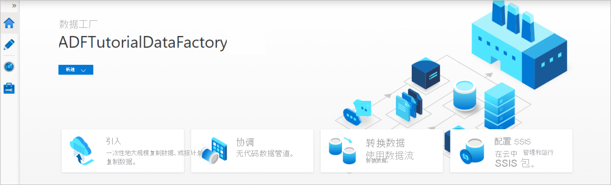

# 使用复制数据工具根据 LastModifiedDate 以增量方式复制新的和已更改的文件

[!INCLUDE[appliesto-adf-asa-md](includes/appliesto-adf-asa-md.md)]

在本教程中，你将使用 Azure 门户创建数据工厂。 然后，使用复制数据工具创建一个管道，该管道仅将 Azure Blob 存储中的新文件和已更改的文件以增量方式复制到另一个 Azure Blob 存储。 它使用 `LastModifiedDate` 来确定要复制的文件。

完成此处的步骤后，Azure 数据工厂会扫描源存储中的所有文件，应用按 `LastModifiedDate` 进行筛选的文件筛选器，然后仅将新文件和自上次以来已更新的文件复制到目标存储。 请注意，如果数据工厂扫描大量文件，复制过程预计仍要花费很长时间。 即使减少了要复制的数据量，文件扫描也很耗时。

> [!NOTE]
> 如果对数据工厂不熟悉，请参阅 [Azure 数据工厂简介](introduction.md)。

在本教程中，你将完成以下任务：

> [!div class="checklist"]
> * 创建数据工厂。
> * 使用“复制数据”工具创建管道。
> * 监视管道和活动运行。

## 先决条件

* **Azure 订阅**：如果没有 Azure 订阅，请在开始之前创建一个 [免费帐户](https://azure.microsoft.com/free/)。
* **Azure 存储帐户**，将 Blob 存储用作源和接收器数据存储。 如果没有 Azure 存储帐户，请按照[创建存储帐户](../storage/common/storage-account-create.md)中的说明操作。

## 在 Blob 存储中创建两个容器

完成以下步骤，准备本教程所需的 Blob 存储：

1. 创建名为 **source** 的容器。 可以使用各种工具（例如 [Azure 存储资源管理器](https://storageexplorer.com/)）来执行此任务。

2. 创建名为 **destination** 的容器。

## 创建数据工厂

1. 在左窗格中，选择“创建资源”  。 选择“集成” > “数据工厂” ：

   

2. 在“新建数据工厂”  页的“名称”下输入 **ADFTutorialDataFactory**  。

   数据工厂的名称必须全局独一无二。 可能会收到以下错误消息：

    :::image type="content" source="./media/doc-common-process/name-not-available-error.png" alt-text="针对重复名称的新的数据工厂错误消息。":::

   如果收到有关名称值的错误消息，请为数据工厂输入另一名称。 例如，使用名称 _**yourname**_**ADFTutorialDataFactory**。 有关数据工厂项目的命名规则，请参阅[数据工厂命名规则](naming-rules.md)。
3. 在“订阅”下，选择要在其中创建新数据工厂的 Azure 订阅  。
4. 在“资源组”下执行以下步骤之一  ：

    * 选择“使用现有”，然后在列表中选择现有的资源组。 

    * 选择“新建”，然后输入资源组的名称  。
         
    若要了解资源组，请参阅[使用资源组管理 Azure 资源](../azure-resource-manager/management/overview.md)。

5. 在“版本”下选择“V2”。 
6. 在“位置”下选择数据工厂的位置。  列表中仅显示支持的位置。 数据工厂使用的数据存储（例如，Azure 存储和 Azure SQL 数据库）和计算资源（例如，Azure HDInsight）可以位于其他位置和区域。
8. 选择“创建”  。
9. 创建数据工厂后，会显示数据工厂主页。
10. 若要在单独的选项卡中登录 Azure 数据工厂用户界面 (UI)，请在“打开 Azure 数据工厂工作室”磁贴上选择“打开”： 

    :::image type="content" source="./media/doc-common-process/data-factory-home-page.png" alt-text="Azure 数据工厂主页，其中包含“打开 Azure 数据工厂工作室”磁贴。":::

## 使用“复制数据”工具创建管道

1. 在 Azure 数据工厂主页上，选择“引入”磁贴来打开“复制数据”工具：

   

2. 在“属性”页上执行以下步骤： 

    1. 在“任务类型”下，选择“内置复制任务” 。

    1. 在“任务节奏或任务计划”下，选择“翻滚窗口”。 

    1. 在“重复周期”下输入“15 分钟”。  

    1. 选择“**下一页**”。

    

3. 在“源数据存储”  页上，完成以下步骤：

    1. 选择“+ 新建连接”添加一个连接。

    1. 从库中选择“Azure Blob 存储”   ，然后选择“继续”：

        

    1. 在“新建连接（）Azure Blob 存储”页上，从“Azure 订阅”列表中选择你的 Azure 订阅，从“存储帐户名称”列表中选择你的存储帐户  。 测试连接，然后选择“创建”  。

    1. 在“连接”块中选择新建的连接。

    1. 在“文件或文件夹”部分中，选择“浏览”并选择源文件夹，然后选择“确定”。   

    1. 在“文件加载行为”下，选择“增量加载：LastModifiedDate”，然后选择“二进制复制”  。
    
    1. 选择“**下一页**”。

    :::image type="content" source="./media/tutorial-incremental-copy-lastmodified-copy-data-tool/source-data-store-page.png" alt-text="显示“源数据存储”页的屏幕截图。":::

4. 在“目标数据存储”页上，完成以下步骤：
    1. 选择已创建的“AzureBlobStorage”连接。 这是与源数据存储相同的存储帐户。

    1. 在“文件夹路径”部分中，浏览并选择目标文件夹，然后选择“确定”。  

    1. 选择“**下一页**”。

    :::image type="content" source="./media/tutorial-incremental-copy-lastmodified-copy-data-tool/destination-data-store-page.png" alt-text="显示“目标数据存储”页的屏幕截图。":::

5. 在“设置”页上的“任务名称”下，输入 DeltaCopyFromBlobPipeline，然后选择“下一步”。    数据工厂会使用指定的任务名称创建一个管道。

    :::image type="content" source="./media/tutorial-incremental-copy-lastmodified-copy-data-tool/settings-page.png" alt-text="显示“设置”页的屏幕截图。":::

6. 在“摘要”  页上检查设置，然后选择“下一步”  。

    

7. 在“部署”页中，选择“监视”以监视管道（任务） 。

    

8. 请注意，界面中已自动选择左侧的“监视”选项卡。  应用程序将切换到“监视”选项卡。  请查看管道的状态。 选择“刷新”可刷新列表。  选择“管道名称”下的链接，查看活动运行详细信息或重新运行管道。

    

9. 该管道只包含一个活动（复制活动），因此只显示了一个条目。 要了解有关复制操作的详细信息，请在“活动运行”页上，选择“活动名称”列下的“详细信息”链接（眼镜图标）。 有关属性的详细信息，请参阅[复制活动概述](copy-activity-overview.md)。

    

    由于 Blob 存储帐户的源容器中没有文件，因此不会看到任何文件复制到该帐户的目标容器中：

    

10. 创建空的文本文件，并将其命名为 **file1.txt**。 将此文本文件上传到存储帐户中的源容器。 可以使用各种工具（例如 [Azure 存储资源管理器](https://storageexplorer.com/)）来执行这些任务。

    

11. 要返回“管道运行”视图，请在“活动运行”页的痕迹菜单中选择“所有管道运行”链接，然后等待同一管道再次自动触发。    

12. 当第二个管道运行完成时，请按照前述步骤查看活动运行详情。  

    你会发现，已将一个文件 (file1.txt) 从 Blob 存储帐户的源容器复制到目标容器。

    

13. 创建另一个空的文本文件，并将其命名为 **file2.txt**。 将此文本文件上传到 Blob 存储帐户中的源容器。

14. 针对第二个文本文件重复步骤 11 和 12。 你会发现，在执行此管道运行期间，只有新文件 (file2.txt) 从存储帐户的源容器复制到了目标容器。  

    还可以使用 [Azure 存储资源管理器](https://storageexplorer.com/)来扫描文件，以便验证是否只复制了一个文件：

    

## 后续步骤
请转到下一教程，了解如何使用 Azure 上的 Apache Spark 群集来转换数据：

> [!div class="nextstepaction"]
>[使用 Apache Spark 群集转换云中的数据](tutorial-transform-data-spark-portal.md)
