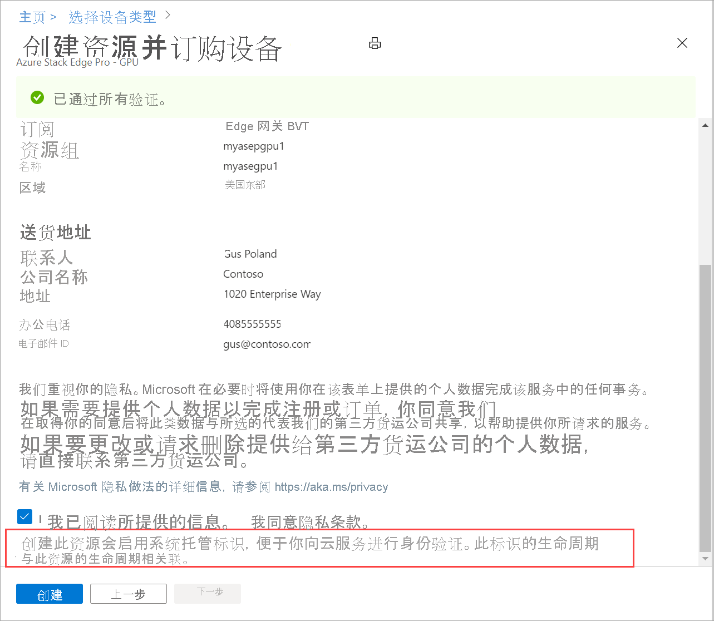

# Azure Key Vault 与 Azure Stack Edge 的集成 

[!INCLUDE [applies-to-GPU-and-pro-r-and-mini-r-skus](../../includes/azure-stack-edge-applies-to-gpu-pro-r-mini-r-sku.md)]

将 Azure Key Vault 与 Azure Stack Edge 资源集成，以用于管理机密。 本文详细介绍了如何在设备激活期间为 Azure Stack Edge 资源创建 Azure 密钥保管库，然后用其管理机密。 

## 关于 Key Vault 和 Azure Stack Edge

Azure Key Vault 云服务用于安全地存储令牌、密码、证书、API 密钥和其他机密，并控制对它们的访问。 通过 Key Vault，还可以轻松创建和控制用于加密数据的加密密钥。 如需详细了解允许的事务和相应费用，请参阅 [Azure Key Vault 定价](https://azure.microsoft.com/pricing/details/key-vault/)。

对于 Azure Stack Edge 服务，使用的机密之一是通道完整性密钥 (CIK)。 此密钥用于加密机密。 通过密钥保管库的集成，CIK 可安全地存储在密钥保管库中。 有关详细信息，请参阅[安全地存储机密和密钥](../key-vault/general/overview.md#securely-store-secrets-and-keys)。

## 创建密钥保管库

在激活密钥生成过程中，将为 Azure Stack Edge 资源创建密钥保管库。 

- 创建 Azure Stack Edge 资源时，需要注册 Microsoft.KeyVault 资源提供程序。 如果你有订阅的所有者或参与者访问权限，则系统会自动注册资源提供程序。 密钥保管库将在与 Azure Stack Edge 资源相同的订阅和资源组中进行创建。 

- 在你创建 Azure Stack Edge 资源时，系统还会创建一个在资源生存期内一直存在并与云中的资源提供程序通信的托管服务标识 (MSI)。 

    启用 MSI 后，Azure 将为 Azure Stack Edge 资源创建受信任的标识。

- 创建 Azure Stack Edge 资源并从 Azure 门户生成激活密钥后，一个密钥保管库随即创建。 此密钥保管库用于管理机密，只要有 Azure Stack Edge 资源，该密钥保管库就会一直存在。 

    

- 你可以选择接受默认密钥名称，也可以为密钥保管库指定自定义名称。 密钥保管库名称长度必须介于 3 到 24 个字符。 不能使用已在使用中的密钥保管库。 <!--The MSI is then used to authenticate to key vault to retrieve secrets.--> 

    

- 要浏览到 Azure 密钥保管库，请转到 Azure Stack Edge 资源中的“属性”，并选择相应密钥保管库名称。 

- 为防止意外删除，应对密钥保管库启用资源锁。 还应对密钥保管库启用软删除，这样一来，如果发生意外删除，则可以在 90 天内还原密钥保管库。 有关详细信息，请参阅 [Azure 密钥保管库软删除概述](../key-vault/general/soft-delete-overview.md)

    如果意外删除密钥保管库，且未超过 90 天的清除保护期，请按照以下步骤[恢复密钥保管库](../key-vault/general/key-vault-recovery.md#list-recover-or-purge-soft-deleted-secrets-keys-and-certificates)。 

- 如果在将 Azure Key Vault 与 Azure Stack Edge 资源集成之前存在现有 Azure Stack Edge 资源，则不会受到影响。 你可以继续使用现有的 Azure Stack Edge 资源。 

- 删除 Azure Stack Edge 资源后，Azure 密钥保管库也会随之一起删除。 系统会提示进行确认。 如果不想删除此密钥保管库，可以选择不同意。 只有 Azure Stack Edge 资源会被删除，而密钥保管库保持不变。 

- 如果此密钥保管库用于存储其他密钥，则你仍可在删除后的 90 天内还原它。 在清除保护期期间，不能使用该密钥保管库名称来创建新的密钥保管库。

如果遇到与密钥保管库和设备激活相关的任何问题，请参阅[排查设备激活问题](azure-stack-edge-gpu-troubleshoot-activation.md)。

<!--## Key vault secret management

When you generate an activation key, the following events occur:

1. You request an activation key in the Azure portal. The request is then sent to Key Vault resource provider. 
1. A standard tier key vault with access policy is created and is locked by default. This key vault uses the default name or the custom name that you specified.
1. The key vault authenticates with MSI the request to generate activation key. The MSI is also added to the key vault access policy and a channel integrity key is generated and placed in the key vault.
1. The activation key is returned to the Azure portal. You can then copy this key and use it in the local UI to activate your device.-->

## 后续步骤

- 详细了解如何[生成激活密钥](azure-stack-edge-gpu-deploy-prep.md#get-the-activation-key)。