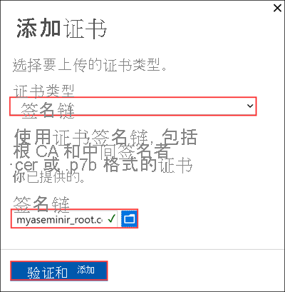
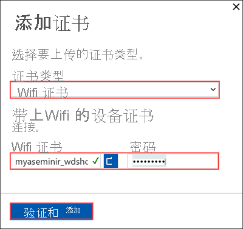
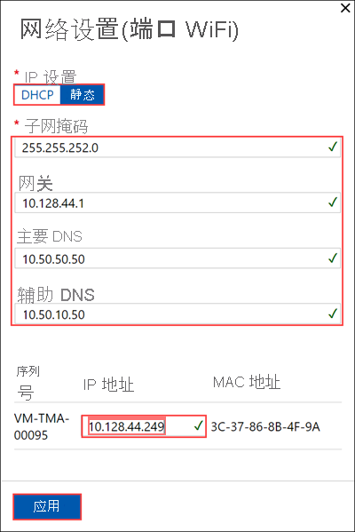
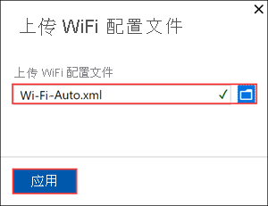
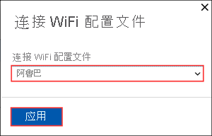
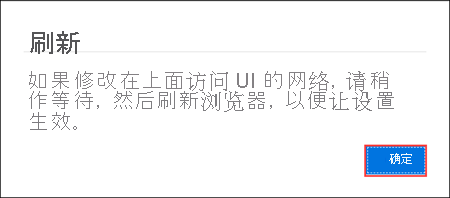

# 教程：配置 Azure Stack Edge Mini R 的网络

本教程介绍如何通过本地 Web UI，使用板载 GPU 为 Azure Stack Edge Mini R 设备配置网络。

连接过程可能需要大约 20 分钟才能完成。

在本教程中，你将学习：

> [!div class="checklist"]
>
> * 先决条件
> * 配置网络
> * 启用计算网络
> * 配置 Web 代理

## 先决条件

配置和设置 Azure Stack Edge Mini R 设备之前，请确保：

* 已根据[安装 Azure Stack Edge Mini R](azure-stack-edge-gpu-deploy-install.md) 中详述的内容安装了物理设备。
* 已按照[连接到 Azure Stack Edge Mini R](azure-stack-edge-mini-r-deploy-connect.md) 中所述连接到设备的本地 Web UI

## 配置网络

“入门”页显示的各种设置是配置物理设备并将其注册到 Azure Stack Edge 服务所需的。 

按照以下步骤操作，为设备配置网络。

1. 在设备的本地 Web UI 中，转到“入门”页。 

2. 如果需要零时差更新，可在此处通过为数据端口配置有线连接来实现。 若要详细了解如何为此设备设置有线连接，请参阅[通过数据线连接设备](azure-stack-edge-mini-r-deploy-install.md#cable-the-device)。 更新结束后，可删除有线连接。

3. 创建 Wi-Fi 证书和签名链证书。 签名链证书和 Wi-Fi 证书都必须采用带有 .cer 文件扩展名的 DER格式。 有关说明，请参阅[创建证书](azure-stack-edge-gpu-manage-certificates.md)。 如果使用 Wi-Fi 配置文件而不是证书进行身份验证，则此步骤是可选的。

   > [!NOTE] 
   > 如果在个人 Wi-Fi 网络上使用基于密码的身份验证，则可以跳过证书步骤。 只需配置 Wi-Fi 端口，然后上传 Wi-Fi 配置文件。   若要了解有关 WPA2（个人网络）的 Wi-Fi 配置文件并了解如何导出 Wi-Fi 配置文件，请参阅[使用 Wi-Fi 配置文件](azure-stack-edge-mini-r-use-wifi-profiles.md)。

4. 将证书添加到设备： 

   1. 在本地 web UI 中，转到“开始使用”。 在“安全”磁贴上，依次选择“证书”和“配置”  。 

      

   1. 选择“+ 添加证书”。 
    
      

   2. 上传签名链，然后选择“应用”。

      

   3. 对 Wi-Fi 证书重复上述过程。 

      

   4. 新证书应显示在“证书”页上。 

      

   5. 返回到“开始使用”。

5. 配置 Wi-Fi 端口。 在“网络”磁贴上，选择“配置” 。  

   在物理设备上有 4 个网络接口。 端口 1 和端口 2 是 1 Gbps 网络接口。 端口 3 和端口 4 是 10-Gbps 网络接口。 第 5 个端口是 Wi-Fi 端口。 

       

   选择 Wi-Fi 端口并配置端口设置。 

   > [!IMPORTANT]
   > 强烈建议为 Wi-Fi 端口配置静态 IP 地址。  

   

   应用 Wi-Fi 端口设置后，“网络”页将更新。

   

6. 选择“添加 Wi-Fi 配置文件”并上传 Wi-Fi 配置文件。 

   

   无线网络配置文件包含 SSID（网络名称）、密码密钥和安全信息，以便能够连接到无线网络。 可从网络管理员处获取环境的 Wi-Fi 配置文件。

   

   添加配置文件后，Wi-Fi 配置文件列表将更新，以呈现新的配置文件。 配置文件应将“连接状态”显示为“已断开连接” 。 

   

7. 成功加载无线网络配置文件后，连接到此配置文件。 选择“连接到 Wi-Fi 配置文件”。 

   

8. 选择在上一步中添加的 Wi-Fi 配置文件，然后选择“应用”。 

   

   “连接状态”应更新为“已连接” 。 信号强度将更新，以表示信号质量。 

   

   > [!NOTE]
   > 若要传输大量数据，建议使用有线连接，而不是无线网络。 

9. 将设备上的端口 1 与笔记本电脑断开连接。 

10. 配置网络设置时，请记住：

    - 如果你的环境中启用了 DHCP，则会自动配置网络接口。 系统会自动分配 IP 地址、子网、网关和 DNS。
    - 如果未启用 DHCP，则可以根据需要分配静态 IP。
    - 可以将网络接口配置为 IPv4。
    - Azure Stack Edge 不支持网络接口卡 (NIC) 组合或链接聚合。
    - 任何端口的序列号都与节点序列号相对应。 对于 K 系列设备，仅显示一个序列号。

     > [!NOTE]
     > 建议不要将网络接口的本地 IP 地址从静态切换到 DCHP，除非有另一个 IP 地址连接到该设备。 如果使用一个网络接口并切换到 DHCP，则无法确定 DHCP 地址。 如果要更改为 DHCP 地址，请等待设备注册服务后再更改。 然后，可以在 Azure 门户中为你的服务查看“设备属性”中所有适配器的 IP。

配置和应用网络设置后，选择“下一步:计算”来配置计算网络。

## 启用计算网络

请按照以下步骤，启用计算并配置计算网络。 

1. 在“计算”页中，选择要为计算启用的网络接口。 

   

1. 在“网络设置”对话框中，选择“启用” 。 启用计算时，会在设备上的该网络接口上创建一个虚拟交换机。 虚拟交换机用于设备上的计算基础结构。 
    
1. 分配“Kubernetes 节点 IP”。 这些静态 IP 地址适用于计算 VM。  

   对于 n 节点设备，使用起始 IP 地址和结束 IP 地址为计算 VM 提供了连续范围内的至少 n + 1 个（或更多）IPv4 地址 。 假设 Azure Stack Edge 是 1 节点设备，则至少提供 2 个连续的 IPv4 地址。

   > [!IMPORTANT]
   > Azure Stack Edge 上的 Kubernetes 对 Pod 使用 172.27.0.0/16 子网，对服务使用 172.28.0.0/16 子网。 请确保这些子网未在网络中使用。 如果这些子网已在网络中使用，则可从设备的 PowerShell 界面运行 `Set-HcsKubeClusterNetworkInfo` cmdlet 来更改这些子网。 有关详细信息，请参阅[更改 Kubernetes Pod 子网和服务子网](azure-stack-edge-gpu-connect-powershell-interface.md#change-kubernetes-pod-and-service-subnets)。

1. 分配“Kubernetes 外部服务 IP”。 这些地址也是负载均衡 IP 地址。 这些连续的 IP 地址用于要在 Kubernetes 群集之外公开的服务，你可以根据公开的服务数量指定静态 IP 范围。 
    
   > [!IMPORTANT]
   > 强烈建议为 Azure Stack Edge Mini R 中心服务指定至少 1 个 IP 地址，以访问计算模块。 然后，可以选择为需要从群集外部访问的其他服务/IoT Edge 模块指定其他 IP 地址（每个服务/模块 1 个地址）。 以后可以更新服务 IP 地址。 
    
1. 选择“应用”。

   

1. 应用配置需要几分钟时间，可能需要刷新浏览器。 可以看到已为计算启用指定端口。 
 
   

   在完成时选择“下一步:Web 代理”以配置 Web 代理。  

  
## 配置 Web 代理

这是可选的配置。

> [!IMPORTANT]
> 不支持代理自动配置 (PAC) 文件。 PAC 文件定义了 Web 浏览器和其他用户代理如何自动选择适当的代理服务器（访问方法）来获取给定 URL。 尝试拦截和读取所有流量（然后用其自己的证书对所有内容进行重新签名）的代理不兼容，因为代理的证书不受信任。 通常，透明代理非常适合 Azure Stack Edge Mini R。不支持非透明的 Web 代理。

1. 在“Web 代理设置”页上，执行以下步骤：

   1. 在“Web 代理 URL”框中，按以下格式输入 URL：`http://host-IP address or FQDN:Port number`。 不支持 HTTPS URL。

   2. 若要验证并应用配置的 Web 代理设置，请选择“应用”  。

   <!--UI text update is needed to remove NTLM from instruction text.-->

2. 应用设置后，选择“下一步:设备”。

## 后续步骤

本教程介绍了以下内容：

> [!div class="checklist"]
> * 先决条件
> * 配置网络
> * 启用计算网络
> * 配置 Web 代理

若要了解如何设置 Azure Stack Edge Mini R 设备，请参阅：

> [!div class="nextstepaction"]
> [配置设备设置](./azure-stack-edge-mini-r-deploy-set-up-device-update-time.md)
