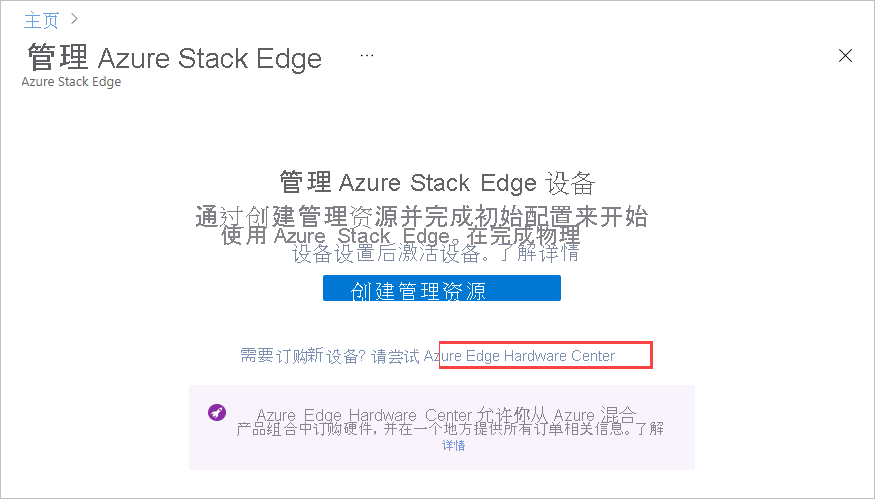
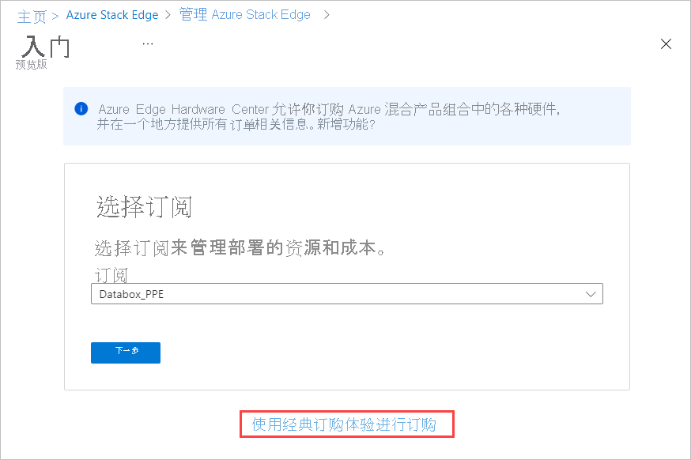
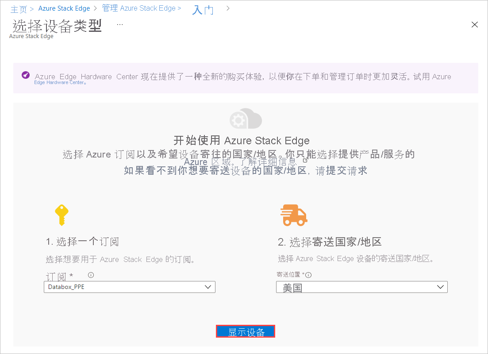
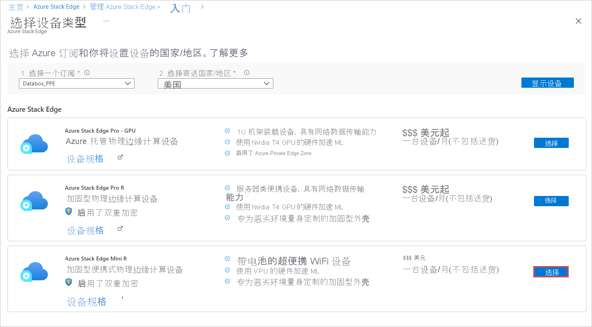
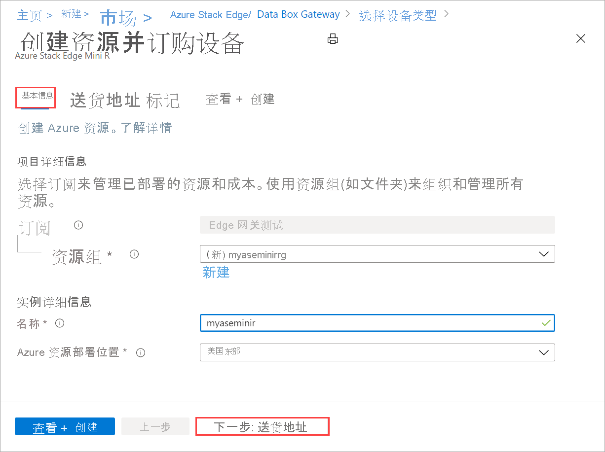
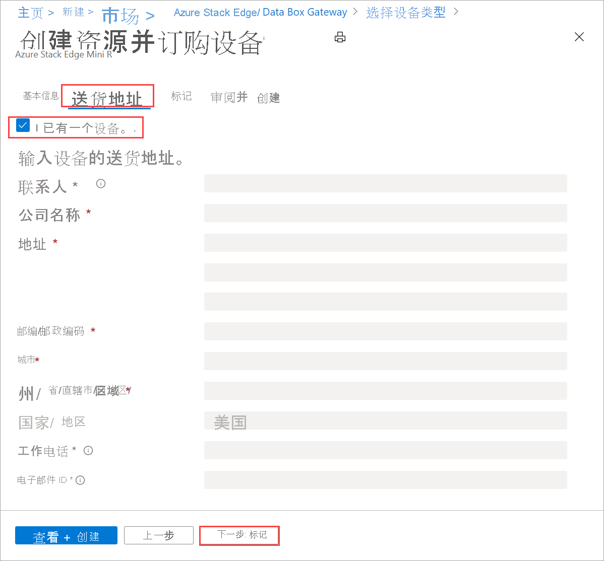
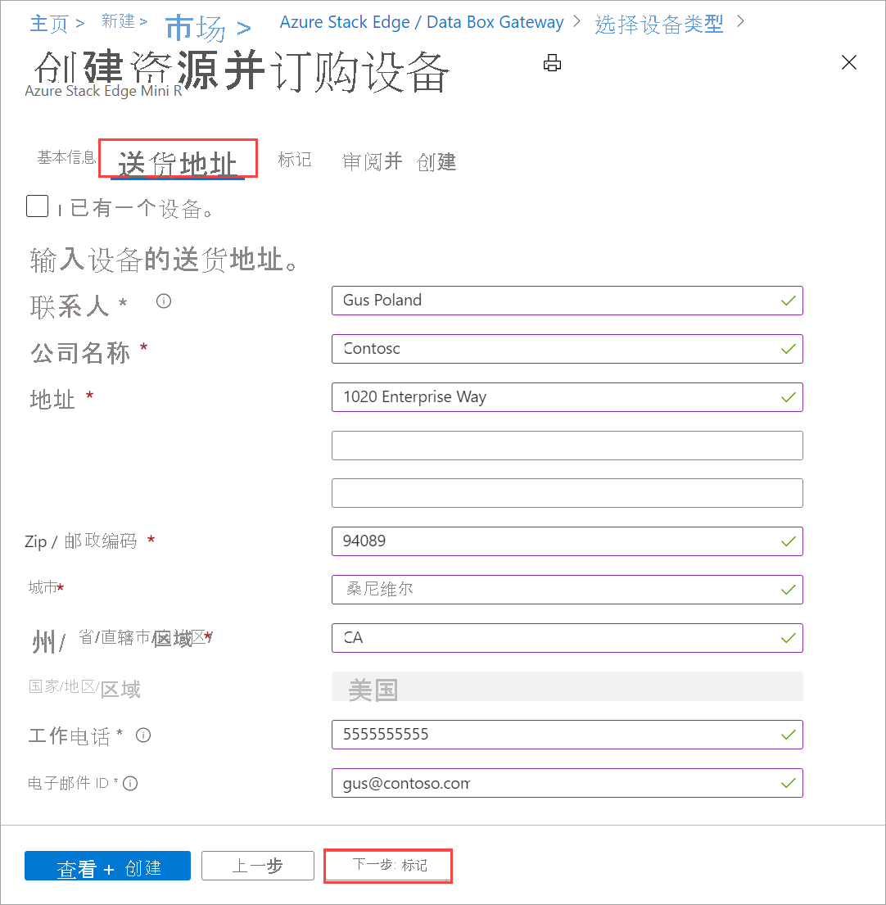

# <a name="tutorial-prepare-to-deploy-azure-stack-edge-mini-r"></a>教程：准备部署 Azure Stack Edge Mini R

本教程是完整部署 Azure Stack Edge Mini R 设备时必读的部署教程系列的第一篇。 本教程介绍如何准备 Azure 门户，以便部署 Azure Stack Edge 资源。

需要有管理员权限才能完成安装和配置过程。 门户准备只需不到 10 分钟的时间。

在本教程中，你将了解如何执行以下操作：

> [!div class="checklist"]
> * 创建新资源
> * 获取激活密钥

### <a name="get-started"></a>入门

若要部署 Azure Stack Edge Mini R，请按指定顺序参阅以下教程。

| 步骤 | 说明 |
| --- | --- |
| **准备工作** |在为即将进行的部署执行准备工作时必须完成这些步骤。 |
| **[部署配置清单](#deployment-configuration-checklist)** |在部署之前或在部署期间使用此清单来收集和记录信息。 |
| **[部署先决条件](#prerequisites)** |这些先决条件会验证环境是否已做好部署准备。 |
|  | |
|**部署教程** |需要完成这些教程，才能在生产环境中部署 Azure Stack Edge Mini R 设备。 |
|**[1.在 Azure 门户中做好部署设备的准备](azure-stack-edge-mini-r-deploy-prep.md)** |在安装物理设备之前创建并配置 Azure Stack Edge 资源。 |
|**[2.安装设备](azure-stack-edge-mini-r-deploy-install.md)**|检查物理设备，并通过数据线连接它。  |
|**[3.连接到设备](azure-stack-edge-mini-r-deploy-connect.md)** |安装设备后，连接到设备本地 Web UI。  |
|**[4.配置网络设置](azure-stack-edge-mini-r-deploy-configure-network-compute-web-proxy.md)** |配置网络，包括设备的计算网络和 Web 代理设置。   |
|**[5.配置设备设置](azure-stack-edge-mini-r-deploy-set-up-device-update-time.md)** |分配设备名称和 DNS 域，配置更新服务器和设备时间。 |
|**[6.配置安全设置](azure-stack-edge-mini-r-deploy-configure-certificates-vpn-encryption.md)** |使用自己的证书配置证书，设置 VPN 并为设备配置静态加密。   |
|**[7.激活设备](azure-stack-edge-mini-r-deploy-activate.md)** |使用从服务中获取的激活密钥来激活设备。 现已准备好在设备设置 SMB 或 NFS 共享或通过 REST 进行连接。 |
|**[8.配置计算](azure-stack-edge-gpu-deploy-configure-compute.md)** |配置设备上的计算角色。 还会创建 Kubernetes 群集。 |

现在可以开始设置 Azure 门户。

## <a name="deployment-configuration-checklist"></a>部署配置清单

在部署设备之前，需要收集信息来配置 Azure Stack Edge Mini R 设备上的软件。 提前准备其中的一些信息有助于简化在环境中部署设备的过程。 使用 [Azure Stack Edge Mini R 部署配置清单](azure-stack-edge-mini-r-deploy-checklist.md)，在部署设备时记下配置详细信息。

## <a name="prerequisites"></a>先决条件

下面是 Azure Stack Edge 资源、Azure Stack Edge 设备和数据中心网络的配置先决条件。

### <a name="for-the-azure-stack-edge-resource"></a>对于 Azure Stack Edge 资源

[!INCLUDE [Azure Stack Edge resource prerequisites](../../includes/azure-stack-edge-gateway-resource-prerequisites.md)]

### <a name="for-the-azure-stack-edge-device"></a>对于 Azure Stack Edge 设备

在部署物理设备之前，请确保：

- 你已查看 [Azure Stack Edge 设备安全指南](azure-stack-edge-mini-r-safety.md)，了解了关于此设备的安全信息。
[!INCLUDE [Azure Stack Edge device prerequisites](../../includes/azure-stack-edge-gateway-device-prerequisites.md)] 

### <a name="for-the-datacenter-network"></a>对于数据中心网络

在开始之前，请确保：

- 按你的 Azure Stack Edge 设备的网络要求配置数据中心内的网络。 有关详细信息，请参阅 [Azure Stack Edge Mini R 系统要求](azure-stack-edge-mini-r-system-requirements.md)。

- 若要使 Azure Stack Edge 正常运行，请做好以下准备：

    - 使用至少 10 Mbps 的下载带宽以确保设备更新。
    - 使用至少 20 Mbps 的专用上传和下载带宽传输文件。

## <a name="create-a-new-resource"></a>创建新资源

如果现有的 Azure Stack Edge 资源可以管理物理设备，请跳过此步骤，转到[获取激活密钥](#get-the-activation-key)。

---

### <a name="azure-edge-hardware-center-preview"></a>[Azure Edge Hardware Center（预览版）](#tab/azure-edge-hardware-center)

Azure Edge Hardware Center（预览版）是一种新服务，可让你从 Azure 混合产品组合（包括 Azure Stack Edge Pro 设备）浏览和订购各种硬件。

通过 Azure Edge Hardware Center 下订单时，可以订购多个设备以寄送到多个地址，并且可重复使用来自其他订单的地址。

通过 Azure Edge Hardware Center 进行订购会创建一个 Azure 资源，其中包含所有与订单相关的信息。 会为每个订购的单元创建一个资源。 收到设备之后必须创建 Azure Stack Edge 资源才能激活和管理设备。

[!INCLUDE [Create order in Azure Edge Hardware Center](../../includes/azure-edge-hardware-center-new-order.md)]

#### <a name="create-a-management-resource-for-each-device"></a>为每个设备创建管理资源

若要管理通过 Azure Edge Hardware Center 订购的设备，请在 Azure Stack Edge 中为每个设备创建管理资源。 激活设备后，管理资源会与订单项关联。 你将能够从管理资源打开订单项，并从订单项打开管理资源。 

交付设备后，“配置硬件”链接会添加到订单项详细信息中，使你可以直接打开向导以便创建管理资源。 还可以使用 Azure Stack Edge 中的“创建管理资源”选项。

[!INCLUDE [Create management resource](../../includes/azure-edge-hardware-center-create-management-resource.md)]

### <a name="portal-classic"></a>[门户（经典）](#tab/azure-portal)

若要创建 Azure Stack Edge 资源，请在 Azure 门户中执行以下步骤。

1. 使用 Microsoft Azure 凭据通过以下 URL 登录到 Azure 门户：[https://portal.azure.com](https://portal.azure.com)。

2. 在“Azure 服务”中，搜索并选择“Azure Stack Edge” 。 然后选择“+ 创建”。 

3. 在“管理 Azure Stack Edge 设备”中，选择“试用 Azure Hardware Center”链接 。

    

    这会打开“开始”屏幕，以便在 Azure Edge Hardware Center 中创建订单。 

4. 如果不想通过 Hardware Center 进行订购，请在“开始使用”屏幕上选择“使用经典订购体验进行订购” 。

   

5. 选取要用于 Azure Stack Edge Pro 设备的订阅。 选择要将此物理设备寄送到的国家/地区。 选择“显示设备”。

    


6. 选择设备类型。 在“Azure Stack Edge”下，选择“Azure Stack Edge Pro Mini R”，然后选择“选择”  。 如果发现任何问题或无法选择设备类型，请转到[排查订单问题](azure-stack-edge-troubleshoot-ordering.md)。

    [](media/azure-stack-edge-mini-r-deploy-prep/create-resource-2.png)


7. 在“基本信息”选项卡上，输入或选择以下“项目详细信息”。  
    
    |设置  |值  |
    |---------|---------|
    |订阅    |系统会根据前面所做的选择自动填充此订阅。 订阅将链接到你的计费帐户。 |
    |资源组  |选择现有的组，或创建新组。<br>详细了解 [Azure 资源组](../azure-resource-manager/management/overview.md)。     |


8. 输入或选择以下“实例详细信息”。

    |设置  |值  |
    |---------|---------|
    |名称   | 用于标识资源的友好名称。<br>名称可具有 2 和 50 个字符，包括字母、数字和连字符。<br> 名称以字母或数字开头和结尾。        |
    |区域     |有关可使用 Azure Stack Edge 资源的所有区域的列表，请参阅[可用的 Azure 产品(按区域)](https://azure.microsoft.com/global-infrastructure/services/?products=databox&regions=all)。 如果使用 Azure 政府版，则可选择 [Azure 区域](https://azure.microsoft.com/global-infrastructure/regions/)中显示的所有可用的政府区域。<br> 选择离要部署设备的地理区域最近的位置。|

    


9. 在完成时选择“下一步:送货地址”。

   - 如果已经有一台设备，请选择与“我已有设备”对应的组合框。

     

   - 如果这是你订购的新设备，请输入联系人姓名、公司、要将设备寄送到的地址，以及联系人信息。

     

10. 在完成时选择“下一步:  标记”。 （可选）提供标记，以便对资源进行分类并合并账单。 在完成时选择“下一步:查看 + 创建”。

11. 在“查看 + 创建”选项卡上，查看“定价详细信息”、“使用条款”和资源的详细信息。 选择与“我已经查看隐私条款”对应的组合框。

    

    你还会收到通知，了解到在资源创建期间启用了一个托管服务标识 (MSI)，你可通过它对云服务进行身份验证。 只要资源存在，就会存在此标识。

12. 选择“创建”。

    创建资源需要几分钟时间。 还会创建一个 MSI，Azure Stack Edge 设备可通过它与 Azure 中的资源提供程序进行通信。
    
    成功创建并部署资源后，你会收到通知。 选择“转到资源”。
    
    
    
在你下单以后，Microsoft 会审核订单并通过电子邮件联系你，核对配送详细信息。

> [!NOTE]
> 如果要一次创建多个订单或克隆现有订单，可以使用 [Azure 示例中的脚本](https://github.com/Azure-Samples/azure-stack-edge-order)。 有关详细信息，请参阅自述文件。

若在处理订单的过程中遇到任何问题，请参阅[排查订单问题](azure-stack-edge-troubleshoot-ordering.md)。

### <a name="azure-cli"></a>[Azure CLI](#tab/azure-cli)

如有必要，请为 Azure CLI 准备环境。

[!INCLUDE [azure-cli-prepare-your-environment-no-header.md](../../includes/azure-cli-prepare-your-environment-no-header.md)]

若要创建 Azure Stack Edge 资源，请在 Azure CLI 中运行以下命令。

1. 通过使用 [az group create](/cli/azure/group#az_group_create) 命令来创建资源组，或者使用某个现有的资源组：

   ```azurecli
   az group create --name myasepgpu1 --location eastus
   ```

1. 若要创建设备，请使用 [az databoxedge device create](/cli/azure/databoxedge/device#az_databoxedge_device_create) 命令：

   ```azurecli
   az databoxedge device create --resource-group myasepgpu1 \
      --device-name myasegpu1 --location eastus --sku EdgeMR_Mini
   ```

   选择离要部署设备的地理区域最近的位置。 该区域只存储用于设备管理的元数据。 实际数据可以存储在任何存储帐户中。

   有关可使用 Azure Stack Edge 资源的所有区域的列表，请参阅[可用的 Azure 产品(按区域)](https://azure.microsoft.com/global-infrastructure/services/?products=databox&regions=all)。 如果使用 Azure 政府版，则可选择 [Azure 区域](https://azure.microsoft.com/global-infrastructure/regions/)中显示的所有可用的政府区域。

1. 若要创建订单，请运行 [az databoxedge order create](/cli/azure/databoxedge/order#az_databoxedge_order_create) 命令：

   ```azurecli
   az databoxedge order create --resource-group myasepgpu1 \
      --device-name myasegpu1 --company-name "Contoso" \
      --address-line1 "1020 Enterprise Way" --city "Sunnyvale" \
      --state "California" --country "United States" --postal-code 94089 \
      --contact-person "Gus Poland" --email-list gus@contoso.com --phone 4085555555
   ```

创建资源需要几分钟时间。 运行 [az databoxedge order show](/cli/azure/databoxedge/order#az_databoxedge_order_show) 命令以查看该订单：

```azurecli
az databoxedge order show --resource-group myasepgpu1 --device-name myasegpu1 
```

在你下单后，Microsoft 会审核该订单并通过电子邮件联系你，核对配送详细信息。

---

## <a name="get-the-activation-key"></a>获取激活密钥

在 Azure Stack Edge 资源启动并运行后，你需要获取激活密钥。 此密钥用于激活 Azure Stack Edge Mini R 设备并将其连接到资源。 如果你仍在 Azure 门户中，则现在可以获取此密钥。

1. 选择创建的资源，然后选择“概述”。

   

2. 在“激活”磁贴上，为 Azure Key Vault 提供一个名称，或者接受默认名称。 密钥保管库名称的长度可介于 3 至 24 个字符之间。 

    对于随设备一起激活的每个 Azure Stack Edge 资源，都会创建一个密钥保管库。 通过密钥保管库，可存储和访问机密， 例如密钥保管库中存储的服务的通道完整性密钥 (CIK)。

    指定密钥保管库名称后，请选择“生成激活密钥”来创建激活密钥。

    [](media/azure-stack-edge-mini-r-deploy-prep/azure-stack-edge-resource-3.png#lightbox)

    创建密钥保管库和激活密钥需要几分钟时间，请稍候。 选择复制图标复制密钥并将其保存供日后使用。

> [!IMPORTANT]
> - 生成的激活密钥将在三天后过期。
> - 如果密钥已过期，请生成新密钥。 旧密钥不再有效。

## <a name="next-steps"></a>后续步骤

在本教程中，你已了解了以下 Azure Stack Edge 主题：

> [!div class="checklist"]
> * 创建新资源
> * 获取激活密钥

请继续学习下一教程，了解如何安装 Azure Stack Edge。

> [!div class="nextstepaction"]
> [安装 Azure Stack Edge](./azure-stack-edge-mini-r-deploy-install.md)
