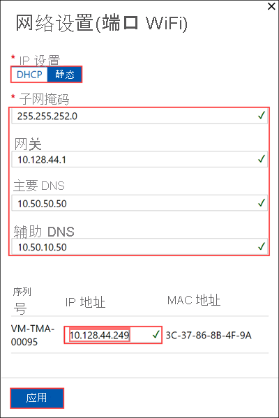
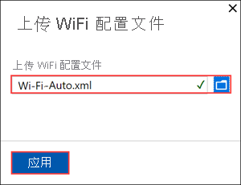
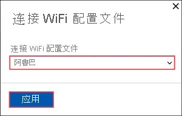

# <a name="use-the-local-web-ui-to-manage-wireless-connectivity-on-your-azure-stack-edge-mini-r"></a>使用本地 Web UI 管理 Azure Stack Edge Mini R 上的无线连接

本文介绍如何在 Azure Stack Edge Mini R 设备上管理无线网络连接。 你可以使用 Azure Stack Edge Mini R 设备上的本地 Web UI 来添加、连接和删除 Wi-Fi 配置文件。

## <a name="about-wi-fi"></a>关于 Wi-Fi

Azure Stack Edge Mini R 设备既可通过有线网络操作，也可通过无线网络操作。 该设备具有 Wi-Fi 端口，必须启用该端口才能允许其连接到无线网络。 

你的设备有五个端口，端口 1 到端口 4，以及第五个 Wi-Fi 端口。 下面是 Mini R 设备连接到无线网络时的背面图。


## <a name="add-connect-to-wi-fi-profile"></a>添加、连接到 Wi-Fi 配置文件

在设备的本地 UI 中执行以下步骤，以添加并连接到 Wi-Fi 配置文件。

1. 转到设备本地 Web UI 中的“入门”页。 在“网络”磁贴上，选择“配置” 。  
    
    在物理设备上有 4 个网络接口。 端口 1 和端口 2 是 1 Gbps 网络接口。 端口 3 和端口 4 是 10-Gbps 网络接口。 第 5 个端口是 Wi-Fi 端口。 

    [](./media/azure-stack-edge-mini-r-deploy-configure-network-compute-web-proxy/configure-wifi-1.png#lightbox)  
    
    选择 Wi-Fi 端口并配置端口设置。 
    
    > [!IMPORTANT]
    > 强烈建议为 Wi-Fi 端口配置静态 IP 地址。  

    

    应用 Wi-Fi 端口设置后，“网络”页将更新。

    

   
2. 选择“添加 Wi-Fi 配置文件”并上传 Wi-Fi 配置文件。 

    
    
    无线网络配置文件包含 SSID（网络名称）、密码密钥和安全信息，以便能够连接到无线网络。 可从网络管理员处获取环境的 Wi-Fi 配置文件。

    有关准备 Wi-Fi 配置文件的信息，请参阅[将 Wi-Fi 配置文件与 Azure Stack Edge Mini R 设备配合使用](azure-stack-edge-mini-r-use-wifi-profiles.md)。

    

    添加配置文件后，Wi-Fi 配置文件列表将更新，以呈现新的配置文件。 配置文件应将“连接状态”显示为“已断开连接” 。 

    
    
3. 成功加载无线网络配置文件后，连接到此配置文件。 选择“连接到 Wi-Fi 配置文件”。 

    

4. 选择在上一步中添加的 Wi-Fi 配置文件，然后选择“应用”。 

    

    “连接状态”应更新为“已连接” 。 信号强度将更新，以表示信号质量。 

    

    > [!NOTE]
    > 若要传输大量数据，建议使用有线连接，而不是无线网络。 


## <a name="download-wi-fi-profile"></a>下载 Wi-Fi 配置文件

可以下载用于无线网络连接的 Wi-Fi 配置文件。

1. 在设备的本地 Web UI 中，转到“配置”>“网络”。 

2. 在 Wi-Fi 配置文件设置下，选择“下载配置文件”。 这应该会下载当前正在使用的 Wi-Fi 配置文件。


## <a name="delete-wi-fi-profile"></a>删除 Wi-Fi 配置文件

可以删除用于无线网络连接的 Wi-Fi 配置文件。


1. 在设备的本地 Web UI 中，转到“配置”>“网络”。 

2. 在 Wi-Fi 配置文件设置下，选择“删除 Wi-Fi 配置文件”。

3. 在“删除 Wi-Fi 配置文件”边栏选项卡中，选择要删除的配置文件。 选择“应用”。


## <a name="configure-cisco-wi-fi-profile"></a>配置 Cisco Wi-Fi 配置文件

下面是一些有关如何在设备上管理和配置 Cisco 无线控制器和接入点的指导。 

### <a name="dhcp-bridging-mode"></a>DHCP 桥接模式

要对设备使用 Cisco 无线控制器，必须在无线 LAN 控制器 (WLC) 上启用动态主机配置协议 (DHCP) 桥接模式。

有关详细信息，请参阅 [DHCP 桥接模式](https://www.cisco.com/c/en/us/support/docs/wireless/4400-series-wireless-lan-controllers/110865-dhcp-wlc.html#anc9)。

#### <a name="bridging-configuration-example"></a>桥接配置示例

要在控制器上启用 DHCP 桥接功能，必须在控制器上禁用 DHCP 代理功能。 使用命令行启用 DHCP 桥接：

```powershell
(Cisco Controller) > config dhcp proxy disable
(Cisco Controller) > show dhcp proxy
DHCP Proxy Behaviour: disabled
```

如果 DHCP 服务器不存在于与客户端相同的第 2 层 (L2) 网络上，则应使用 IP 帮助程序将广播转发到客户端网关上的 DHCP 服务器。 下面是此配置的示例：

```powershell
Switch#conf t
Switch(config)#interface vlan <client vlan #>
Switch(config-if)#ip helper-address <dhcp server IP>
```

DHCP 桥接功能为全局设置，因此它会影响控制器中的所有 DHCP 事务。 需要将 IP 帮助程序语句添加到控制器上所有必要的虚拟局域网 (VLAN) 的有线基础结构中。

### <a name="enable-the-passive-client-for-wlan"></a>启用适用于 WLAN 的被动客户端

为 Cisco 无线控制器上的无线局域网 (WLAN) 启用被动客户端功能：

* 与 WLAN 关联的接口必须启用 VLAN 标记。
* 必须为 WLAN 启用多播 VLAN。
* 必须在 WLC 上启用 GARP 转发。

有关详细信息，请参阅[有关多播优化的多播 VLAN 信息](https://www.cisco.com/c/en/us/td/docs/wireless/controller/8-5/config-guide/b_cg85/wlan_interfaces.html)。

### <a name="troubleshoot"></a>疑难解答

如果在 Azure Stack Edge Mini R 设备上运行的 VM 上发生 IP 地址分配问题，应验证网络环境上的上述配置设置。

## <a name="next-steps"></a>后续步骤

- 了解如何[部署 Azure Stack Edge Mini R 设备](azure-stack-edge-mini-r-deploy-prep.md)。
