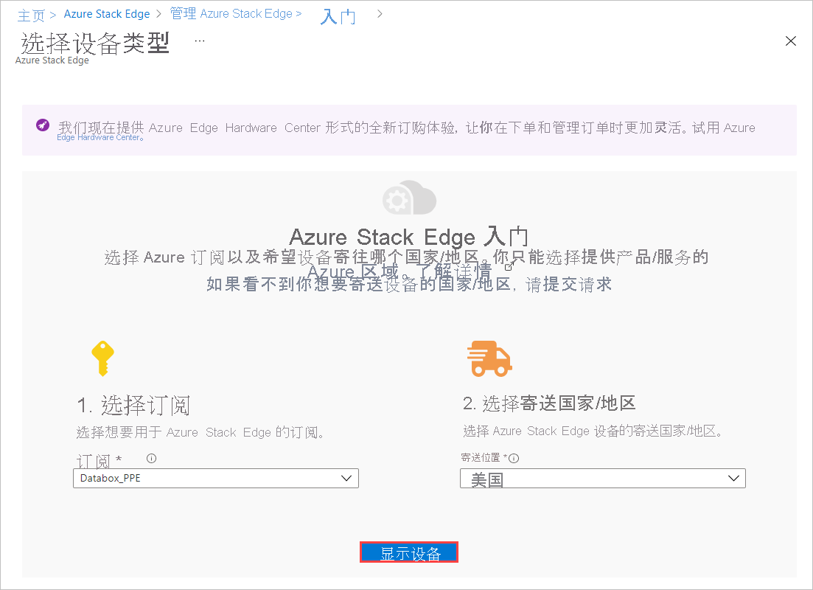
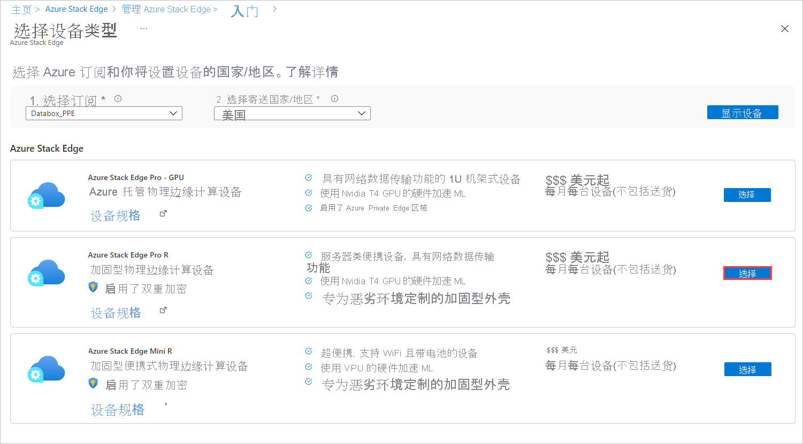
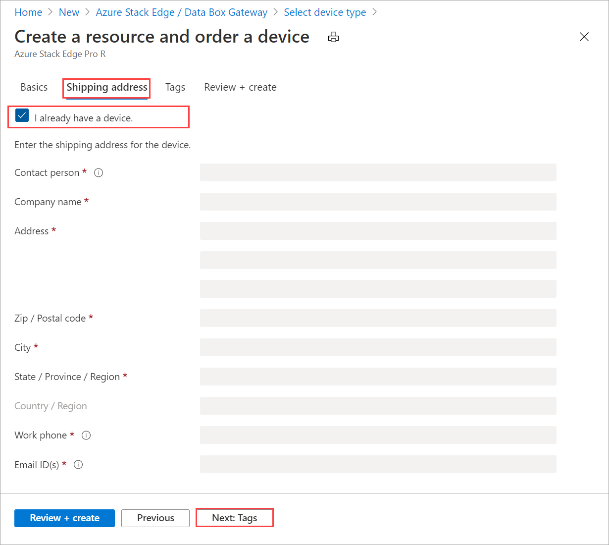
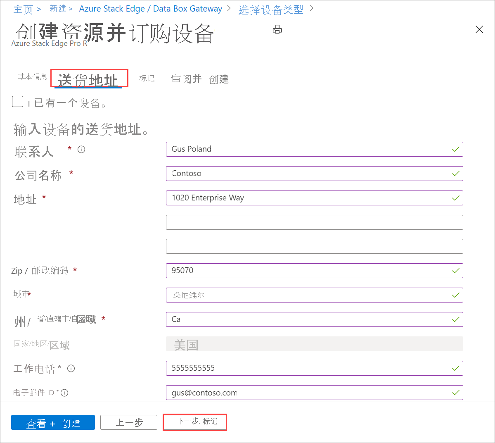

# 教程：准备部署 Azure Stack Edge Pro R

本教程是完全部署 Azure Stack Edge Pro R 所需的部署教程系列中的第一个。本教程介绍如何准备 Azure 门户以部署 Azure Stack Edge 资源。 本教程使用附带不间断电源 (UPS) 的 1 节点 Azure Stack Edge Pro R 设备。

需要有管理员权限才能完成安装和配置过程。 门户准备只需不到 10 分钟的时间。

在本教程中，你将了解如何执行以下操作：

> [!div class="checklist"]
>
> * 创建新资源
> * 获取激活密钥

### 入门

若要部署 Azure Stack Edge Pro R，请按指定顺序参阅以下教程。

| 若要执行此步骤 | 使用这些文档 |
| --- | --- |
| **准备工作** |在为即将进行的部署执行准备工作时必须完成这些步骤。 |
| **[部署配置清单](#deployment-configuration-checklist)** |在部署之前或在部署期间使用此清单来收集和记录信息。 |
| **[部署先决条件](#prerequisites)** |这些先决条件会验证环境是否已做好部署准备。 |
|  | |
|**部署教程** |需要完成这些教程，才能在生产环境中部署 Azure Stack Edge Pro R 设备。 |
|**[1.在 Azure 门户中做好部署设备的准备](azure-stack-edge-pro-r-deploy-prep.md)** |在安装 Azure Stack Edge 物理设备之前创建并配置 Azure Stack Edge 资源。 |
|**[2.安装设备](azure-stack-edge-pro-r-deploy-install.md)**|检查物理设备，并通过数据线连接它。  |
|**[3.连接到设备](azure-stack-edge-pro-r-deploy-connect.md)** |安装设备后，连接到设备本地 Web UI。  |
|**[4.配置网络设置](azure-stack-edge-pro-r-deploy-configure-network-compute-web-proxy.md)** |配置网络，包括设备的计算网络和 Web 代理设置。   |
|**[5.配置设备设置](azure-stack-edge-pro-r-deploy-set-up-device-update-time.md)** |分配设备名称和 DNS 域，配置更新服务器和设备时间。 |
|**[6.配置安全设置](azure-stack-edge-pro-r-deploy-configure-certificates-vpn-encryption.md)** |为设备配置证书、VPN 和静态加密。 可使用设备生成的证书，或者使用自己的证书。   |
|**[7.激活设备](azure-stack-edge-pro-r-deploy-activate.md)** |使用从服务中获取的激活密钥来激活设备。 现已准备好在设备设置 SMB 或 NFS 共享或通过 REST 进行连接。 |
|**[8.配置计算](azure-stack-edge-gpu-deploy-configure-compute.md)** |配置设备上的计算角色。 还会创建 Kubernetes 群集。 |

现在可以开始设置 Azure 门户。

## 部署配置清单

在部署设备之前，需要收集信息来配置 Azure Stack Edge Pro 设备上的软件。 提前准备其中的一些信息有助于简化在环境中部署设备的过程。 使用 [Azure Stack Edge Pro R 部署配置清单](azure-stack-edge-pro-r-deploy-checklist.md)，在部署设备时记下配置详细信息。

## 先决条件

下面是 Azure Stack Edge 资源、Azure Stack Edge 设备和数据中心网络的配置先决条件。

### 对于 Azure Stack Edge 资源

[!INCLUDE [Azure Stack Edge resource prerequisites](../../includes/azure-stack-edge-gateway-resource-prerequisites.md)]

### 对于 Azure Stack Edge 设备

在部署物理设备之前，请确保：

- 你已在以下网页中查看此设备的安全信息：[Azure Stack Edge 设备的安全准则](azure-stack-edge-pro-r-safety.md)。
[!INCLUDE [Azure Stack Edge device prerequisites](../../includes/azure-stack-edge-gateway-device-prerequisites.md)] 

### 对于数据中心网络

在开始之前，请确保：

- 按你的 Azure Stack Edge 设备的网络要求配置数据中心内的网络。 有关详细信息，请参阅 [Azure Stack Edge Pro R 系统要求](azure-stack-edge-pro-r-system-requirements.md)。

- 若要使设备正常运行，请做好以下准备：

    - 使用至少 10 Mbps 的下载带宽以确保设备更新。
    - 使用至少 20 Mbps 的专用上传和下载带宽传输文件。

## 创建新资源

如果现有的 Azure Stack Edge 资源可以管理物理设备，请跳过此步骤，转到[获取激活密钥](#get-the-activation-key)。

若要创建 Azure Stack Edge 资源，请在 Azure 门户中执行以下步骤。

1. 使用 Microsoft Azure 凭据通过以下 URL 登录到 Azure 门户：[https://portal.azure.com](https://portal.azure.com)。

2. 在左窗格中，选择“+ 创建资源”。 搜索并选择“Azure Stack Edge/Data Box Gateway”。 选择“创建”。 

3. 选取要用于 Azure Stack Edge Pro 设备的订阅。 选择要将此物理设备寄送到的国家/地区。 选择“显示设备”。

    

4. 选择设备类型。 在“Azure Stack Edge”下，选择“Azure Stack Edge Pro R”，然后选择“选择”  。 如果发现任何问题或无法选择设备类型，请转到[排查订单问题](azure-stack-edge-troubleshoot-ordering.md)。

    

5. 根据你的业务需求，你可以选择“Azure Stack Edge Pro R 单一节点”或“有 UPS 的 Azure Stack Edge Pro R 单一节点” 。  

    

6. 在“基本信息”选项卡上，输入或选择以下“项目详细信息”。  
    
    |设置  |值  |
    |---------|---------|
    |订阅    |系统会根据前面所做的选择自动填充此订阅。 订阅将链接到你的计费帐户。 |
    |资源组  |选择现有的组，或创建新组。 详细了解 [Azure 资源组](../azure-resource-manager/management/overview.md)。     |

7. 输入或选择以下“实例详细信息”。 

    |设置  |值  |
    |---------|---------|
    |名称   | 用于标识资源的友好名称。 该名称的长度必须介于 2 和 50 个字符之间，只能包含字母、数字和连字符。  名称以字母或数字开头和结尾。        |
    |区域     |有关可使用 Azure Stack Edge 资源的所有区域的列表，请参阅[可用的 Azure 产品(按区域)](https://azure.microsoft.com/global-infrastructure/services/?products=databox&regions=all)。 如果使用 Azure 政府版，则可选择 [Azure 区域](https://azure.microsoft.com/global-infrastructure/regions/)中显示的所有可用的政府区域。  选择离要部署设备的地理区域最近的位置。|

    

8. 在完成时选择“下一步:送货地址”。

    - 如果你已有一个设备，请选择与“我有 Azure Stack Edge Pro R 设备”对应的组合框。

        

    - 如果这是你订购的新设备，请输入联系人姓名、公司、寄送设备的地址，以及联系人信息。

        

9. 在完成时选择“下一步:  标记”。 （可选）提供标记，以便对资源进行分类并合并账单。 在完成时选择“下一步:查看 + 创建”。

10. 在“查看 + 创建”选项卡上，查看“定价详细信息”、“使用条款”和资源的详细信息。 选择与“我已经查看隐私条款”对应的组合框。

     

    你还会收到通知，了解到在资源创建期间启用了一个托管服务标识 (MSI)，你可通过它对云服务进行身份验证。 只要资源存在，就会存在此标识。

11. 选择“创建”。

    创建资源需要几分钟时间。 还会创建一个 MSI，Azure Stack Edge 设备可通过它与 Azure 中的资源提供程序进行通信。

    成功创建并部署资源后，你会收到通知。 选择“转到资源”。

    

在你下单以后，Microsoft 会审核订单并通过电子邮件联系你，核对配送详细信息。

<!-- - If this is restored, it must go above "After the resource is successfully created." The azure-stack-edge-resource-1.png would seem superfluous in that case.--> 

> [!NOTE]
> 如果要一次创建多个订单或克隆现有订单，可以使用 [Azure 示例中的脚本](https://github.com/Azure-Samples/azure-stack-edge-order)。 有关详细信息，请参阅自述文件。

若在处理订单的过程中遇到任何问题，请参阅[排查订单问题](azure-stack-edge-troubleshoot-ordering.md)。

## 获取激活密钥

在 Azure Stack Edge 资源启动并运行后，你需要获取激活密钥。 此密钥用于激活 Azure Stack Edge Pro 设备并将其连接到资源。 如果你仍在 Azure 门户中，则现在可以获取此密钥。

1. 选择创建的资源，然后选择“概述”。

2. 在右侧窗格上，为 Azure Key Vault 提供一个名称，或者接受默认名称。 密钥保管库名称的长度可介于 3 至 24 个字符之间。

   对于随设备一起激活的每个 Azure Stack Edge 资源，都会创建一个密钥保管库。 通过密钥保管库，可存储和访问机密，例如密钥保管库中存储的服务的通道完整性密钥 (CIK)。

   指定密钥保管库名称后，请选择“生成激活密钥”来创建激活密钥。

   

   创建密钥保管库和激活密钥需要几分钟时间，请稍候。 选择复制图标复制密钥并将其保存供日后使用。<!--Verify that the new screen has a copy icon.-->

> [!IMPORTANT]
> - 生成的激活密钥将在三天后过期。
> - 如果密钥已过期，请生成新密钥。 旧密钥不再有效。

## 后续步骤

在本教程中，你已了解了以下 Azure Stack Edge 主题：

> [!div class="checklist"]
> * 创建新资源
> * 获取激活密钥

请继续学习下一教程，了解如何安装 Azure Stack Edge。

> [!div class="nextstepaction"]
> [安装 Azure Stack Edge](./azure-stack-edge-pro-r-deploy-install.md)
