# 教程：使用 DMS 将 SQL Server 脱机迁移到 Azure SQL 托管实例

可使用 Azure 数据库迁移服务将数据库从 SQL Server 实例迁移到 [Azure SQL 托管实例](../azure-sql/managed-instance/sql-managed-instance-paas-overview.md)。 若要了解可能需要一些手动操作的其他方法，请参阅[将 SQL Server 实例迁移到 Azure SQL 托管实例](../azure-sql/migration-guides/managed-instance/sql-server-to-managed-instance-guide.md)一文。

本教程介绍如何使用 Azure 数据库迁移服务，将 [AdventureWorks2016](/sql/samples/adventureworks-install-configure#download-backup-files) 数据库从 SQL Server 的本地实例迁移到 SQL 托管实例。

将了解如何执行以下操作：
> [!div class="checklist"]
>
> - 注册 Azure DataMigration 资源提供程序。
> - 创建 Azure 数据库迁移服务的实例。
> - 使用 Azure 数据库迁移服务创建迁移项目。
> - 运行迁移。
> - 监视迁移。

> [!IMPORTANT]
> 对于从 SQL Server 到 SQL 托管实例的脱机迁移，Azure 数据库迁移服务可以为你创建备份文件。 或者可以在 SMB 网络共享中提供服务将用于迁移数据库的最新完整数据库备份。 可以将每个备份写入单个独立的备份文件或多个备份文件。 但是，不支持将多个备份追加到单个备份介质中。 请注意，也可以使用压缩的备份来减少在迁移大型备份时出现潜在问题的可能性。

[!INCLUDE [online-offline](../../includes/database-migration-service-offline-online.md)]

本文介绍如何从 SQL Server 脱机迁移到 SQL 托管实例。 有关联机迁移，请参阅[使用 DMS 将 SQL Server 联机迁移到 SQL 托管实例](tutorial-sql-server-managed-instance-online.md)。

## 先决条件

要完成本教程，需要：

- 下载并安装 [SQL Server 2016 或更高版本](https://www.microsoft.com/sql-server/sql-server-downloads)。
- 按照[启用或禁用服务器网络协议](/sql/database-engine/configure-windows/enable-or-disable-a-server-network-protocol#SSMSProcedure)一文中的说明启用 TCP/IP 协议（在安装 SQL Server Express 时，会默认禁用它）。
- [将 AdventureWorks2016 数据库还原到SQL Server实例。](/sql/samples/adventureworks-install-configure#restore-to-sql-server)
- 使用 Azure 资源管理器部署模型创建适合 Azure 数据库迁移服务的 Microsoft Azure 虚拟网络，它将使用 [ExpressRoute](../expressroute/expressroute-introduction.md) 或 [VPN](../vpn-gateway/vpn-gateway-about-vpngateways.md) 为本地源服务器提供站点到站点连接。 [了解使用 Azure 数据库迁移服务迁移 SQL 托管实例的网络拓扑](./resource-network-topologies.md)。 有关创建虚拟网络的详细信息，请参阅[虚拟网络文档](../virtual-network/index.yml)，尤其是提供了分步详细信息的快速入门文章。

    > [!NOTE]
    > 在虚拟网络设置期间，如果将 ExpressRoute 与 Microsoft 的网络对等互连一起使用，则请将以下服务[终结点](../virtual-network/virtual-network-service-endpoints-overview.md)添加到要在其中预配该服务的子网：
    > - 目标数据库终结点（例如，SQL 终结点、Cosmos DB 终结点等）
    > - 存储终结点
    > - 服务总线终结点
    >
    > Azure 数据库迁移服务缺少 Internet 连接，因此必须提供此配置。

- 请确保虚拟网络的网络安全组规则不阻止 ServiceBus、存储服务和 AzureMonitor 的 ServiceTag 出站端口 443。 有关虚拟网络 NSG 流量筛选的更多详细信息，请参阅[使用网络安全组筛选网络流量](../virtual-network/virtual-network-vnet-plan-design-arm.md)一文。
- 配置[针对源数据库引擎访问的 Windows 防火墙](/sql/database-engine/configure-windows/configure-a-windows-firewall-for-database-engine-access)。
- 打开 Windows 防火墙，使 Azure 数据库迁移服务能够访问源 SQL Server（默认情况下为 TCP 端口 1433）。 如果默认实例正在侦听其他端口，请将该端口添加到防火墙。
- 如果使用动态端口运行多个命名 SQL Server 实例，则可能需要启用 SQL Browser 服务并允许通过防火墙访问 UDP 端口 1434，以便 Azure 数据库迁移服务可连接到源服务器上的命名实例。
- 如果在源数据库的前面使用了防火墙设备，可能需要添加防火墙规则以允许 Azure 数据库迁移服务访问要迁移的源数据库，并通过 SMB 端口 445 访问文件。
- 按照[在 Azure 门户中创建 SQL 托管实例](../azure-sql/managed-instance/instance-create-quickstart.md)一文中的详述创建 SQL 托管实例。
- 确保用于连接源 SQL Server 和目标 SQL 托管实例的登录名是 sysadmin 服务器角色的成员。

    >[!NOTE]
    >默认情况下，Azure 数据库迁移服务仅支持迁移 SQL 登录名。 但是，可通过以下方式启用迁移 Windows 登录名的功能：
    >
    >- 确保目标 SQL 托管实例具有 AAD 读取访问权限，该权限可由具有“全局管理员”角色的用户通过 Azure 门户进行配置。
    >- 配置 Azure 数据库迁移服务实例以启用 Windows 用户/组登录名迁移，这通过 Azure 门户在“配置”页上进行设置。 启用此设置后，重启服务以使更改生效。
    >
    > 重启服务后，Windows 用户/组登录名将出现在可用于迁移的登录名列表中。 对于迁移的所有 Windows 用户/组登录名，系统都会提示提供关联的域名。 不支持服务用户帐户（域名为 NT AUTHORITY 的帐户）和虚拟用户帐户（域名为 NT SERVICE 的帐户）。

- 创建网络共享，供 Azure 数据库迁移服务用来备份源数据库。
- 确保运行源 SQL Server 实例的服务帐户对你创建的网络共享拥有写入权限，并且源服务器的计算机帐户具有对同一共享的读/写访问权限。
- 请记下在前面创建的网络共享中拥有完全控制权限的 Windows 用户（和密码）。 Azure 数据库迁移服务可模拟用户凭据，将备份文件上传到 Azure 存储容器，以执行还原操作。
- 遵循[使用存储资源管理器管理 Azure Blob 存储资源](../vs-azure-tools-storage-explorer-blobs.md#get-the-sas-for-a-blob-container)一文中的步骤创建 Blob 容器并检索其 SAS URI。创建 SAS URI 时，请务必在策略窗口中选择所有权限（读取、写入、删除、列出）。 此详细信息可为 Azure 数据库迁移服务提供你的存储帐户容器的访问权限，以便将用于迁移数据库的备份文件上传到 SQL 托管实例。

    > [!NOTE]
    > 在[配置迁移设置](#configure-migration-settings)步骤中配置存储帐户设置时，Azure 数据库迁移服务不支持使用帐户级别 SAS 令牌。
    
[!INCLUDE [resource-provider-register](../../includes/database-migration-service-resource-provider-register.md)]

## 创建 Azure 数据库迁移服务实例

1. 在 Azure 门户菜单或“主页”页上，选择“创建资源” 。 搜索并选择“Azure 数据库迁移服务”。

    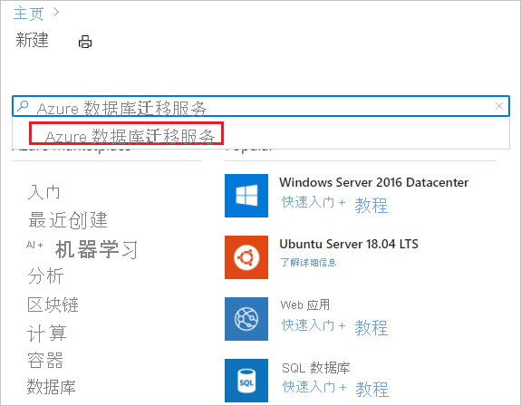

2. 在“Azure 数据库迁移服务”屏幕上，选择“创建”   。

    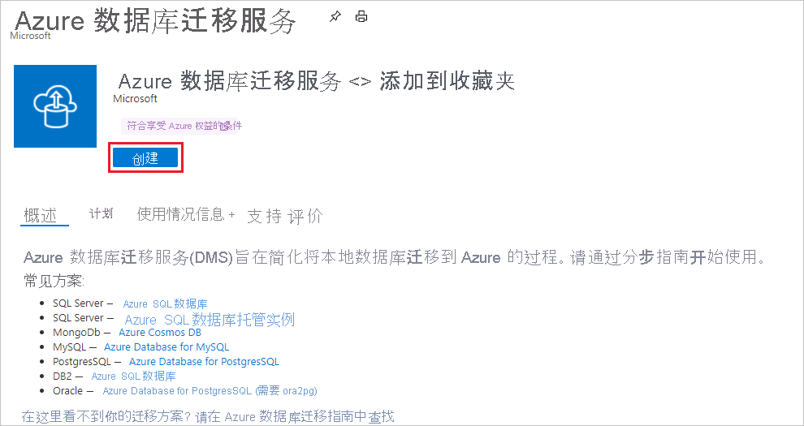

3. 在“创建迁移服务”基本信息屏幕中：

     - 选择订阅。
     - 新建资源组或使用现有资源组。
     - 指定 Azure 数据库迁移服务实例的名称。
     - 选择要在其中创建 Azure 数据库迁移服务实例的位置。
     - 选择“Azure”作为服务模式。
     - 选择定价层。 有关成本和定价层的详细信息，请参阅[价格页](https://aka.ms/dms-pricing)。

    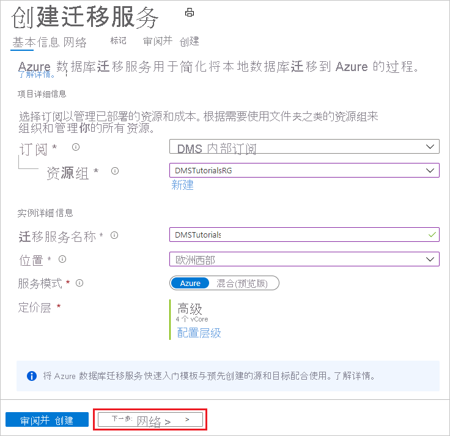

     - 选择“下一页:网络”。

4. 在“创建迁移服务”网络屏幕中：

    - 选择现有虚拟网络或新建一个。 虚拟网络为 Azure 数据库迁移服务提供源 SQL Server 和目标 Azure SQL 托管实例的访问权限。
     
    - 有关如何在 Azure 门户中创建虚拟网络的详细信息，请参阅[使用 Azure 门户创建虚拟网络](../virtual-network/quick-create-portal.md)一文。
    
    - 有关更多详细信息，请参阅[使用 Azure 数据库迁移服务迁移 Azure SQL 托管实例的网络拓扑](./resource-network-topologies.md)一文。

    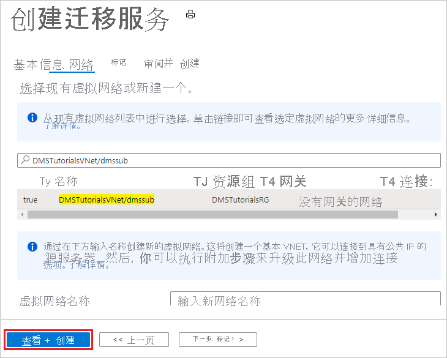

    - 选择“查看 + 创建”，查看详细信息，然后选择“创建”以创建服务 。

## 创建迁移项目

创建服务实例后，在 Azure 门户中找到并打开它，然后创建一个新的迁移项目。

1. 在 Azure 门户菜单中，选择“所有服务”。 搜索并选择“Azure 数据库迁移服务”。

    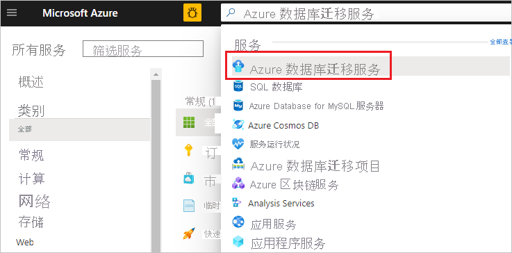

2. 在“Azure 数据库迁移服务”屏幕上，搜索你创建的 Azure 数据库迁移服务实例。

3. 选择“新建迁移项目”。

     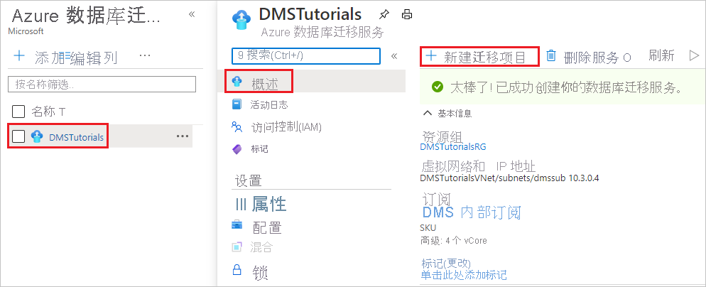

4. 在“新建迁移项目”屏幕上指定项目名称，在“源服务器类型”文本框中选择“SQL Server”，在“目标服务器类型”文本框中选择“Azure SQL 数据库托管实例”，然后在“选择活动类型”中选择“脱机数据迁移”。       

   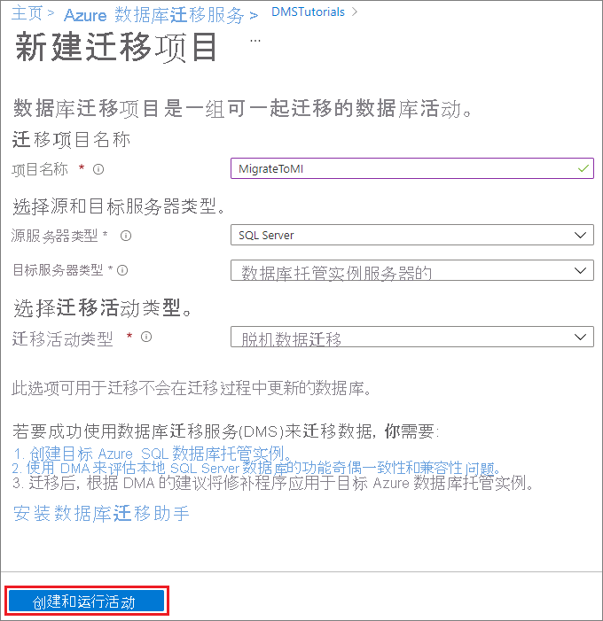

5. 选择“创建并运行活动”，以便创建项目并运行迁移活动。 

## 指定源详细信息

1. 在“选择源”屏幕上，指定源 SQL Server 实例的连接详细信息。

    请确保为源 SQL Server 实例名称使用完全限定的域名 (FQDN)。 即使不能使用 DNS 名称解析，也可使用 IP 地址。

2. 如果尚未在服务器上安装受信任的证书，请选中“信任服务器证书”复选框。

    如果没有安装受信任的证书，SQL Server 会在实例启动时生成自签名证书。 此证书用于加密客户端连接的凭据。

    > [!CAUTION]
    > 使用自签名证书加密的 TLS 连接不提供强安全性。 它们易遭受中间人攻击。 在生产环境中或在连接到 Internet 的服务器上不应依赖使用自签名证书的 TLS。

   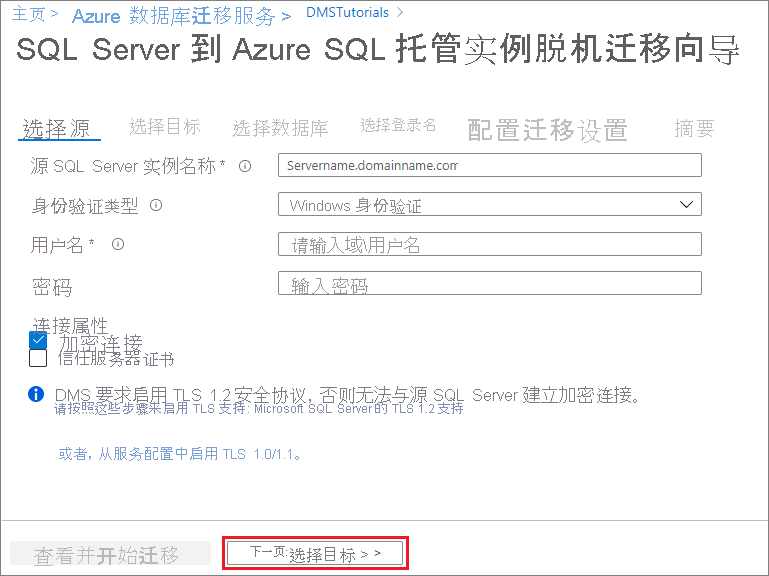

3. 选择“下一步: 选择目标”

## 指定目标详细信息

1. 在“选择目标”屏幕上，指定目标的连接详细信息，该目标是要将“AdventureWorks2016”数据库迁移到其中的已提前预配的 SQL 托管实例 。

    如果尚未预配 SQL 托管实例，请选择相应的[链接](../azure-sql/managed-instance/instance-create-quickstart.md)来帮助预配实例。 仍可继续进行项目创建，然后在 SQL 托管实例准备就绪后返回到此特定项目以执行迁移。

    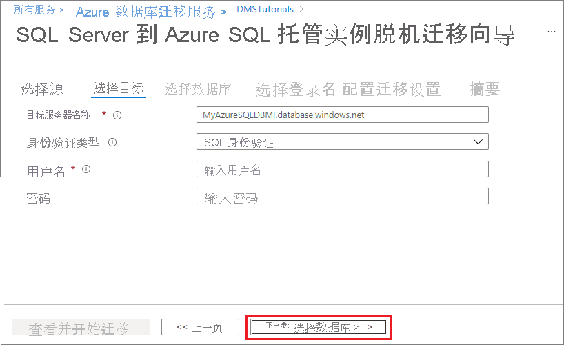

2. 选择“下一步: 选择数据库”。 在“选择数据库”屏幕上，选择用于迁移的“AdventureWorks2016”数据库 。

   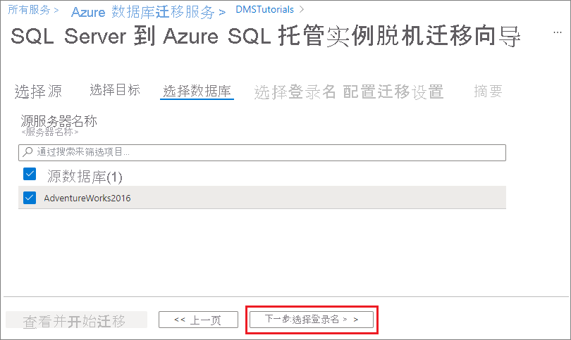

    > [!IMPORTANT]
    > 如果使用 SQL Server Integration Services (SSIS)，则 DMS 目前不支持将 SSIS 项目/包的目录数据库 (SSISDB) 从 SQL Server 迁移到 SQL 托管实例。 但是，你可以在 Azure 数据工厂 (ADF) 中预配 SSIS 并将 SSIS 项目/包重新部署到由 SQL 托管实例托管的目标 SSISDB。 有关如何迁移 SSIS 包的详细信息，请参阅[将 SQL Server Integration Services 包迁移到 Azure](./how-to-migrate-ssis-packages.md)。

3. 选择“下一步: 选择登录名”

## 选择登录名

1. 在“选择登录名”屏幕上，选择要迁移的登录名。

    >[!NOTE]
    >默认情况下，Azure 数据库迁移服务仅支持迁移 SQL 登录名。 若要启用对迁移 Windows 登录名的支持，请参阅本教程的 **先决条件** 部分。

    

2. 选择“下一步: 配置迁移设置”。

## 配置迁移设置

1. 在“配置迁移设置”屏幕上，提供以下详细信息：

    | 参数 | 说明 |
    |--------|---------|
    |**选择源备份选项** | 如果已经有一个完整备份文件供 DMS 用于数据库迁移，请选择选项“我将提供最新备份文件”。 如果希望 DMS 先进行源数据库完整备份，然后用它来进行迁移，请选择选项“我将让 Azure 数据库迁移服务创建备份文件”。 |
    |**网络位置共享** | 可让 Azure 数据库迁移服务备份源数据库的本地 SMB 网络共享。 运行源 SQL Server 实例的服务帐户必须在此网络共享中拥有写入特权。 在网络共享中提供服务器的 FQDN 或 IP 地址，例如“'\\\servername.domainname.com\backupfolder”或“\\\IP address\backupfolder”。|
    |**用户名** | 确保 Windows 用户具有对上面提供的网络共享的完全控制权限。 Azure 数据库迁移服务将模拟用户凭据，将备份文件上传到 Azure 存储容器，以执行还原操作。 如果选择已启用 TDE 的数据库进行迁移，则上述 Windows 用户必须是内置的管理员帐户，且必须对 Azure 数据库迁移服务禁用[用户帐户控制](/windows/security/identity-protection/user-account-control/user-account-control-overview)，才能上传和删除证书文件。 |
    |**密码** | 用户密码。 |
    |**存储帐户设置** | 可让 Azure 数据库迁移服务访问你的存储帐户容器，以便将用于迁移数据库的备份文件上传到 SQL 托管实例的 SAS URI。 [了解如何获取 Blob 容器的 SAS URI](../vs-azure-tools-storage-explorer-blobs.md#get-the-sas-for-a-blob-container)。 此 SAS URI 必须用于 blob 容器，而不能用于存储帐户。|
    |**TDE 设置** | 若要迁移启用了透明数据加密 (TDE) 的源数据库，必须拥有目标 SQL 托管实例的写入权限。  从下拉菜单中选择预配了 SQL 托管实例的订阅。  在下拉菜单中选择目标 **Azure SQL 数据库托管实例**。 |

    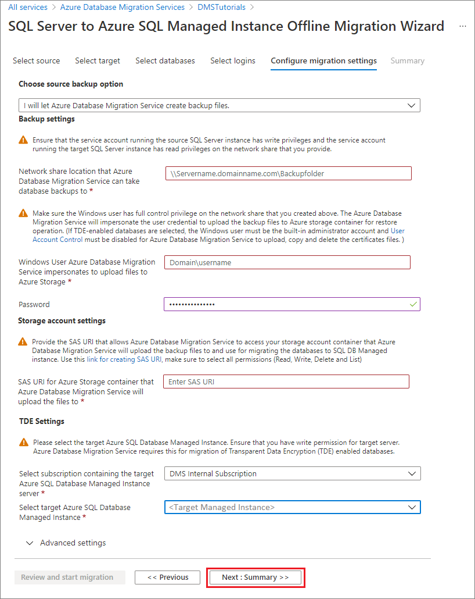

2. 在完成时选择“下一步:摘要”。

## 查看迁移摘要

1. 在“摘要”屏幕的“活动名称”文本框中，指定迁移活动的名称 。

2. 查看并验证与迁移项目关联的详细信息。

    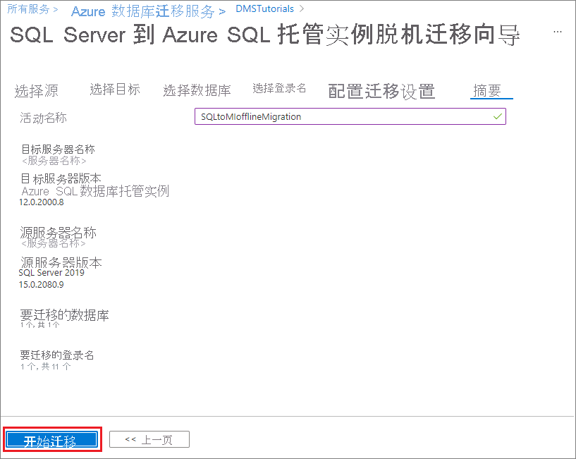

## 运行迁移

- 选择“开始迁移”。

  “迁移活动”窗口随即显示，其中显示了数据库和登录名的当前迁移状态。

## 监视迁移

1. 在“迁移活动”屏幕中，选择“刷新”以更新显示。

   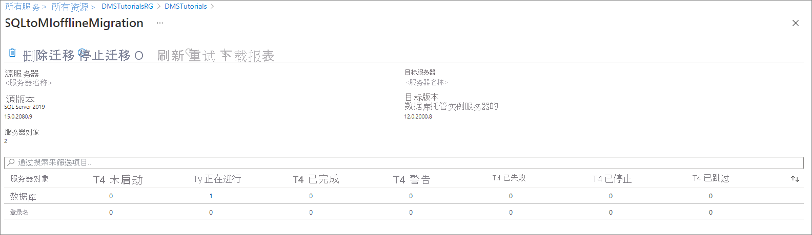

2. 可以进一步展开数据库和登录类别，以监视相应服务器对象的迁移状态。

   

3. 完成迁移后，验证 SQL 托管实例环境中的目标数据库。

## 其他资源

- 有关介绍如何使用 T-SQL RESTORE 命令将数据库迁移到 SQL 托管实例的教程，请参阅[使用 restore 命令将备份还原到 SQL 托管实例](../azure-sql/managed-instance/restore-sample-database-quickstart.md)。
- 有关 SQL 托管实例的信息，请参阅[什么是 SQL 托管实例](../azure-sql/managed-instance/sql-managed-instance-paas-overview.md)。
- 若要了解如何将应用连接到 SQL 托管实例，请参阅[连接应用程序](../azure-sql/managed-instance/connect-application-instance.md)。
