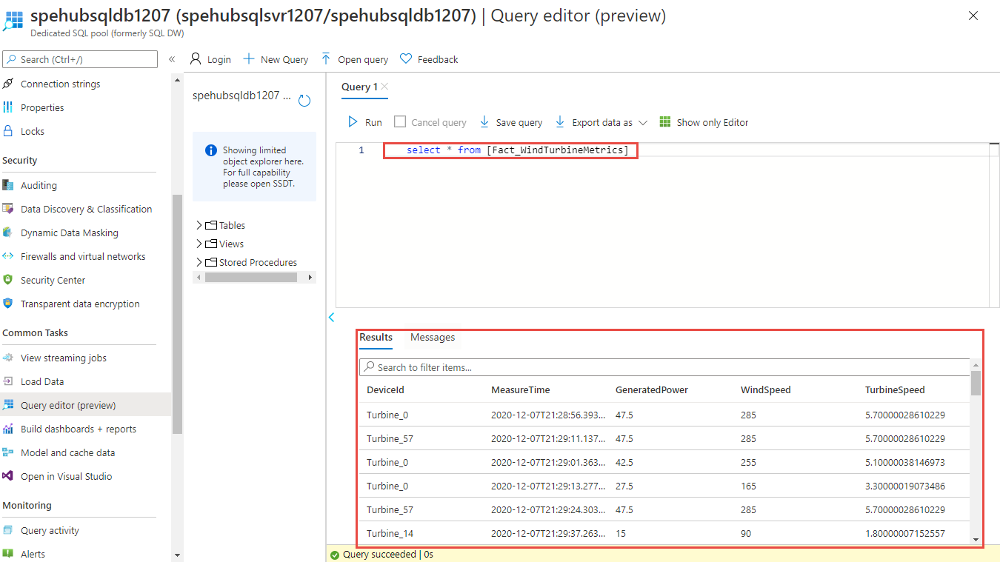

:::image type="content" source="media/event-grid-event-hubs-functions-synapse-analytics/overview.png" alt-text="应用概览":::

此图描绘了在本教程中生成的解决方案的工作流： 

1. 在 Azure Blob 存储中捕获发送到 Azure 事件中心的数据。
2. 完成数据捕获后，将生成一个事件并将其发送到 Azure 事件网格。 
3. 事件网格将此事件数据转发到 Azure 函数应用。
4. 函数应用使用事件数据中的 Blob URL 从存储中检索 Blob。 
5. 函数应用将 Blob 数据迁移到 Azure Synapse Analytics。 

在本文中，将执行以下步骤：

> [!div class="checklist"]
> - 部署本教程所需的基础结构
> - 将代码发布到 Functions 应用
> - 创建事件网格订阅 
> - 将示例数据流式传输到事件中心
> - 验证 Azure Synapse Analytics 中捕获的数据

## <a name="prerequisites"></a>先决条件
若要完成本教程，必须满足以下先决条件：

- Azure 订阅。 如果没有 Azure 订阅，请在开始之前创建一个[免费帐户](https://azure.microsoft.com/free/)。
- [Visual Studio 2019](https://www.visualstudio.com/vs/)，并包含适用于以下用途的工作负载：.NET 桌面开发、Azure 开发、ASP.NET 和 Web 开发、Node.js 开发和 Python 开发。
- 将 [EventHubsCaptureEventGridDemo 示例项目](https://github.com/Azure/azure-event-hubs/tree/master/samples/e2e/EventHubsCaptureEventGridDemo)下载到计算机上。
    - WindTurbineDataGenerator – 一个简单的发布服务器，可以将示例风力涡轮机数据发送到启用了捕获功能的事件中心
    - FunctionDWDumper – 一个 Azure Function，可以在 Avro 文件捕获到 Azure 存储 Blob 时接收事件网格通知。 它接收 Blob 的 URI 路径、读取其内容并将该数据推送到 Azure Synapse Analytics（专用 SQL 池）。

## <a name="deploy-the-infrastructure"></a>部署基础结构
在此步骤中，使用[资源管理器模板](https://github.com/Azure/azure-docs-json-samples/blob/master/event-grid/EventHubsDataMigration.json)部署所需的基础结构。 部署模板时，将创建以下资源：

* 已启用捕获功能的事件中心。
* 适用于已捕获文件的存储帐户。 
* 用于托管函数应用的应用服务计划
* 用于处理事件的函数应用
* 用于托管数据仓库的 SQL Server
* 用于存储迁移数据的 Azure Synapse Analytics（专用 SQL 池）

### <a name="use-azure-cli-to-deploy-the-infrastructure"></a>使用 Azure CLI 部署基础结构

1. 登录 [Azure 门户](https://portal.azure.com)。 
2. 选择顶部的“Cloud Shell”按钮。

    :::image type="content" source="media/event-grid-event-hubs-functions-synapse-analytics/azure-portal.png" alt-text="Azure 门户":::
3. 会看到 Cloud Shell 在浏览器底部打开。

    :::image type="content" source="media/event-grid-event-hubs-functions-synapse-analytics/launch-cloud-shell.png" alt-text="Cloud Shell":::
4. 在 Cloud Shell 中，如果看到在“Bash”和“PowerShell”之间进行选择的选项，请选择“Bash”  。 
5. 如果是第一次使用 Cloud Shell，请选择“创建存储”来创建存储帐户。 Azure Cloud Shell 需要一个 Azure 存储帐户来存储某些文件。 

    :::image type="content" source="media/event-grid-event-hubs-functions-synapse-analytics/create-storage-cloud-shell.png" alt-text="为 Cloud Shell 创建存储":::
6. 等待 Cloud Shell 初始化。 

    :::image type="content" source="media/event-grid-event-hubs-functions-synapse-analytics/cloud-shell-initialized.png" alt-text="Cloud Shell 初始化":::
1. 通过运行以下 CLI 命令创建 Azure 资源组： 
    1. 将以下命令复制并粘贴到 Cloud Shell 窗口中。 如有需要，请更改资源组名称和位置。

        ```azurecli
        az group create -l eastus -n rgDataMigration
        ```
    2. 按 **Enter**。 

        以下是示例：
    
        ```azurecli
        user@Azure:~$ az group create -l eastus -n rgDataMigration
        {
          "id": "/subscriptions/00000000-0000-0000-0000-0000000000000/resourceGroups/rgDataMigration",
          "location": "eastus",
          "managedBy": null,
          "name": "rgDataMigration",
          "properties": {
            "provisioningState": "Succeeded"
          },
          "tags": null
        }
        ```
2. 通过运行以下 CLI 命令来部署上一部分提到的所有资源（事件中心、存储帐户、函数应用、Azure Synapse Analytics）： 
    1. 将命令复制并粘贴到 Cloud Shell 窗口中。 或者，可能需要复制/粘贴到所选的编辑器中，设置值，然后将该命令复制到 Cloud Shell。 

        > [!IMPORTANT]
        > 运行此命令前，指定以下实体的值： 
        > - 之前创建的资源组的名称。
        > - 事件中心命名空间的名称。 
        > - 事件中心的名称。 可以将值保留原样 (hubdatamigration)。
        > - SQL Server 的名称。
        > - SQL 用户名称和密码。 
        > - 数据库的名称。
        > - 存储帐户的名称。 
        > - 函数应用的名称。 


        ```azurecli
        az deployment group create \
            --resource-group rgDataMigration \
            --template-uri https://raw.githubusercontent.com/Azure/azure-docs-json-samples/master/event-grid/EventHubsDataMigration.json \
            --parameters eventHubNamespaceName=<event-hub-namespace> eventHubName=hubdatamigration sqlServerName=<sql-server-name> sqlServerUserName=<user-name> sqlServerPassword=<password> sqlServerDatabaseName=<database-name> storageName=<unique-storage-name> functionAppName=<app-name>
        ```
    3.  在 Cloud Shell 窗口中按 ENTER 以运行该命令。 此过程可能需要一段时间，因为正在创建一系列资源。 在命令的结果中，请确保没有任何故障。 
1. 通过选择门户中的“Cloud Shell”按钮（或）Cloud Shell 窗口右上角的“X”按钮来关闭 Cloud Shell 。 

### <a name="verify-that-the-resources-are-created"></a>验证是否已创建资源

1. 在 Azure 门户中的左侧菜单上选择“资源组”。 
2. 通过在搜索框中输入资源组的名称来筛选资源组列表。 
3. 在列表中选择你的资源组。

    :::image type="content" source="media/event-grid-event-hubs-functions-synapse-analytics/select-resource-group.png" alt-text="选择你的资源组":::
4. 确认是否在资源组中看到以下资源：

    :::image type="content" source="media/event-grid-event-hubs-functions-synapse-analytics/resources-in-resource-group.png" alt-text="资源组中的资源" lightbox="media/event-grid-event-hubs-functions-synapse-analytics/resources-in-resource-group.png":::

### <a name="create-a-table-in-azure-synapse-analytics"></a>在 Azure Synapse Analytics 中创建表
通过运行 [CreateDataWarehouseTable.sql](https://github.com/Azure/azure-event-hubs/blob/master/samples/e2e/EventHubsCaptureEventGridDemo/scripts/CreateDataWarehouseTable.sql) 脚本在数据仓库中创建表。 若要运行此脚本，可以使用 Visual Studio 或门户中的查询编辑器。 以下步骤显示如何使用查询编辑器： 

1. 在资源组的资源列表中，选择“专用 SQL 池”。 
2. 在“专用 SQL 池”页左侧菜单的“常见任务”部分中，选择“查询编辑器(预览版)”  。 

    :::image type="content" source="media/event-grid-event-hubs-functions-synapse-analytics/sql-data-warehouse-page.png" alt-text="Azure Synapse Analytics 页":::
2. 输入 SQL Server 的“用户名”和“密码”，然后选择“确定”  。 如果看到有关允许客户端访问 SQL Server 的消息，请执行以下步骤：
    1. 选择此链接：**设置服务器防火墙**。 
    2. 在“防火墙设置”页上，依次选择工具栏上的“添加客户端 IP”和“保存”  。 
    3. 在成功消息框上选择“确定”。
    4. 导航回“专用 SQL 池”页，然后在左侧菜单中选择“查询编辑器(预览)” 。 
    5. 输入用户和密码，然后选择“确定”  。 
1. 在查询窗口中，复制并运行以下 SQL 脚本： 

    ```sql
    CREATE TABLE [dbo].[Fact_WindTurbineMetrics] (
        [DeviceId] nvarchar(50) COLLATE SQL_Latin1_General_CP1_CI_AS NULL, 
        [MeasureTime] datetime NULL, 
        [GeneratedPower] float NULL, 
        [WindSpeed] float NULL, 
        [TurbineSpeed] float NULL
    )
    WITH (CLUSTERED COLUMNSTORE INDEX, DISTRIBUTION = ROUND_ROBIN);
    ```

    :::image type="content" source="media/event-grid-event-hubs-functions-synapse-analytics/run-sql-query.png" alt-text="运行 SQL 查询":::
5. 保持此选项卡或窗口处于打开状态，以便可以验证在本教程结束时是否创建了数据。 

### <a name="update-the-function-runtime-version"></a>更新函数运行时版本

1. 在 Web 浏览器中打开另一个选项卡，然后导航到 [Azure 门户](https://portal.azure.com)。
1. 在 Azure 门户中的左侧菜单上选择“资源组”。
1. 选择函数应用所在的资源组。 
1. 在资源组的资源列表中，选择“函数应用”。
1. 在左侧菜单中的“设置”下选择“配置” 。 
1. 切换到右窗格中的“函数运行时设置”选项卡。 
1. 将运行时版本更新为 ~3 。 

    :::image type="content" source="media/event-grid-event-hubs-functions-synapse-analytics/function-runtime-version.png" alt-text="更新函数运行时版本":::
6. 在工具栏上选择“保存”。 
1. 在“保存更改”确认弹出窗口中，选择“继续” 。 

## <a name="publish-the-azure-functions-app"></a>发布 Azure Functions 应用

1. 启动 Visual Studio。
2. 打开作为先决条件的一部分从 [GitHub](https://github.com/Azure/azure-event-hubs/tree/master/samples/e2e/EventHubsCaptureEventGridDemo) 下载的 EventHubsCaptureEventGridDemo.sln 解决方案。 可以在 `/samples/e2e/EventHubsCaptureEventGridDemo` 文件夹中找到它。 
3. 在解决方案资源管理器中，右键单击“FunctionEGDWDumper”项目，然后选择“发布” 。
4. 如果看到以下屏幕，请选择“启动”。 

    :::image type="content" source="media/event-grid-event-hubs-functions-synapse-analytics/start-publish-button.png" alt-text="“发布”部分的“启动”按钮。":::
5. 在“发布”对话框中，对于“目标”，请选择“Azure”，然后选择“下一步”   。 
6. 选择“Azure Function App (Windows)”，然后选择“下一步” 。
7. 在“Functions 实例”选项卡上，选择你的 Azure 订阅，展开资源组，并选择函数应用，然后选择“完成” 。 如果尚未执行该操作，则需要登录到 Azure 帐户。 

    :::image type="content" source="media/event-grid-event-hubs-functions-synapse-analytics/publish-select-function-app.png" alt-text="选择函数应用":::
8. 在“发布”页上的“服务依赖项”部分中，为“存储”选择“配置”   。 

    :::image type="content" source="media/event-grid-event-hubs-functions-synapse-analytics/publish-storage-configure-link.png" alt-text="为存储服务依赖项选择配置链接":::
1. 在“配置依赖项”页上，执行以下步骤： 
    1. 选择之前创建的存储帐户，然后选择“下一步” 。 

        :::image type="content" source="media/event-grid-event-hubs-functions-synapse-analytics/select-dependency-storage.png" alt-text="选择存储帐户":::
    10. 为连接字符串指定名称，并为“保存连接字符串”选项选择“无”，然后选择“下一步”   。 
    
        :::image type="content" source="media/event-grid-event-hubs-functions-synapse-analytics/dependency-storage-connection-string.png" alt-text="指定连接字符串名称":::      
    1. 清除“C# 代码文件”和“机密存储”选项，然后选择“完成”  。  
    
        :::image type="content" source="media/event-grid-event-hubs-functions-synapse-analytics/dependency-storage-changes-summary.png" alt-text="查看更改摘要":::
1. 在 Visual Studio 配置好配置文件后，选择“发布”。

    :::image type="content" source="media/event-grid-event-hubs-functions-synapse-analytics/select-publish.png" alt-text="选择发布":::
2. 在打开了“Azure Function”页面的选项卡中，选择左侧菜单中的“函数” 。 确认 EventGridTriggerMigrateData 函数显示在列表中。 如果看不到该函数，请尝试再次从 Visual Studio 发布，然后在门户中刷新页面。 

    :::image type="content" source="media/event-grid-event-hubs-functions-synapse-analytics/confirm-function-creation.png" alt-text="确认函数创建":::    

在发布函数后，已准备好订阅事件。

## <a name="subscribe-to-the-event"></a>订阅事件

1. 在 Web 浏览器的新选项卡或新窗口中，导航到 [Azure 门户](https://portal.azure.com)。
2. 在 Azure 门户中的左侧菜单上选择“资源组”。 
3. 通过在搜索框中输入资源组的名称来筛选资源组列表。 
4. 在列表中选择你的资源组。
1. 从资源列表中选择“事件中心命名空间”。
1. 在“事件中心命名空间”页的左侧菜单中选择“事件”，然后在工具栏上选择“+ 事件订阅”  。 

    :::image type="content" source="media/event-grid-event-hubs-functions-synapse-analytics/event-hub-add-subscription-link.png" alt-text="在“事件”页面上为事件中心命名空间添加事件订阅链接":::
1. 在“创建事件订阅”页上执行以下步骤： 
    1. 输入事件订阅的名称。 
    1. 输入系统主题的名称。 系统主题为发送方提供发送事件的终结点。 有关详细信息，请参阅[系统主题](../system-topics.md)
    1. 对于“终结点类型”，请选择“Azure Function” 。
    1. 对于“终结点”，请选择该链接。
    1. 在“选择 Azure Function”页上，如果以下步骤没有自动填充，请执行这些步骤。
        1. 选择包含 Azure Function 的 Azure 订阅。 
        1. 为函数选择资源组。 
        1. 选择函数应用。
        1. 选择部署槽位。 
        1. 选择 EventGridTriggerMigrateData 函数。 
    1. 在“选择 Azure Function”页上，选择”确认选择” 。
    1. 然后返回“创建事件订阅”页，选择“创建” 。 
    
        :::image type="content" source="media/event-grid-event-hubs-functions-synapse-analytics/event-subscription-select-function.png" alt-text="使用函数创建事件订阅" lightbox="media/event-grid-event-hubs-functions-synapse-analytics/event-subscription-select-function.png":::
1. 验证是否已创建事件订阅。 切换到事件中心命名空间的“事件”页上的“事件订阅”选项卡 。 
    
    :::image type="content" source="media/event-grid-event-hubs-functions-synapse-analytics/confirm-event-subscription.png" alt-text="确认事件订阅" lightbox="media/event-grid-event-hubs-functions-synapse-analytics/confirm-event-subscription.png":::
1. 在资源组的资源列表中，选择应用服务计划（而不是应用服务）。 

## <a name="run-the-app-to-generate-data"></a>运行应用以生成数据
至此，已完成设置事件中心、专用 SQL 池（以前称为 SQL 数据仓库）、Azure 函数应用和事件订阅。 需要先配置几个值，然后再运行应用来生成事件中心数据。

1. 在 Azure 门户中，像之前那样导航到资源组。 
2. 选择事件中心命名空间。
3. 在“事件中心命名空间”页中的左侧菜单上选择“共享访问策略” 。
4. 在策略列表中选择 RootManageSharedAccessKey。 

    :::image type="content" source="media/event-grid-event-hubs-functions-synapse-analytics/event-hub-namespace-shared-access-policies.png" alt-text="事件中心命名空间的“共享访问策略”页":::    
1. 选择“连接字符串 - 主密钥”文本框旁边的“复制”按钮。 
1. 返回到 Visual Studio 解决方案。 
1. 右键单击“WindTurbineDataGenerator”项目，然后选择“设为启动项目” 。 
1. 在 WindTurbineDataGenerator 项目中，打开 program.cs。
1. 将 `<EVENT HUBS NAMESPACE CONNECTION STRING>` 替换为从门户复制的连接字符串。 
1. 将 `<EVENT HUB NAME>` 替换为事件中心的名称。 

   ```cs
   private const string EventHubConnectionString = "Endpoint=sb://demomigrationnamespace.servicebus.windows.net/...";
   private const string EventHubName = "hubdatamigration";
   ```
6. 生成解决方案。 运行 WindTurbineGenerator.exe 应用程序。 
7. 几分钟后，在打开了查询窗口的另一个浏览器选项卡中，查询数据仓库中的表以获取已迁移的数据。

    ```sql
    select * from [dbo].[Fact_WindTurbineMetrics]    
    ```

    

## <a name="monitor-the-solution"></a>监视解决方案
本部分可帮助你监视解决方案或对解决方案进行故障排除。 

### <a name="view-captured-data-in-the-storage-account"></a>查看存储帐户中的捕获数据
1. 导航到资源组，然后选择用于捕获事件数据的存储帐户。 
1. 在“存储帐户”页的左侧菜单中选择“存储资源管理器(预览)” 。
1. 展开“BLOB 容器”，并选择“windturbinecapture” 。 
1. 在右侧窗格中打开与事件中心命名空间名称相同的文件夹。 
1. 打开与事件中心名称相同的文件夹 (hubdatamigration)。 
1. 钻取文件夹，你将看到 AVRO 文件。 下面是一个示例：

    :::image type="content" source="media/event-grid-event-hubs-functions-synapse-analytics/storage-captured-file.png" alt-text="存储中的捕获文件" lightbox="media/event-grid-event-hubs-functions-synapse-analytics/storage-captured-file.png":::
    

### <a name="verify-that-the-event-grid-trigger-invoked-the-function"></a>验证事件网格触发器是否调用了函数
1. 导航到资源组，然后选择函数应用。 
1. 在左侧菜单中选择“函数”。
1. 从列表中选择 EventGridTriggerMigrateData 函数。 
1. 在“函数”页的左侧菜单中选择“监视器” 。 
1. 选择“配置”，配置 Application Insights 来捕获调用日志。 
1. 新建一个 Application Insights 资源或使用现有资源。 
1. 导航回到该函数的“监视器”页。 
1. 确认发送事件的客户端应用程序 (WindTurbineDataGenerator) 仍在运行。 如果没有，请运行应用。 
1. 等待几分钟（5 分钟或更长时间），然后选择“刷新”按钮以查看函数调用。    

    :::image type="content" source="media/event-grid-event-hubs-functions-synapse-analytics/function-invocations.png" alt-text="函数调用":::
1. 选择一个调用以查看详细信息。

    事件网格将事件数据分发给订阅者。 以下示例显示了在 Blob 中捕获通过事件中心的数据流时生成的事件数据。 特别要注意 `data` 对象中的 `fileUrl` 属性指向存储中的 Blob。 函数应用使用此 URL 来检索具有捕获数据的 Blob 文件。

    ```json
    {
        "topic": "/subscriptions/<AZURE SUBSCRIPTION ID>/resourcegroups/rgDataMigration/providers/Microsoft.EventHub/namespaces/spehubns1207",
        "subject": "hubdatamigration",
        "eventType": "Microsoft.EventHub.CaptureFileCreated",
        "id": "4538f1a5-02d8-4b40-9f20-36301ac976ba",
        "data": {
            "fileUrl": "https://spehubstorage1207.blob.core.windows.net/windturbinecapture/spehubns1207/hubdatamigration/0/2020/12/07/21/49/12.avro",
            "fileType": "AzureBlockBlob",
            "partitionId": "0",
            "sizeInBytes": 473444,
            "eventCount": 2800,
            "firstSequenceNumber": 55500,
            "lastSequenceNumber": 58299,
            "firstEnqueueTime": "2020-12-07T21:49:12.556Z",
            "lastEnqueueTime": "2020-12-07T21:50:11.534Z"
        },
        "dataVersion": "1",
        "metadataVersion": "1",
        "eventTime": "2020-12-07T21:50:12.7065524Z"
    }
    ```

### <a name="verify-that-the-data-is-stored-in-the-dedicated-sql-pool"></a>验证数据是否存储在专用的 SQL 池中
在打开了查询窗口的浏览器选项卡中，查询专用 SQL 池中的表以获取已迁移的数据。


