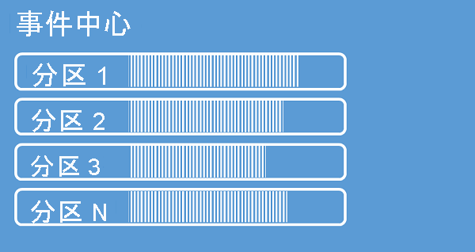

事件中心将发送到事件中心的事件序列组织到一个或多个分区中。 当较新的事件到达时，它们将添加到此序列的末尾。 

可以将分区视为“提交日志”。 分区保存事件数据，这些数据包含事件的主体、描述事件的用户定义属性包以及元数据（例如它在分区中的偏移量、它在流序列中的编号以及它被接受时的服务端时间戳）。

### 使用分区的优势
事件中心旨在帮助处理量较大的事件，分区通过两种方式对此提供帮助：

- 尽管事件中心是一项 PaaS 服务，但其背后存在一个物理现实，并且维护一个保持事件顺序的日志需要将这些事件一起保存在基础存储及其副本中，这将导致出现针对此类日志的吞吐量上限。 分区允许将多个并行日志用于同一个事件中心，从而使可用的原始 IO 吞吐容量倍增。
- 你自己的应用程序必须能够及时处理要发送到事件中心的事件量。 这可能很复杂，并且需要大量的横向扩展并行处理容量。 用于处理事件的单个进程的容量有限，因此需要多个进程。 分区是解决方案为这些进程供给容量的一种方式，它们还能确保每个事件都有一个明确的处理所有者。 

### 分区数
分区数在创建事件中心时指定。 该数值必须介于 1 和每个定价层允许的最大分区计数之间。 有关每个层的分区计数限制，请参阅[此文](../event-hubs-quotas.md#basic-vs-standard-vs-premium-vs-dedicated-tiers)。 

建议在特定事件中心的应用程序峰值负载期间，至少选择你预期需要的分区数。 创建事件中心后，不能更改其分区计数，但专用群集中的事件中心除外。 创建事件中心后，可以[增加](../dynamically-add-partitions.md)[专用事件中心群集](../event-hubs-dedicated-overview.md)中事件中心的分区计数，但当分区键到分区的映射发生更改时，流在分区之间的分布也会发生更改，因此如果应用程序中事件的相对顺序很重要，你应该尽力避免此类更改。

将分区数设置为允许的最大值很有吸引力，但请始终记住，事件流需要进行结构化，这样你才能真正利用多个分区。 如果需要跨所有事件或仅少数几个子流保持绝对顺序，则你可能无法利用多个分区。 而且，多个分区会使处理端更加复杂。 

在定价方面，事件中心中具有多少个分区并不重要。 这取决于命名空间或专用群集的定价单位数量（标准层为[吞吐量单位 (TU)](../event-hubs-scalability.md#throughput-units)、高级层为[处理单位 (PU)](../event-hubs-scalability.md#processing-units)、专用层为[容量单位 (CU)](../event-hubs-dedicated-overview.md)）。 例如，当命名空间设置为 1 TU 容量时，具有 32 个分区或 1 个分区的标准层的事件中心会产生完全相同的费用。 此外，你可以缩放命名空间的 TU 或 PU 或者专用群集的 CU，而不管分区计数如何。 

### 事件到分区的映射
可以使用分区键将传入事件数据映射到特定分区，以便进行数据组织。 分区键是发送者提供的、要传递给事件中心的值。 该键通过静态哈希函数进行处理，以便分配分区。 如果在发布事件时未指定分区键，则会使用循环分配。

事件发布者只知道其分区密钥，而不知道事件要发布到的分区。 键与分区的这种分离使发送者无需了解有关下游处理的过多信息。 每个设备或用户的唯一标识就可以充当一个适当的分区键，但是，也可以使用其他属性（例如地理位置），以便将相关的事件分组到单个分区中。

通过指定分区键，可使相关事件保持在同一分区中，并按其到达的确切顺序排列。 分区键是派生自应用程序上下文并标识事件之间的相互关系的字符串。 分区键标识的事件序列是一个流。 分区是针对许多此类流的多路复用日志存储。 

> [!NOTE]
> 尽管你可以直接向分区发送事件，但我们不建议这样做，尤其是保持高可用性至关重要时。 这种做法会将事件中心的可用性降级到分区级别。 有关详细信息，请参阅[可用性和一致性](../event-hubs-availability-and-consistency.md)。

