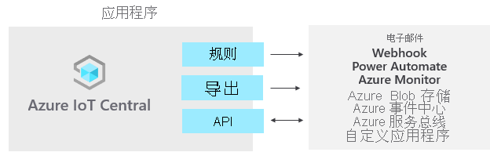

# 什么是 Azure IoT Central？

IoT Central 是一个 IoT 应用程序平台，可减轻开发、管理和维护企业级 IoT 解决方案的负担和成本。 选择使用 IoT Central 进行构建可将时间、金钱和精力集中于使用 IoT 数据转换业务，而不仅仅是维护和更新复杂且不断发展的 IoT 基础结构。

通过 Web UI 可以快速连接设备、监视设备条件、创建规则并在其整个生命周期中管理数百万个设备及其数据。 此外，该平台将 IoT 智能扩展到了业务线应用程序，你可以利用该平台根据设备的见解采取行动。

本文概述了与 IoT Central 相关的以下内容：

- 与项目关联的典型用户角色。
- 如何创建应用程序。
- 如何将设备连接到应用程序。
- 如何将应用程序与其他服务集成。
- 如何管理应用程序。
- 定价选项。

## 用户角色

本 IoT Central 文档提到了四个可与 IoT Central 应用程序进行交互的用户角色：

- 解决方案构建者负责[创建应用程序](quick-deploy-iot-central.md)、[配置规则和操作](quick-configure-rules.md)、[定义与其他服务的集成](quick-export-data.md)，并进一步自定义供操作员和设备开发人员使用的应用程序。
- “操作员”[管理连接到应用程序的设备](howto-manage-devices-individually.md)。
- “管理员”负责执行管理任务，例如，管理应用程序中的[用户角色和权限](howto-administer.md)。
- “设备开发者”[创建在连接到应用程序的设备上运行的代码](concepts-telemetry-properties-commands.md)，或在连接到应用程序的 [IoT Edge 模块](concepts-iot-edge.md)上运行的代码。

## 创建 IoT Central 应用程序

可以快速部署新的 IoT Central 应用程序，然后对其进行自定义以满足特定要求。 一开始可以使用通用 _应用程序模板_，或使用针对以下任一行业的应用程序模板：

- [零售](../retail/overview-iot-central-retail.md)
- [能源](../energy/overview-iot-central-energy.md)
- 政府
- [医疗保健](../healthcare/overview-iot-central-healthcare.md)。

请参阅[创建新的应用程序](quick-deploy-iot-central.md)快速入门，了解如何创建你的第一个应用程序。

## 连接设备

创建应用程序后，第一步是创建并连接设备。 连接到 IoT Central 的每台设备都使用 _设备模板_。 设备模板是定义一种设备的特征和行为的蓝图，例如：

- 它发送的遥测。 示例包含温度和湿度。 遥测是流式处理数据。
- 操作员可以修改的业务属性。 示例包含客户地址和最后维护日期。
- 由设备设置的、在应用程序中处于只读状态的设备属性。 例如，阀的状态为打开或关闭。
- 由操作员设置的属性，决定了设备的行为。 例如，设备的目标温度。
- 操作员可以调用的、在设备上运行的命令。 例如，用于远程重启设备的命令。

每个[设备模板](howto-set-up-template.md)包括：

- 描述设备应实现的功能的 _设备模型_。 设备功能包括：

  - 流式传输到 IoT Central 的遥测。
  - 用于将状态报告给 IoT Central 的只读属性。
  - 从 IoT Central 接收的、用于设置设备状态的可写属性。
  - 从 IoT Central 调用的命令。

- 不存储在设备上的云属性。
- 属于 IoT Central 应用程序的自定义、窗体和设备视图。

你在创建设备模板时有多种选择：

- 在 IoT Central 中设计设备模板，然后在设备代码中实现其设备模型。
- 使用 Visual Studio code 创建设备模型，并将模型发布到存储库。 基于模型实现设备代码，并将设备连接到 IoT Central 应用程序。 IoT Central 从存储库中查找设备模型，并创建简单的设备模板。
- 使用 Visual Studio Code 创建设备模型。 基于模型实现设备代码。 将设备模型手动导入到 IoT Central 应用程序中，然后添加 IoT Central 应用程序所需的任何云属性、自定义项和视图。

### 自定义 UI

你还可以为负责日常使用应用程序的操作员自定义 IoT Central 应用程序 UI。 可以进行的自定义包括：

- 配置自定义仪表板，以帮助操作员获得见解，并更快地解决问题。
- 配置自定义分析来从已连接的设备探究时序数据。
- 在设备模板上定义属性和设置的布局。

## 管理设备

操作员使用 IoT Central 应用程序[管理 IoT Central 解决方案中的设备](howto-manage-devices-individually.md)。 操作员执行以下任务：

- 监视连接到应用程序的设备。
- 排查和修正设备问题。
- 预配新设备。

你可以定义对连接设备的数据流进行操作的[自定义规则和操作](howto-configure-rules.md)。 操作员可以在设备级别启用或禁用这些规则来控制和自动执行应用程序中的任务。

对于旨在大规模运行的 IoT 解决方案，以结构化的方式管理设备非常重要。 只是将设备连接到云是不够的，还需要使设备保持连接状态并正常运行。 在整个应用程序生命周期内，可使用以下 IoT Central 功能来管理设备：

### 仪表板

一开始可以使用应用程序模板中的预生成仪表板，或创建自己的根据操作员需求定制的仪表板。 可与应用程序中的所有用户共享仪表板，或将其保留为个人专用。

### 规则和操作

基于设备状态和遥测生成[自定义规则](tutorial-create-telemetry-rules.md)，以识别需要引以注意的设备。 配置操作来通知适当的人员，并确保及时采取纠正措施。

### 作业

使用[作业](howto-manage-devices-in-bulk.md)可以通过设置属性或调用命令对设备应用单项更新或批量更新。

## 与其他服务集成

作为应用程序平台，IoT Central 可让你将 IoT 数据转换为业务见解来促成可行的结果。 例如，可通过[规则](./tutorial-create-telemetry-rules.md)、[数据导出](./howto-export-data.md)和[公共 REST API](/learn/modules/manage-iot-central-apps-with-rest-api/) 将 IoT Central 与业务线应用程序相集成：

可以生成业务见解（例如，确定机器的效率趋势，或预测车间的未来能耗），方法是生成自定义的分析管道来处理设备发出的遥测数据并存储结果。 在 IoT Central 应用程序中配置数据导出，以将遥测数据、设备属性更改和设备模板更改导出到其他服务，在其中可以使用偏好的工具分析、存储和可视化数据。

### 使用 REST API 生成自定义 IoT 解决方案和集成

生成 IoT 解决方案，例如：

- 可远程设置和控制设备的移动伴侣应用。
- 可使现有业务线应用程序能够与 IoT 设备和数据交互的自定义集成。
- 用于设备建模、加入、管理和数据访问的设备管理应用程序。

## 管理应用程序

IoT Central 应用程序完全由 Microsoft 托管，这降低了管理应用程序时的管理开销。 管理员通过[用户角色和权限](howto-administer.md)管理对应用程序的访问权限。

## 定价

可以使用 7 天免费试用版创建 IoT Central 应用程序，也可以使用标准定价计划。

- 使用免费计划创建的应用程序在七天内是免费的，最多支持五台设备。 在它们过期之前，随时可将其转换为使用标准定价计划。
- 使用标准计划创建的应用程序按设备计费，可以选择“标准 0”、“标准 1”或“标准 2”定价计划，前两个设备是免费的  。 详细了解 [IoT Central 定价](https://aka.ms/iotcentral-pricing)。

## 后续步骤

现在，你已大致了解了 IoT Central，下面是一些建议的后续步骤：

- 如果你是设备开发人员并想深入了解某种代码，建议执行的下一步骤是[创建客户端应用程序并将其连接到 Azure IoT Central 应用程序](./tutorial-connect-device.md)。
- 熟悉 [Azure IoT Central UI](overview-iot-central-tour.md)。
- 通过[创建 Azure IoT Central 应用程序](quick-deploy-iot-central.md)开始使用此解决方案。
