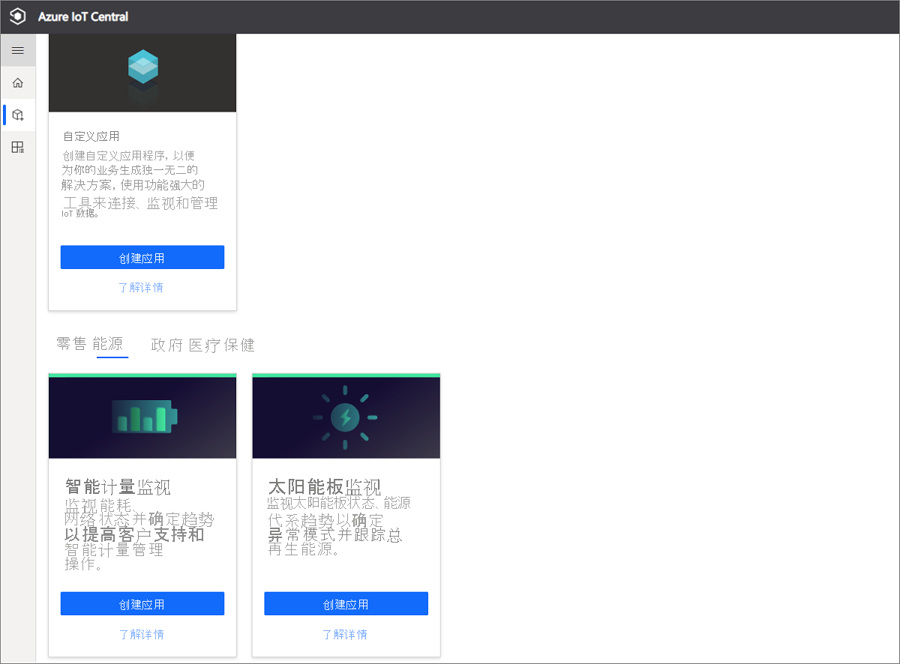
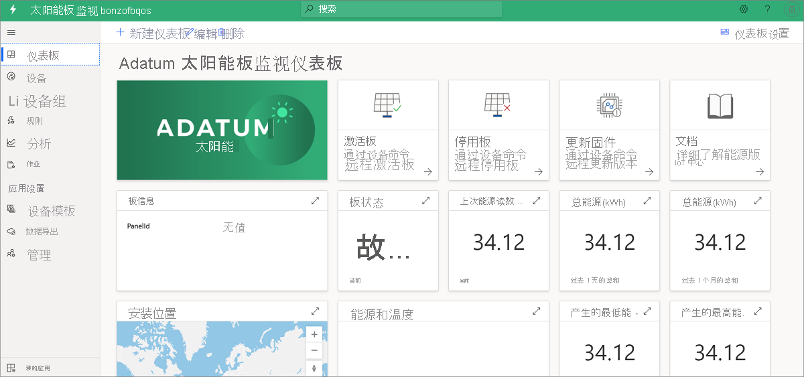
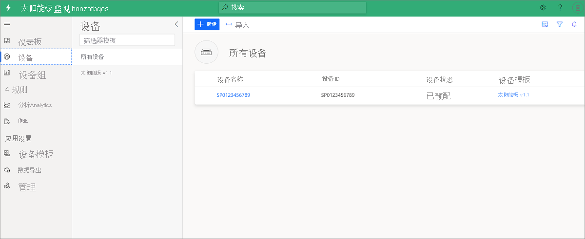
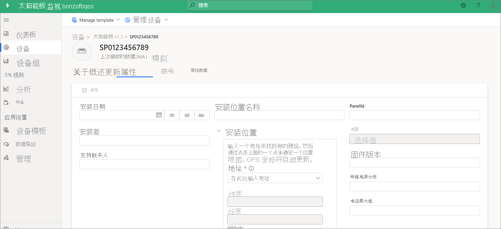
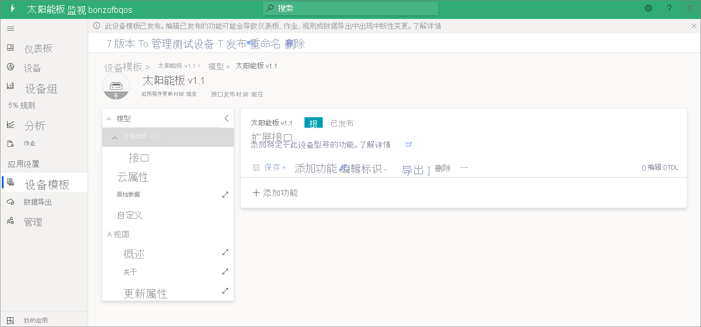
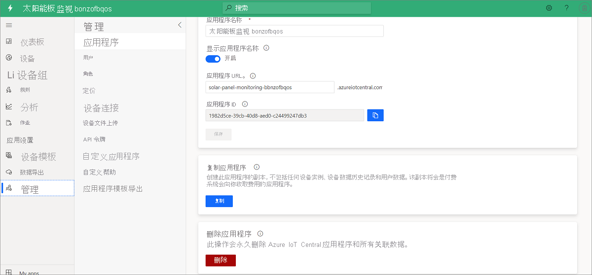

# 教程：创建和探索太阳能板监视应用模板 

本教程将指导你完成创建太阳能板监视应用程序的过程，其中包括具有模拟数据的示例设备模型。 本教程介绍以下操作：

> [!div class="checklist"]
> * 免费创建太阳能板应用
> * 演练应用程序
> * 清理资源

如果没有订阅，请[创建免费试用帐户](https://azure.microsoft.com/free)。

## 先决条件

完成本教程没有任何先决条件。 建议使用 Azure 订阅，但这不是必需的。

## 创建太阳能板监视应用 

可以通过三个简单的步骤来创建此应用程序：

1. 转到 [Azure IoT Central](https://apps.azureiotcentral.com)。 若要创建新的应用程序，请选择“构建”。 

1. 选择“能源”选项卡。在“太阳能板监视”下，选择“创建应用” 。 

    > [!div class="mx-imgBorder"]
    > 
  
1. 在“新建应用程序”对话框中，填写所需的详细信息，然后选择“创建” ：
    * **应用程序名称**：为 Azure IoT Central 应用程序选择一个名称。 
    * **URL**：选择 Azure IoT Central URL。 由平台验证其是否唯一。
    * **定价计划**：如果已有 Azure 订阅，则建议使用默认设置。 如果没有 Azure 订阅，请从免费试用版入手。
    * **计费信息**：应用程序本身是免费的。 预配应用的资源时需要目录、Azure 订阅和区域详细信息。
        
        
        

### 验证应用程序和模拟数据

你随时都可修改这个新的太阳能板应用。 目前，在修改应用之前请确保应用已部署并按预期方式工作。

若要验证应用创建和数据模拟，请转到“仪表板”。 如果可以看到包含某些数据的磁贴，则表明应用部署成功。 数据模拟可能需要几分钟的时间来生成数据。 

## 应用程序演练
成功部署应用模板后，你需要多浏览一下应用。 请注意，它附带了示例智能仪表设备、设备型号和仪表板。

Adatum 是一家虚构的能源公司，负责监视和管理太阳能板。 在太阳能板监视仪表板上，可以看到太阳能板属性、数据和示例命令。 通过此仪表板，你或你的支持团队可在问题需要额外支持前主动执行以下活动：
* 查看地图上的最新面板信息及其安装[位置](../core/howto-use-location-data.md)。
* 检查面板状态和连接状态。
* 查看能源产生和温度趋势，以捕获任何异常模式。
* 跟踪计划和计费用途的总能耗产生。
* 如有必要，激活面板并更新固件版本。 在模板中，命令按钮显示可能的功能，并且不发送实际命令。

> [!div class="mx-imgBorder"]
> 

### 设备
该应用附带了一个示例太阳能板设备。 若要查看设备详细信息，请选择“设备”。

> [!div class="mx-imgBorder"]
> 

选择示例设备 SP0123456789。 从“更新属性”选项卡中，可更新设备的可写属性，并直观查看仪表板上已更新的值。 

> [!div class="mx-imgBorder"]
> 

### 设备模板
若要查看太阳能板设备型号，请选择“设备模板”选项卡。模型为数据、属性、命令和视图预定义了接口。

> [!div class="mx-imgBorder"]
> 

## 清理资源
如果决定不继续使用此应用程序，请使用以下步骤将它删除：

1. 在左侧窗格中，选择“管理”。
1. 选择“应用程序设置” > “删除” 。 

    > [!div class="mx-imgBorder"]
    > 

## 后续步骤
 
> [!div class="nextstepaction"]
> [Azure IoT Central - 太阳能板应用体系结构](./concept-iot-central-solar-panel-app.md)

