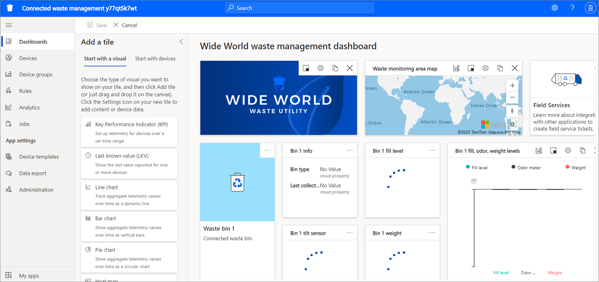

# 教程：创建连接的废弃物管理应用

本教程介绍如何使用 Azure IoT Central 创建联网废物管理应用程序。 

具体来说，你将学习如何： 

> [!div class="checklist"]
> * 使用 Azure IoT Central 联网废弃物管理模板来创建应用。
> * 浏览并自定义仪表板。 
> * 浏览联网垃圾箱设备模板。
> * 浏览模拟设备。
> * 浏览并配置规则。
> * 配置作业。
> * 自定义应用程序品牌。

## 先决条件

建议使用 Azure 订阅。 或者，可使用 7 天免费试用版。 如果没有 Azure 订阅，则可在 [Azure 注册页](https://aka.ms/createazuresubscription)上创建一个。

## 在 Azure IoT Central 中创建应用

在本部分，你将使用联网废物管理模板在 Azure IoT Central 中创建应用。 下面介绍如何操作：

1. 转到 [Azure IoT Central](https://aka.ms/iotcentral)。

    如果你有一个 Azure 订阅，请使用用于访问该订阅的凭据登录。 否则，请使用 Microsoft 帐户登录：

    

1. 在左侧窗格中，选择“构建”。 然后，选择“政府”选项卡。“政府”窗格显示了几个政府应用程序模板。

    

1. 选择“联网废弃物管理”应用程序模板。 此模板包括示例联网垃圾箱设备模板、模拟设备、仪表板以及预配置的监测规则。    

1. 选择“创建应用”，这会打开“新建应用程序”对话框 。 填写以下字段的信息：
    * **应用程序名称**。 默认情况下，应用程序使用“联网废弃物管理”，后跟 Azure IoT Central 生成的唯一 ID 字符串。 （可选）可选择一个易记的应用程序名称。 稍后也可以更改应用程序名称。
    * **URL**。 （可选）可选择所需的 URL。 稍后可更改该 URL。 
    * **定价计划**。 如果你有 Azure 订阅，请在“计费信息”对话框的相应字段输入目录、Azure 订阅和区域。 如果你没有订阅，请选择“免费”来启用 7 天试用版订阅，并填写所需的联系信息。  

1. 在页面底部，选择“创建”。 

    
    
    

 
新创建的应用程序带有下列预配置的内容：
* 示例仪表板。
* 预定义的联网垃圾箱设备示例模板。
* 模拟的联网垃圾箱设备。
* 规则和作业。
* 示例品牌。 

这是你的应用程序，你可以随时修改它。 现在，浏览应用程序并进行一些自定义。  

## 浏览并自定义仪表板 

查看创建应用后看到的 Wide World 废弃物管理仪表板。

   

生成人员可在仪表板上创建和自定义视图，以供操作员使用。 首先，来看看这个仪表板。 

>[!NOTE]
>仪表板中显示的所有数据均基于模拟设备数据，下一部分将详细介绍。 

仪表板包含不同的磁贴：

* **Wide World Waste 公司图像磁贴**：仪表板中的第一个磁贴是虚构的废弃物公司“Wide World Waste”的图像磁贴。 可自定义该磁贴并放置自己的图像，也可将其删除。 

* **垃圾箱图像磁贴**：可使用图像和内容磁贴创建正在受监视的设备的可视化表示形式以及描述。 

* **填充级别 KPI 磁贴**：该磁贴显示垃圾箱中的填充级别传感器报告的值。 可远程监控垃圾箱中的填充级别和其他传感器（例如“气味测量仪”或“重量”） 。 操作员可采取行动，比如调度垃圾收集车。 

* **废弃物监视区域地图**：该磁贴使用 Azure Maps，你可直接在 Azure IoT Central 中对其进行配置。 地图磁贴显示设备[位置](../core/howto-use-location-data.md)。 尝试将鼠标悬停在地图上，然后尝试使用地图上的控件，如放大、缩小或展开。

     

* **填充、气味、重量水平条形图**：可在条形图中直观呈现一种或多种设备遥测数据。 还可以展开条形图。  

  

* **Field Services**：仪表板上有一个链接，可通过它了解如何从 Azure IoT Central 应用程序与 Dynamics 365 Field Services 进行集成。 例如，可使用 Field Services 创建用于调度垃圾收集服务的票证。 

### 自定义仪表板 

可通过选择“编辑”菜单来自定义仪表板  。 然后，可添加新磁贴或配置现有磁贴。 下面是仪表板在编辑模式下的显示效果： 

还可选择“+新建”来创建新的仪表板，并从头开始配置。 你可以有多个仪表板，还可通过仪表板菜单在仪表板之间切换。 

## 浏览设备模板

Azure IoT Central 中的设备模板会定义设备的功能，这些功能可以包括遥测、属性或命令。 构建者可定义设备模板来表示要联网的设备功能。 

联网废弃物管理应用程序附带了一个联网垃圾箱设备示例模板。

如需查看设备模板：

1. 在 Azure IoT Central 中，从应用的左侧窗格中选择“设备模板”。 

    

1. 在“设备模板”列表中，选择“联网垃圾箱” 。

1. 检查设备模板功能。 你可以看到，它定义了填充级别、气味测量仪、重量和位置等传感器   。

   

### 自定义设备模板

尝试自定义以下内容：
1. 在设备模板菜单中，选择“自定义”  。
1. 查找“气味测量仪”遥测类型。
1. 将气味测量仪的显示名称更新为“气味级别”  。
1. 尝试更新度量单位，或设置“最小值”和“最大值” 。
1. 选择“保存”。  

### 添加云属性 

下面介绍如何操作：
1. 从设备模板菜单中，选择“云属性”  。
1. 选择“+添加云属性”。 在 Azure IoT Central 中，可添加与设备相关但不应由设备发送的属性。 例如，云属性可以是特定于安装区域、资产信息或维护信息的警报阈值。 
1. 选择“保存”。 
 
### 视图 
联网垃圾箱设备模板带有预定义的视图。 浏览视图，并根据需要对其进行更新。 视图定义了操作员查看设备数据及输入云属性的方式。 

  

### 发布 

如果进行了任何更改，请记得发布设备模板。 

### 创建新设备模板 

若要创建新的设备模板，请选择“+新建”，然后按照步骤操作。 可从头开始创建自定义设备模板，也可从 Azure 设备目录选择一个设备模板。 

## 浏览模拟设备

在 Azure IoT Central 中，可以创建模拟设备以测试设备模板和应用程序。 

联网废弃物管理应用程序有两个模拟设备关联到联网垃圾箱设备模板。 

### 查看设备

1. 在 Azure IoT Central 的左侧窗格中，选择“设备”。 

   

1. 选择“联网垃圾箱”设备。  

     

1. 请转到“云属性”选项卡。将“箱满警报阈值”的值从 95 更新到 100  。 

浏览“设备属性”和“设备仪表板”选项卡 。 

> [!NOTE]
> 所有选项卡都是从设备模板视图配置的。

### 添加新设备

可选择“设备”选项卡上的“+新建”来添加新设备 。 

## 浏览并配置规则

在 Azure IoT Central 中，可创建规则来自动监视设备遥测，并在满足一个或多个条件时触发操作。 这些操作可能包括发送电子邮件通知、触发 Power Automate 中的操作，或启动 Webhook 操作来向其他服务发送数据。

“连接的废弃物管理”应用程序有四个示例规则  。

### 查看规则
1. 在 Azure IoT Central 的左侧窗格中，选择“规则”。

   

1. 选择“箱满警报”。

     

 1. 箱满警报会检查以下情况：**填充级别大于或等于箱满警报阈值**。

    箱满警报阈值是联网垃圾箱设备模板中定义的一个云属性。 

现在，让我们创建电子邮件操作。

### 创建电子邮件操作

在规则的“操作”列表中，可配置电子邮件操作：
1. 选择“+ 电子邮件”  。 
1. 对于“显示名称”，输入“高 pH 警报” 。
1. 对于“收件人”，输入与 Azure IoT Central 帐户关联的电子邮件地址。 
1. （可选）输入要包含在电子邮件文本中的注释。
1. 选择“完成” > “保存” 。 

满足配置条件后，现在会收到电子邮件。

>[!NOTE]
>每次满足条件后，应用程序都会发送电子邮件。 “禁用”该规则会停止从自动规则接收电子邮件  。 
  
若要创建新规则，请从“规则”的左窗格中，选择“+新建” 。

## 配置作业

在 Azure IoT Central 中，可通过作业在多台设备上触发设备或云属性更新。 还可以使用作业在多个设备上触发设备命令。 Azure IoT Central 将自动执行工作流。 

1. 在 Azure IoT Central 的左侧窗格中，选择“作业”。 
1. 选择“+新建”，并配置一个或多个作业。 

## 自定义应用程序 

构建者可以更改多个设置来自定义应用程序中的用户体验。

### 更改应用程序主题

下面介绍如何操作：
1. 转到“管理” > “自定义应用程序” 。
1. 选择“更改”，来选择要上传用于应用程序徽标的图像 。
1. 选择“更改”，来选择要上传用于浏览器图标的图像（该图标是一个将显示在浏览器标签页上的图像） 。
1. 还可添加 HTML 十六进制颜色代码来替换默认浏览器颜色。 为此，请使用“标头”和“强调”字段 。

   

1. 还可更改应用程序图像。 选择“管理” > “应用程序设置” > “选择图像”，来选择要上传用作应用程序图像的图像  。
1. 最后，还可单击应用程序刊头上的“设置”来更改主题。

## 清理资源

如果不希望继续使用此应用程序，请删除应用程序，步骤如下：

1. 在 Azure IoT Central 应用的左侧窗格中选择“管理”。
1. 选择“应用程序设置” > “删除” 。

## 后续步骤

> [!div class="nextstepaction"]
> [连接的废弃物管理概念](./concepts-connectedwastemanagement-architecture.md)
