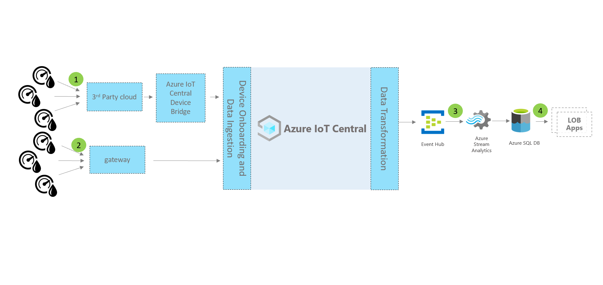
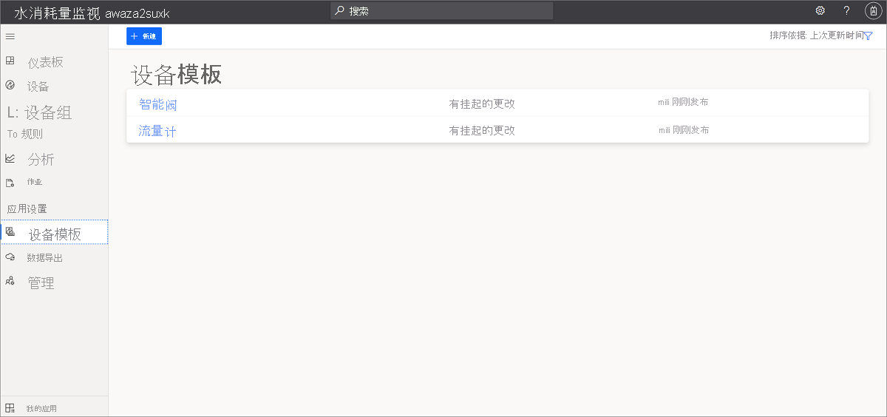
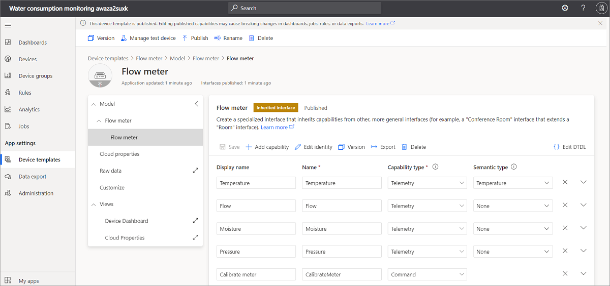
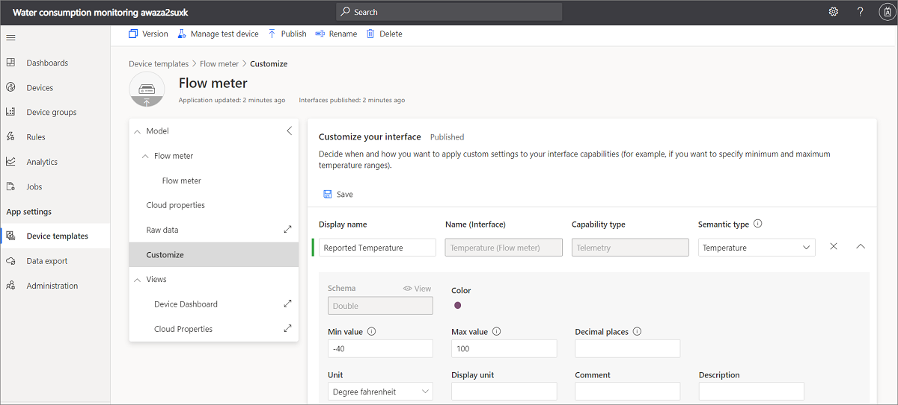
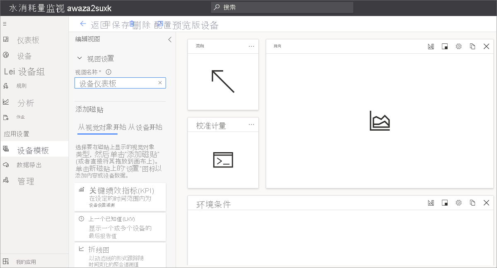
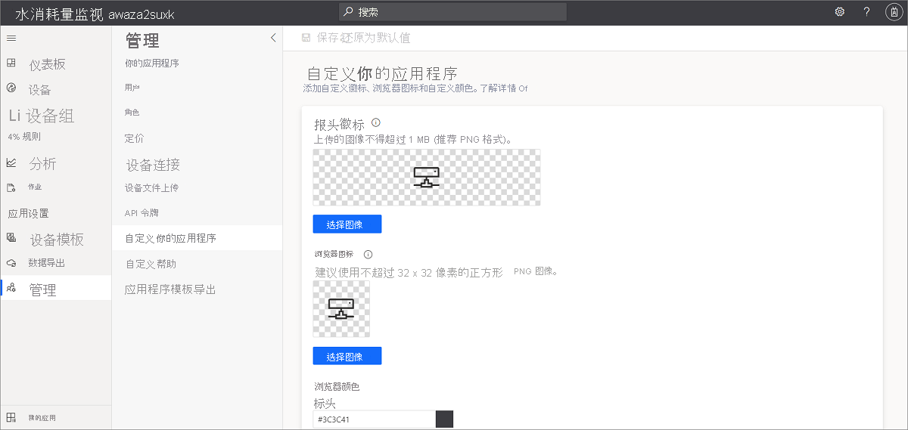

# 教程：部署并演练水消耗量监测应用程序

使用 IoT Central 水消耗量监测应用程序模板和本文中的指南来开发端到端水消耗量监测解决方案。

### 设备和连接

水务管理解决方案使用智能水务设备，例如流量计、水质监测仪、智能阀门、检漏仪。

智能水务解决方案中的设备可通过低功耗广域网 (LPWAN) 或通过第三方网络运营商进行连接。 对于这几类设备，请使用 [Azure IoT Central 设备网桥](../core/howto-build-iotc-device-bridge.md)将设备数据发送到 Azure IoT Central 中的 IoT 应用程序。 还可以使用支持 IP 且可直接连接到 IoT Central 的设备网关。

### IoT Central

Azure IoT Central 是一种 IoT 应用平台，可帮助快速构建和部署 IoT 解决方案。 你可以设计、自定义解决方案，并将其与第三方服务相集成。

将智能水务设备连接到 IoT Central 时，该应用程序会提供设备命令与控制、监视和警报、带有内置 RBAC 的用户界面、可配置的仪表板和扩展性选项。

### 扩展性和集成

可以在 IoT Central 中扩展 IoT 应用程序，并可根据需要执行以下操作：

* 转换和集成 IoT 数据以进行高级分析，例如，通过从 IoT Central 应用程序持续导出的数据训练机器学习模型。
* 通过 Power Automate 或 IoT Central 应用程序中的 Webhook 来触发操作，在其他系统中自动执行工作流。
* 通过 IoT Central API 以编程方式访问 IoT Central 中的 IoT 应用程序。

### 业务应用程序

可以使用 IoT 数据为水务公用事业中的各种业务应用程序赋能。 在 [IoT Central 用水量监测应用程序](tutorial-water-consumption-monitoring.md)中，可以配置规则和操作，并将其设置为在[已连接现场服务](/dynamics365/field-service/connected-field-service)中创建警报。 在 IoT Central 规则中配置 Power Automate，以跨应用程序和服务自动执行工作流。 此外，基于已连接现场服务中的服务活动，可以将信息发送回 Azure IoT Central。

在本教程中，你将了解：

> [!div class="checklist"]

> * 使用 Azure IoT Central 水消耗量监测模板创建水消耗量监测应用程序。
> * 浏览并自定义仪表板。
> * 浏览设备模板。
> * 浏览模拟设备。
> * 浏览并配置规则。
> * 配置作业。
> * 使用白色标签自定义应用程序品牌。

## 先决条件

* 无需满足特定的先决条件，就可以部署此应用。
* 你可以使用免费定价计划或使用 Azure 订阅。

## 创建水消耗量监测应用程序

使用以下步骤创建应用程序：

1. 导航到 [Azure IoT Central 生成](https://aka.ms/iotcentral)站点。 然后使用 Microsoft 个人、工作或学校帐户登录。 从左侧导航栏中选择“生成”，然后选择“政府”选项卡：:::image type="content" source="media/tutorial-waterconsumptionmonitoring/iot-central-government-tab-overview1.png" alt-text="应用程序模板"::: 

1. 选择“水消耗量监测”下的“创建应用” 。

若要了解详细信息，请参阅[创建 IoT Central 应用程序](../core/howto-create-iot-central-application.md)。

## 演练应用程序

以下各部分将介绍应用程序的主要功能：

### 仪表板

创建应用程序后，会打开“Wide World 水消耗量监测仪表板”示例  。
  
:::image type="content" source="media/tutorial-waterconsumptionmonitoring/water-consumption-monitoring-dashboard-full.png" alt-text="水消耗量监测仪表板。":::

可在仪表板上创建和自定义视图，以供操作员使用。

> [!NOTE]
> 仪表板中显示的所有数据均基于模拟设备数据，这将在下一部分进行探讨。
  
仪表板包含不同种类的磁贴：

* **Wide World 供水公司图像磁贴**：仪表板中的第一个磁贴是虚构的供水公司 Wide World Water 的图像磁贴。 可以通过插入自己的图像来自定义磁贴，或将其删除。
* **平均水流量 KPI 磁贴**：KPI 磁贴配置为显示为“最近 30 分钟内的平均值”示例  。 可以自定义 KPI 磁贴，并将其设置为不同的类型和时间范围。
* **设备命令磁贴**：这些磁贴包括“关闭阀门”、“打开阀门”和“设置阀门位置”磁贴。    选择命令将转到模拟设备命令页。 在 Azure IoT Central 中，命令是一种设备功能类型   。 稍后我们会在本教程的[设备模板](../government/tutorial-water-consumption-monitoring.md#explore-the-device-template)部分探讨此概念。

* **水分布区域地图**：该地图使用 Azure Maps，你可以直接在 Azure IoT Central 中对其进行配置。 地图磁贴显示设备[位置](../core/howto-use-location-data.md)。 将鼠标悬停在地图上，然后尝试使用地图上的控件，如放大、缩小或展开    。

    :::image type="content" source="media/tutorial-waterconsumptionmonitoring/water-consumption-monitoring-dashboard-map.png" alt-text="水消耗量监测仪表板地图":::

* **平均水流量折线图** 和 **环境条件折线图**：可以可视化绘制为所需时间范围内的折线图的一个或多个设备遥测。
* **平均阀门压力热度地图图表**：对于你想要通过颜色索引查看在一定时间范围内的分布情况的设备遥测数据，可以选择这些数据的热度地图可视化类型。
* **重置警报阈值内容磁贴**：可以包含调用操作内容磁贴，并嵌入操作页的链接。 在此情况下，重置警报阈值会转到应用程序的“作业”，可在其中运行设备属性的更新  。 稍后将在本教程的[配置作业](../government/tutorial-water-consumption-monitoring.md#configure-jobs)部分探讨此选项。
* **属性磁贴**：仪表板显示“阀门操作信息”、“流量警报阈值”和“维护信息”磁贴    。

### 自定义仪表板

可在仪表板上自定义视图，以供操作员使用。

1. 选择“编辑”可自定义“Wide World 水消耗量仪表板”   。 可通过选择“编辑”菜单来自定义仪表板  。 仪表板进入编辑模式后，可添加新的磁贴，或对其进行配置  。

    :::image type="content" source="media/tutorial-waterconsumptionmonitoring/water-consumption-monitoring-edit-dashboard.png" alt-text="编辑仪表板":::

若要了解详细信息，请参阅[创建和自定义仪表板](../core/howto-manage-dashboards.md)

## 浏览设备模板

 在 Azure IoT Central 中，设备模板定义设备的功能。 设备功能包括设备传感器发送的遥测、设备属性以及设备可以执行的命令。 可在 Azure IoT Central 中定义一个或多个表示要连接的设备功能的设备模板。

水消耗量监测应用程序附带了两个引用设备模板，分别表示流量计和智能阀设备   。

如需查看设备模板：

1. 选择 Azure IoT Central 中应用程序左侧窗格中的“设备模板”  。 在“设备模板”列表中，将看到两个设备模板：“智能阀”和“流量计”    。

   

1. 选择“流量计”  设备模板并熟悉设备功能。

     

### 自定义设备模板

若要自定义设备模板：

1. 在“设备模板”菜单中转到“自定义”   。
1. 找到 `Temperature` 遥测类型。
1. 将 `Temperature` 的“显示名称”更新为 `Reported temperature`  。
1. 更新度量单位，或设置“最小值”和“最大值”   。
1. 选择“保存”  以保存所有更改。

    

### 添加云属性

1. 在“设备模板”菜单中转到“云属性”   。
1. 选择“+ 添加云属性”添加新的云属性  。
    在 Azure IoT Central 中，可以添加与设备相关的属性。 例如，云属性可以是特定于安装区域、资产信息或其他维护信息的警报阈值。
1. 选择“保存”  以保存所有更改。

若要了解详细信息，请参阅[云属性](../core/concepts-device-templates.md#cloud-properties)。

### 视图

水消耗量监测设备模板附带预定义的视图。 视图定义操作员查看设备数据以及设置云属性的值的方式。

  

若要了解详细信息，请参阅[视图](../core/concepts-device-templates.md#views)。

### 发布设备模板

导航到“设备模板”页面，选择“发布”以保存对设备模板所做的任何更改。

若要了解详细信息，请参阅[如何发布模板](../core/howto-set-up-template.md#publish-a-device-template)。

### 创建新设备模板

选择“+ 新建”以创建新的设备模板，然后执行创建过程  。
可以从头开始创建自定义设备模板，也可以从 Azure 设备目录中选择设备模板。

若要了解详细信息，请参阅[如何添加设备模板](../core/howto-set-up-template.md)。

## 浏览模拟设备

在 Azure IoT Central 中，可以创建模拟设备以测试设备模板和应用程序。 水消耗量监测应用程序具有映射到流量计和智能阀设备模板的两个模拟设备   。

### 查看设备

1. 在左侧窗格中选择“设备” > “所有设备”   。

    :::image type="content" source="media/tutorial-waterconsumptionmonitoring/water-consumption-monitoring-devices.png" alt-text="“所有设备”窗格":::

1. 选择“智能阀 1”  。

    :::image type="content" source="media/tutorial-waterconsumptionmonitoring/water-consumption-monitor-device-1.png" alt-text="智能阀 1":::

1. 在“命令”选项卡上，可以看到三个设备命令：“打开阀门”、“关闭阀门”和“设置阀门位置”，它们是智能阀设备模板中定义的功能      。

1. 浏览“设备属性”选项卡和“设备仪表板”选项卡   。

> [!NOTE]
> 此页面上显示的视图是使用“设备模板”>“视图”页面配置的。 

### 添加新设备

选择“设备”选项卡上的“+ 新建”来添加新设备   。

若要了解详细信息，请参阅[管理设备](../core/howto-manage-devices-individually.md)。

## 了解规则

在 Azure IoT Central 中，可以创建规则来自动监视设备遥测，并在满足一个或多个条件时触发操作。 这些操作可能包括发送电子邮件通知或触发 Microsoft Power Automate 或向其他服务发送数据的 Webhook 操作。

创建的水消耗量监测应用程序中预配置了三个规则。

### 查看规则

1. 在左侧窗格中选择“规则”  。

    :::image type="content" source="media/tutorial-waterconsumptionmonitoring/water-consumption-monitoring-rules.png" alt-text="“规则”窗格":::

1. 选择“高水流量警报”，它是应用程序中的一项预配置规则。

    :::image type="content" source="media/tutorial-waterconsumptionmonitoring/water-consumption-monitoring-high-flow-alert.png" alt-text="高 pH 警报":::

    `High water flow alert` 规则配置为根据条件 `Flow``greater than``Max flow threshold` 进行检查。 流量阈值是在“智能阀”设备模板中定义的云属性。 每个设备实例均设有 `Max flow threshold` 值。

接下来，你可以创建电子邮件操作。

若要向规则添加操作，请执行以下操作：

1. 选择“+ 电子邮件”  。
1. 输入“高流量警报”作为操作的易记显示名称 。
1. 在“收件人”中输入与 Azure IoT Central 帐户关联的电子邮件地址  。
1. （可选）输入要包含在电子邮件文本中的注释。
1. 选择“完成”  ，完成操作。
1. 选择“保存”，以保存新规则。
1. 启用该规则。

满足配置条件后，你将在几分钟内收到电子邮件。

> [!NOTE]
> 每次满足条件后，应用程序都会发送电子邮件。 选择“禁用”会禁止该规则停止从自动规则接收电子邮件  。
  
若要创建新规则：

若要创建新规则，请在左侧窗格的“规则”选项卡上选择“+ 新建” 。

## 配置作业

在 Azure IoT Central 中，作业允许你在多个设备上触发设备或云属性更新。 除了属性外，还可以使用作业在多个设备上触发设备命令。 Azure IoT Central 将自动执行工作流。

1. 在左侧窗格中选择“作业”  。
1. 选择“+ 新建”并配置一个或多个作业  。

若要了解详细信息，请参阅[如何运行作业](../core/howto-manage-devices-in-bulk.md)。

## 自定义应用程序

管理员可以更改多个设置来自定义应用程序中的用户体验。

1. 选择“管理” > “自定义应用程序”   。
1. 若要选择要作为应用程序徽标上传的图像，请选择“更改”按钮   。
1. 若要选择将显示在浏览器选项卡上的浏览器图标图像，请选择“更改”按钮   。
1. 还可以通过添加 HTML 十六进制颜色代码来替换默认“浏览器颜色”  。 有关 **十六进制值** 颜色表示法的详细信息，请参阅 [HTML 颜色](https://www.w3schools.com/html/html_colors.asp)。

   

1. 也可以选择“管理”   > “应用程序设置”  来更改应用程序图像。 若要选择要作为应用程序图像上传的图像，请选择“选择图像”按钮  。

## 清理资源

如果你不打算继续使用此应用程序，请将其删除。

1. 在 Azure IoT Central 应用程序的左侧窗格中选择“管理”  。
1. 选择“应用程序设置”，然后选择页面底部的“删除”   。

## 后续步骤
 
建议的下一步是了解[水质监测](./tutorial-water-quality-monitoring.md)。