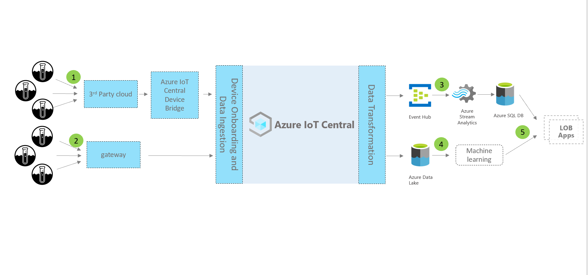

# 教程：部署并演练水质监测应用程序

使用 IoT Central 水质监测应用程序模板和本文中的指南来开发端到端水质监测解决方案。

### 设备和连接

水务管理解决方案使用智能水务设备，例如流量计、水质监测仪、智能阀门、检漏仪。

智能水务解决方案中的设备可通过低功耗广域网 (LPWAN) 或通过第三方网络运营商进行连接。 对于此类设备，可以使用 [Azure IoT Central 设备网桥](../core/howto-build-iotc-device-bridge.md)将设备数据发送到 Azure IoT Central 中的 IoT 应用程序。 还可以使用支持 IP 且可直接连接到 IoT Central 的设备网关。

### IoT Central

Azure IoT Central 是一种 IoT 应用平台，可帮助快速构建和部署 IoT 解决方案。 你可以设计、自定义解决方案，并将其与第三方服务相集成。

将智能水务设备连接到 IoT Central 时，该应用程序会提供设备命令与控制、监视和警报、带有内置 RBAC 的用户界面、可配置的仪表板和扩展性选项。

### 扩展性和集成

可以在 IoT Central 中扩展 IoT 应用程序，并可根据需要执行以下操作：

* 转换和集成 IoT 数据以进行高级分析，例如，通过从 IoT Central 应用程序持续导出的数据训练机器学习模型。
* 通过 Power Automate 或 IoT Central 应用程序中的 Webhook 来触发操作，在其他系统中自动执行工作流。
* 通过 IoT Central API 以编程方式访问 IoT Central 中的 IoT 应用程序。

### 业务应用程序

可以使用 IoT 数据为水务公用事业中的各种业务应用程序赋能。 在 [IoT Central 用水量监测应用程序](tutorial-water-consumption-monitoring.md)中，可以配置规则和操作，并将其设置为在[已连接现场服务](/dynamics365/field-service/connected-field-service)中创建警报。 在 IoT Central 规则中配置 Power Automate，以跨应用程序和服务自动执行工作流。 此外，基于已连接现场服务中的服务活动，可以将信息发送回 Azure IoT Central。

在本教程中，学习：

> [!div class="checklist"]

> * 使用水质监测模板来创建水质监测应用程序  。
> * 浏览并自定义仪表板。
> * 浏览水质监测设备模板。
> * 浏览模拟设备。
> * 浏览并配置规则。
> * 配置作业。
> * 使用白色标签自定义应用程序品牌。

## 先决条件

* 无需满足特定的先决条件，就可以部署此应用。
* 你可以使用免费定价计划或使用 Azure 订阅。

## 创建水质监测应用程序

使用以下步骤创建应用程序：

1. 导航到 [Azure IoT Central 生成](https://aka.ms/iotcentral)站点。 然后使用 Microsoft 个人、工作或学校帐户登录。 从左侧导航栏中选择“生成”，然后选择“政府”选项卡：:::image type="content" source="media/tutorial-waterqualitymonitoring/iot-central-government-tab-overview1.png" alt-text="应用程序模板"::: 

1. 选择“水质监测”下的“创建应用” 。

若要了解详细信息，请参阅[创建 IoT Central 应用程序](../core/howto-create-iot-central-application.md)。

## 演练应用程序

以下各部分将介绍应用程序的主要功能：

### 仪表板

创建应用程序后，“Wide World 水质仪表板”窗格将打开  。

:::image type="content" source="media/tutorial-waterqualitymonitoring/water-quality-monitoring-dashboard1.png" alt-text="水质监测仪表板。":::

生成人员可在仪表板上创建和自定义视图，以供操作员使用。 但在尝试自定义之前，请先浏览仪表板。

仪表板中显示的所有数据均基于模拟设备数据，这将在下节中进行讨论。

该仪表板包含以下种类的磁贴：

* **Wide World 供水公司图像磁贴**：仪表板左上角的第一个磁贴是一个显示名为 Wide World 的虚构供水公司的图像。 可以自定义磁贴以使用自己的图像，也可以删除该磁贴。

* **平均 pH KPI 磁贴**：“过去 30 分钟内的平均 pH”等 KPI 磁贴位于仪表板窗格的顶部  。 可以自定义 KPI 磁贴，并将每个磁贴设置为不同的类型和时间范围。

* 水监测地区地图：Azure IoT Central 使用 Azure Maps，你可以在应用程序中直接对其进行设置以显示设备[位置](../core/howto-use-location-data.md)。 还可以将位置信息从应用程序映射到设备，然后使用 Azure Maps 显示地图上的信息。 将鼠标悬停在地图上，并尝试使用控件。

* **平均 pH 分布热图图表**：可选择不同的可视化图表，以最适合你应用程序的方式显示设备遥测数据。

* **关键质量指标折线图**：可将一定时间范围内的设备遥测数据可视化为折线图。  

* **化学制剂浓度条形图**：可在条形图中可视化设备遥测数据。

* **重置传感器参数磁贴**：仪表板包含操作磁贴，操作员可直接从监视仪表板启动这些操作。 此类操作的一个示例是重置设备属性。

* **属性列表磁贴**：仪表板具有多个属性磁贴，它们表示阈值信息、设备运行状况信息以及维护信息。

### 自定义仪表板

生成人员可以自定义仪表板上的视图，以供操作员使用。

1. 选择“编辑”可自定义“Wide World 水质仪表板”窗格   。 可通过选择“编辑”菜单上的命令来自定义仪表板  。 仪表板进入编辑模式后，可添加新的磁贴，也可配置现有文件。

    :::image type="content" source="media/tutorial-waterqualitymonitoring/edit-dashboard.png" alt-text="编辑仪表板。":::

1. 选择“+ 新建”可以创建可配置的新仪表板  。 可以有多个仪表板，并且可以从仪表板菜单中进行导航。

## 浏览水质监测设备模板

Azure IoT Central 中的设备模板定义了设备的功能。 可用功能包括遥测、属性和命令。 生成人员可在 Azure IoT Central 中定义表示所连接设备功能的设备模板。 还可以创建模拟设备以测试设备模板和应用程序。

已创建的水质监测应用程序附带一个水质监测设备模板。

如需查看设备模板：

1. 选择 Azure IoT Central 中应用程序最左侧窗格上的“设备模板”  。
1. 在设备模板列表中，选择“水质监测器”来打开该设备模板。

:::image type="content" source="media/tutorial-waterqualitymonitoring/water-quality-monitoring-device-template.png" alt-text="设备模板。":::

### 自定义设备模板

练习自定义以下设备模板设置：

1. 在设备模板菜单中，选择“自定义”  。
1. 转到“温度”遥测类型  。
1. 将“显示名称”值更改为“报告的温度”   。
1. 更改度量单位，或设置最小值和最大值   。
1. 选择“保存”。 

#### 添加云属性

1. 从设备模板菜单中，选择“云属性”。
1. 若要添加新的云属性，请选择“+ 添加云属性”  。 在 Azure IoT Central 中，可以添加与设备相关但不应由设备发送的属性。 此类属性的一个示例是特定于安装区域、资产信息或维护信息的警报阈值。
1. 输入“安装区域”作为显示名称，并选择“字符串”作为架构   。
1. 选择“保存”。 

### 浏览视图

水质监测设备模板附带预定义的视图。 视图定义操作员查看设备数据及设置云属性的方式。 浏览视图并练习更改。

:::image type="content" source="media/tutorial-waterqualitymonitoring/water-quality-monitoring-device-template-views.png" alt-text="设备模板视图。":::

### 发布设备模板

如果进行了任何更改，请务必选择“发布”，以发布设备模板  。

### 创建新设备模板

1. 在“设备模板”页面上，选择“+新建”来创建新的设备模板，然后执行创建过程 。
1. 创建自定义设备模板或从 Azure IoT 设备目录中选择设备模板。

## 浏览模拟设备

从应用程序模板创建的水质监测应用程序具有两个模拟设备。 这些设备会映射到水质监测设备模板。

### 查看设备

1. 选择应用程序最左侧窗格上的“设备”  。

    :::image type="content" source="media/tutorial-waterqualitymonitoring/water-quality-monitoring-devices.png" alt-text="设备":::

1. 选择一个模拟设备。

    :::image type="content" source="media/tutorial-waterqualitymonitoring/water-quality-monitor-device1.png" alt-text="选择设备 1":::

1. 在“云属性”选项卡上，将酸性 (pH) 阈值从 8 更改为 9，然后选择“保存”    。
1. 浏览“设备属性”选项卡和“设备仪表板”选项卡   。

> [!NOTE]
> 已从设备模板视图配置所有选项卡  。

### 添加新设备

1. 在“设备”选项卡上，选择“+ 新建”以添加新设备   。
1. 使用建议的“设备 ID”或输入自己的设备 ID。 也可为新设备输入设备名称。
1. 选择“水质监测器”作为设备模板 。 
1. 如果要创建模拟设备，请确保“模拟此设备”设置为“是” 。 
1. 选择“创建”。  

## 浏览并配置规则

在 Azure IoT Central 中，可创建自动监视设备遥测的规则。 当任一条件满足时，这些规则将触发操作。 发送电子邮件通知是其中一种可能的操作。 其他可能的操作包括 Power Automate 操作或将数据发送到其他服务的 Webhook 操作。

已创建的水质监测应用程序具有两个预配置的规则。

### 查看规则

1. 选择应用程序最左侧窗格上的“规则”  。

    :::image type="content" source="media/tutorial-waterqualitymonitoring/water-quality-monitoring-rules.png" alt-text="规则":::

1. 选择“高 pH 警报”，它是应用程序中的一项预配置规则  。

    :::image type="content" source="media/tutorial-waterqualitymonitoring/water-quality-monitoring-high-ph-alert.png" alt-text="高 pH 预警规则":::

   高 pH 预警规则配置为检查大于 8 的酸性 (pH) 条件  。

接下来，将电子邮件操作添加到规则：

1. 选择“+ 电子邮件”  。
1. 在“显示名称”框中，输入“高 pH 警报”   。
1. 在“收件人”框中，输入与你的 Azure IoT Central 帐户关联的电子邮件地址  。
1. （可选）输入要包含在电子邮件文本中的注释。
1. 选择“完成”  ，完成操作。
1. 将规则设置为“已启用”，然后选择“保存” 。

满足配置条件后，你应该能在几分钟内收到电子邮件。

> [!NOTE]
> 每次满足条件后，应用程序都会发送电子邮件。 为某个规则选择“禁用”，以停止接收来自该规则的自动电子邮件  。
  
若要创建新规则，请在应用程序最左侧的窗格上选择“规则”，然后选择“+ 新建”   。

## 配置作业

使用 Azure IoT Central 作业，可以在多台设备上触发对设备或云属性的更新。 还可以使用作业在多个设备上触发设备命令。 Azure IoT Central 将自动执行工作流。

1. 在应用程序最左侧的窗格上选择“作业”  。
1. 选择“+新建作业”，并配置一个或多个作业。

## 自定义应用程序

构建者可以更改多个设置来自定义应用程序中的用户体验。

1. 选择“管理” > “自定义应用程序”   。
1. 在“报头徽标”下选择“更改”，选择作为徽标上传的图像 。
1. 在“浏览器图标”下，选择“更改”以选择在浏览器选项卡上显示的图像   。
1. 在“浏览器颜色”下，可将默认值替换为 HTML 十六进制颜色代码  。

    :::image type="content" source="media/tutorial-waterqualitymonitoring/water-quality-monitoring-customize-your-application1.png" alt-text="自定义应用程序":::

### 更新应用程序图像

1. 选择“管理” > “你的应用程序”。 

1. 选择“更改”，来选择要上传用作应用程序图像的图像。

## 清理资源

如果不打算继续使用应用程序，请删除应用程序，步骤如下：

1. 打开应用程序最左侧窗格上的“管理”选项卡  。
1. 选择“你的应用程序”，然后选择“删除”按钮 。

    :::image type="content" source="media/tutorial-waterqualitymonitoring/water-quality-monitoring-application-settings-delete-app1.png" alt-text="删除应用程序。":::
