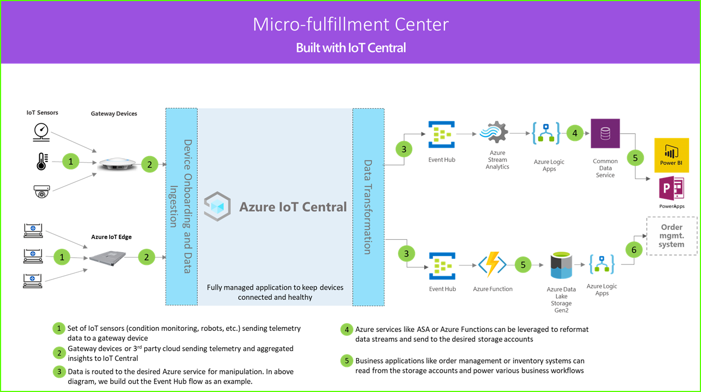

# 教程：部署和演练微履行中心应用程序模板

使用 IoT Central 微履行中心应用程序模板和本文中的指南来开发端到端微履行中心解决方案。

1. 一组将遥测数据发送到网关设备的 IoT 传感器
2. 将遥测和聚合见解发送到 IoT Central 的网关设备
3. 连续数据导出到所需的 Azure 服务以进行操作
4. 可按所需格式对数据进行结构化并将其发送到存储服务
5. 业务应用程序可以查询数据并生成可助力零售运营的见解

### 机器人载体

微履行中心解决方案中可能会有大量产生各种遥测信号的机器人载体。 这些信号可以被网关设备接收、聚合，然后发送到 IoT Central，如体系结构图左侧所示。  

### 环境监视传感器

IoT 解决方案从一组传感器开始，这些传感器从履行中心捕获有意义的信号。 上面的体系结构图最左侧的各种传感器反映了这一点。

### 网关设备

许多 IoT 传感器可将原始信号直接送到云或位于其附近的网关设备。 网关设备先在边缘执行数据聚合，然后将摘要见解发送到 IoT Central 应用程序。 网关设备还负责将命令和控制操作中继到传感器设备（如果适用）。 

### IoT Central 应用程序

Azure IoT Central 应用程序从履行中心环境中的各种 IoT 传感器、机器人以及网关设备引入数据，并生成一组有意义的见解。

Azure IoT Central 还为商店运营商提供定制的体验，使他们能够远程监视和管理基础结构设备。

### 数据转换

解决方案中的 Azure IoT Central 应用程序可配置为将原始或聚合见解导出到一组 Azure PaaS（平台即服务）服务，这些服务可执行数据操作并丰富这些见解，然后将其引入业务应用程序。 

### 业务应用程序

IoT 数据可用于为零售环境中部署的各种业务应用程序提供支持。 履行中心经理或员工可以使用这些应用程序将业务见解可视化，并实时采取有意义的行动。 若要了解如何为零售团队构建实时 Power BI 仪表板，请按照[教程](./tutorial-in-store-analytics-create-app.md)操作。

在本教程中，学习以下内容：

> [!div class="checklist"]

> * 如何部署应用程序模板
> * 如何使用应用程序模板

## 先决条件

* 无需满足特定的先决条件，就可以部署此应用。
* 你可以使用免费定价计划或使用 Azure 订阅。

## 创建微型配送应用程序

使用以下步骤创建应用程序：

1. 导航到 [Azure IoT Central 生成](https://aka.ms/iotcentral)站点。 然后使用 Microsoft 个人、工作或学校帐户登录。 从左侧导航栏中选择“生成”，然后选择“零售”选项卡 ：

   :::image type="content" source="media/tutorial-micro-fulfillment-center-app/iotc-retail-homepage-mfc.png" alt-text="显示如何创建应用的屏幕截图。":::

1. 选择“微履行中心”下的“创建应用” 。

## 演练应用程序 

以下各部分将介绍应用程序的主要功能：

成功部署应用模板后，会看到 **Northwind Traders 微型配送中心仪表板**。 Northwind Traders 是一家虚构的零售商，它在此 Azure IoT Central 应用程序中管理微型配送中心。 在仪表板上，可以看到此模板中与设备有关的信息和遥测数据，以及可执行的一组命令、作业和操作。 仪表板以逻辑方式划分为两个部分。 在左侧可以监视配送结构中的环境条件，在右侧可以监视车间中机器人载体的运行状况。  

在仪表板中可以：
   * 查看设备遥测数据，例如取件数量、处理的订单数量，以及结构系统状态等属性。  
   * 查看楼面布置图，以及机器人载体在配送结构中的位置。
   * 触发命令，例如重置控制系统、更新载体的固件，以及重新配置网络。

  :::image type="content" source="media/tutorial-micro-fulfillment-center-app/mfc-dashboard-1.png" alt-text="Northwind Traders 微履行中心仪表板上半部分的屏幕截图。":::
   * 参阅可供操作员用来监视配送中心内的条件的仪表板示例。
   * 监视配送中心内网关设备上运行的有效负载的运行状况。

  :::image type="content" source="media/tutorial-micro-fulfillment-center-app/mfc-dashboard-2.png" alt-text="Northwind Traders 微履行中心仪表板下半部分的屏幕截图。":::

### 设备模板

如果选择“设备模板”选项卡，将会看到模板中包含两种不同的设备类型： 
   * **机器人载体**：此设备模板表示已部署在配送结构中的，且正在执行相应的贮存和检索操作的正常运行的机器人载体的定义。 如果选择该模板，会看到机器人正在发送设备数据，例如温度、轴位置，以及机器人载体状态等属性。 
   * **结构条件监视**：此设备模板表示一个设备集合，可用于监视环境条件，以及承载各种边缘工作负荷，以便为配送中心提供动力的网关设备。 设备发送温度、取件数量、订单数量等遥测数据。 它还会发送有关环境中运行的计算工作负荷的状态和运行状况的信息。 

  :::image type="content" source="media/tutorial-micro-fulfillment-center-app/device-templates.png" alt-text="微履行中心设备模板。":::

如果选择“设备组”选项卡，则还会看到这些设备模板会自动为其创建设备组。

### 规则

在“规则”选项卡上，可以看到应用程序模板中存在的一个示例规则，该规则用于监视机器人载体的温度条件。  如果车间中的特定机器人温度过高，因而需要将其下线以进行检修，则可以使用此规则来提醒操作员。 

请参考示例规则来定义更适合你的业务职能的规则。

  :::image type="content" source="media/tutorial-micro-fulfillment-center-app/rules.png" alt-text="“规则”选项卡的屏幕截图。":::

### 清理资源

如果你不打算继续使用此应用程序，请删除应用程序模板。 转到“管理” > “应用程序设置”，然后选择“删除”。   

  :::image type="content" source="media/tutorial-micro-fulfillment-center-app/delete.png" alt-text="微履行中心“应用程序设置”页的屏幕截图。":::

## 后续步骤

了解有关以下方面的详细信息：

> [!div class="nextstepaction"]
> [微履行中心解决方案体系结构](./architecture-micro-fulfillment-center.md)
