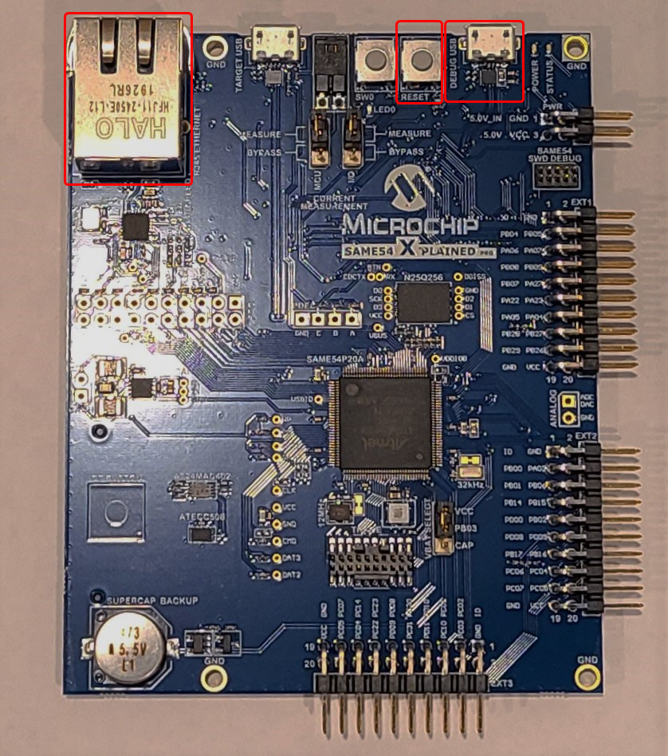

# <a name="quickstart-connect-a-microchip-atsame54-xpro-evaluation-kit-to-iot-central"></a>快速入门：将微芯片 ATSAME54-XPro 评估工具包连接到 IoT Central

**适用于**：[嵌入式设备开发](about-iot-develop.md#embedded-device-development)<br>
**总完成时间**：45 分钟

[](https://github.com/azure-rtos/getting-started/tree/master/Microchip/ATSAME54-XPRO)

在本快速入门中，使用 Azure RTOS 将微芯片 ATSAME54-XPro（后称微芯片 E54）连接到 Azure IoT。

你将完成以下任务：

* 安装一组嵌入式开发工具，用于以 C 语言编写微芯片 E54 的程序
* 生成一个映像并将其刷入到微芯片 E54 中
* 使用 Azure IoT Central 创建云组件、查看属性、查看设备遥测和调用直接命令

## <a name="prerequisites"></a>先决条件

* 一台运行 Microsoft Windows 10 的 PC
* 用于克隆存储库的 [Git](https://git-scm.com/downloads)
* 硬件

    * [微芯片 ATSAME54-XPro](https://www.microchip.com/developmenttools/productdetails/atsame54-xpro)（微芯片 E54）
    * USB 2.0 A 公头转 Micro USB 公头电缆
    * 可访问有线以太网
    * 以太网电缆
    * 可选：[Weather Click](https://www.mikroe.com/weather-click) 传感器。 可以将此传感器添加到设备中以监视天气情况。 如果没有该传感器，仍可完成本快速入门。
    * 可选：[mikroBUS Xplained Pro](https://www.microchip.com/Developmenttools/ProductDetails/ATMBUSADAPTER-XPRO) 适配器。 使用此适配器将 Weather Click 传感器连接到微芯片 E54。 如果没有此传感器和此适配器，仍可完成本快速入门。

:::zone pivot="iot-toolset-iar-ewarm"

* IAR 的 EWARM。 可下载 [IAR 的 EWARM 的 30 天免费试用版](https://www.iar.com/products/architectures/arm/iar-embedded-workbench-for-arm/)。

:::zone-end
:::zone pivot="iot-toolset-mplab"

* [MPLAB X IDE 5.35](https://www.microchip.com/mplab/mplab-x-ide)
* [MPLAB XC32/32++ 编译器 2.4.0 或更高版本](https://www.microchip.com/mplab/compilers)

:::zone-end

## <a name="prepare-the-development-environment"></a>准备开发环境

若要设置开发环境，请先克隆一个 GitHub 存储库，其中包含本快速入门所需的所有资产。 然后安装一组编程工具。

### <a name="clone-the-repo-for-the-quickstart"></a>克隆本快速入门所需的存储库

克隆以下存储库以下载所有示例设备代码、安装脚本和文档的脱机版本。 如果以前在另一篇快速入门中克隆过此存储库，则无需再次执行此操作。

要克隆存储库，请运行以下命令：

```shell
git clone --recursive https://github.com/azure-rtos/getting-started.git
```

### <a name="install-the-tools"></a>安装工具

:::zone pivot="iot-toolset-cmake"

克隆的存储库包含用于安装和配置所需工具的安装脚本。 如果在另一篇嵌入式设备快速入门中安装了这些工具，则无需再次执行此操作。

> [!NOTE]
> 安装脚本将安装以下工具：
>
> * [CMake](https://cmake.org)：生成
> * [ARM GCC](https://developer.arm.com/tools-and-software/open-source-software/developer-tools/gnu-toolchain/gnu-rm)：编译
> * [Termite](https://www.compuphase.com/software_termite.htm)：监视已连接设备的串行端口输出

若要安装工具：

1. 在文件资源管理器中，导航到存储库中的以下路径，并运行名为 ***get-toolchain.bat*** 的安装脚本：

    *getting-started\tools\get-toolchain.bat*

1. 安装后，打开一个新的控制台窗口来识别安装脚本所做的配置更改。 使用此控制台完成本快速入门中的其余编程任务。 可以使用 Windows CMD、PowerShell 或 Git Bash for Windows。
1. 运行以下代码，确认已安装 CMake 版本3.14 或更高版本。

    ```shell
    cmake --version
    ```

1. 安装[适用于 AVR&reg; 和 SAM 设备的微芯片工作室](https://www.microchip.com/en-us/development-tools-tools-and-software/microchip-studio-for-avr-and-sam-devices#)。 微芯片工作室是一个设备开发环境，其中包含用于编程和刷写微芯片 E54 的工具。 在本教程中，只使用微芯片工作室来刷写微芯片 E54。 安装需要几分钟时间才能完成，并会多次提示你批准安装组件。

:::zone-end
:::zone pivot="iot-toolset-iar-ewarm, iot-toolset-mplab"

使用工具集的制造商提供的安装说明来安装和准备开发工具集。

:::zone-end

[!INCLUDE [iot-develop-embedded-create-central-app-with-device](../../includes/iot-develop-embedded-create-central-app-with-device.md)]

## <a name="prepare-the-device"></a>准备设备

若要将微芯片 E54 连接到 Azure，需要修改 Azure IoT 设置的配置文件，重新生成映像，并将映像刷写到设备。

### <a name="add-configuration"></a>添加配置

:::zone pivot="iot-toolset-cmake"

1. 在文本编辑器中打开以下文件：

    *getting-started\Microchip\ATSAME54-XPRO\app\azure_config.h*

1. 将 Azure IoT 设备信息常量设置为在创建 Azure 资源后保存的值。

    |常量名称|值|
    |-------------|-----|
    | `IOT_DPS_ID_SCOPE` | {*ID 范围值*} |
    | `IOT_DPS_REGISTRATION_ID` | {*设备 ID 值*} |
    | `IOT_DEVICE_SAS_KEY` | {*主密钥值*} |

1. 保存并关闭该文件。

:::zone-end
:::zone pivot="iot-toolset-iar-ewarm"

1. 在 IAR 中从提取的 zip 文件中打开 azure_rtos.eww EWARM 工作区。

1. 将 Azure IoT 设备信息常量设置为在创建 Azure 资源后保存的值。

    |常量名称|值|
    |-------------|-----|
    | `IOT_DPS_ID_SCOPE` | {*ID 范围值*} |
    | `IOT_DPS_REGISTRATION_ID` | {*设备 ID 值*} |
    | `IOT_DEVICE_SAS_KEY` | {*主密钥值*} |

1. 保存并关闭该文件。

:::zone-end
:::zone pivot="iot-toolset-mplab"

1. 打开 MPLab 并选择“文件”>“打开项目”，然后从提取的 zip 文件中选择所有项目。

1. 将 Azure IoT 设备信息常量设置为在创建 Azure 资源后保存的值。

    |常量名称|值|
    |-------------|-----|
    | `IOT_DPS_ID_SCOPE` | {*ID 范围值*} |
    | `IOT_DPS_REGISTRATION_ID` | {*设备 ID 值*} |
    | `IOT_DEVICE_SAS_KEY` | {*主密钥值*} |

1. 保存并关闭该文件。

:::zone-end

### <a name="connect-the-device"></a>连接设备

1. 在微芯片 E54 上，找到“重置”按钮、“以太网”端口和标记为“调试 USB”的 Micro USB 端口。 下图突出显示了每个组件：

    

1. 将 Micro USB 电缆连接到微芯片 E54 上的“调试 USB”端口，然后连接到计算机。

    > [!NOTE]
    > 有关微芯片 E54 设置和入门指南的详细信息，也可参阅《[SAM E54 Xplained Pro 用户指南](http://ww1.microchip.com/downloads/en/DeviceDoc/70005321A.pdf)》。

1. 使用以太网电缆将微芯片 E54 连接到以太网端口。

### <a name="optional-install-a-weather-sensor"></a>可选：安装气象传感器

如果有 Weather Click 传感器和 mikroBUS Xplained Pro 适配器，请按照本部分中的步骤进行操作；否则，请跳到[生成映像](#build-the-image)。 即使没有传感器，也可完成本快速入门。 如果没有真实传感器，设备的示例代码会返回模拟数据。

1. 如果有 Weather Click 传感器和 mikroBUS Xplained Pro 适配器，请将其安装在微芯片 E54 上，如下图中所示：

    :::image type="content" source="media/quickstart-devkit-microchip-atsame54-xpro/sam-e54-sensor.png" alt-text="在 Microchip ES4 上安装 Weather Click 传感器和 mikroBUS Xplained Pro 适配器":::

1. 重新打开之前编辑的配置文件：

    *getting-started\Microchip\ATSAME54-XPRO\app\azure_config.h*

1. 将常数 `__SENSOR_BME280__` 的值设置为 1，如头文件中的以下代码所示。 通过设置此值，设备可以使用 Weather Click 传感器中的实际传感器数据。

    `#define __SENSOR_BME280__ 1`

1. 保存并关闭该文件。

### <a name="build-the-image"></a>生成映像

:::zone pivot="iot-toolset-cmake"

1. 在控制台或文件资源管理器中，在以下路径中运行脚本 ***rebuild.bat*** 以生成映像：

    *getting-started\Microchip\ATSAME54-XPRO\tools\rebuild.bat*

1. 生成完成后，请确认已在以下路径中创建了二进制文件：

    *getting-started\Microchip\ATSAME54-XPRO\build\app\atsame54_azure_iot.bin*

:::zone-end
:::zone pivot="iot-toolset-iar-ewarm"

在 IAR 中，选择“项目”>“批量生成”，选择“build_all”，然后选择“生成”以生成所有项目。 你将看到所有示例项目的编译和链接。

:::zone-end
:::zone pivot="iot-toolset-mplab"

确保所有示例项目的依赖库（azure_iot、threadx、netxduo、same54_lib）都是通过以下方法生成的：在“项目”窗格中选择相应项目，右键单击项目并选择“生成”。

:::zone-end

### <a name="flash-the-image"></a>刷写映像

:::zone pivot="iot-toolset-cmake"

1. 打开 Windows“开始”>“微芯片工作室命令提示符”控制台，转到生成的微芯片 E54 二进制文件的文件夹。

    *getting-started\Microchip\ATSAME54-XPRO\build\app*

1. 通过“atprogram”实用程序，使用二进制映像刷写微芯片 E54：

    ```shell
    atprogram --tool edbg --interface SWD --device ATSAME54P20A program --chiperase --file atsame54_azure_iot.bin --verify
    ```

    > [!NOTE]
    > 有关将 Atmel-ICE 和 atprogram 工具与微芯片 E54 配合使用的详细信息，请参阅[在批量生产环境中使用 Atmel-ICE 进行 AVR 编程](http://ww1.microchip.com/downloads/en/AppNotes/00002466A.pdf)。

    刷写进程完成后，控制台将确认编程是否已成功：

    ```output
    Firmware check OK
    Programming and verification completed successfully.
    ```

:::zone-end
:::zone pivot="iot-toolset-iar-ewarm"

在 IAR 中，在工具栏中按绿色的“下载和调试”按钮，下载并运行程序。 然后按“执行”。

:::zone-end
:::zone pivot="iot-toolset-mplab"

在 MPLAB 中，选择“调试”>“调试主项目”。

:::zone-end

### <a name="confirm-device-connection-details"></a>确认设备连接详细信息

可以使用 **Termite** 应用来监视通信，并确认设备已正确设置。

1. 启动 **Termite**。

    > [!TIP]
    > 如果刷写后在设备中进行初始化或连接时遇到问题，请参阅[故障排除](troubleshoot-embedded-device-quickstarts.md)获取其他步骤。

1. 选择“设置”。

1. 在“串行端口设置”对话框中，检查以下设置并根据需要进行更新：
    * **波特率**：115,200
    * **端口**：微芯片 E54 连接到的端口。 如果下拉列表中有多个端口选项，则可以找到要使用的正确端口。 打开 Windows **设备管理器**，查看“端口”以确定要使用的端口。
    * **流控制**：DTR/DSR

    :::image type="content" source="media/quickstart-devkit-microchip-atsame54-xpro/termite-settings.png" alt-text="Termite 应用中串行端口设置的屏幕截图":::

1. 选择“确定”。

1. 按设备上的“复位”按钮。 该按钮在设备上进行了标记，位于 Micro USB 连接器附近。

1. 在 **Termite** 应用中，检查以下检查点值，以确认设备已初始化并连接到 Azure IoT。

    ```output
    Starting Azure thread

    Initializing DHCP
        IP address: 192.168.0.21
        Mask: 255.255.255.0
        Gateway: 192.168.0.1
    SUCCESS: DHCP initialized

    Initializing DNS client
        DNS address: 75.75.75.75
    SUCCESS: DNS client initialized

    Initializing SNTP client
        SNTP server 0.pool.ntp.org
        SNTP IP address: 45.55.58.103
        SNTP time update: Jun 5, 2021 20:2:46.32 UTC 
    SUCCESS: SNTP initialized

    Initializing Azure IoT DPS client
        DPS endpoint: global.azure-devices-provisioning.net
        DPS ID scope: ***
        Registration ID: mydevice
    SUCCESS: Azure IoT DPS client initialized

    Initializing Azure IoT Hub client
        Hub hostname: ***.azure-devices.net
        Device id: mydevice
        Model id: dtmi:azurertos:devkit:gsg;1
    Connected to IoT Hub
    SUCCESS: Azure IoT Hub client initialized
    ```

在以下步骤中，保持 Termite 处于打开状态以监视设备输出。

## <a name="verify-the-device-status"></a>查看设备状态

要在 IoT Central 门户中查看设备状态，请执行以下操作：

1. 在应用程序仪表板中，选择侧面导航菜单中的“设备”。
1. 确认“设备状态”已更新为“已预配”。
1. 确认“设备模板”已更新为“入门指南”。

    :::image type="content" source="media/quickstart-devkit-microchip-atsame54-xpro/iot-central-device-view-status.png" alt-text="IoT Central 中设备状态的屏幕截图":::

## <a name="view-telemetry"></a>查看遥测数据

通过 IoT Central，可以查看从设备到云的遥测数据流。

在 IoT Central 门户中查看遥测数据：

1. 在应用程序仪表板中，选择侧面导航菜单中的“设备”。
1. 从设备列表中选择设备。
1. 在“概述”选项卡中，查看设备向云发送消息的实时遥测数据。

    :::image type="content" source="media/quickstart-devkit-microchip-atsame54-xpro/iot-central-device-telemetry.png" alt-text="IoT Central 中设备遥测数据的屏幕截图":::

    > [!NOTE]
    > 还可以使用 Termite 应用从设备监视遥测数据。

## <a name="call-a-direct-method-on-the-device"></a>在设备上调用直接方法

还可以使用 IoT Central 调用在设备上实现的直接方法。 直接方法有一个名称，可以选择包含 JSON 有效负载、可配置的连接和方法超时。 在本节中，将调用一个方法让你可以打开或关闭 LED。

要在 IoT Central 门户中调用方法，请执行以下操作：

1. 从设备页中选择“命令”选项卡。
1. 在“状态”下拉列表中选择“True”，然后选择“运行”  。  LED 指示灯应亮起。

    :::image type="content" source="media/quickstart-devkit-microchip-atsame54-xpro/iot-central-invoke-method.png" alt-text="在 IoT Central 中调用设备上的直接方法的屏幕截图":::

1. 在“状态”下拉列表中选择“False”，然后选择“运行”  。 LED 指示灯应关闭。

## <a name="view-device-information"></a>查看设备信息

可以从 IoT Central 查看设备信息。

从设备页中选择“关于”选项卡。

:::image type="content" source="media/quickstart-devkit-microchip-atsame54-xpro/iot-central-device-about.png" alt-text="IoT Central 中设备信息的屏幕截图":::

## <a name="troubleshoot-and-debug"></a>故障排除和调试

如果在生成设备代码、刷写设备或进行连接时遇到问题，请参阅[故障排除](troubleshoot-embedded-device-quickstarts.md)。

要调试应用程序，请参阅[使用 Visual Studio Code 进行调试](https://github.com/azure-rtos/getting-started/blob/master/docs/debugging.md)。

## <a name="clean-up-resources"></a>清理资源

如果不再需要本快速入门中创建的 Azure 资源，可以从 IoT Central 门户将其删除。

要删除整个 Azure IoT Central 示例应用程序及其所有设备和资源，请执行以下操作：

1. 选择“管理” > “你的应用程序”。 
1. 选择“删除”。 

## <a name="next-steps"></a>后续步骤

在本快速入门中，生成了一个包含 Azure RTOS 示例代码的自定义映像，然后将该映像刷写到了微芯片 E54 设备中。 还使用 IoT Central 门户创建了 Azure 资源，将微芯片 E54 安全地连接到 Azure，查看遥测数据以及发送消息。

接下来请浏览以下文章，以详细了解如何使用 IoT 设备 SDK 将设备连接到 Azure IoT。 

> [!div class="nextstepaction"]
> [将模拟设备连接到 IoT Central](quickstart-send-telemetry-central.md)
> [!div class="nextstepaction"]
> [将模拟设备连接到 IoT 中心](quickstart-send-telemetry-iot-hub.md)

> [!IMPORTANT]
> Azure RTOS 为 OEM 提供了一些组件，通过这些组件可以保护通信以及使用底层 MCU/MPU 硬件保护机制创建代码和数据隔离。 但是，每个 OEM 最终负责确保其设备满足不断变化的安全要求。
