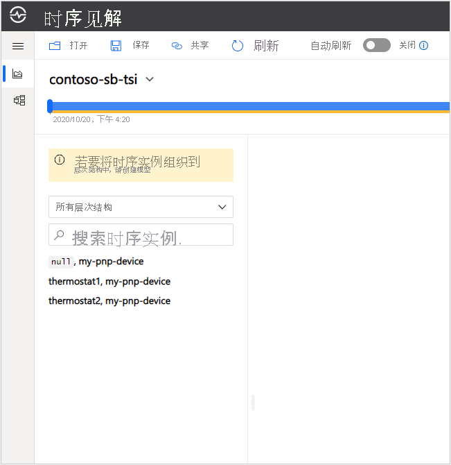
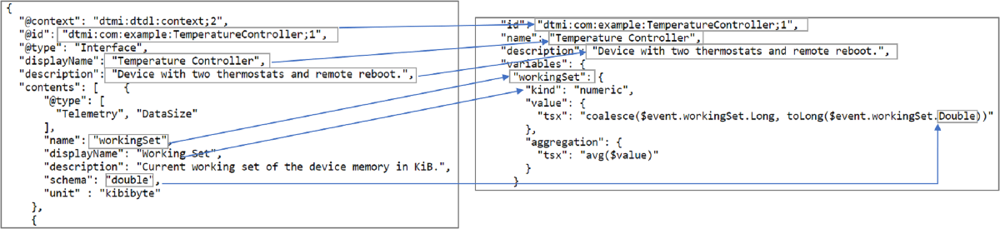
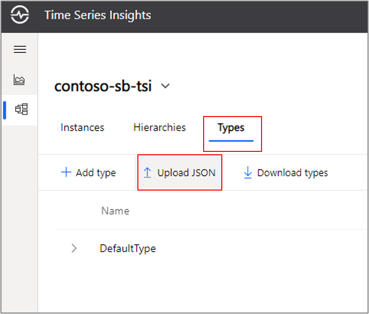
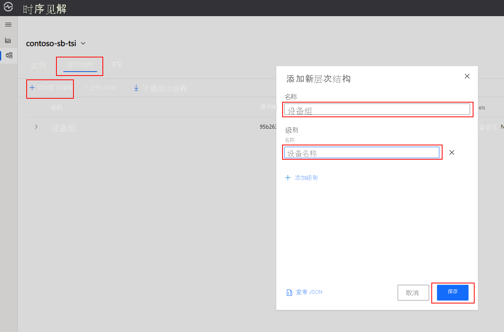
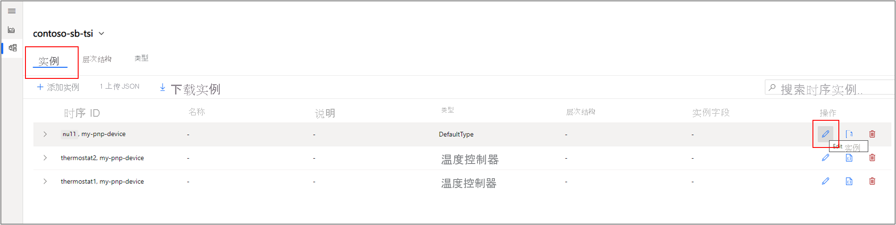
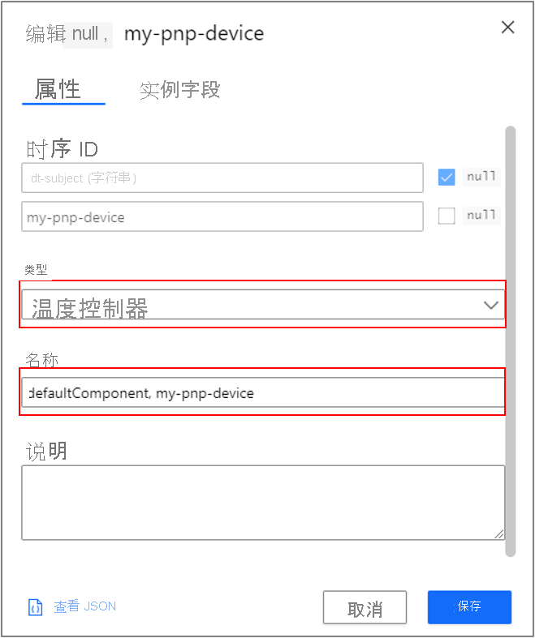
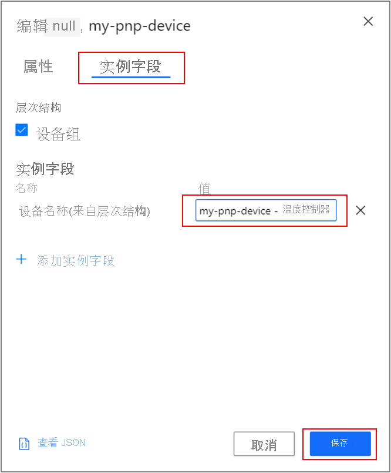

# <a name="tutorial-create-and-configure-a-time-series-insights-gen2-environment"></a>Tutorial:创建和配置时序见解 Gen2 环境

本教程将介绍如何创建和配置 [Azure 时序见解 Gen2](../time-series-insights/overview-what-is-tsi.md) 环境，以便与 IoT 即插即用解决方案集成。 使用时序见解在物联网 (IoT) 规模上收集、处理、存储、查询和可视化时序数据。

在本教程中：

> [!div class="checklist"]
> * 预配时序见解环境并将 IoT 中心作为流式处理事件源进行连接。
> * 通过模型同步来创作[时序模型](../time-series-insights/concepts-model-overview.md)。
> * 使用温度控制器和恒温器设备采用的[数字孪生定义语言 (DTDL)](https://github.com/Azure/opendigitaltwins-dtdl) 示例模型文件。

> [!NOTE]
> 时序见解和 IoT 即插即用之间的这种集成处于预览状态。 DTDL 设备模型映射到时序见解时序模型的方式可能会改变。

## <a name="prerequisites"></a>先决条件

[!INCLUDE [iot-pnp-prerequisites](../../includes/iot-pnp-prerequisites.md)]

此时，你应具备：

* Azure IoT 中心。
* 连接到 IoT 中心的设备预配服务 (DPS) 实例。 DPS 实例应为 IoT 即插即用设备注册一个单独的设备。
* 单组件设备或多组件设备与 IoT 中心之间的连接，用于流式传输模拟数据。

## <a name="prepare-your-event-source"></a>准备事件源

以前创建的 IoT 中心将是时序见解环境的[事件源](../time-series-insights/concepts-streaming-ingestion-event-sources.md)。

> [!IMPORTANT]
> 禁用任何现有的 IoT 中心路由。 使用配置了[路由](../iot-hub/iot-hub-devguide-messages-d2c.md#routing-endpoints)的 IoT 中心时存在一个已知问题。 暂时禁用任何路由终结点。 IoT 中心连接到时序见解时，你可再次启用路由终结点。

在 IoT 中心上，创建唯一的使用者组，供时序见解使用。 在下面的示例中，将 `my-pnp-hub` 替换为之前使用的 IoT 中心的名称。

```azurecli-interactive
az iot hub consumer-group create --hub-name my-pnp-hub --name tsi-consumer-group
```

## <a name="choose-a-time-series-id"></a>选择时间序列 ID

预配时序见解环境时，需要选择时序 ID。 选择相应的时序 ID 很重要。 此属性是不可变的，设置后不能更改。 时序 ID 类似于数据库分区键。 时序 ID 充当时序模型的主键。 有关详细信息，请参阅[选择时序 ID 的最佳做法](../time-series-insights/how-to-select-tsid.md)。

作为 IoT 即插即用用户，请将 `iothub-connection-device-id` 和 `dt-subject` 构成的组合键指定为时序 ID。 IoT 中心会添加这些分别包含了 IoT 即插即用设备 ID 和设备组件名称的系统属性。

即使 IoT 即插即用设备模型目前不使用组件，也应将 `dt-subject` 包含在内并作为组合键的一部分，以便将来需要时可以使用它们。 由于时序 ID 不可变，Microsoft 建议启用这个选项，以便将来需要时使用。

> [!NOTE]
> 本文中的示例适用于多组件 `TemperatureController` 设备。 但是对于非组件 `Thermostat` 设备，这些概念是相同的。

## <a name="provision-your-time-series-insights-environment"></a>预配时序见解环境

本节介绍如何预配 Azure 时序见解 Gen2 环境。

运行下面的命令以实现以下目的：

* 为环境的[冷存储](../time-series-insights/concepts-storage.md#cold-store)创建 Azure 存储帐户。 此帐户旨在用于长期保留和历史数据分析。
  * 在代码中，将 `mytsicoldstore` 替换为冷存储帐户的唯一名称。
* 创建 Azure 时序见解 Gen2 环境。 需使用保持期为 7 天的暖存储创建此环境。 需附加冷存储帐户，以便无限期保留。
  * 在代码中，将 `my-tsi-env` 替换为时序见解环境的唯一名称。
  * 在代码中，将 `my-pnp-resourcegroup` 替换为在设置过程中使用的资源组的名称。
  * 时序 ID 属性是 `iothub-connection-device-id, dt-subject`。

```azurecli-interactive
storage=mytsicoldstore
rg=my-pnp-resourcegroup
az storage account create -g $rg -n $storage --https-only
key=$(az storage account keys list -g $rg -n $storage --query [0].value --output tsv)
az tsi environment gen2 create --name "my-tsi-env" --location eastus2 --resource-group $rg --sku name="L1" capacity=1 --time-series-id-properties name=iothub-connection-device-id type=String --time-series-id-properties name=dt-subject type=String --warm-store-configuration data-retention=P7D --storage-configuration account-name=$storage management-key=$key
```

连接 IoT 中心事件源。 将 `my-pnp-resourcegroup``my-pnp-hub` 和 `my-tsi-env` 替换为所选的值。 下面的命令引用你先前创建的时序见解使用者组：

```azurecli-interactive
rg=my-pnp-resourcegroup
iothub=my-pnp-hub
env=my-tsi-env
es_resource_id=$(az iot hub create -g $rg -n $iothub --query id --output tsv)
shared_access_key=$(az iot hub policy list -g $rg --hub-name $iothub --query "[?keyName=='service'].primaryKey" --output tsv)
az tsi event-source iothub create --event-source-name iot-hub-event-source --environment-name $env --resource-group $rg --location eastus2 --consumer-group-name tsi-consumer-group --key-name iothubowner --shared-access-key $shared_access_key --event-source-resource-id $es_resource_id --iot-hub-name $iothub
```

在 [Azure 门户](https://portal.azure.com)中，转到资源组，然后选择新的时序见解环境。 转到实例概述中显示的“时序见解资源管理器 URL”：


在资源管理器中，可看到三个实例：

* &lt;pnp 设备 ID&gt;，thermostat1
* &lt;pnp 设备 ID&gt;，thermostat2
* &lt;pnp 设备 ID&gt;，`null`

> [!NOTE]
> 第三个标记表示来自 `TemperatureController` 本身的遥测，例如设备内存的工作集。 因为这是一个顶级属性，所以组件名称的值为 null。 在后面的步骤中，你将使此名称更易于用户使用。



## <a name="configure-model-translation"></a>配置模型转换

接下来将 DTDL 设备模型转换为 Azure 时序见解中的资产模型。 在时序见解中，时序模型是一种用于数据语境化的语义建模工具。 该模型包含三个核心组件：

* [时序模型实例](../time-series-insights/concepts-model-overview.md#time-series-model-instances)是时序本身的虚拟表示形式。 实例由时序 ID 唯一标识。
* [时序模型层次结构](../time-series-insights/concepts-model-overview.md#time-series-model-hierarchies)通过指定属性名称及其关系来组织实例。
* [时序模型类型](../time-series-insights/concepts-model-overview.md#time-series-model-types)可帮助你定义用于计算的[变量](../time-series-insights/concepts-variables.md)或公式。 类型与某个特定实例关联。

### <a name="define-your-types"></a>定义类型

可以开始将数据引入到 Azure 时序见解第 2 代，无需预定义模型。 当遥测到达时，时序见解尝试基于时序 ID 属性值自动解析时序实例。 为所有实例分配默认类型。 你需要手动创建一个新类型来正确地对实例进行分类。

以下详细信息概述了将设备 DTDL 模型与时序模型类型同步的最简单方法：

* 数字孪生模型标识符将成为你的类型 ID。
* 类型名称可以是模型的名称，也可以是显示名称。
* 模型说明将成为类型的说明。
* 至少为每个具有数值架构的遥测创建一个类型变量。
  * 变量只能使用 numeric 数据类型，但如果将值作为另一种可转换的类型发送（例如 `"0"`），可使用[转换](/rest/api/time-series-insights/reference-time-series-expression-syntax#conversion-functions)函数，例如 `toDouble`。
* 变量名称可以是遥测名称，也可以是显示名称。
* 定义时序表达式变量时，请参阅线上的遥测名称及遥测数据类型。

| DTDL JSON | 时序模型类型 JSON | 示例值 |
|-----------|------------------|-------------|
| `@id` | `id` | `dtmi:com:example:TemperatureController;1` |
| `displayName`    | `name`   |   `Temperature Controller`  |
| `description`  |  `description`  |  `Device with two thermostats and remote reboot.` |
|`contents`（数组）| `variables`（对象）  | 请参阅以下示例。



> [!NOTE]
> 此示例显示三种变量，但每种类型最多可包含 100 个变量。 不同的变量可以引用相同的遥测值，以根据需要执行不同的计算。 有关筛选器、聚合和标量函数的完整列表，请参阅[时序见解 Gen2 时序表达式语法](/rest/api/time-series-insights/reference-time-series-expression-syntax)。

打开文本编辑器并将以下 JSON 保存到本地驱动器。

```JSON
{
  "put": [
    {
      "id": "dtmi:com:example:TemperatureController;1",
      "name": "Temperature Controller",
      "description": "Device with two thermostats and remote reboot.",
      "variables": {
        "workingSet": {
          "kind": "numeric",
          "value": {
            "tsx": "coalesce($event.workingSet.Long, toLong($event.workingSet.Double))"
          },
          "aggregation": {
            "tsx": "avg($value)"
          }
        },
        "temperature": {
          "kind": "numeric",
          "value": {
            "tsx": "coalesce($event.temperature.Long, toLong($event.temperature.Double))"
          },
          "aggregation": {
            "tsx": "avg($value)"
          }
        },
        "eventCount": {
          "kind": "aggregate",
          "aggregation": {
            "tsx": "count()"
          }
        }
      }
    }
  ]
}
```

在时序见解资源管理器中，选择左侧的模型图标以打开“模型”选项卡。选择“类型”，然后选择“上传 JSON” ：



选择“选择文件”，选择之前保存的 JSON，然后选择“上传” 。

你将看到新定义的温度控制器类型。

### <a name="create-a-hierarchy"></a>创建层次结构

创建一个层次结构来组织 `TemperatureController` 父项下的标记。 以下简单示例只有一个级别，但 IoT 解决方案通常具有多个嵌套级别，作用是让标记在组织中所处的物理和语义位置上得到语境化的体现。

选择“层次结构”，然后选择“添加层次结构” 。 对于名称，请输入“设备组”。 创建一个名为“设备名称”的级别。 再选择“保存”。



### <a name="assign-your-instances-to-the-correct-type"></a>为实例分配正确的类型

接下来将更改实例的类型，并将其置于层次结构中。

选择“实例”选项卡。找到表示设备工作集的实例，然后选择最右侧的“编辑”图标。



打开“类型”下拉菜单，然后选择“温度控制器” 。 输入 defaultComponent \<your device name\>，更新表示与设备关联的所有顶级标记的实例名称。



在选择“保存”之前，首先选择“实例字段”选项卡，然后选择“设备组”  。 若要将遥测组合在一起，请输入 \<your device name\> - 温度控制器。 再选择“保存”。



重复上述步骤，为恒温器标记分配正确的类型和层次结构。

## <a name="view-your-data"></a>查看数据

返回到图表绘制窗格，并展开“设备组”> 你的设备。 选择“thermostat1”，选择“温度”变量，然后选择“添加”，为值绘图  。 对 thermostat2 和 defaultComponent workingSet 值执行相同的操作  。


## <a name="clean-up-resources"></a>清理资源

[!INCLUDE [iot-pnp-clean-resources](../../includes/iot-pnp-clean-resources.md)]

## <a name="next-steps"></a>后续步骤

> [!div class="nextstepaction"]
> 若要详细了解各种图表绘制选项，包括间隔大小调整和 y 轴控件，请参阅 [Azure 时序见解资源管理器](../time-series-insights/concepts-ux-panels.md)。
