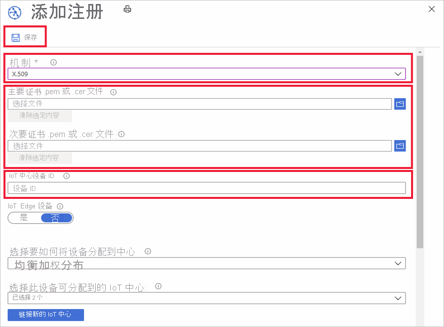

# 如何通过 Azure 门户管理设备注册

“设备注册”将创建单台设备或一组设备在某一时刻向 Azure IoT 中心设备预配服务进行注册的记录  。 注册记录包含注册过程中设备的初始配置。 此配置中包含的是 IoT 中心和分配策略，前者是设备分配到的地方，后者可从一组中心中配置该中心。 本文演示了如何针对预配服务管理设备注册。

## 创建设备注册

可通过两种方法向预配服务注册设备：

* 注册组是共享常见证明机制的一组设备的条目。 建议对共享初始配置的大量设备，或者全部转到同一租户的设备使用注册组。 支持使用[对称密钥](concepts-symmetric-key-attestation.md)或 [X.509 证书](concepts-x509-attestation.md)的设备。 

    有关使用对称密钥创建和使用注册组的分步说明，请参阅[使用对称密钥预配设备](how-to-legacy-device-symm-key.md)教程。

    执行以下步骤在门户中为一组设备创建注册组：

    1. 登录 Azure 门户，单击左侧菜单中的“所有资源”。  
    1. 从资源列表中单击要向其注册设备的设备预配服务。  
    1. 在预配服务中，单击“管理注册”，然后单击顶部的“添加注册组”按钮 。  
     
        
        
    1. 当“添加注册组”面板出现时，输入注册信息，然后单击“保存”。  
     
        
        
        | 字段 | 描述 |
        | :--- | :--- |
        | **组名** | 设备组所需的名称。 |
        | **证明类型** | 单击“证书”或“对称密钥”作为证明类型，具体取决于设备将使用的证明方法 。 |
        | **证书类型** | 如果使用证书证明，则可用。 根据签署设备证书的证书选择“CA 证书”或“中间” 。 |
        | **主要证书** | 如果要使用根 CA 证书对设备证书进行签名，则该根 CA 证书必须完成[所有权证明](how-to-verify-certificates.md)。 然后，可以将其选择为设备组的主要证书。  如果要使用中间证书对设备证书进行签名，则可以使用上传按钮来上传中间证书。 签署中间的证书还必须为其完成[所有权证明](how-to-verify-certificates.md)。 |

        
    

* 单独注册是可分配给 IoT 中心的单个设备的条目。 支持使用[对称密钥](concepts-symmetric-key-attestation.md)、[X.509 证书](concepts-x509-attestation.md)和 [TPM 证明](concepts-tpm-attestation.md)的设备。 

    可通过以下步骤在门户中创建单独注册。

    1. 登录 Azure 门户，单击左侧菜单中的“所有资源”。
    1. 从资源列表中单击要向其注册设备的设备预配服务。
    1. 在预配服务中，单击“管理注册”，然后单击顶部的“添加单独注册”按钮 。   

       

    1. 当“添加注册”面板出现时，输入单个设备注册的信息，然后单击“保存”。 
     
        
    
        | 字段 | 描述 |
        | :--- | :--- |
        | **机制** | 选择“X.509”、“TPM”或“对称密钥”作为要使用的证明机制，具体取决于设备将使用的证明方法  。 |
        | 证明设置 | 有关使用对称密钥或 X.509 证书创建和使用单独注册的分步说明，请参阅[快速入门：预配模拟对称密钥设备](quick-create-simulated-device-symm-key.md#create-a-device-enrollment)或[快速入门：预配 X.509 证书设备](quick-create-simulated-device-x509.md#create-a-device-enrollment)。  有关使用 TPM 证明创建和使用单独注册的分步说明，请参阅[预配模拟的 TPM 设备](quick-create-simulated-device-tpm.md#create-a-device-enrollment-entry)示例。|
        | **IoT 中心设备 ID** |  此 ID 代表你的设备。 它必须遵循设备 ID 的规则。 有关详细信息，请参阅[设备标识属性](../iot-hub/iot-hub-devguide-identity-registry.md#device-identity-properties)。  使用 X.509 证书时，此文本必须是你为注册上传的设备证书上的使用者名称。 使用者名称必须符合设备 ID 规则。|
            

## 更新注册条目
可通过以下步骤在门户中更新现有注册条目。

1. 在 Azure 门户中打开设备预配服务，然后单击“管理注册”。 
1. 导航到要修改的注册条目。 单击该条目会打开设备注册的摘要信息。 
1. 在此页上，可以修改安全类型和凭据以外的项，例如设备应链接到的 IoT 中心和设备 ID。 还可以修改初始的设备孪生状态。 
1. 完成后，单击“保存”更新设备注册。 

    

## 删除设备注册
如果不需要将设备预配到任何 IoT 中心，可以通过以下步骤删除门户中的相关注册条目。

1. 在 Azure 门户中打开设备预配服务，然后单击“管理注册”。 
1. 导航到要删除的注册条目并选中。 
1. 单击顶部的“删除”按钮，然后在出现确认提示时选择“是”。 
1. 完成操作后，会看到条目已从设备注册列表中删除。 
 
    