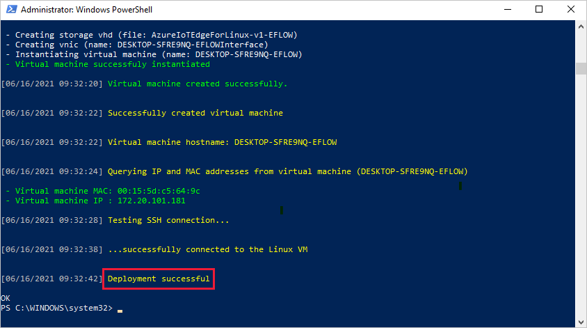
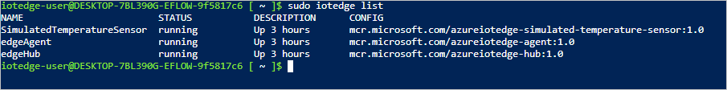

# <a name="quickstart-deploy-your-first-iot-edge-module-to-a-windows-device"></a>快速入门：将第一个 IoT Edge 模块部署到 Windows 设备

[!INCLUDE [iot-edge-version-201806](../../includes/iot-edge-version-201806.md)]

在本快速入门中通过将容器化代码部署到 Linux on Windows IoT Edge 设备来试用 Azure IoT Edge。 IoT Edge 允许你远程管理设备上的代码，这样你就可以将更多工作负荷发送到 Edge。 对于本快速入门，我们建议你使用自己的设备，看看使用 Azure IoT Edge for Linux on Windows 有多么简单。

在本快速入门中，你将学习如何：

* 创建 IoT 中心。
* 将 IoT Edge 设备注册到 IoT 中心。
* 在设备上安装并运行 IoT Edge for Linux on Windows 运行时。
* 以远程方式将模块部署到 IoT Edge 设备并发送遥测数据。


本快速入门将逐步介绍如何设置 Azure IoT Edge for Linux on Windows 设备。 然后，将模块从 Azure 门户部署到设备。 你将使用的模块为模拟传感器，可以生成温度、湿度和压强数据。 其他 Azure IoT Edge 教程均以本教程中通过部署模块（这些模块通过分析模拟数据来获得业务见解）执行的操作为基础。

如果没有可用的 Azure 订阅，可以在开始前创建一个[免费帐户](https://azure.microsoft.com/free)。

## <a name="prerequisites"></a>先决条件

为 Azure CLI 准备环境。

[!INCLUDE [azure-cli-prepare-your-environment-no-header.md](../../includes/azure-cli-prepare-your-environment-no-header.md)]

创建云资源组，用于管理在本快速入门中使用的所有资源。

   ```azurecli-interactive
   az group create --name IoTEdgeResources --location westus2
   ```

请确保 IoT Edge 设备满足以下要求：

* 版本
  * Windows 10 版本 1809 或更高版本；内部版本 17763 或更高版本
    * Professional、Enterprise、IoT Enterprise
  * Windows Server 2019 内部版本 17763 或更高版本

* 硬件要求
  * 最小可用内存：1 GB
  * 最小可用磁盘空间：10 GB

>[!NOTE]
>此快速入门使用 PowerShell 创建 IoT Edge for Linux on Windows 部署。 你也可以使用 Windows Admin Center 创建部署。 如果希望使用 Windows Admin Center 来创建部署，请按照[在 Windows 设备上安装和预配 Azure IoT Edge for Linux](how-to-install-iot-edge-on-windows.md?tabs=windowsadmincenter) 操作指南中的步骤进行操作。

## <a name="create-an-iot-hub"></a>创建 IoT 中心

首先，使用 Azure CLI 创建 IoT 中心。


免费级 Azure IoT 中心适用于此快速入门。 如果曾经用过 IoT 中心并且创建了一个中心，则可使用该 IoT 中心。

以下代码将在资源组 `IoTEdgeResources` 中创建免费的 F1 中心。 将 `{hub_name}` 替换为 IoT 中心的唯一名称。 创建 IoT 中心可能需要数分钟的时间。

```azurecli-interactive
az iot hub create --resource-group IoTEdgeResources --name {hub_name} --sku F1 --partition-count 2
```

如果由于订阅中已经有一个免费的中心而出现错误，请将 SKU 更改为 `S1`。 如果出现一条错误，指示 IoT 中心名称不可用，则表明他人已使用具有该名称的中心。 请尝试一个新名称。

## <a name="register-an-iot-edge-device"></a>注册 IoT Edge 设备

使用新创建的 IoT 中心注册 IoT Edge 设备。


为模拟设备创建设备标识，以便它可以与 IoT 中心通信。 设备标识存在于云中，而将物理设备关联到设备标识时，则使用唯一的设备连接字符串。

IoT Edge 设备的行为和管理方式与典型的 IoT 设备不同。 使用 `--edge-enabled` 标志声明该标识用于 IoT Edge 设备。

1. 在 Azure Cloud Shell 中输入以下命令，以便在中心创建名为“myEdgeDevice”的设备。

     ```azurecli-interactive
     az iot hub device-identity create --device-id myEdgeDevice --edge-enabled --hub-name {hub_name}
     ```

     如果收到有关 `iothubowner` 策略密钥的错误，请确保 Cloud Shell 正在运行最新版 Azure IoT 扩展。

1. 查看设备的连接字符串，该字符串将物理设备与其在 IoT 中心的标识链接在一起。 它包含 IoT 中心名称、设备名称，以及用于对这两者之间的连接进行身份验证的共享密钥。

     ```azurecli-interactive
     az iot hub device-identity connection-string show --device-id myEdgeDevice --hub-name {hub_name}
     ```

1. 复制 JSON 输出中 `connectionString` 键的值并保存。 该值为设备连接字符串。 可使用此值在下一部分中配置 IoT Edge 运行时。

     

## <a name="install-and-start-the-iot-edge-runtime"></a>安装和启动 IoT Edge 运行时

在设备上安装 IoT Edge for Linux on Windows，并使用设备连接字符串对其进行配置。


在想要部署 Azure IoT Edge for Linux on Windows 的目标设备上运行以下 PowerShell 命令。 若要使用 PowerShell 部署到远程目标设备，请使用[远程 PowerShell](/powershell/module/microsoft.powershell.core/about/about_remote) 与远程设备建立连接，并在该设备上远程运行这些命令。

1. 在已提升权限的 PowerShell 会话中，运行以下每个命令来下载 IoT Edge for Linux on Windows。

   ```powershell
   $msiPath = $([io.Path]::Combine($env:TEMP, 'AzureIoTEdge.msi'))
   $ProgressPreference = 'SilentlyContinue'
   Invoke-WebRequest "https://aka.ms/AzEflowMSI" -OutFile $msiPath
   ```

1. 在设备上安装 IoT Edge for Linux on Windows。

   ```powershell
   Start-Process -Wait msiexec -ArgumentList "/i","$([io.Path]::Combine($env:TEMP, 'AzureIoTEdge.msi'))","/qn"
   ```

1. 在目标设备上将执行策略设置为 `AllSigned`（如果尚未设置）。 可以在已提升权限的 PowerShell 提示符中使用以下命令检查当前执行策略：

   ```powershell
   Get-ExecutionPolicy -List
   ```

   如果 `local machine` 的执行策略不是 `AllSigned`，则可以使用以下命令设置执行策略：

   ```powershell
   Set-ExecutionPolicy -ExecutionPolicy AllSigned -Force
   ```

1. 创建 IoT Edge for Linux on Windows 部署。

   ```powershell
   Deploy-Eflow
   ```

1. 输入“Y”接受许可条款。

1. 根据自己的偏好，输入“O”或“R”以打开或关闭“可选诊断数据”。 下面描绘了一个成功的部署。

   

1. 使用上一节中检索的设备连接字符串来预配设备。 将占位符文本替换为你自己的值。

   ```powershell
   Provision-EflowVm -provisioningType ManualConnectionString -devConnString "<CONNECTION_STRING_HERE>"
   ```

IoT Edge 设备现在已配置好。 它可以运行云部署型模块了。

## <a name="deploy-a-module"></a>部署模块

从云端管理 Azure IoT Edge 设备，部署将遥测数据发送到 IoT 中心的模块。


<!--
[!INCLUDE [iot-edge-deploy-module](../../includes/iot-edge-deploy-module.md)]

Include content included below to support versioned steps in Linux quickstart. Can update include file once Windows quickstart supports v1.2
-->

Azure IoT Edge 的主要功能之一是从云中将代码部署到 IoT Edge 设备。 *IoT Edge 模块* 是以容器形式实现的可执行程序包。 在本部分中，你将直接从 Azure IoT 中心的 [Azure 市场的 IoT Edge 模块部分](https://azuremarketplace.microsoft.com/marketplace/apps/category/internet-of-things?page=1&subcategories=iot-edge-modules)部署一个预建的模块。

在本部分中部署的模块模拟一个传感器并发送生成的数据。 开始使用 IoT Edge 时，此模块是非常有用的代码段，因为你可以使用模拟的数据进行开发和测试。 如果要确切了解此模块的功能，则可以查看[模拟的温度传感器源代码](https://github.com/Azure/iotedge/blob/027a509549a248647ed41ca7fe1dc508771c8123/edge-modules/SimulatedTemperatureSensor/src/Program.cs)。

请按照以下步骤从 Azure 市场部署你的第一个模块。

1. 登录 [Azure 门户](https://portal.azure.com)并转到 IoT 中心。

1. 从左侧菜单中的“自动设备管理”下，选择“IoT Edge” 。

1. 选择设备列表中目标设备的设备 ID。

   创建新的 IoT Edge 设备时，它将在 Azure 门户中显示状态代码 `417 -- The device's deployment configuration is not set`。 此状态正常，表示设备已准备好接收模块部署。


1. 在上方栏中，选择“设置模块”。

   

1. 在“IoT Edge 模块”下，打开“添加”下拉菜单，然后选择“市场模块”  。

   

1. 在 IoT Edge 模块市场中，搜索并选择 `Simulated Temperature Sensor` 模块。

   该模块会添加到“IoT Edge 模块”部分，并处于所需的运行状态。

1. 在完成时选择“下一步:”路由以继续执行向导的下一步。

   

1. 在“路由”选项卡上，删除默认路由（路由），然后选择“下一步:   查看 + 创建”继续执行向导的下一步。

   >[!Note]
   >路由使用名称和值对构造而成。 应在此页上看到两条路由。 默认路由（路由）会将所有消息发送到 IoT 中心（称为 `$upstream`）。 从 Azure 市场添加模块时，将自动创建第二条路由 (SimulatedTemperatureSensorToIoTHub)。 此路由用于将所有来自模拟温度模块中的消息发送到 IoT 中心。 可以删除默认路由，因为在这种情况下它是多余的。

   

1. 查看 JSON 文件，然后选择“创建”。 JSON 文件定义你部署到 IoT Edge 设备的所有模块。 你将看到“SimulatedTemperatureSensor”模块以及“edgeAgent”和“edgeHub”这两个运行时模块  。

   >[!Note]
   >在将新部署提交到 IoT Edge 设备时，不会向设备推送任何内容。 相反，设备会定期对 IoT 中心进行查询以获取任何新指令。 如果设备找到了更新的部署清单，则它会使用关于新部署的信息来从云中拉取模块映像，然后开始在本地运行模块。 此过程可能需要几分钟。

1. 创建模块部署详细信息后，向导会将你返回到设备详细信息页。 在“模块”选项卡上查看部署状态。

   应会看到三个模块：$edgeAgent、$edgeHub 和 SimulatedTemperatureSensor  。 如果其中一个或多个模块在“在部署中指定”下为“是”，但在“由设备报告”下不是，则意味着 IoT Edge 设备仍在启动它们  。 等待几分钟，然后刷新页面。

   

## <a name="view-the-generated-data"></a>查看生成的数据

此快速入门中，创建了新的 IoT Edge 设备，并在该设备上安装了 IoT Edge 运行时。 然后，你使用了 Azure 门户部署 IoT Edge 模块，使其在不更改设备本身的情况下在设备上运行。

推送的模块会生成示例环境数据，你可以在稍后使用该数据进行测试。 模拟传感器正在监视一台计算机和该计算机周围的环境。 例如，该传感器可能位于服务器机房中、工厂地板上或风力涡轮机上。 它将发送包含环境温度和湿度、机器温度和压力以及时间戳的消息。 IoT Edge 教程使用此模块创建的数据作为测试数据进行分析。

1. 在 PowerShell 会话中使用以下命令，登录到 Windows 虚拟机上的 IoT Edge for Linux：

   ```powershell
   Connect-EflowVm
   ```

   >[!NOTE]
   >唯一被允许通过 SSH 登录到虚拟机的帐户是创建该虚拟机的用户。

1. 登录后，可以使用以下 Linux 命令查看正在运行的 IoT Edge 模块的列表：

   ```bash
   sudo iotedge list
   ```

   

1. 请使用以下 Linux 命令查看从温度传感器模块发送到云的消息：

   ```bash
   sudo iotedge logs SimulatedTemperatureSensor -f
   ```

   >[!IMPORTANT]
   >引用模块名称时，IoT Edge 命令区分大小写。

   

你也可使用 [Visual Studio Code 的 Azure IoT 中心扩展](https://marketplace.visualstudio.com/items?itemName=vsciot-vscode.azure-iot-toolkit)查看到达 IoT 中心的消息。

## <a name="clean-up-resources"></a>清理资源

若要继续学习 IoT Edge 教程，请跳过此步骤。 可以使用在本快速入门中注册和设置的设备。 否则，可删除已创建的 Azure 资源，避免产生费用。

如果是在新资源组中创建的虚拟机和 IoT 中心，则可删除该组以及所有关联的资源。 如果不希望删除整个组，则可改为删除单个资源。

> [!IMPORTANT]
> 检查资源组的内容，确保没有要保留的内容。 删除资源组的操作不可逆。

使用以下命令删除 IoTEdgeResources 组。 删除操作可能需要几分钟时间。

```azurecli-interactive
az group delete --name IoTEdgeResources
```

可以通过使用此命令查看资源组列表来确认已删除该资源组。

```azurecli-interactive
az group list
```

### <a name="remove-azure-iot-edge-for-linux-on-windows"></a>删除 Azure IoT Edge for Linux on Windows

可以使用 Windows Admin Center 中的仪表板扩展卸载 Azure IoT Edge for Linux on Windows。

1. 在 Windows Admin Center 中连接到 IoT Edge 设备。 此时将加载 Azure 仪表板工具扩展。

1. 选择“卸载”。 删除 Azure IoT Edge 后，Windows Admin Center 将从“开始”页中删除 Azure IoT Edge 设备连接项。

>[!Note]
>从 Windows 系统中删除 Azure IoT Edge 的另一种方法是：在 IoT Edge 设备上，选择“开始” > “设置” > “应用” > “Azure IoT Edge LTS” > “卸载”。 此方法将从 IoT Edge 设备中删除 Azure IoT Edge，但会保留 Windows Admin Center 中的连接。 要完成删除操作，也可从“设置”菜单卸载 Windows Admin Center。

## <a name="next-steps"></a>后续步骤

在本快速入门中，你创建了一个 IoT Edge 设备并使用 Azure IoT Edge 云接口将代码部署到该设备上。 现在，你有了一个测试设备，可以生成与环境相关的原始数据。

下一教程将介绍如何从 Azure 门户监视设备的活动和运行状况。

> [!div class="nextstepaction"]
> [监视 IoT Edge 设备](tutorial-monitor-with-workbooks.md)
