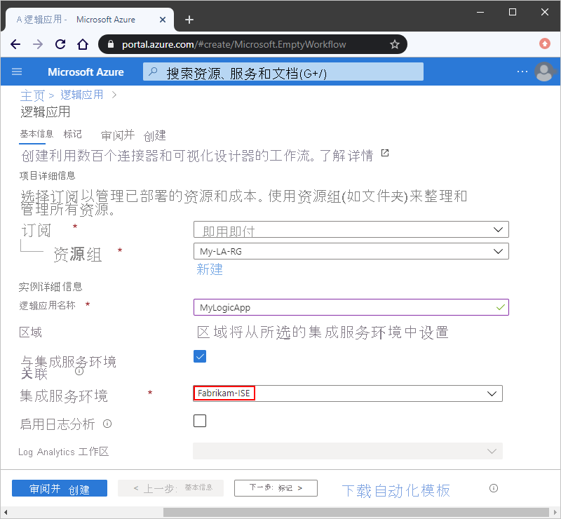

# 使用集成服务环境 (ISE) 从 Azure 逻辑应用访问 Azure 虚拟网络

有时，逻辑应用工作流需要访问受保护的资源（例如，虚拟机 (VM) 和其他系统或服务），这些资源可能位于 Azure 虚拟网络中，也可能连接到该虚拟网络。 若要从通常在多租户 Azure 逻辑应用中运行的工作流直接访问这些资源，可以改为在集成服务环境 (ISE) 中创建和运行逻辑应用。 ISE 实际上是一个 Azure 逻辑应用实例，在全局多租户 Azure 环境以外的专用资源上单独运行。

例如，某些 Azure 虚拟网络使用专用终结点（[Azure 专用链接](../private-link/private-link-overview.md)）来提供对 Azure PaaS 服务（例如 Azure 存储、Azure Cosmos DB 或 Azure SQL 数据库）、合作伙伴服务或 Azure 上托管的客户服务的访问。 如果逻辑应用工作流需要访问使用专用终结点的虚拟网络，则可以使用以下选项：

* 如果要使用“逻辑应用（消耗版）”资源类型来开发工作流，并且工作流需要使用专用终结点，则必须在 ISE 中创建、部署和运行逻辑应用。 有关详细信息，请参阅[使用集成服务环境 (ISE) 从 Azure 逻辑应用连接到 Azure 虚拟网络](../logic-apps/connect-virtual-network-vnet-isolated-environment.md)。

* 如果要使用“逻辑应用（标准版）”资源类型来开发工作流，并且工作流需要使用专用终结点，则不需要 ISE。 相反，工作流可以通过将专用终结点用于入站流量并将虚拟网络集成用于出站流量，与虚拟网络进行私密且安全的通信。 有关详细信息，请参阅[使用专用终结点保护虚拟网络和单租户 Azure 逻辑应用之间的流量](secure-single-tenant-workflow-virtual-network-private-endpoint.md)。

有关详细信息，请参阅[多租户 Azure 逻辑应用和集成服务环境之间的差异](logic-apps-overview.md#resource-environment-differences)。

## ISE 如何与虚拟网络一起工作

创建 ISE 时，选择希望 Azure 注入或部署 ISE 的 Azure 虚拟网络。 创建需要访问此虚拟网络的逻辑应用和集成帐户时，可以选择 ISE 作为这些逻辑应用和集成帐户的主机位置。 在 ISE 中，逻辑应用独立于多租户 Azure 逻辑应用环境中的其他资源在专用资源上运行。 ISE 中的数据保留在[创建和部署该 ISE 的同一区域](https://azure.microsoft.com/global-infrastructure/data-residency/)中。

要更好地控制 Azure 存储使用的加密密钥，可以通过 [Azure 密钥保管库](../key-vault/general/overview.md)设置、使用和管理自己的密钥。 此功能也称为“创建自己的密钥”(BYOK)，密钥称为“客户管理的密钥”。 有关详细信息，请参阅[设置客户管理的密钥以便为 Azure 逻辑应用中的集成服务环境 (ISE) 加密静态数据](../logic-apps/customer-managed-keys-integration-service-environment.md)。

此概述详细介绍了[为何要使用 ISE](#benefits)、[专用和多租户逻辑应用服务之间的差异](#difference)，以及如何直接访问 Azure 虚拟网络内部或与之连接的资源。

## 为何使用 ISE

在你自己的专用实例中运行逻辑应用有助于降低其他 Azure 租户对应用性能的影响，此影响也称为[“邻近干扰”影响](https://en.wikipedia.org/wiki/Cloud_computing_issues#Performance_interference_and_noisy_neighbors)。 ISE 还带来以下好处：

* 直接访问虚拟网络内部或与之连接的资源

  在 ISE 中创建和运行的逻辑应用可以使用[专门设计的在 ISE 中运行的连接器](../connectors/managed.md#ise-connectors)。 如果某个本地系统或数据源存在 ISE 连接器，则无需使用[本地数据网关](../logic-apps/logic-apps-gateway-connection.md)即可直接连接。 有关详细信息，请参阅本主题后面部分中的[专用与多租户](#difference)以及[访问本地系统](#on-premises)。

* 继续访问虚拟网络外部或未与之连接的资源

  当 ISE 特定的连接器不可用时，在 ISE 中创建和运行的逻辑应用仍然可以使用在多租户逻辑应用服务中运行的连接器。 有关详细信息，请参阅[专用与多租户](#difference)。

* 你自己的静态 IP 地址，它们不同于多租户服务中的逻辑应用共享的静态 IP 地址。 还可以设置单个公共的、静态的和可预测的出站 IP 地址，以便与目标系统通信。 这样就无需在每个 ISE 的那些目标系统上设置其他防火墙开口。

* 增加了对运行持续时间、存储保留、吞吐量、HTTP 请求和响应超时、消息大小和自定义连接器请求的限制。 有关详细信息，请参阅 [Azure 逻辑应用的限制和配置](logic-apps-limits-and-config.md)。

## 专用与多租户

在 ISE 中创建和运行逻辑应用时，可以获得与多租户逻辑应用服务相同的用户体验和类似的功能。 在多租户逻辑应用服务中可用的所有内置触发器、操作和托管连接器都一样可用。 某些托管连接器还提供了额外的 ISE 版本。 ISE 连接器与非 ISE 连接器之间的区别在于运行位置不同，以及在 ISE 中运行时二者在逻辑应用设计器中对应的标签不同。

* 内置触发器和操作（例如 HTTP）显示 **CORE** 标签，并在与逻辑应用相同的 ISE 中运行。

* 显示 **ISE** 标签的托管连接器是专门设计用于 ISE，并且始终在与逻辑应用相同的 ISE 中运行。 例如，以下是一些[提供了 ISE 版本的连接器](../connectors/managed.md#ise-connectors)：

  * Azure Blob 存储、文件存储和表存储
  * Azure 服务总线、Azure 队列、Azure 事件中心
  * Azure 自动化、Azure 密钥保管库、Azure 事件网格和 Azure Monitor 日志
  * FTP、SFTP-SSH、文件系统和 SMTP
  * SAP、IBM MQ、IBM DB2 和 IBM 3270
  * SQL Server、Azure Synapse Analytics、Azure Cosmos DB
  * AS2、X12 和 EDIFACT

  在少数例外情况下，如果 ISE 连接器可用于本地系统或数据源，则无需使用[本地数据网关](../logic-apps/logic-apps-gateway-connection.md)即可直接连接。 有关详细信息，请参阅本主题后面部分中的[访问本地系统](#on-premises)。

* 不显示 **ISE** 标签的托管连接器将继续适用于 ISE 内部的逻辑应用。 这些连接器始终在多租户逻辑应用服务中运行，而不是在 ISE 中运行。

* 对于在 ISE 以外创建的自定义连接器，无论是否需要[本地数据网关](../logic-apps/logic-apps-gateway-connection.md)，都将继续可用于 ISE 内部的逻辑应用。 但是，在 ISE 中创建的自定义连接器将无法与本地数据网关一起使用。 有关详细信息，请参阅[访问本地系统](#on-premises)。

## 访问本地系统

通过使用以下项，在 ISE 内部运行的逻辑应用可以直接访问 Azure 虚拟网络内部或与之连接的本地系统和数据源：

* 显示 **CORE** 标签的 HTTP 触发器或操作

* 适用于本地系统或数据源的 **ISE** 连接器（如果可用）

  如果 ISE 连接器可用，则无需[本地数据网关](../logic-apps/logic-apps-gateway-connection.md)即可直接访问系统或数据源。 但是，如果需要从 ISE 访问 SQL Server 并使用 Windows 身份验证，则必须使用连接器的非 ISE 版本和本地数据网关。 连接器的 ISE 版本不支持 Windows 身份验证。 有关详细信息，请参阅 [ISE 连接器](../connectors/managed.md#ise-connectors)和[从集成服务环境连接](../connectors/managed.md#integration-account-connectors)。

* 自定义连接器

  * 对于在 ISE 以外创建的自定义连接器，无论是否需要[本地数据网关](../logic-apps/logic-apps-gateway-connection.md)，都将继续可用于 ISE 内部的逻辑应用。

  * 在 ISE 中创建的自定义连接器无法与本地数据网关一起使用。 但是，这些连接器可以直接访问 ISE 所在的虚拟网络内部或与之连接的本地系统和数据源。 因此，在访问这些资源时，ISE 内的逻辑应用通常不需要数据网关。

若要访问没有 ISE 连接器、位于虚拟网络外部或未连接到虚拟网络的本地系统和数据源，则仍需使用本地数据网关。 ISE 中的逻辑应用可以继续使用没有 **CORE** 或 **ISE** 标签的连接器。 这些连接器在多租户逻辑应用服务中运行，而不是在 ISE 中运行。 

## ISE SKU

创建 ISE 时，可以选择开发人员 SKU 或高级 SKU。 此 SKU 选项仅在创建 ISE 时可用，以后不能更改。 下面是这些 SKU 之间的差异：

* **开发人员**

  提供了可用于探索、试验、开发和测试，但不能用于生产或性能测试的较低成本 ISE。 开发人员 SKU 包括内置触发器和操作、标准连接器、企业连接器，以及[每月固定价格](https://azure.microsoft.com/pricing/details/logic-apps)的单个[免费层](../logic-apps/logic-apps-limits-and-config.md#artifact-number-limits)集成帐户。 

  > [!IMPORTANT]
  > 此 SKU 在回收期间没有服务级别协议 (SLA)、纵向扩展功能或冗余，这意味着你可能会遇到延迟或停机。 后端更新可能会间歇性地中断服务。

  有关容量和限制信息，请参阅 [Azure 逻辑应用中的 ISE 限制](logic-apps-limits-and-config.md#integration-service-environment-ise)。 若要了解 ISE 的计费原理，请参阅[逻辑应用定价模型](../logic-apps/logic-apps-pricing.md#ise-pricing)。

* **高级**

  提供了可用于生产和性能测试的 ISE。 高级 SKU 包括 SLA 支持、内置触发器和操作、标准连接器、企业连接器、单个[标准层](../logic-apps/logic-apps-limits-and-config.md#artifact-number-limits)集成帐户、纵向扩展功能以及回收期间的冗余，实现[每月固定价格](https://azure.microsoft.com/pricing/details/logic-apps)。

  有关容量和限制信息，请参阅 [Azure 逻辑应用中的 ISE 限制](logic-apps-limits-and-config.md#integration-service-environment-ise)。 若要了解 ISE 的计费原理，请参阅[逻辑应用定价模型](../logic-apps/logic-apps-pricing.md#ise-pricing)。

## ISE 终结点访问权限

创建 ISE 时，可以选择使用内部或外部访问终结点。 具体选择将决定 ISE 中逻辑应用上的请求或 Webhook 触发器能否接收来自虚拟网络外部的调用。 这些终结点还会影响从逻辑应用的运行历史记录访问输入和输出的方式。

> [!IMPORTANT]
> 只能在创建 ISE 的过程中选择访问终结点，以后不能更改此选项。

* **内部**：专用终结点允许调用 ISE 中的逻辑应用，其中只能从虚拟网络内部查看和访问逻辑应用的运行历史记录中的输入和输出。

  > [!IMPORTANT]
  > 如果需要使用这些基于 Webhook 的触发器，并且服务在虚拟网络和对等互连虚拟网络外部，请在创建 ISE 时使用外部终结点，而不是内部终结点：
  > 
  > * Azure DevOps
  > * Azure 事件网格
  > * Common Data Service
  > * Office 365
  > * SAP（多租户版本）
  > 
  > 此外，请确保专用终结点与要从中访问运行历史记录的计算机之间存在网络连接。 否则，当尝试查看逻辑应用的运行历史记录时，会收到一条错误消息，提示“意外错误。 未能提取”。
  >
  > 
  >
  > 例如，客户端计算机可能位于 ISE 的虚拟网络中，也可能存在于通过对等互连或虚拟专用网络连接到 ISE 的虚拟网络的某个虚拟网络中。 

* **外部**：公共终结点允许调用 ISE 中的逻辑应用，其中可以从虚拟网络外部查看和访问逻辑应用的运行历史记录中的输入和输出。 如果使用网络安全组 (NSG)，请确保设置适当的入站规则，以允许访问运行历史记录的输入和输出。 有关详细信息，请参阅[启用 ISE 访问](../logic-apps/connect-virtual-network-vnet-isolated-environment.md#enable-access)。

若要确定 ISE 使用内部还是外部访问终结点，请在 ISE 菜单上的“设置”下，选择“属性”，然后找到“访问终结点”属性：

## 定价模型

在 ISE 中运行的逻辑应用、内置触发器、内置操作和连接器使用固定定价计划，不同于基于消费的定价计划。 有关详细信息，请参阅[逻辑应用定价模型](../logic-apps/logic-apps-pricing.md#ise-pricing)。 有关定价费率，请参阅[逻辑应用定价](https://azure.microsoft.com/pricing/details/logic-apps/)。

## 集成帐户与 ISE

可以在集成服务环境 (ISE) 中将集成帐户与逻辑应用结合使用。 但是，这些集成帐户必须使用相同的 ISE 作为链接的逻辑应用。 ISE 中的逻辑应用只能引用同一 ISE 中的这些集成帐户。 创建集成帐户时，可以选择 ISE 作为集成帐户的位置。 若要了解集成帐户与 ISE 的定价和计费原理，请参阅[逻辑应用定价模型](../logic-apps/logic-apps-pricing.md#ise-pricing)。 有关定价费率，请参阅[逻辑应用定价](https://azure.microsoft.com/pricing/details/logic-apps/)。 有关限制信息，请参阅[集成帐户限制](../logic-apps/logic-apps-limits-and-config.md#integration-account-limits)。

## 后续步骤

* [从 Azure 逻辑应用连接到 Azure 虚拟网络](../logic-apps/connect-virtual-network-vnet-isolated-environment.md)
* 详细了解 [Azure 虚拟网络](../virtual-network/virtual-networks-overview.md)
* 了解 [Azure 服务的虚拟网络集成](../virtual-network/virtual-network-for-azure-services.md)
