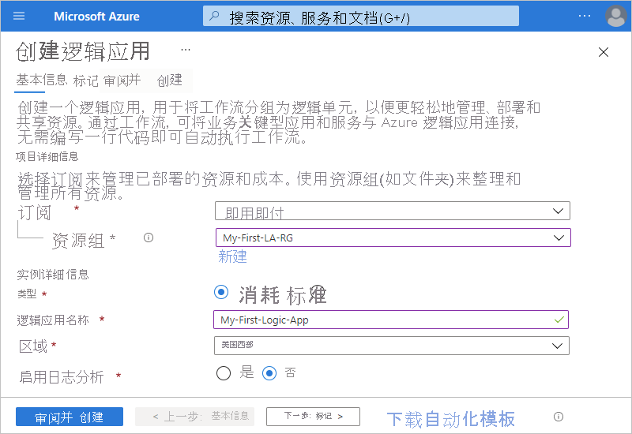

# 快速入门：使用多租户 Azure 逻辑应用和 Azure 门户创建集成工作流

本快速入门介绍如何在使用[多租户 Azure 逻辑应用](logic-apps-overview.md)时创建集成两种服务（网站的 RSS 源和电子邮件帐户）的示例自动化工作流。 尽管此示例是基于云的，但 Azure 逻辑应用支持跨云、本地和混合环境连接应用、数据、服务和系统的工作流。 有关多租户 Azure 逻辑应用与单租户 Azure 逻辑应用的详细信息，请查看[单租户与多租户以及集成服务环境](single-tenant-overview-compare.md)。

在此示例中，将创建一个使用 RSS 连接器和 Office 365 Outlook 连接器的逻辑应用资源和工作流。 资源在多租户 Azure 逻辑应用中运行，并基于[消耗量定价模型](logic-apps-pricing.md#consumption-pricing)。 RSS 连接器有一个触发器，可根据计划检查 RSS 源。 通过 Office 365 Outlook 连接器，可以为每个新项发送电子邮件。 本示例中的连接器仅仅是在工作流中可以使用的[数百个连接器](/connectors/connector-reference/connector-reference-logicapps-connectors)中的两个。

以下屏幕截图显示了基本示例工作流：

完成本快速入门教程后，你将了解以下基本步骤：

* 创建在多租户 Azure 逻辑应用环境中运行的逻辑应用资源。
* 选择空白逻辑应用模板。
* 添加一个指定运行工作流的时间的触发器。
* 添加一个在触发器触发后执行任务的操作。
* 运行工作流。

要使用其他工具创建并管理逻辑应用资源，请查看以下其他 Azure 逻辑应用快速入门：

* [在 Visual Studio Code 中创建和管理逻辑应用](quickstart-create-logic-apps-visual-studio-code.md)
* [在 Visual Studio 中创建和管理逻辑应用](quickstart-create-logic-apps-with-visual-studio.md)
* [使用 Azure 命令行接口 (Azure CLI) 创建和管理逻辑应用](quickstart-logic-apps-azure-cli.md)

## 先决条件

* Azure 帐户和订阅。 如果没有订阅，可以[注册免费的 Azure 帐户](https://azure.microsoft.com/free/?WT.mc_id=A261C142F)。

* 逻辑应用支持的服务（例如 Office 365 Outlook 或 Outlook.com）提供的电子邮件帐户。 对于其他受支持的电子邮件提供程序，请查看[Azure 逻辑应用的连接器](/connectors/connector-reference/connector-reference-logicapps-connectors)。

  > [!NOTE]
  > 如果要使用 [Gmail 连接器](/connectors/gmail/)，则只有 G-Suite 帐户可以在 Azure 逻辑应用中不受限制地使用此连接器。 如果有 Gmail 用户帐户，则除非[创建用于通过 Gmail 连接器进行身份验证的 Google 客户端应用](/connectors/gmail/#authentication-and-bring-your-own-application)，否则只能将此连接器与 Google 批准的特定服务一起使用。 有关详细信息，请参阅 [Azure 逻辑应用中 Google 连接器的数据安全和隐私策略](../connectors/connectors-google-data-security-privacy-policy.md)。

* 如果具有限制流量流经特定 IP 地址的防火墙，将防火墙设置为，允许访问你创建逻辑应用工作流的 Azure 区域内的逻辑应用服务使用的[入站](logic-apps-limits-and-config.md#inbound)和[出站](logic-apps-limits-and-config.md#outbound) IP 地址。

  此示例使用 RSS 和 Office 365 Outlook 连接器，它们均由 [Microsoft 托管](../connectors/managed.md)。 这些连接器要求将防火墙设置为允许访问 Azure 区域中逻辑应用资源的所有[托管连接器出站 IP 地址](/connectors/common/outbound-ip-addresses)。

## 创建逻辑应用资源

1. 使用 Azure 帐户登录到 [Azure 门户](https://portal.azure.com)。

1. 在 Azure 搜索框中，输入 `logic apps`，然后选择“逻辑应用”。

   

1. 在“逻辑应用”页上，选择“添加” 。

   

1. 在“创建逻辑应用”窗格中，选择要使用的 Azure 订阅，为逻辑应用资源创建新的[资源组](../azure-resource-manager/management/overview.md#terminology)，并提供有关逻辑应用资源的基本详细信息。

   | 属性 | 值 | 说明 |
   |----------|-------|-------------|
   | **订阅** | <*Azure-subscription-name*> | Azure 订阅的名称。 |
   | **资源组** | <*Azure-resource-group-name*> | [Azure 资源组的名称](../azure-resource-manager/management/overview.md#terminology)必须在区域中是唯一的。 此示例使用“My-First-LA-RG”。 |
   | **Type** | **消耗** | 用于资源的逻辑应用资源类型和计费模型： 

- **消耗**：此逻辑应用资源类型在全局多租户 Azure 逻辑应用中运行，并使用[消耗计费模型](logic-apps-pricing.md#consumption-pricing)。 此示例使用“消耗”模型。 
- **标准**：此逻辑应用资源类型在单租户 Azure 逻辑应用中运行，并使用[标准计费模型](logic-apps-pricing.md#standard-pricing)。 |
   | **逻辑应用名称** | <*logic-app-name*> | 逻辑应用资源的名称，该名称必须在区域中是唯一的。 此示例使用“My-First-Logic-App”。 

**重要说明**：此名称只能包含字母、数字、连字符 (`-`)、下划线 (`_`)、括号 `(``)` 和句点 (`.`)。  |
   | **区域** | <*Azure-region*> | 要在其中存储应用信息的 Azure 数据中心区域。 此示例使用“美国西部”。 
**注意**：如果订阅与[集成服务环境](connect-virtual-network-vnet-isolated-environment-overview.md)关联，则此列表包括这些环境。 |
   | **启用日志分析** | **否** | 只在要启用诊断日志记录时，才更改此选项。 对于本示例，请勿选择此选项。 |
   ||||

   

1. 准备就绪后，选择“查看 + 创建”。 在验证页上，确认所提供的详细信息，并选择“创建”。

## 选择空白模板

1. Azure 成功部署应用后，请选择“转到资源”。 或者通过在 Azure 搜索框中键入名称来查找并选择逻辑应用资源。

   

   工作流设计器打开并显示一个包含简介视频和常用触发器的页面。

1. 在“模板”下，选择“空白逻辑应用”。

   

   选择模板后，设计器会显示一个空白的工作流图面。

## 添加触发器

工作流始终以单个[触发器](../logic-apps/logic-apps-overview.md#how-do-logic-apps-work)开始，该触发器指定在工作流中运行任何操作之前要满足的条件。 每当触发器触发时，Azure 逻辑应用都会创建并运行工作流实例。 如果触发器没有触发，则不会创建或运行任何实例。 可以通过在不同的触发器中进行选择来启动工作流。

此示例使用 RSS 触发器根据计划检查 RSS 源。 如果源中存在新项，触发器会触发，并且新工作流实例会开始运行。 如果在检查之间存在多个新项，则触发器会针对每个项触发，并为每个项运行一个单独的新工作流实例。

1. 在工作流设计器的搜索框下，选择“全部”。

1. 要查找 RSS 触发器，请在搜索框中输入 `rss`。 从“触发器”列表中，选择 RSS 触发器“发布源项时” 。

   

1. 触发器详细信息包含以下信息：

   | 属性 | 必须 | 值 | 说明 |
   |----------|----------|-------|-------------|
   | **RSS 源 URL** | 是 | <*RSS-feed-URL*> | 要监视的 RSS 源 URL。 

本示例使用《华尔街日报》的 RSS 源 `https://feeds.a.dj.com/rss/RSSMarketsMain.xml`。 但可以使用不需要 HTTP 授权的任何 RSS 源。 选择经常发布的 RSS 源，以便可以轻松地测试工作流。 |
   | **所选属性将用于确定** | 否 | PublishDate | 确定哪些项是新项的属性。 |
   | **时间间隔** | 是 | 1 | 在源检查之间需等待的时间间隔数。 

此示例使用 `1` 作为间隔。 |
   | **频率** | 是 | Minute | 用于每个间隔的频率单位。 

此示例使用 `Minute` 作为频率。 |
   |||||

   

1. 通过单击触发器的标题栏，暂时折叠触发器的详细信息。

   

1. 完成后，请保存逻辑应用，它将立即在 Azure 门户中运行。 在设计器工具栏上选择“保存”。 

   除了检查 RSS 源，触发器不会执行任何操作。 因此需要添加一个操作来定义触发器触发时会发生的情况。

## 添加操作

继触发器之后，[操作](../logic-apps/logic-apps-overview.md#logic-app-concepts)是在工作流中运行某个操作的后续步骤。 任何操作都可以使用上一步中的输出，该输出可以是触发器或其他操作。 可以在多个不同的操作中进行选择，添加多个操作，直至达到[每个工作流的上限](logic-apps-limits-and-config.md#definition-limits)，甚至创建不同的操作路径。

此示例使用 Office 365 Outlook 操作，该操作在每次为新的 RSS 源项触发触发器时发送一封电子邮件。 如果在检查之间存在多个新项，则会收到多封电子邮件。

1. 在“发布源项时”触发器下，选择“新建步骤”。

   

1. 在“选择操作”和搜索框下，选择“全部” 。

1. 在搜索框中，输入 `send an email` 以便查找提供此操作的连接器。 要通过对“操作”列表进行筛选来查找特定的应用或服务，请先选择该应用或服务。

   例如，如果你具有 Microsoft 工作或学校帐户，并且想要使用 Office 365 Outlook，请选择“Office 365 Outlook”。 或者如果你具有个人 Microsoft 帐户，请选择“Outlook.com”。 本示例将继续使用 Office 365 Outlook。

   > [!NOTE]
   > 如果在工作流中使用其他受支持的电子邮件服务，用户界面可能会略有不同。 但是，用于连接到其他电子邮件服务的基本概念仍保持不变。

   

   现在可以更轻松地找到并选择要使用的操作，如“发送电子邮件”：

   

1. 如果选择的电子邮件服务提示你登录标识并对其进行身份验证，请立即完成该步骤。

   许多连接器要求在继续执行操作之前首先创建连接并对标识进行身份验证。

   

   > [!NOTE]
   > 此示例显示连接到 Office 365 Outlook 的手动身份验证。 但其他服务可能支持或使用不同的身份验证类型。 可以根据场景以各种方式处理连接身份验证。
   > 
   > 例如，如果使用 Azure 资源管理器模板进行部署，则可以通过将值（如连接详细信息）参数化来提高经常更改的输入的安全性。 有关详细信息，请查看以下主题：
   >
   > * [部署的模板参数](../logic-apps/logic-apps-azure-resource-manager-templates-overview.md#template-parameters)
   > * [授权 OAuth 连接](../logic-apps/logic-apps-deploy-azure-resource-manager-templates.md#authorize-oauth-connections)
   > * [使用托管标识验证访问](../logic-apps/create-managed-service-identity.md)
   > * [为逻辑应用部署验证连接](../logic-apps/logic-apps-azure-resource-manager-templates-overview.md#authenticate-connections)

1. 在“发送电子邮件”操作中，指定要包含在电子邮件中的信息。

   1. 在“收件人”框中，输入接收方的电子邮件地址。 对于本示例，请使用你的电子邮件地址。

      > [!NOTE]
      > 在“收件人”框和某些输入类型的其他框内单击时，会出现“添加动态内容”列表 。 此列表显示前面几个步骤的任何输出，你可以选择这些输出作为当前操作的输入。 可以暂时忽略此列表。 后续步骤会使用动态内容列表。

   1. 在“主题”框中，输入电子邮件主题。 对于此示例，请输入以下带有尾随空白的文本：`New RSS item: `

      

   1. 在“发布源项时”下的“添加动态内容”中，选择“源标题”  。

      源标题是一个引用 RSS 项的标题的触发器输出。 电子邮件使用此输出显示 RSS 项的标题。

      

      > [!TIP]
      > 在动态内容列表中，如果没有从“发布源项时”触发器中显示任何输出，则请在操作的标头旁边选择“查看更多” 。
      > 
      > 

      完成后，电子邮件主题如以下示例所示：

      

      > [!NOTE]
      > 如果设计器上显示“For each”循环，则选择引用“categories-Item”属性等数组的输出 。 对于此输出类型，设计器会自动在引用输出的操作周围添加“For each”循环。 这样工作流就会对每个数组项执行同一操作。 
      >
      > 要删除循环，请选择循环的标题栏上的省略号 (...)，然后选择“删除” 。

   1. 在“正文”框中，输入电子邮件正文内容。
   
      在此示例中，正文包括以下属性，前面是每个属性的说明性文本。 若要在编辑框中添加空行，请按 Shift + Enter。

      | 说明性文本 | 属性 | 说明 |
      |------------------|----------|-------------|
      | `Title:` | 源标题 | 项的标题 |
      | `Date published:` | 源发布日期 | 项的发布日期和时间 |
      | `Link:` | 源主链接 | 项的 URL |
      ||||

      

1. 保存逻辑应用。 在设计器工具栏上选择“保存”。 

## 运行工作流

要检查工作流是否正常运行，可以等待触发器根据设置计划检查 RSS 源的操作完成。 或者通过选择工作流设计器工具栏上的“运行”来手动运行工作流，如以下屏幕截图所示。

如果 RSS 源有新项，工作流会为每个新项发送一封电子邮件。 否则，工作流会等到下一个间隔再次检查 RSS 源。

以下屏幕截图显示由示例工作流发送的示例电子邮件。 电子邮件包括所选的每个触发器输出的详细信息，以及每个项目所包含的说明性文本。

## 排查问题

如果未按预期接收到来自工作流的电子邮件：

* 请检查电子邮件帐户的垃圾邮件文件夹，以防错误筛选了邮件。

* 请确保正在使用的 RSS 源自上次计划或手动检查后已发布项目。

## 清理资源

完成此快速入门后，请通过删除为此示例创建的资源组来删除示例逻辑应用资源和所有相关资源。

1. 在 Azure 搜索框中，输入 `resource groups`，然后选择“资源组”。

   

1. 查找并选择逻辑应用的资源组。 在“概述”窗格上，选择“删除资源组”。

   

1. 出现确认窗格时，输入资源组名称，然后选择“删除”。

   

## 后续步骤

在本快速入门中，你在 Azure 门户中创建了第一个逻辑应用程序，以检查 RSS 源，并为每个新项发送了电子邮件。 要了解有关高级计划工作流的详细信息，请参阅以下教程：

> [!div class="nextstepaction"]
> [使用基于计划的逻辑应用检查流量](../logic-apps/tutorial-build-schedule-recurring-logic-app-workflow.md)
