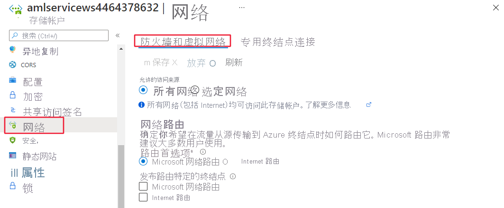

# <a name="secure-an-azure-machine-learning-workspace-with-virtual-networks"></a>使用虚拟网络保护 Azure 机器学习工作区

本文中介绍如何在虚拟网络中保护 Azure 机器学习工作区及其关联资源。

> [!TIP]
> 本文是介绍如何保护 Azure 机器学习工作流系列文章的一部分。 请参阅本系列中的其他文章：
>
> * [虚拟网络概述](how-to-network-security-overview.md)
> * [保护训练环境](how-to-secure-training-vnet.md)
> * [保护推理环境](how-to-secure-inferencing-vnet.md)
> * [启用工作室功能](how-to-enable-studio-virtual-network.md)
> * [使用自定义 DNS](how-to-custom-dns.md)
> * [使用防火墙](how-to-access-azureml-behind-firewall.md)
>
> 有关创建安全工作区的教程，请参阅[教程：创建安全工作区](tutorial-create-secure-workspace.md)。

本文介绍如何在虚拟网络中保护以下工作区资源：
> [!div class="checklist"]
> - Azure 机器学习工作区
> - Azure 存储帐户
> - Azure 机器学习数据存储和数据集
> - Azure Key Vault
> - Azure 容器注册表

## <a name="prerequisites"></a>先决条件

+ 阅读[网络安全概述](how-to-network-security-overview.md)一文，了解常见的虚拟网络方案和总体虚拟网络体系结构。

+ 用于计算资源的现有虚拟网络和子网。

    > [!TIP]
    > 如果计划在虚拟网络中使用 Azure 容器实例（部署模型），则工作区和虚拟网络必须位于同一资源组中。 否则，它们可以位于不同组中。

+ 若要将资源部署到虚拟网络或子网中，你的用户帐户必须在 Azure 基于角色的访问控制 (Azure RBAC) 中具有以下操作的权限：

    - “Microsoft.Network/virtualNetworks/join/action”（在虚拟网络资源上）。
    - “Microsoft.Network/virtualNetworks/subnet/join/action”（在子网资源上）。

    若要详细了解如何将 Azure RBAC 与网络配合使用，请参阅[网络内置角色](../role-based-access-control/built-in-roles.md#networking)

### <a name="azure-container-registry"></a>Azure 容器注册表

* Azure 容器注册表必须是高级版。 若要详细了解如何升级，请参阅[更改 SKU](../container-registry/container-registry-skus.md#changing-tiers)。

* Azure 容器注册表必须与用于训练或推理的存储帐户和计算目标位于同一虚拟网络和子网中。

* Azure 机器学习工作区必须包含 [Azure 机器学习计算群集](how-to-create-attach-compute-cluster.md)。

## <a name="limitations"></a>限制

### <a name="azure-storage-account"></a>Azure 存储帐户

如果 Azure 机器学习工作区和 Azure 存储帐户都使用专用终结点连接到 VNet，则两者必须位于同一子网中。

### <a name="azure-container-registry"></a>Azure 容器注册表

如果 ACR 位于虚拟网络后面，Azure 机器学习无法使用它来直接生成 Docker 映像。 而是使用计算群集来生成映像。

> [!IMPORTANT]
> 用于构建 Docker 映像的计算群集需要能够访问用于定型和部署模型的包存储库。 你可能需要添加允许访问公用存储库、[使用专用 Python 包](how-to-use-private-python-packages.md)，或使用已包含该包的[自定义 Docker 映像](how-to-train-with-custom-image.md)的网络安全规则。

## <a name="required-public-internet-access"></a>所需的公共 Internet 访问权限

[!INCLUDE [machine-learning-required-public-internet-access](../../includes/machine-learning-public-internet-access.md)]

有关使用防火墙解决方案的信息，请参阅[在 Azure 机器学习中使用防火墙](how-to-access-azureml-behind-firewall.md)。

## <a name="secure-the-workspace-with-private-endpoint"></a>通过专用终结点保护工作区

使用 Azure 专用链接，可以通过专用终结点连接到工作区。 专用终结点是虚拟网络中的一组专用 IP 地址。 然后，你可以限制工作区访问权限，只允许通过专用 IP 地址访问你的工作区。 专用终结点有助于降低数据泄露风险。

有关为工作区配置专用终结点的信息，请参阅[如何配置专用终结点](how-to-configure-private-link.md)。

> [!WARNING]
> 使用专用终结点保护工作区本身不能确保端到端安全。 必须按照本文其余部分的步骤和 VNet 系列中的步骤进行操作，以确保解决方案中各个组件的安全。 例如，如果为工作区使用专用终结点，但 Azure 存储帐户不在 VNet 之后，则工作区和存储之间的流量出于安全原因不会使用 VNet。

## <a name="secure-azure-storage-accounts-with-service-endpoints"></a>使用服务终结点保护 Azure 存储帐户

Azure 机器学习支持将存储帐户配置为使用服务终结点或专用终结点。 本部分介绍如何使用服务终结点保护 Azure 存储帐户。 对于专用终结点，请参阅下一部分。

若要在虚拟网络中使用工作区的 Azure 存储帐户，请按照以下步骤操作：

1. 在 Azure 门户中，转到你要在工作区中使用的存储服务。

   [](./media/how-to-enable-virtual-network/workspace-storage.png#lightbox)

1. 在存储服务帐户页上，选择“网络”。

   

1. 在“防火墙和虚拟网络”选项卡上执行以下操作：
    1. 选择“所选网络”。
    1. 在“虚拟网络”下，选择“添加现有的虚拟网络”链接。  此操作将添加计算资源所在的虚拟网络（参阅步骤 1）。

        > [!IMPORTANT]
        > 存储帐户必须与用于训练或推理的计算实例或群集位于同一虚拟网络和子网中。

    1. 选中“允许受信任的 Microsoft 服务访问此存储帐户”复选框。 此更改不会使所有 Azure 服务获得对你的存储帐户的访问权限。
    
        * 某些服务的资源在注册到订阅后，可在同一订阅中访问存储帐户以便执行选择操作 。 例如，写入日志或创建备份。
        * 可通过向其系统分配的托管标识分配 Azure 角色，向某些服务的资源授予对存储帐户的显式访问权限。

        有关详细信息，请参阅[配置 Azure 存储防火墙和虚拟网络](../storage/common/storage-network-security.md#trusted-microsoft-services)。

> [!TIP]
> 使用服务终结点时，还可以禁用公共访问。 有关详细信息，请参阅[禁止公共读取访问](../storage/blobs/anonymous-read-access-configure.md#allow-or-disallow-public-read-access-for-a-storage-account)。

## <a name="secure-azure-storage-accounts-with-private-endpoints"></a>使用专用终结点保护 Azure 存储帐户

Azure 机器学习支持将存储帐户配置为使用服务终结点或专用终结点。 如果存储帐户使用专用终结点，则必须为默认存储帐户配置两个专用终结点：
1. 具有 blob 目标子资源的专用终结点。
1. 具有文件目标子资源（文件共享）的专用终结点。

> [!TIP]
> 如果你打算在管道中使用 [ParallelRunStep](./tutorial-pipeline-batch-scoring-classification.md)，则还需要使用队列和表目标子资源配置专用终结点 。 ParallelRunStep 在幕后使用队列和表进行任务调度和分派。


若要为非默认存储的存储帐户配置专用终结点，请选择与要添加的存储帐户对应的“目标子资源”类型 。

有关详细信息，请参阅[对 Azure 存储使用专用终结点](../storage/common/storage-private-endpoints.md)

> [!TIP]
> 使用专用终结点时，还可以禁用公共访问。 有关详细信息，请参阅[禁止公共读取访问](../storage/blobs/anonymous-read-access-configure.md#allow-or-disallow-public-read-access-for-a-storage-account)。

## <a name="secure-azure-key-vault"></a>保护 Azure Key Vault

Azure 机器学习使用关联的 Key Vault 实例存储以下凭据：
* 关联的存储帐户连接字符串
* Azure 容器存储库实例的密码
* 数据存储的连接字符串

可以将 Azure 密钥保管库配置为使用服务终结点或专用终结点。 若要在虚拟网络的后面将 Azure 机器学习试验功能与 Azure Key Vault 配合使用，请执行以下步骤：

1. 转到与工作区关联的 Key Vault。

1. 在“Key Vault”页上的左侧窗格中，选择“网络” 。

1. 在“防火墙和虚拟网络”选项卡上执行以下操作：
    1. 在“允许访问来源”下，选择“专用终结点和所选网络” 。
    1. 在“虚拟网络”下，选择“添加现有的虚拟网络”，以添加试验计算资源所在的虚拟网络。 
    1. 在“允许受信任的 Microsoft 服务跳过此防火墙”下选择“是”。 

   [](./media/how-to-enable-virtual-network/key-vault-firewalls-and-virtual-networks-page.png#lightbox)

## <a name="enable-azure-container-registry-acr"></a>启用 Azure 容器注册表 (ACR)

> [!TIP]
> 如果在创建工作区时未使用现有的 Azure 容器注册表，说明可能不存在。 默认情况下，工作区不会创建 ACR 实例，除非需要。 若要强制创建，请在使用此部分中的步骤之前使用工作区定型或部署一个模型。

Azure 容器注册表可配置为使用服务终结点或专用终结点。 使用以下步骤将工作区配置为在虚拟网络中时使用 ACR：

1. 请使用以下方法之一查找工作区的 Azure 容器注册表的名称：

    __Azure 门户__

    在工作区的“概述”部分中，“注册表”值链接到 Azure 容器注册表。

    :::image type="content" source="./media/how-to-enable-virtual-network/azure-machine-learning-container-registry.png" alt-text="工作区的 Azure 容器注册表" border="true":::

    __Azure CLI__

    如果[安装了用于 Azure CLI 的机器学习扩展](reference-azure-machine-learning-cli.md)，可以运行 `az ml workspace show` 命令来显示工作区信息。

    ```azurecli-interactive
    az ml workspace show -w yourworkspacename -g resourcegroupname --query 'containerRegistry'
    ```

    此命令会返回类似于 `"/subscriptions/{GUID}/resourceGroups/{resourcegroupname}/providers/Microsoft.ContainerRegistry/registries/{ACRname}"` 的值。 此字符串的最后一部分是工作区的 Azure 容器注册表的名称。

1. 使用[配置注册表的网络访问权限](../container-registry/container-registry-vnet.md#configure-network-access-for-registry)中的步骤来限制对虚拟网络的访问。 添加虚拟网络时，为 Azure 机器学习资源选择虚拟网络和子网。

1. 将工作区的 ACR 配置为[允许受信任的服务进行访问](../container-registry/allow-access-trusted-services.md)。

1. 创建 Azure 机器学习计算群集。 当 ACR 位于 VNet 后面时，将使用此群集生成 Docker 映像。 有关详细信息，请参阅[创建计算群集](how-to-create-attach-compute-cluster.md)。

1. 使用 Azure 机器学习 Python SDK 配置工作区，以使用计算实例生成 Docker 映像。 以下代码片段演示如何更新工作区以设置生成计算。 将 `mycomputecluster` 替换为要使用的群集名称：

    ```python
    from azureml.core import Workspace
    # Load workspace from an existing config file
    ws = Workspace.from_config()
    # Update the workspace to use an existing compute cluster
    ws.update(image_build_compute = 'mycomputecluster')
    # To switch back to using ACR to build (if ACR is not in the VNet):
    # ws.update(image_build_compute = '')
    ```

    > [!IMPORTANT]
    > 存储帐户、计算群集和 Azure 容器注册表必须都位于虚拟网络的同一子网中。
    
    有关详细信息，请参阅 [update()](/python/api/azureml-core/azureml.core.workspace.workspace#update-friendly-name-none--description-none--tags-none--image-build-compute-none--enable-data-actions-none-) 方法参考。

> [!TIP]
> 当 ACR 位于 VNet 后面时，还可以[禁用对它的公共访问](../container-registry/container-registry-access-selected-networks.md#disable-public-network-access)。

## <a name="datastores-and-datasets"></a>数据存储和数据集
下表列出了需要跳过验证的服务：

| 服务 | 是否需要跳过验证？ |
| ----- |:-----:|
| Azure Blob 存储 | 是 |
| Azure 文件共享 | 是 |
| Azure Data Lake Store Gen1 | 否 |
| Azure Data Lake Store Gen2 | 否 |
| Azure SQL 数据库 | 是 |
| PostgreSQL | 是 |

> [!NOTE]
> Azure Data Lake Store 第一代和 Lake Store 第二代默认跳过验证，因此无需执行任何操作。

下面的代码示例创建一个新的 Azure Blob 数据存储并设置 `skip_validation=True`。

```python
blob_datastore = Datastore.register_azure_blob_container(workspace=ws,  

                                                         datastore_name=blob_datastore_name,  

                                                         container_name=container_name,  

                                                         account_name=account_name, 

                                                         account_key=account_key, 

                                                         skip_validation=True ) // Set skip_validation to true
```

### <a name="use-datasets"></a>使用数据集

对于下列数据集类型，用于跳过数据集验证的语法是类似的：
- 带分隔符的文件
- JSON 
- Parquet
- SQL
- 文件

下面的代码创建一个新的 JSON 数据集并设置 `validate=False`。

```python
json_ds = Dataset.Tabular.from_json_lines_files(path=datastore_paths, 

validate=False) 
```

## <a name="securely-connect-to-your-workspace"></a>安全连接到工作区

以下方法可用于连接到安全工作区：

* [Azure VPN 网关](../vpn-gateway/vpn-gateway-about-vpngateways.md) - 通过专用连接将本地网络连接到 VNet。 通过公共 Internet 建立连接。 可以使用两种类型的 VPN 网关：

    * [点到站点](../vpn-gateway/vpn-gateway-howto-point-to-site-resource-manager-portal.md)：每台客户端计算机使用 VPN 客户端连接到 VNet。
    * [站点到站点](../vpn-gateway/tutorial-site-to-site-portal.md)：VPN 设备将 VNet 连接到本地网络。

* [ExpressRoute](https://azure.microsoft.com/services/expressroute/) - 通过专用连接将本地网络连接到云。 通过连接提供商建立连接。
* [Azure Bastion](../bastion/bastion-overview.md) - 在此方案中，你将在 VNet 内部创建 Azure 虚拟机（有时称作 Jump Box）。 然后使用 Azure Bastion 连接到 VM。 Bastion 允许在本地 Web 浏览器中使用 RDP 或 SSH 会话连接到 VM。 然后使用 Jump Box 作为开发环境。 由于 Jump Box 位于 VNet 中，因此它可以直接访问工作区。 有关使用 Jump Box 的示例，请参阅[教程：创建安全工作区](tutorial-create-secure-workspace.md)。

> [!IMPORTANT]
> 使用“VPN 网关”或“ExpressRoute”时，需要规划本地资源与 VNet 中资源之间的名称解析工作方式 。 有关详细信息，请参阅[使用自定义 DNS 服务器](how-to-custom-dns.md)。

## <a name="workspace-diagnostics"></a>工作区诊断

[!INCLUDE [machine-learning-workspace-diagnostics](../../includes/machine-learning-workspace-diagnostics.md)]

## <a name="next-steps"></a>后续步骤

本文是介绍如何保护 Azure 机器学习工作流系列文章的一部分。 请参阅本系列中的其他文章：

* [虚拟网络概述](how-to-network-security-overview.md)
* [保护训练环境](how-to-secure-training-vnet.md)
* [保护推理环境](how-to-secure-inferencing-vnet.md)
* [启用工作室功能](how-to-enable-studio-virtual-network.md)
* [使用自定义 DNS](how-to-custom-dns.md)
* [使用防火墙](how-to-access-azureml-behind-firewall.md)
