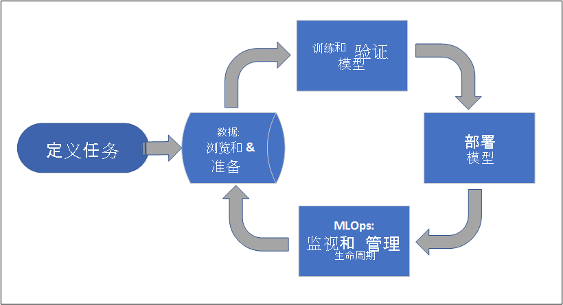
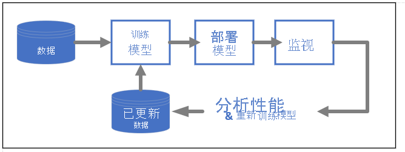

# 什么是 Azure 机器学习？

Azure 机器学习是一种用于加速和管理机器学习项目生命周期的云服务。 机器学习专业人员、数据科学家和工程师可以在日常工作流中使用它：训练和部署模型，以及管理 MLOps。

可以在 Azure 机器学习中创建模型，也可以使用从开源平台构建的模型，例如 Pytorch、TensorFlow 或 scikit-learn。 MLOps 工具有助于监视、重新训练和重新部署模型。 

> [!Tip]
> **免费试用！**  如果没有 Azure 订阅，请在开始之前创建一个免费帐户。 [试用 Azure 机器学习的免费版或付费版](https://azure.microsoft.com/free/machine-learning/search/)。 你将获得可用于 Azure 服务的赠送额度。 额度用完后，可以保留该帐户并继续使用[免费的 Azure 服务](https://azure.microsoft.com/free/)。 除非显式更改设置并要求付费，否则不会对信用卡收取任何费用。

## Azure 机器学习适合哪些人群？

Azure 机器学习适用于要在其组织内实现 MLOps（以便在安全且可审核的生产环境中将机器学习模型投入生产）的个人和团队。

数据科学家和 ML 工程师将找到用于加快和自动执行其日常工作流的工具。 应用程序开发人员会找到用于将模型集成到应用程序或服务的工具。 平台开发人员将找到由持久 Azure 资源管理器 API 提供支持的一组可靠工具，用于构建高级 ML 工具。

使用 Microsoft Azure 云中的企业将在基础结构方面发现熟悉的安全性和基于角色的访问控制 (RBAC)。 可以设置项目以拒绝对受保护数据的访问并选择操作。

### 机器学习团队的协作

机器学习项目通常需要具有各种技能组的团队来构建和维护。 Azure 机器学习提供了有助于实现协作的工具，例如：

- 共享笔记本、计算资源、数据和环境
- 可显示更改操作人员和时间的跟踪和可审核性
- 资产版本控制

### 开发人员工具

开发人员可以在 Azure 机器学习中找到熟悉的接口，例如：

- [Python SDK](/python/api/overview/azure/ml/)
- [Azure 资源管理器 REST API（预览）](/rest/api/azureml/)
- [CLI (v2)（预览版）](/cli/azure/ml)

### Studio UI 

Azure 机器学习工作室是一种图形用户界面，用作项目工作区。 在工作室中，可以执行以下操作：

- 查看运行、指标、日志、输出等。
- 创作和编辑笔记本和文件。
- 管理公共资产，例如
    - 数据凭据
    - 计算
    - 环境
- 直观呈现运行指标、结果和报表。
- 直观呈现通过开发人员界面创作的管道。
- 创作 AutoML 作业。

此外，设计器还提供了一个拖放界面，可用于训练和部署模型。 

## 企业就绪情况和安全性

Azure 机器学习与 Azure 云平台集成，以增加 ML 项目的安全性。 

安全集成包括：

- 带有网络安全组的 Azure 虚拟网络 (VNet) 
- Azure Key Vault，可用于保存安全机密，例如存储帐户的访问信息
- 在 VNet 后设置的 Azure 容器注册表

请参阅[教程：设置安全工作区](tutorial-create-secure-workspace.md)。

## 适用于完整解决方案的 Azure 集成

与 Azure 服务进行的其他集成支持端到端的机器学习项目。 它们包括：

- 用于通过 Spark 处理和流式传输数据的 Azure Synapse Analytics
- Azure Arc，可用于在 Kubernetes 环境中运行 Azure 服务
- 存储和数据库选项，如 Azure SQL 数据库、Azure 存储 Blob 等
- Azure 应用服务，以便部署和管理 ML 驱动的应用

## 机器学习项目工作流

通常，模型开发过程属于具有目标的项目的一部分。 项目往往不止涉及一个人。 在试验数据、算法和模型时，开发具有迭代性。 

### 项目生命周期

尽管项目生命周期可能因项目而异，但通常如下所示：

工作区可整理项目，让朝着共同目标而努力的许多用户都能够协作。 工作区中的用户轻轻松松即可在工作室用户界面中共享其实验运行结果，或将已进行版本控制的资产用于环境和存储引用等作业。

有关详细信息，请参阅[管理 Azure 机器学习工作区](how-to-manage-workspace.md?tabs=python)。

当项目准备好进行操作化时，用户的工作可以在机器学习管道中自动执行，并按计划或 HTTPS 请求触发。

可以将模型部署到托管推理解决方案，以进行实时和批部署，并忽略部署模型通常所需的基础结构管理。

## 训练模型

在 Azure 机器学习中，可以在云中运行训练脚本或从头开始构建模型。 客户通常会自带他们在开源框架中构建和训练的模型，以便他们在云中让这些模型实现操作化。 

### 开放且可交互

数据科学家可以在 Azure 机器学习中使用他们在常见 Python 框架中创建的模型，例如： 

- PyTorch
- TensorFlow
- scikit-learn
- XGBoost
- LightGBM

还支持其他语言和框架，包括： 
- R
- .NET

请参阅[与 Azure 机器学习的开源集成](concept-open-source.md)。

### 自动特征化和算法选择 (AutoML)

在经典机器学习重复且耗时的处理过程中，数据科学家使用以前的经验和直觉来选择合适的数据特征化和算法进行训练。 自动化机器学习 (AutoML) 可加快此过程，并可通过工作室 UI 或 Python SDK 使用。

请参阅[什么是自动化机器学习？](concept-automated-ml.md)

### 超参数优化

超参数优化或超参数优化可能是一项枯燥的任务。 Azure 机器学习可为任意参数化命令自动执行此任务，而基本无需对作业定义进行任何修改。 结果会在工作室中直观呈现。

请参阅[如何优化超参数](how-to-tune-hyperparameters.md)。

### 多节点分布式训练

通过多节点分布式训练，深度学习的训练效率（有时甚至是经典机器学习训练作业的效率）可以得到显著提高。 Azure 机器学习计算群集提供最新的 GPU 选项。

通过 Azure Arc 附加的 Kubernetes（预览版）和 Azure ML 计算群集提供支持：

- PyTorch
- TensorFlow
- MPI

MPI 分发可用于 Horovod 或自定义多节点逻辑。 此外，Apache Spark 通过 Azure Synapse Analytics Spark 群集（预览版）提供支持。

请参阅[使用 Azure 机器学习进行分布式训练](concept-distributed-training.md)。

### 易并行训练

缩放机器学习项目可能需要缩放易并行模型训练。 此模式在预测需求等场景中很常见，在这些场景中，模型可能需要针对许多存储进行训练。

## 部署模型

若要将模型投入生产，需要对其进行部署。 Azure 机器学习托管终结点会抽象化批处理或实时（在线）模型评分（推理）所需的基础结构。

### 实时评分和批评分（推理）

批评分（或批推理）涉及通过数据引用进行调用的终结点 。 批处理终结点以异步方式运行作业，以并行处理计算群集上的数据，并存储数据以供进一步分析。

实时评分或在线推理涉及调用具有一个或多个模型部署的终结点并通过 HTTP 准实时接收响应 。 流量可分散到多种部署中，允许通过初始转移一定数量的流量并在建立对新模型的信心后增加流量来测试新模型版本。    

请参阅：
 - [使用实时托管终结点部署模型](how-to-deploy-managed-online-endpoints.md)
 - [使用批处理终结点进行评分](how-to-use-batch-endpoint.md) 

## MLOps：用于机器学习的 DevOps 

用于机器学习模型的 DevOps，通常称为 MLOps，是为生成开发模型的过程。 如果不可重现，模型从训练到部署的生命周期必须可审核。

### ML 模型生命周期 

详细了解 [Azure 机器学习中的 MLOps](concept-model-management-and-deployment.md)。

### 启用 MLOP 的集成

Azure 机器学习在构建时考虑到了模型生命周期。 可以针对具体的提交和环境来审核模型的生命周期。 

启用 MLOps 的一些主要功能包括：

- `git` 集成
- MLflow 集成
- 机器学习管道计划
- 用于自定义触发器的 Azure 事件网格集成
- 易于与 GitHub Actions 或 Azure DevOps 等 CI/CD 工具配合使用

此外，Azure 机器学习还包括用于监视和审核的功能：
- 作业项目，例如代码快照、日志和其他输出
- 作业和资产（例如容器、数据和计算资源）之间的世系

## 后续步骤

开始使用 Azure 机器学习：
- [设置 Azure 机器学习工作区](quickstart-create-resources.md)
- [教程：构建第一个机器学习项目](tutorial-1st-experiment-hello-world.md)
- [预览：使用 v2 CLI 运行模型训练作业](how-to-train-cli.md)
