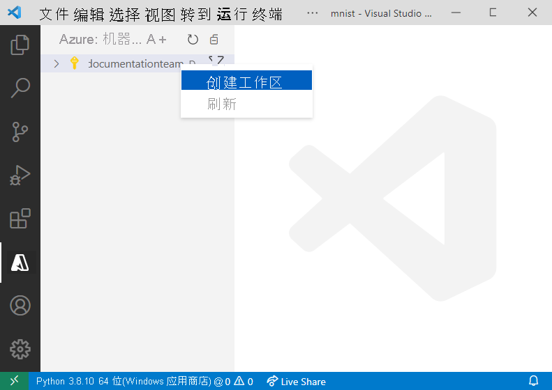
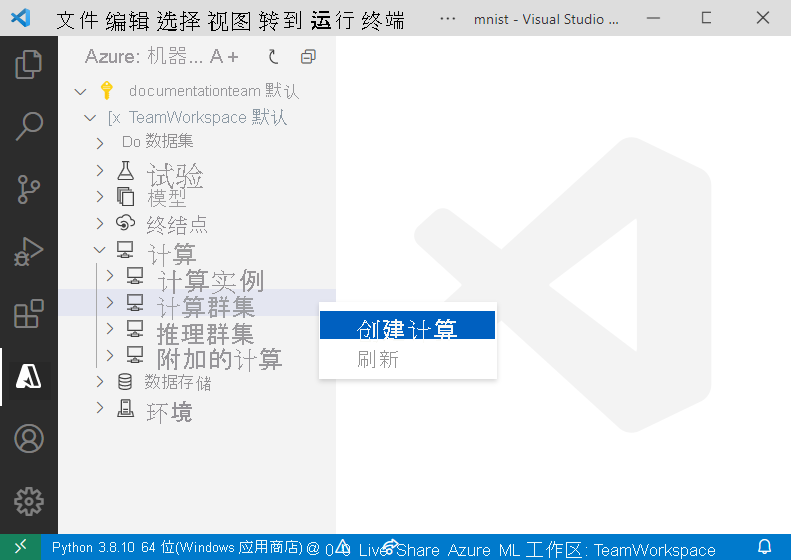
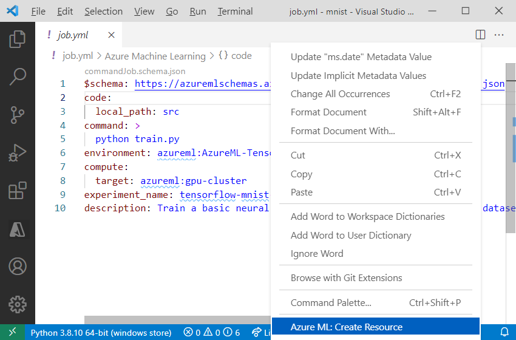

# <a name="train-an-image-classification-tensorflow-model-using-the-azure-machine-learning-visual-studio-code-extension-preview"></a>使用 Azure 机器学习 Visual Studio Code 扩展（预览版）训练图像分类 TensorFlow 模型

了解如何使用 TensorFlow 和 Azure 机器学习 Visual Studio Code 扩展训练图像分类模型来识别手写数字。

本教程将介绍以下任务：

> [!div class="checklist"]
> * 了解代码
> * 创建工作区
> * 创建用于训练的 GPU 群集
> * 训练模型

## <a name="prerequisites"></a>先决条件

- Azure 订阅。 如果没有订阅，注册之后即可试用 [Azure 机器学习免费版或付费版](https://azure.microsoft.com/free/t.com/free/)。
- 安装 [Visual Studio Code](https://code.visualstudio.com/docs/setup/setup-overview)，一种轻量型跨平台代码编辑器。
- Azure 机器学习工作室 Visual Studio Code 扩展。 有关安装说明，请参阅 [Azure 机器学习 Visual Studio Code 扩展指南](./how-to-setup-vs-code.md)
- CLI (v2)（预览版）。 有关安装说明，请参阅[安装、设置和使用 CLI (v2)（预览版）](how-to-configure-cli.md)

## <a name="understand-the-code"></a>了解代码

本教程的代码使用 TensorFlow 来训练可以对手写数字 0-9 进行分类的图像分类机器学习模型。 它通过创建一个神经网络来实现此目的。该神经网络将“28 像素 x 28 像素”图像的像素值作为输入，输出一个包含 10 个概率的列表，一个概率对应于要分类的一个数字。 下面是数据的外观示例。  


在计算机上的任何位置下载并解压缩 [Azure ML 示例存储库](https://github.com/Azure/azureml-examples/archive/refs/heads/main.zip)，获取本教程的代码。

## <a name="create-a-workspace"></a>创建工作区

若要在 Azure 机器学习中生成应用程序，第一件必须做的事是创建工作区。 工作区包含用于训练模型的资源以及已训练的模型本身。 有关详细信息，请参阅[什么是工作区](./concept-workspace.md)。

1. 在 Visual Studio Code 中打开“azureml-examples-main/cli/jobs/train/tensorflow/mnist”目录。
1. 在 Visual Studio Code 活动栏上选择 **Azure** 图标，打开“Azure 机器学习”视图。
1. 在“Azure 机器学习”视图中，右键单击你的订阅节点，然后选择“创建工作区”。

    > [!div class="mx-imgBorder"]
    > 

1. 此时会显示规范文件。 用以下选项配置规范文件。 

    ```yml
    $schema: https://azuremlschemas.azureedge.net/latest/workspace.schema.json
    name: TeamWorkspace
    location: WestUS2
    friendly_name: team-ml-workspace
    description: A workspace for training machine learning models
    tags:
      purpose: training
      team: ml-team
    ```

    规格文件将在 `WestUS2` 区域中创建名为 `TeamWorkspace` 的工作区。 规格文件中定义的其余选项为工作区提供友好的命名、说明和标记。

1. 右键单击规范文件，然后选择“Azure ML: 创建资源”。 创建资源时将使用 YAML 规范文件中定义的配置选项，并使用 CLI (v2) 提交一个作业。 此时，系统会向 Azure 发出请求，以便在你的帐户中创建新的工作区和相关资源。 几分钟后，新工作区会显示在订阅节点中。
1. 将 `TeamWorkspace` 设置为默认工作区。 这样会默认将你创建的资源和作业放入该工作区。 在 Visual Studio Code 状态栏上选择“设置 Azure ML 工作区”按钮，然后按照提示将 `TeamWorkspace` 设置为默认工作区。

有关工作区的详细信息，请参阅[如何在 VS Code 中管理资源](how-to-manage-resources-vscode.md)。

## <a name="create-a-gpu-cluster-for-training"></a>创建用于训练的 GPU 群集

计算目标是在其中运行训练作业的计算资源或环境。 有关详细信息，请参阅 Azure [机器学习计算目标文档](./concept-compute-target.md)。

1. 在“Azure 机器学习”视图中，展开你的工作区节点。
1. 右键单击工作区的“计算”节点内的“计算群集”节点，然后选择“创建计算”  

    > [!div class="mx-imgBorder"]
    > 

1. 此时会显示规范文件。 用以下选项配置规范文件。

    ```yml
    $schema: https://azuremlschemas.azureedge.net/latest/compute.schema.json
    name: gpu-cluster
    type: amlcompute
    size: Standard_NC12
    
    min_instances: 0
    max_instances: 3
    idle_time_before_scale_down: 120
    ```

    规格文件将创建名为 `gpu-cluster` 的 GPU 群集，其中最多包含 3 个 Standard_NC12 VM 节点，在处于非活动状态 120 秒后，该群集将自动纵向缩减为 0 个节点。

    有关 VM 大小的详细信息，请参阅 [Azure 中的 Linux 虚拟机大小](../virtual-machines/sizes.md)。

1. 右键单击规范文件，然后选择“Azure ML: 创建资源”。

几分钟后，新计算目标会出现在工作区的“计算”>“计算群集”节点中。

## <a name="train-image-classification-model"></a><a name="train-the-model"></a> 训练图像分类模型

在训练过程中训练 TensorFlow 模型的方式是这样的：针对要分类的每个相应的数字，处理在该模型中嵌入的训练数据和学习模式。

与工作区和计算目标一样，训练作业是使用资源模板定义的。 对于本示例，规格文件在 job.yml 文件中定义，如下所示：

```yml
$schema: https://azuremlschemas.azureedge.net/latest/commandJob.schema.json
code: 
    local_path: src
command: >
    python train.py
environment: azureml:AzureML-TensorFlow2.4-Cuda11-OpenMpi4.1.0-py36:1
compute:
    target: azureml:gpu-cluster
experiment_name: tensorflow-mnist-example
description: Train a basic neural network with TensorFlow on the MNIST dataset.
```

此规格文件将名为 `tensorflow-mnist-example` 的、用于运行 train.py Python 脚本中的代码的训练作业提交到最近创建的 `gpu-cluster` 计算机目标。 使用的环境是 Azure 机器学习提供的特选环境之一，其中包含 TensorFlow 以及运行训练脚本所需的其他软件依赖项。 有关特选环境的详细信息，请参阅 [Azure 机器学习特选环境](resource-curated-environments.md)。

若要提交训练作业，请执行以下操作：

1. 打开“job.yml”文件。
1. 在文本编辑器中右键单击该文件，然后选择“Azure ML: 创建资源”。

> [!div class="mx-imgBorder"]
> 

此时系统会向 Azure 发送请求，以便在工作区中所选的计算目标上运行试验。 此过程需要几分钟。 运行训练作业的时间长度受多种因素（如计算类型和训练数据大小）的影响。 若要跟踪试验进度，请右键单击当前的运行节点，然后选择“在 Azure 门户中查看运行”。

出现请求打开外部网站的对话框时，请选择“打开”。

> [!div class="mx-imgBorder"]
> 

训练完模型后，运行节点旁边的状态标签会更新为“已完成”。

## <a name="next-steps"></a>后续步骤

本教程将介绍以下任务：

> [!div class="checklist"]
> * 了解代码
> * 创建工作区
> * 创建用于训练的 GPU 群集
> * 训练模型

有关后续步骤，请参阅：

* [使用 Visual Studio Code 创建和管理 Azure 机器学习资源](how-to-set-up-vs-code-remote.md)。
* [将 Visual Studio Code 连接到计算实例](how-to-set-up-vs-code-remote.md)以获得完整开发体验。
* 若要详细了解如何在本地编辑、运行和调试代码，请参阅 [Python hello-world 教程](https://code.visualstudio.com/docs/Python/Python-tutorial)。
* 使用远程 Jupyter 服务器[在 Visual Studio Code 中运行 Jupyter Notebook](how-to-manage-resources-vscode.md)。
* 若要详细了解如何在 Visual Studio Code 外部使用 Azure 机器学习进行训练，请参阅[教程：使用 Azure 机器学习训练模型](tutorial-train-models-with-aml.md)。