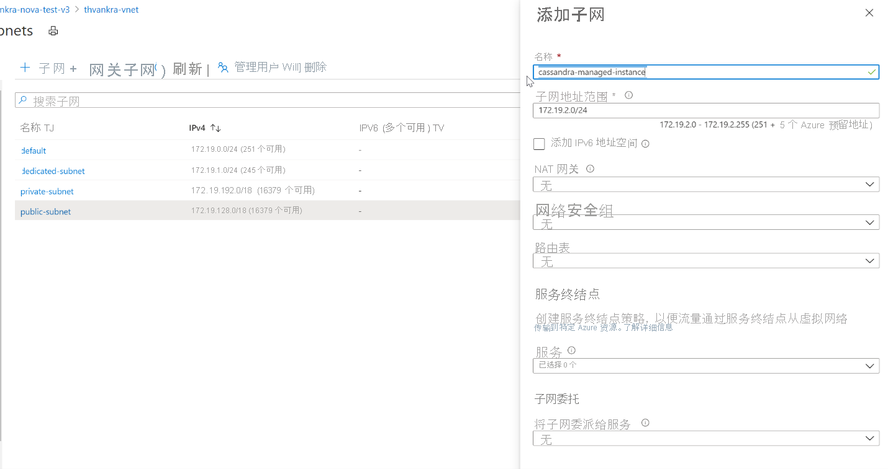

# <a name="quickstart-configure-a-hybrid-cluster-with-azure-managed-instance-for-apache-cassandra-preview"></a>快速入门：使用 Azure Managed Instance for Apache Cassandra（预览版）配置混合群集

Azure Managed Instance for Apache Cassandra 为托管的开源 Apache Cassandra 数据中心提供自动部署和缩放操作。 此服务有助于加速混合方案的部署，并减少日常维护。

> [!IMPORTANT]
> Azure Managed Instance for Apache Cassandra 目前以公共预览版形式提供。
> 此预览版在提供时没有附带服务级别协议，不建议将其用于生产工作负荷。 某些功能可能不受支持或者受限。
> 有关详细信息，请参阅 [Microsoft Azure 预览版补充使用条款](https://azure.microsoft.com/support/legal/preview-supplemental-terms/)。

本快速入门演示如何使用 Azure CLI 命令配置混合群集。 如果你的现有数据中心位于本地或自承载环境中，则可使用 Azure Managed Instance for Apache Cassandra 将其他数据中心添加到该群集并对其进行维护。

[!INCLUDE [azure-cli-prepare-your-environment.md](../../includes/azure-cli-prepare-your-environment.md)]

* 本文需要 Azure CLI 2.12.1 或更高版本。 如果你使用的是 Azure Cloud Shell，则表示已安装最新版本。

  > [!NOTE]
  > 请确保在 cloud shell 中运行 CLI 模块 `cosmosdb-preview` 的版本 0.9.0（或更高版本）。 这对于下面列出的所有命令正常运行是必需的。 可以通过运行 `az --version` 来检查扩展版本。 如有必要，请使用 `az extension update --name cosmosdb-preview` 进行升级。

* 与自承载环境或本地环境连接的 [Azure 虚拟网络](../virtual-network/virtual-networks-overview.md)。 若要详细了解如何将本地环境连接到 Azure，请参阅[将本地网络连接到 Azure](/azure/architecture/reference-architectures/hybrid-networking/) 一文。

## <a name="configure-a-hybrid-cluster"></a><a id="create-account"></a>配置混合群集

1. 登录 [Azure 门户](https://portal.azure.com/)并导航到你的虚拟网络资源。

1. 打开“子网”选项卡并创建新的子网。 若要详细了解“添加子网”窗体中的字段，请参阅[虚拟网络](../virtual-network/virtual-network-manage-subnet.md#add-a-subnet)一文：

   :::image type="content" source="./media/configure-hybrid-cluster/subnet.png" alt-text="将新子网添加到虚拟网络中。" lightbox="./media/configure-hybrid-cluster/subnet.png" border="true":::
    <!--  -->

   > [!NOTE]
   > 部署 Azure Managed Instance for Apache Cassandra 需要 Internet 访问权限。 在限制 Internet 访问权限的环境中，部署将失败。 请确保未在 VNet 中阻止对以下关键 Azure 服务（托管 Cassandra 需要这些服务才能正常工作）的访问权限。 还可以在[此处](network-rules.md)找到 IP 地址和端口依赖项的广泛列表。 
   > - Azure 存储
   > - Azure KeyVault
   > - Azure 虚拟机规模集
   > - Azure 监视
   > - Azure Active Directory
   > - Azure 安全性

1. 现在，我们将使用 Azure CLI 对 Cassandra 托管实例所需的 VNet 和子网应用一些特殊权限。 使用 `az role assignment create` 命令，将 `<subscriptionID>`、`<resourceGroupName>` 和 `<vnetName>` 替换为适当的值：

   ```azurecli-interactive
   az role assignment create \
     --assignee a232010e-820c-4083-83bb-3ace5fc29d0b \
     --role 4d97b98b-1d4f-4787-a291-c67834d212e7 \
     --scope /subscriptions/<subscriptionID>/resourceGroups/<resourceGroupName>/providers/Microsoft.Network/virtualNetworks/<vnetName>
   ```

   > [!NOTE]
   > 上一命令中的 `assignee` 和 `role` 值分别是固定的服务主体和角色标识符。

1. 接下来，我们将为混合群集配置资源。 你已经有一个群集，所以此处的群集名称将仅作为用于标识现有群集名称的逻辑资源。 在以下脚本中定义 `clusterName` 和 `clusterNameOverride` 变量时，请务必使用现有群集的名称。 
 
   你还至少需要来自现有数据中心的种子节点，以及节点到节点加密所需的 gossip 证书。 Azure Managed Instance for Apache Cassandra 需要将节点到节点加密用于数据中心之间的通信。 如果在现有群集中未实现节点到节点加密，则需要实现它 - 请参阅[此处](https://docs.datastax.com/en/cassandra-oss/3.x/cassandra/configuration/secureSSLNodeToNode.html)的文档。 应提供证书位置的路径。 每个证书都应采用 PEM 格式，例如 `-----BEGIN CERTIFICATE-----\n...PEM format 1...\n-----END CERTIFICATE-----`。 通常，可以通过两种方式实现证书：

   1. 自签名证书。 这意味着每个节点都有一个专用和公用（无 CA）证书 - 在这种情况下，我们需要所有公用证书。

   1. CA 签名的证书。 这可以是自签名 CA，甚至是公用 CA。 在这种情况下，我们需要根 CA 证书（请参阅有关[为生产准备 SSL 证书](https://docs.datastax.com/en/cassandra-oss/3.x/cassandra/configuration/secureSSLCertWithCA.html)的说明）以及所有中介（如果适用）。

   （可选）如果你还实现了客户端到节点证书（请参阅[此处](https://docs.datastax.com/en/cassandra-oss/3.x/cassandra/configuration/secureSSLClientToNode.html)），则还需要在创建混合群集时以相同格式提供它们。 请查看以下示例。

   > [!NOTE]
   > 你将在下面提供的 `delegatedManagementSubnetId` 变量的值与你在上面的命令中提供的 `--scope` 的值完全相同：

   ```azurecli-interactive
   resourceGroupName='MyResourceGroup'
   clusterName='cassandra-hybrid-cluster-legal-name'
   clusterNameOverride='cassandra-hybrid-cluster-illegal-name'
   location='eastus2'
   delegatedManagementSubnetId='/subscriptions/<subscriptionID>/resourceGroups/<resourceGroupName>/providers/Microsoft.Network/virtualNetworks/<vnetName>/subnets/<subnetName>'
    
   # You can override the cluster name if the original name is not legal for an Azure resource:
   # overrideClusterName='ClusterNameIllegalForAzureResource'
   # the default cassandra version will be v3.11
    
   az managed-cassandra cluster create \
     --cluster-name $clusterName \
     --resource-group $resourceGroupName \
     --location $location \
     --delegated-management-subnet-id $delegatedManagementSubnetId \
     --external-seed-nodes 10.52.221.2 10.52.221.3 10.52.221.4 \
     --external-gossip-certificates /usr/csuser/clouddrive/rootCa.pem /usr/csuser/clouddrive/gossipKeyStore.crt_signed
     # optional - add your existing datacenter's client-to-node certificates (if implemented):
     # --client-certificates /usr/csuser/clouddrive/rootCa.pem /usr/csuser/clouddrive/nodeKeyStore.crt_signed 
   ```

   > [!NOTE]
   > 如果群集已具有节点到节点和客户端到节点加密，则你应知道现有客户端和/或 gossip SSL 证书的保存位置。 如果你不确定，你应该能够运行 `keytool -list -keystore <keystore-path> -rfc -storepass <password>` 来打印证书。 

1. 创建群集资源后，运行以下命令获取群集设置详细信息：

   ```azurecli-interactive
   resourceGroupName='MyResourceGroup'
   clusterName='cassandra-hybrid-cluster'
    
   az managed-cassandra cluster show \
      --cluster-name $clusterName \
      --resource-group $resourceGroupName \
   ```

1. 上述命令会返回托管实例环境的相关信息。 你将需要 gossip 证书，以便可将它们安装在现有数据中心内节点的信任存储上。 以下屏幕截图显示了上一命令的输出和证书的格式：

   :::image type="content" source="./media/configure-hybrid-cluster/show-cluster.png" alt-text="从群集获取证书详细信息。" lightbox="./media/configure-hybrid-cluster/show-cluster.png" border="true":::
    <!--  -->

   > [!NOTE]
   > 以上命令返回的证书包含以文本形式表示的换行符，例如 `\r\n`。 你应将每个证书都复制到一个文件中，并在尝试将其导入现有数据中心的信任存储之前对其进行格式化。

   > [!TIP]
   > 将上面屏幕截图中显示的 `gossipCertificates` 数组值复制到文件中，使用以下 bash 脚本（需要为平台[下载并安装 jq](https://stedolan.github.io/jq/download/)）格式化证书，并为每个证书创建单独的 pem 文件。
   >
   > ```bash
   > readarray -t cert_array < <(jq -c '.[]' gossipCertificates.txt)
   > # iterate through the certs array, format each cert, write to a numbered file.
   > num=0
   > filename=""
   > for item in "${cert_array[@]}"; do
   >   let num=num+1
   >   filename="cert$num.pem"
   >   cert=$(jq '.pem' <<< $item)
   >   echo -e $cert >> $filename
   >   sed -e '1d' -e '$d' -i $filename
   > done
   > ```

1. 接下来，在混合群集中创建新的数据中心。 请务必将变量值替换为群集详细信息：

   ```azurecli-interactive
   resourceGroupName='MyResourceGroup'
   clusterName='cassandra-hybrid-cluster'
   dataCenterName='dc1'
   dataCenterLocation='eastus2'
    
   az managed-cassandra datacenter create \
     --resource-group $resourceGroupName \
     --cluster-name $clusterName \
     --data-center-name $dataCenterName \
     --data-center-location $dataCenterLocation \
     --delegated-subnet-id $delegatedManagementSubnetId \
     --node-count 9 
   ```

1. 现已创建新的数据中心，接下来运行 show datacenter 命令查看其详细信息：

   ```azurecli-interactive
   resourceGroupName='MyResourceGroup'
   clusterName='cassandra-hybrid-cluster'
   dataCenterName='dc1'
    
   az managed-cassandra datacenter show \
     --resource-group $resourceGroupName \
     --cluster-name $clusterName \
     --data-center-name $dataCenterName 
   ```

1. 上述命令会输出新数据中心的种子节点： 

   :::image type="content" source="./media/configure-hybrid-cluster/show-datacenter.png" alt-text="获取数据中心详细信息。" lightbox="./media/configure-hybrid-cluster/show-datacenter.png" border="true":::
    <!--  -->

1. 现在将新数据中心的种子节点添加到现有数据中心在 [cassandra.yaml](https://docs.datastax.com/en/cassandra-oss/3.0/cassandra/configuration/configCassandra_yaml.html) 文件中的[种子节点配置](https://docs.datastax.com/en/cassandra-oss/3.0/cassandra/configuration/configCassandra_yaml.html#configCassandra_yaml__seed_provider)。 对每个证书使用 `keytool` 命令，将之前收集的托管实例 gossip 证书安装到现有群集中每个节点的信任存储中：

   ```bash
   keytool -importcert -keystore generic-server-truststore.jks -alias CassandraMI -file cert1.pem -noprompt -keypass myPass -storepass truststorePass
   ```

   > [!NOTE]
   > 若要添加更多数据中心，可重复以上步骤，但只需要种子节点。 

1. 最后，使用以下 CQL 查询更新每个密钥空间中的复制策略，使其包含整个群集中的所有数据中心：

   ```bash
   ALTER KEYSPACE "ks" WITH REPLICATION = {'class': 'NetworkTopologyStrategy', 'on-premise-dc': 3, 'managed-instance-dc': 3};
   ```

   还需要更新密码表：

   ```bash
   ALTER KEYSPACE "system_auth" WITH REPLICATION = {'class': 'NetworkTopologyStrategy', 'on-premise-dc': 3, 'managed-instance-dc': 3}
   ```

## <a name="troubleshooting"></a>疑难解答

如果在将权限应用到虚拟网络时遇到错误，如 *无法在e5007d2c-4b13-4a74-9b6a-605d99f03501”的图形数据库中找到用户或服务主体*，则可以在 Azure 门户中手动应用相同的权限。 要在门户中应用权限，请访问现有虚拟网络的“访问控制 (IAM)”窗格，并将“Azure Cosmos DB”的角色分配添加到“网络管理员”角色。 如果搜索“Azure Cosmos DB”时出现两个条目，请同时添加这两个条目，如下图所示： 

   :::image type="content" source="./media/create-cluster-cli/apply-permissions.png" alt-text="应用权限" lightbox="./media/create-cluster-cli/apply-permissions.png" border="true":::

> [!NOTE] 
> Azure Cosmos DB 角色分配仅用于部署目的。 Azure Managed Instanced for Apache Cassandra 对于 Azure Cosmos DB 不存在后端依赖关系。  

## <a name="clean-up-resources"></a>清理资源

如果不打算继续使用此托管实例群集，请按照以下步骤删除它：

1. 从 Azure 门户的左侧菜单中选择“资源组”。
1. 从列表中选择为本快速入门创建的资源组。
1. 在资源组的“概述”窗格上，选择“删除资源组” 。
1. 在下一窗口中输入要删除的资源组的名称，然后选择“删除”  。

## <a name="next-steps"></a>后续步骤

在本快速入门中，你了解了如何使用 Azure CLI 和 Azure Managed Instance for Apache Cassandra 创建混合群集。 现在你可开始使用该群集了。

> [!div class="nextstepaction"]
> [使用 Azure CLI 管理 Azure Managed Instance for Apache Cassandra 资源](manage-resources-cli.md)
