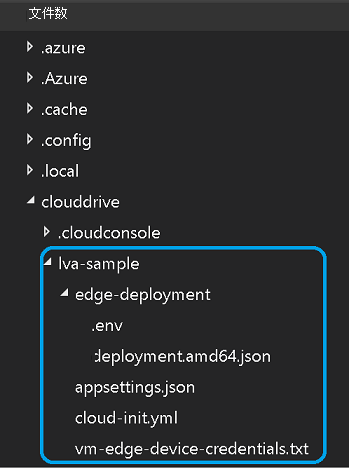

本教程需要以下 Azure 资源：

* IoT 中心
* 存储帐户
* Azure 媒体服务帐户
* Azure 中的 Linux VM，已安装 [IoT Edge 运行时](../../../../../iot-edge/how-to-install-iot-edge.md)

在本快速入门中，我们建议你使用[实时视频分析资源设置脚本](https://github.com/Azure/live-video-analytics/tree/master/edge/setup)在 Azure 订阅中部署所需资源。 为此，请执行下列步骤：

1. 打开 [Azure Cloud Shell](https://ms.portal.azure.com/#cloudshell/)。
    > [!div class="mx-imgBorder"]
    > :::image type="content" source="../../../media/quickstarts/cloud-shell.png" alt-text="Cloud Shell":::
1. 如果你是第一次使用 Cloud Shell，系统将提示你选择一个订阅以创建存储帐户和 Microsoft Azure 文件存储共享。 选择“创建存储”，创建用于存储 Cloud Shell 会话信息的存储帐户。 此存储帐户不同于脚本将要创建的与 Azure 媒体服务帐户配合使用的帐户。
1. 在 Cloud Shell 窗口左侧的下拉菜单中，选择“Bash”作为环境。

    
1. 运行以下命令。

    ```
    bash -c "$(curl -sL https://aka.ms/lva-edge/setup-resources-for-samples)"
    ```
    
    在脚本成功完成后，你应可在订阅中看到所有所需资源。 脚本将设置总共 12 种资源：
    1. **流式处理终结点** - 这将有助于播放记录的 AMS 资产。
    1. **虚拟机** - 这是将充当边缘设备的虚拟机。
    1. **磁盘** - 这是连接到虚拟机来存储媒体和项目的存储磁盘。
    1. **网络安全组** - 这用于筛选 Azure 虚拟网络中出入 Azure 资源的网络流量。
    1. **网络接口** - Azure 虚拟机可通过它与 Internet、Azure 和其他资源进行通信。
    1. **堡垒连接** - 你可通过它使用浏览器和 Azure 门户连接到虚拟机。
    1. **公共 IP 地址** - Azure 资源可通过它与 Internet 和面向公众的 Azure 服务通信
    1. **虚拟网络** - 通过它，许多类型的 Azure 资源（例如虚拟机）可以安全方式彼此通信、与 Internet 通信，以及与本地网络通信。 详细了解[虚拟网络](https://docs.microsoft.com/azure/virtual-network/virtual-networks-overview)
    1. **IoT 中心** - 这充当消息中心，用于在 IoT 应用程序、IoT Edge 模块以及它管理的设备之间进行双向通信。
    1. **媒体服务帐户** - 这有助于在 Azure 中管理和流式传输媒体内容。
    1. **存储帐户** - 你必须具有一个主存储帐户，而且可拥有任意数量与媒体服务帐户关联的辅助存储帐户。 有关详细信息，请参阅 [Azure 存储帐户与 Azure 媒体服务帐户](https://docs.microsoft.com/azure/media-services/latest/storage-account-concept)。
    1. **容器注册表** - 这有助于存储和管理专用 Docker 容器映像及相关项目。

1. 脚本完成后，选择大括号即可公开文件夹结构。 你可在 ~/clouddrive/lva-sample 目录中看到几个文件。 与本快速入门相关的文件如下：

     * ~/clouddrive/lva-sample/edge-deployment/.env - 此文件包含 Visual Studio Code 用来将模块部署到边缘设备的属性。
     * ~/clouddrive/lva-sample/appsetting.json - Visual Studio Code 使用此文件来运行示例代码。
     
    在下一节的 Visual Studio Code 中设置开发环境时，你需要这些文件。 现在需要将它们复制到本地文件中。
    
    

> [!TIP]
> 如果在创建 Azure 资源时遇到问题，请查看[故障排除指南](../../../troubleshoot-how-to.md#common-error-resolutions)来解决一些常见问题。