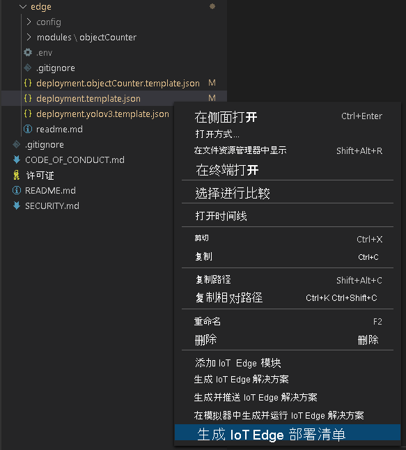
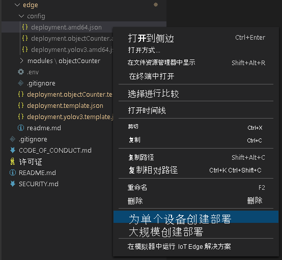

部署清单定义要部署到边缘设备的模块。 它还定义了这些模块的配置设置。 

请按照以下步骤从模板文件生成清单，然后将其部署到边缘设备。

1. 打开 Visual Studio Code。
1. 在“AZURE IOT 中心”窗格旁，选择“更多操作”图标以设置 IoT 中心连接字符串 。 可以从 src/cloud-to-device-console-app/appsettings.json 文件复制该字符串。 

    

> [!NOTE]
> 系统可能会要求你提供 IoT 中心的内置终结点信息。 若要获取此信息，请在 Azure 门户中导航到 IoT 中心，然后在左侧导航窗格中查找“内置终结点”选项。 单击此处，在“与事件中心兼容的终结点”部分下查找“与事件中心兼容的终结点” 。 复制并使用框中的文本。 终结点将如下所示：  
    ```
    Endpoint=sb://iothub-ns-xxx.servicebus.windows.net/;SharedAccessKeyName=iothubowner;SharedAccessKey=XXX;EntityPath=<IoT Hub name>
    ```

1. 右键单击“src/edge/deployment.template.json”并选择“生成 IoT Edge 部署清单”。

    

    此操作应在 src/edge/config 文件夹中创建一个名为“deployment.amd64.json”的清单文件 。
1. 右键单击“src/edge/config/deployment.amd64.json”，选择“为单个设备创建部署”，然后选择边缘设备的名称 。

    

1. 如果系统提示你选择 IoT 中心设备，请从下拉菜单中选择“lva-sample-device”。
1. 大约 30 秒后，在该窗口的左下角刷新 Azure IoT 中心。 边缘设备现在显示以下已部署的模块：

    * IoT Edge 上的实时视频分析（模块名称为 `lvaEdge`）
    * 实时流式处理协议 (RTSP) 模拟器（模块名称为 `rtspsim`）

RTSP 模拟器模块使用视频文件模拟实时视频流，该文件已在运行[实时视频分析资源设置脚本](https://github.com/Azure/live-video-analytics/tree/master/edge/setup)时复制到边缘设备。 

> [!NOTE]
> 如果使用的是自己的边缘设备，而不是设置脚本预配的边缘设备，请转到你的边缘设备并使用管理员权限运行以下命令，以拉取并存储该快速入门所使用的示例视频文件：  

```
mkdir /home/lvaedgeuser/samples      
mkdir /home/lvaedgeuser/samples/input    
curl https://lvamedia.blob.core.windows.net/public/camera-300s.mkv > /home/lvaedgeuser/samples/input/camera-300s.mkv  
chown -R lvalvaedgeuser:localusergroup /home/lvaedgeuser/samples/  
```
在此阶段，模块已部署，但没有媒体图处于活动状态。
