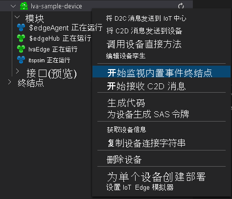

# <a name="tutorial-analyze-live-video-by-using-live-video-analytics-with-intel-openvino-dl-streamer--edge-ai-extension"></a>教程：将实时视频分析与 Intel OpenVINO™ DL Streamer Edge AI 扩展搭配用于分析实时视频 

[!INCLUDE [redirect to Azure Video Analyzer](./includes/redirect-video-analyzer.md)]

本教程介绍如何使用由 Intel 提供的 Intel OpenVINO™ DL Streamer Edge AI 扩展来分析（模拟）IP 相机中的实时视频源。 你将了解如何使用此推理服务器访问用于检测对象（人员、车辆或自行车）、对象分类（车辆归属）和对象跟踪（人员、车辆和自行车）的不同模型。 与 gRPC 模块的集成让你能够将视频帧发送到 AI 推理服务器。 结果随后会发送到 IoT Edge 中心。 在与实时视频分析相同的计算节点上运行此推理服务时，可利用通过共享内存发送视频数据的功能。 这样，你就能以实时视频源的帧速率运行推理（例如 30 帧/秒）。 

本教程将 Azure VM 用作 IoT Edge 设备，并使用模拟的实时视频流。 它基于用 C# 编写的示例代码，并以[检测运动并发出事件](detect-motion-emit-events-quickstart.md)快速入门为基础。

> [!NOTE]
> 本教程要求使用 x86-64 计算机作为你的 Edge 设备。

## <a name="prerequisites"></a>先决条件

* 包含活动订阅的 Azure 帐户。 如果没有帐户，可[免费创建一个帐户](https://azure.microsoft.com/free/?WT.mc_id=A261C142F)。
  > [!NOTE]
  > 你将需要一个具有服务主体创建权限（所有者角色提供此权限）的 Azure 订阅。 如果没有正确的权限，请联系帐户管理员，让其授予适当的权限。 
* 包含以下扩展的 [Visual Studio Code](https://code.visualstudio.com/)：
    * [Azure IoT Tools](https://marketplace.visualstudio.com/items?itemName=vsciot-vscode.azure-iot-tools)
    * [C#](https://marketplace.visualstudio.com/items?itemName=ms-dotnettools.csharp)
* [.NET Core 3.1 SDK](https://dotnet.microsoft.com/download/dotnet-core/3.1)。
* 如果未完成[检测运动并发出事件](detect-motion-emit-events-quickstart.md)快速入门，请确保完成[设置 Azure 资源](detect-motion-emit-events-quickstart.md#set-up-azure-resources)的步骤。

> [!TIP]
> 在安装 Azure IoT Tools 时，系统可能会提示安装 Docker。 可以忽略该提示。

## <a name="review-the-sample-video"></a>观看示例视频

设置 Azure 资源时，会将停车场的短视频复制到 Azure 中用作 IoT Edge 设备的 Linux VM 上。 此快速入门使用视频文件来模拟实时流。

打开一个应用程序，例如 [VLC 媒体播放器](https://www.videolan.org/vlc/)。 选择“Ctrl+N”，然后粘贴[视频](https://lvamedia.blob.core.windows.net/public/lots_015.mkv)的链接以开始播放。 可以看到停车场中车辆的视频片段，大多数是停着的，只有一辆在移动。

> [!VIDEO https://www.microsoft.com/videoplayer/embed/RE4LUbN]

在本快速入门中，你将使用 IoT Edge 上的实时视频分析和 Intel 提供的 Intel OpenVINO™ DL Streamer Edge AI 扩展来检测车辆等对象，从而对车辆进行分类，或跟踪车辆、人员或自行车。 将生成的推理事件发布到 IoT Edge 中心。

## <a name="overview"></a>概述

> [!div class="mx-imgBorder"]
> :::image type="content" source="./media/use-intel-openvino-tutorial/grpc-vas-extension-with-vino.svg" alt-text="LVA MediaGraph 概述":::

此图显示本快速入门中信号的流动方式。 [Edge 模块](https://github.com/Azure/live-video-analytics/tree/master/utilities/rtspsim-live555)会模拟托管实时流协议 (RTSP) 服务器的 IP 相机。 [RTSP 源](media-graph-concept.md#rtsp-source)节点会从该服务器拉取视频源，并将视频帧发送到 [gRPC 扩展处理器](media-graph-concept.md#grpc-extension-processor)节点。 

此 gRPC 扩展处理器节点以解码的视频帧作为输入，并将此类帧中继到 gRPC 服务器公开的 [gRPC](terminology.md#grpc) 终结点。 节点支持使用[共享内存](https://en.wikipedia.org/wiki/Shared_memory)传输数据，或将内容直接嵌入 gRPC 消息的正文中。 此外，此节点具有内置的图像格式化程序，用于在视频帧中继到 gRPC 终结点之前对它们进行缩放和编码。 缩放程序可以对图像纵横比进行保留、填充或拉伸。 图像编码器支持 jpeg、png 或 bmp 格式。 请在[此处](media-graph-extension-concept.md#grpc-extension-processor)详细了解处理器。

在本教程中，将：

1. 部署媒体图。
1. 解释结果。
1. 清理资源。

## <a name="about-intel-openvino-dl-streamer--edge-ai-extension-module"></a>关于 Intel OpenVINO™ DL Streamer Edge AI 扩展模块


OpenVINO™ DL Streamer Edge AI 扩展模块是一项基于 Intel 视频分析服务（VA 服务）的微服务，它为使用 OpenVINO™ DL Streamer 构建的视频分析管道提供服务。 开发人员可将已解码的视频帧发送到 AI 扩展模块，该模块执行检测、分类或跟踪并返回结果。 AI 扩展模块会公开与视频分析平台（如 Microsoft IoT Edge 上的实时视频分析）兼容的 gRPC API。 

为了构建复杂、高性能的实时视频分析解决方案，IoT Edge 模块上的实时视频分析应与功能强大的推理引擎配合使用，以利用边缘的规模。 在本教程中，推理请求会发送到 [Intel OpenVINO™ DL Streamer Edge AI 扩展]()，这是一个 Edge 模块，旨在与 IoT Edge 上的实时视频分析搭配使用。

在此推理服务器的初始版本中，你可以访问以下[模型](https://github.com/intel/video-analytics-serving/tree/master/samples/lva_ai_extension#edge-ai-extension-module-options)：

- object_detection for person_vehicle_bike_detection 

- object_classification for vehicle_attributes_recognition 

- object_tracking for person_vehicle_bike_tracking 

它使用预先加载的对象检测、对象分类和对象跟踪管道来快速启动。 此外，它还附带预先加载的 [person-vehicle-bike-detection-crossroad-0078](https://github.com/openvinotoolkit/open_model_zoo/blob/master/models/intel/person-vehicle-bike-detection-crossroad-0078/README.md) 和 [vehicle-attributes-recognition-barrier-0039 models](https://github.com/openvinotoolkit/open_model_zoo/blob/master/models/intel/vehicle-attributes-recognition-barrier-0039/README.md)。

> [!NOTE]
> 下载和使用 Edge 模块（Intel 提供的 OpenVINO™ DL Streamer Edge AI 扩展）及包含的软件，即表示你同意[许可协议](https://www.intel.com/content/www/us/en/legal/terms-of-use.html)下的条款和条件。
> Intel 致力于尊重人权，避免参与任何侵犯人权的行为。 阅读 [Intel 的全球人权原则](https://www.intel.com/content/www/us/en/policy/policy-human-rights.html)。 Intel 的产品和软件仅适用于不导致或不构成侵犯国际公认人权的应用程序。

只需更改部署模板中的管道环境变量，即可针对你的特定用例灵活地使用不同的管道。 这样，你就能够快速更改管道模型，而在与实时视频分析结合使用时，只需几秒即可更改媒体管道和推理模型。  

## <a name="create-and-deploy-the-media-graph"></a>创建和部署媒体图

### <a name="examine-and-edit-the-sample-files"></a>检查和编辑示例文件

作为先决条件的一部分，请将示例代码下载到一个文件夹中。 按照以下步骤检查并编辑示例文件。

1. 在 Visual Studio Code 中，转到 src/edge。 你可看到 .env 文件以及一些部署模板文件。

    部署模板是指边缘设备的部署清单。 它包含一些占位符值。 该 .env 文件包含这些变量的值。

1. 转到 src/cloud-to-device-console-app 文件夹。 你可在此处看到 appsettings.json 文件和一些其他文件：

    * c2d-console-app.csproj - Visual Studio Code 的项目文件。
    * operations.json - 希望程序运行的操作的列表。
    * Program.cs - 示例程序代码。 此代码：

        * 加载应用设置。
        * 调用 IoT Edge 模块上的实时视频分析公开的直接方法。 可以通过调用模块的[直接方法](direct-methods.md)来使用该模块分析实时视频流。
        * 暂停以检查“终端”窗口中程序的输出，并检查“输出”窗口中模块生成的事件 。
        * 调用直接方法以清理资源。


1. 编辑 operations.json 文件：
    * 将链接更改为图拓扑：

        `"topologyUrl" : "https://raw.githubusercontent.com/Azure/live-video-analytics/master/MediaGraph/topologies/grpcExtensionOpenVINO/2.0/topology.json"`

    * 在 `GraphInstanceSet` 下，编辑图拓扑的名称，使其与上一个链接中的值匹配：

      `"topologyName" : "InferencingWithOpenVINOgRPC"`

    * 在 `GraphTopologyDelete` 下，编辑名称：

      `"name": "InferencingWithOpenVINOgRPC"`

### <a name="generate-and-deploy-the-iot-edge-deployment-manifest"></a>生成并部署 IoT Edge 部署清单

1. 右键单击 src/edge/deployment.openvino.grpc.cpu.template.json 文件，然后选择“生成 IoT Edge 部署清单”。

      

    deployment.openvino.grpc.cpu.amd64.json 清单文件是在 src/edge/config 文件夹中创建的 。

> [!NOTE]
> 我们还包含了一个 deployment.openvino.grpc.gpu.template.json 模板，它为 Intel OpenVINO DL Streamer Edge AI 扩展模块提供 GPU 支持。 这些模板指向 Intel 的 Docker 中心映像。

上述模板指向 Intel Docker 中心映像。 如果你更希望在自己的 Azure 容器注册表上托管副本，可按照下面的步骤 1 和 2 进行操作：
1. 使用 SSH 连接到已安装 Docker CLI 工具的设备（即边缘设备），并按照以下步骤拉取/标记/推送容器：
    * 从 Docker 中心拉取 Intel 的映像：

        `sudo docker pull intel/video-analytics-serving:0.4.1-dlstreamer-edge-ai-extension`
    
    * 使用自己的 Azure 容器注册表名称标记 Intel 的映像。 将 {你的 ACR 名称} 替换为可在 .env 文件中找到的 ACR 名称：

        `sudo docker image tag intel/video-analytics-serving:0.4.1-dlstreamer-edge-ai-extension {YOUR ACR NAME/video-analytics-serving:0.4.1-dlstreamer-edge-ai-extension}`
    
    * 向 Azure 容器注册表推送已标记的映像：

        `sudo docker push {YOUR ACR NAME/video-analytics-serving:0.4.1-dlstreamer-edge-ai-extension}`
    
2. 现在需要编辑模板，以引用 Azure 容器注册表上托管的新映像。
    * 右键单击 deployment.openvino.grpc.cpu.template.json，然后导航到 lavExtension 模块部分并替换 ：

        `intel/video-analytics-serving:0.4.1-dlstreamer-edge-ai-extension`

        替换为：

        `{YOUR ACR NAME/video-analytics-serving:0.4.1-dlstreamer-edge-ai-extension}`
    * 对 deployment.openvino.grpc.gpu.template.json 重复步骤 2


3. 如果已完成[检测运动并发出事件](detect-motion-emit-events-quickstart.md)快速入门，则跳过此步骤。 

    否则，请在左下角“AZURE IOT 中心”窗格附近选择“更多操作”图标，然后选择“设置 IoT 中心连接字符串”  。 可以从 appsettings.json 文件中复制字符串。 或者，为确保在 Visual Studio Code 中配置了正确的 IoT 中心，请使用[选择 IoT 中心命令](https://github.com/Microsoft/vscode-azure-iot-toolkit/wiki/Select-IoT-Hub)。
    
    

> [!NOTE]
> 系统可能会要求你提供 IoT 中心的内置终结点信息。 若要获取此信息，请在 Azure 门户中导航到 IoT 中心，然后在左侧导航窗格中查找“内置终结点”选项。 单击此处，在“与事件中心兼容的终结点”部分下查找“与事件中心兼容的终结点” 。 复制并使用框中的文本。 终结点将如下所示：  
    ```
    Endpoint=sb://iothub-ns-xxx.servicebus.windows.net/;SharedAccessKeyName=iothubowner;SharedAccessKey=XXX;EntityPath=<IoT Hub name>
    ```

1. 右键单击 src/edge/config/deployment.openvino.grpc.cpu.template.json，然后选择“为单个设备创建部署”。 

    

1. 如果系统提示你选择 IoT 中心设备，请选择“lva-sample-device”。
1. 大约 30 秒后，在该窗口的左下角刷新 Azure IoT 中心。 边缘设备现在显示以下已部署的模块：

    * 实时视频分析模块，名为“lvaEdge”
    * rtspsim 模块，可模拟 RTSP 服务器，充当实时视频源的源
    * LvaExtension 模块，它是 Intel OpenVINO™ DL Streamer Edge AI 扩展 

### <a name="prepare-to-monitor-events"></a>准备监视事件

右键单击实时视频分析设备，并选择“开始监视内置事件终结点”。 需要执行此步骤，以在 Visual Studio Code 的“输出”窗口中监视 IoT 中心事件。 

 

### <a name="run-the-sample-program-to-detect-vehicles-persons-or-bike"></a>运行示例程序以检测人员、车辆或自行车
如果在浏览器中打开本教程的[图形拓扑](https://raw.githubusercontent.com/Azure/live-video-analytics/master/MediaGraph/topologies/grpcExtensionOpenVINO/2.0/topology.json)，你将看到 `grpcExtensionAddress` 的值已设置为 `tcp://lvaExtension:5001`，与 httpExtensionOpenVINO 示例相比，无需将 URL 更改为 gRPC 服务器， 而是指示模块使用前面提到的环境变量运行特定管道。 在默认模板中，我们针对“person_vehicle_bike_detection”将其设置为了“object_detection”。 可尝试使用其他支持的管道。 

1. 在 Visual Studio Code 中，打开“扩展”选项卡（或按 Ctrl+Shift+X），然后搜索“Azure IoT 中心”。
1. 右键单击并选择“扩展设置”。

    > [!div class="mx-imgBorder"]
    > :::image type="content" source="./media/run-program/extensions-tab.png" alt-text="扩展设置":::
1. 搜索并启用“显示详细消息”。

    > [!div class="mx-imgBorder"]
    > :::image type="content" source="./media/run-program/show-verbose-message.png" alt-text="显示详细消息":::
1. 若要启动调试会话，请选择 F5 键。 你可在“终端”窗口中看到打印的消息。
1. operations.json 代码首先调用直接方法 `GraphTopologyList` 和 `GraphInstanceList`。 如果你在完成先前的快速入门后清理了资源，则该过程将返回空列表，然后暂停。 若要继续，请选择 Enter 键。

    “终端”窗口将显示下一组直接方法调用：

     * 对 `GraphTopologySet` 的调用，该调用使用前面的 `topologyUrl`
     * 对 `GraphInstanceSet` 的调用，该调用使用以下正文：

         ```
         {
           "@apiVersion": "2.0",
           "name": "Sample-Graph-1",
           "properties": {
             "topologyName": "InferencingWithOpenVINOgRPC",
             "description": "Sample graph description",
             "parameters": [
               {
                 "name": "rtspUrl",
                 "value": "rtsp://rtspsim:554/media/lots_015.mkv"
               },
               {
                 "name": "rtspUserName",
                 "value": "testuser"
               },
               {
                 "name": "rtspPassword",
                 "value": "testpassword"
               }
             ]
           }
         }
         ```

     * 对 `GraphInstanceActivate` 的调用，用于启动图形实例和视频流
     * 对 `GraphInstanceList` 的第二次调用，显示图形实例处于运行状态
1. “终端”窗口中的输出会在出现 `Press Enter to continue` 提示时暂停。 暂时不要选择 Enter。 向上滚动，查看调用的直接方法的 JSON 响应有效负载。
1. 切换到 Visual Studio Code 中的“输出”窗口。 可看到 IoT Edge 模块上的实时视频分析正发送到 IoT 中心的消息。 本快速入门中的以下部分将讨论这些消息。
1. 媒体图将继续运行并打印结果。 RTSP 模拟器不断循环源视频。 若要停止媒体图，请返回“终端”窗口，并选择 Enter。 

    接下来会执行一系列调用，以清理资源：
      * 调用 `GraphInstanceDeactivate` 停用图形实例。
      * 调用 `GraphInstanceDelete` 删除该实例。
      * 调用 `GraphTopologyDelete` 删除拓扑。
      * 对 `GraphTopologyList` 的最后一次调用显示该列表为空。

## <a name="interpret-results"></a>解释结果

运行媒体图时，来自 HTTP 扩展处理器节点的结果将通过 IoT 中心接收器节点传递到 IoT 中心。 在“输出”窗口中看到的消息包含 `body` 和 `applicationProperties` 部分。 有关详细信息，请参阅[创建和读取 IoT 中心消息](../../iot-hub/iot-hub-devguide-messages-construct.md)。

在下面的消息中，实时视频分析模块定义了应用程序属性和正文内容。 

### <a name="mediasessionestablished-event"></a>MediaSessionEstablished 事件

对媒体图进行实例化后，RTSP 源节点尝试连接到在 rtspsim-live555 容器上运行的 RTSP 服务器。 如果连接成功，则打印以下事件。 事件类型为 Microsoft.Media.MediaGraph.Diagnostics.MediaSessionEstablished。

```
[IoTHubMonitor] [9:42:18 AM] Message received from [lvaedgesample/lvaEdge]:
{
  "sdp&quot;: &quot;SDP:\nv=0\r\no=- 1612432131600584 1 IN IP4 172.18.0.6\r\ns=Matroska video+audio+(optional)subtitles, streamed by the LIVE555 Media Server\r\ni=media/homes_00425.mkv\r\nt=0 0\r\na=tool:LIVE555 Streaming Media v2020.08.19\r\na=type:broadcast\r\na=control:*\r\na=range:npt=0-214.166\r\na=x-qt-text-nam:Matroska video+audio+(optional)subtitles, streamed by the LIVE555 Media Server\r\na=x-qt-text-inf:media/homes_00425.mkv\r\nm=video 0 RTP/AVP 96\r\nc=IN IP4 0.0.0.0\r\nb=AS:500\r\na=rtpmap:96 H264/90000\r\na=fmtp:96 packetization-mode=1;profile-level-id=64001F;sprop-parameter-sets=Z2QAH6zZQFAFuwFsgAAAAwCAAAAeB4wYyw==,aOvhEsiw\r\na=control:track1\r\n"
}
```

在此消息中，请注意以下详细信息：

* 消息为诊断事件。 `MediaSessionEstablished` 指示 RTSP 源节点（使用者）与 RTSP 模拟器连接，并已开始接收（模拟的）实时馈送。
* `applicationProperties` 中的 `subject` 指示消息是从媒体图中的 RTSP 源节点生成的。
* `applicationProperties` 中的 `eventType` 指示此事件是诊断事件。
* `eventTime` 指示事件发生的时间。
* `body` 包含有关诊断事件的数据。 在本例中，数据包含[会话描述协议 (SDP)](https://en.wikipedia.org/wiki/Session_Description_Protocol) 详细信息。

### <a name="inference-event"></a>推理事件

gRPC 扩展处理器节点从 Intel OpenVINO™ DL Streamer Edge AI 扩展接收推理结果。 然后它通过 IoT 中心接收器节点将结果作为推理事件发出。 

在这些事件中，类型设置为 `entity`，用于指示它是实体，如汽车或卡车等。 `eventTime` 值为检测到对象时的 UTC 时间。 

在下面的示例中，你看到它识别了一辆车、该车辆的类型（货车）和颜色（白色），每一项的置信度均高于 0.9，而当我们使用对象跟踪模型时，它还为实体分配了 ID。

```
[IoTHubMonitor] [9:43:18 AM] Message received from [lva-sample-device/lvaEdge]:
{
  "timestamp": 145118912223221,
  "inferences": [
    {
      "type": "entity",
      "entity": {
        "tag": {
          "value": "vehicle",
          "confidence": 0.9605301
        },
        "attributes": [
          {
            "name": "color",
            "value": "white",
            "confidence": 0.9605301
          },
          {
            "name": "type",
            "value": "car",
            "confidence": 0.9605301
          }
        ],
        "box": {
          "l": 0.3958135,
          "t": 0.078730375,
          "w": 0.48403296,
          "h": 0.94352424
        },
        "id&quot;: &quot;1"
      }
    }
}
```

在消息中，请注意以下详细信息：

* `applicationProperties` 中的 `subject` 引用生成消息的图形拓扑中的节点。 
* `applicationProperties` 中的 `eventType` 指示此事件是分析事件。
* `eventTime` 值为事件发生的时间。
* `body` 部分包含有关分析事件的数据。 在本例中，该事件是推理事件，因此正文包含 `inferences` 数据。
* `inferences` 部分指示 `type` 为 `entity`。 本部分包含有关实体的其他数据。

## <a name="run-the-sample-program-to-detect-persons-or-vehicles-or-bikes"></a>运行实例程序以检测人、车辆或自行车
若要使用其他模型，你将需要更改部署模板。 若要在支持的模型之间切换，可更改 lvaExtenstion 模块中的环境变量。 有关受支持的值和模型组合，请参阅 [GitHub 上的此文档](https://github.com/intel/video-analytics-serving/tree/master/samples/lva_ai_extension#edge-ai-extension-module-options)。

```
"Env":[
"PIPELINE_NAME=object_classification",
"PIPELINE_VERSION=vehicle_attributes_recognition"
],
```
> [!TIP]
> 复制模板并针对每个可能的管道按新名称来存储它。 这样，你就可基于这些模板之一创建新的部署，在模型之间切换。

更改变量后，可将模板再次部署到设备。 现可使用新管道重复上述步骤以再次运行示例程序。 推理结果将会相似（在架构中），但根据所选管道模型显示更多或更少的信息。

## <a name="clean-up-resources"></a>清理资源

如果计划学习其他快速入门或教程，请保留创建的资源。 否则，请转到 Azure 门户，再转到资源组，选择运行本教程所用的资源组，并删除所有资源。

## <a name="next-steps"></a>后续步骤

查看高级用户面临的其他挑战：

* 使用支持 RTSP 的 [IP 相机](https://en.wikipedia.org/wiki/IP_camera)，而不是使用 RTSP 模拟器。 可以在 [ONVIF 符合标准的产品](https://www.onvif.org/conformant-products/)页面上搜索支持 RTSP 的 IP 摄像机。 查找符合配置文件 G、S 或 T 的设备。
* 使用 Intel x64 Linux 设备，而不是 Azure Linux VM。 此设备必须与 IP 相机位于同一网络中。 可以按照[在 Linux 上安装 Azure IoT Edge 运行时](../../iot-edge/how-to-install-iot-edge.md)中的说明进行操作。 然后按照[将首个 IoT Edge 模块部署到虚拟 Linux 设备](../../iot-edge/quickstart-linux.md)中的说明，将设备注册到 Azure IoT 中心。
