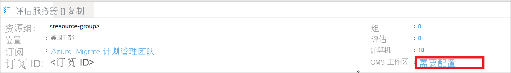
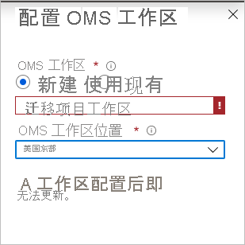
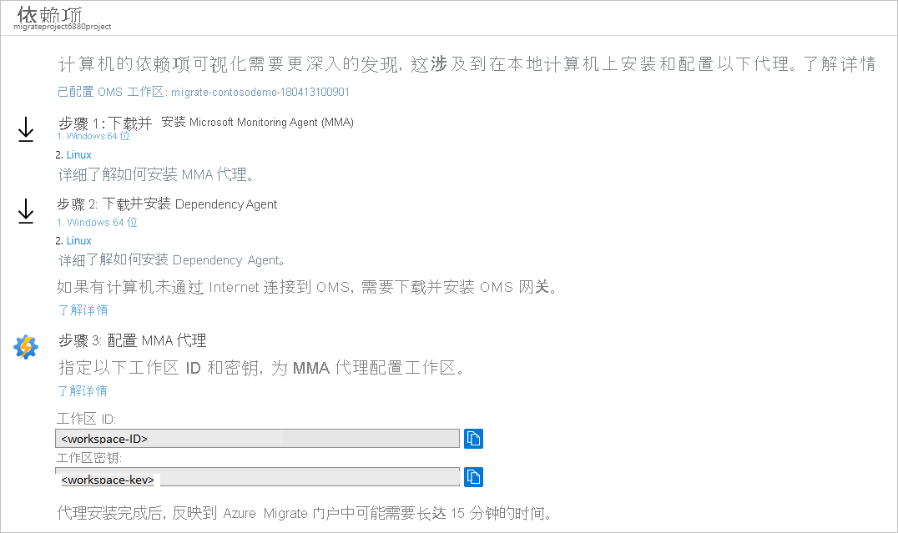

# <a name="set-up-dependency-visualization"></a>设置依赖项可视化

本文介绍如何在“Azure Migrate：发现和评估”中设置基于代理的依赖项分析。 [依赖项分析](concepts-dependency-visualization.md)有助于确定和了解要评估并迁移到 Azure 的服务器之间的依赖项。

## <a name="before-you-start"></a>开始之前

- 查看对以下项的基于代理的依赖项分析的支持和部署要求：
    - [VMware 环境中的服务器](migrate-support-matrix-vmware.md#dependency-analysis-requirements-agent-based)
    - [物理服务器](migrate-support-matrix-physical.md#agent-based-dependency-analysis-requirements)
    - [Hyper-V 环境中的服务器](migrate-support-matrix-hyper-v.md#agent-based-dependency-analysis-requirements)
- 确保：
    - 具有 Azure Migrate 项目。 如果没有，则立即[创建](./create-manage-projects.md)一个。
    - 检查是否已将“Azure Migrate：发现和评估”工具[添加](how-to-assess.md)到项目。
    - 设置 [Azure Migrate 设备](migrate-appliance.md)以发现本地服务器。 该设备用于发现本地服务器，并将元数据和性能数据发送到“Azure Migrate：发现和评估”。 为以下项设置设备：
        - [VMware 环境中的服务器](how-to-set-up-appliance-vmware.md)
        - [Hyper-V 环境中的服务器](how-to-set-up-appliance-hyper-v.md)
        - [物理服务器](how-to-set-up-appliance-physical.md)
- 若要使用依赖项可视化，请将 [Log Analytics 工作区](../azure-monitor/logs/manage-access.md)与 Azure Migrate 项目相关联。
    - 仅在设置 Azure Migrate 设备并在 Azure Migrate 项目中发现服务器后，才能附加工作区。
    - 请确保订阅中具有包含 Azure Migrate 项目的工作区。
    - 工作区必须位于美国东部、东南亚或欧洲西部区域。 其他区域中的工作区无法与项目相关联。
    - 工作区必须位于[支持服务映射](../azure-monitor/vm/vminsights-configure-workspace.md#supported-regions)的区域中。
    - 可以将新的或现有的 Log Analytics 工作区与 Azure Migrate 项目相关联。
    - 首次为服务器设置依赖项可视化时，附加工作区。 Azure Migrate 项目的工作区在添加后就无法修改了。
    - 在 Log Analytics 中，与 Azure Migrate 关联的工作区标记有迁移项目密钥和项目名称。

## <a name="associate-a-workspace"></a>关联工作区

1. 发现用于评估的服务器后，请在“服务器” > “Azure Migrate：发现和评估”中，单击“概述”。  
2. 在“Azure Migrate：发现和评估”中，单击“Essentials”。
3. 在“OMS 工作区”中，单击“需要配置”。

        

4. 在“配置 OMS 工作区”中，指定是否要创建新的工作区或使用现有工作区。
    - 可以从项目订阅中的所有工作区选择现有工作区。
    - 需要工作区的读取器访问权限来关联它。
5. 如果创建新的工作区，请选择新工作区的位置。

    

> [!Note]
> [了解如何](../azure-monitor/logs/private-link-security.md)配置 OMS 工作区以实现专用终结点连接。  

## <a name="download-and-install-the-vm-agents"></a>下载并安装 VM 代理

在要分析的每个服务器上，安装代理。

> [!NOTE]
> 受 System Center Operations Manager 2012 R2 或更高版本监视的服务器无需安装 MMA 代理。 服务映射与 Operations Manager 集成。 [遵循](../azure-monitor/vm/service-map-scom.md#prerequisites)集成指南。

1. 在“Azure Migrate：发现和评估”中，单击“已发现的服务器”。
2. 对于要通过依赖项可视化进行分析的每个服务器，请在“依赖项”列中单击“需要安装代理”。
3. 在“依赖项”页上，下载适用于 Windows 或 Linux 的 MMA 和依赖项代理。
4. 在“配置 MMA 代理”下，复制工作区 ID 和密钥。 安装 MMA 代理时需要这些。

    


## <a name="install-the-mma"></a>安装 MMA

在要分析的每个 Windows 或 Linux 服务器上安装 MMA。

### <a name="install-mma-on-a-windows-server"></a>在 Windows 服务器上安装 MMA

在 Windows 服务器上安装代理：

1. 双击下载的代理。
2. 在“欢迎”页面上，单击“下一步”。  在“许可条款”页面上，单击“我接受”以接受许可协议。
3. 在“目标文件夹”中，保留或修改默认安装文件夹，然后选择“下一步”。
4. 在“代理安装选项”中，选择“Azure Log Analytics” > “下一步”。
5. 单击“添加”以添加 Log Analytics 工作区。 粘贴从门户复制的工作区 ID 和密钥。 单击“下一步”。

可以从命令行或使用自动化方法（如 Configuration Manager 或 Intigua）安装代理。
- [详细了解](../azure-monitor/agents/log-analytics-agent.md#installation-options)如何使用这些方法安装 MMA 代理。
- 还可使用此[脚本](https://github.com/brianbar-MSFT/Install-MMA)安装 MMA 代理。
- [详细了解](../azure-monitor/agents/agents-overview.md#supported-operating-systems) MMA 支持的 Windows 操作系统。

### <a name="install-mma-on-a-linux-server"></a>在 Linux 服务器上安装 MMA

在 Linux 服务器上安装 MMA：

1. 使用 scp/sftp 将相应的捆绑包（x86 或 x64）传输到 Linux 计算机。

2. 使用 --install 参数安装捆绑包。

   `sudo sh ./omsagent-<version>.universal.x64.sh --install -w <workspace id> -s <workspace key>`

[详细了解 MMA 支持的 Linux 操作系统的列表](../azure-monitor/agents/agents-overview.md#supported-operating-systems)。 

## <a name="install-the-dependency-agent"></a>安装依赖项代理

1. 若要在 Windows 服务器上安装依赖项代理，请双击安装程序文件，然后按照向导操作。

2. 若要在 Linux 服务器上安装依赖项代理，请使用以下命令安装为根目录：

   `sh InstallDependencyAgent-Linux64.bin`

- [详细了解](../azure-monitor/vm/vminsights-enable-hybrid.md#dependency-agent)如何使用脚本来安装依赖项代理。
- [详细了解](../azure-monitor/vm/vminsights-enable-overview.md#supported-operating-systems)依赖项代理支持的操作系统。


## <a name="create-a-group-using-dependency-visualization"></a>使用依赖项可视化创建组

现在创建一个组用于评估。 


> [!NOTE]
> 要可视化其依赖项的组所包含的服务器不应超过 10 台。 如果超过 10 台服务器，请将它们拆分成较小的组。

1. 在“Azure Migrate：发现和评估”中，单击“已发现的服务器”。
2. 在“依赖项”列中，单击要查看的每台服务器的“查看依赖项”。
3. 在依赖项映射上，可以看到以下内容：
    - 与服务器的入站（客户端）和出站（服务器）TCP 连接。
    - 未安装依赖项代理的依赖服务器按端口号进行分组。
    - 安装了依赖项代理的依赖服务器显示为单独的框。
    - 服务器内运行的进程。 展开每个服务器框可查看进程。
    - 服务器属性（包括 FQDN、操作系统、MAC 地址）。 单击每个服务器框以查看详细信息。

4. 可通过单击时间范围标签中的持续时间，查看不同持续时间的依赖项。
    - 时间范围默认为 1 小时。 
    - 你可以修改时间范围，或指定开始和结束日期以及持续时间。
    - 时间范围可长达一小时。 如果需要更长的范围，请使用 Azure Monitor 查询更长时间内的依赖数据。

5. 确定想要分成一组的依赖服务器之后，按住 Ctrl 键单击，在映射上选择多台服务器，然后单击“分组计算机”。
6. 指定组名。
7. 确认 Azure Migrate 已发现依赖服务器。

    - 如果“Azure Migrate：发现和评估”未发现依赖服务器，则不能将其添加到组中。
    - 若要添加服务器，请再次运行发现，并验证是否发现了该服务器。

8. 如果想要为该组创建评估，请选中相应复选框，为该组创建新的评估。
8. 单击“确定”以保存组。

创建组后，建议在组中的所有服务器上安装代理，然后将整个组的依赖项可视化。

## <a name="query-dependency-data-in-azure-monitor"></a>在 Azure Monitor 中查询依赖项数据

可以在与 Azure Migrate 项目关联的 Log Analytics 工作区中查询服务映射捕获的依赖项数据。 Log Analytics 用于编写和运行 Azure Monitor 日志查询。

- [了解如何](../azure-monitor/vm/service-map.md#log-analytics-records)在 Log Analytics 中搜索服务映射数据。
- [大致了解](../azure-monitor/logs/get-started-queries.md)如何在 [Log Analytics](../azure-monitor/logs/log-analytics-tutorial.md) 中编写日志查询。

对依赖项数据运行查询，如下所示：

1. 安装代理后，请转到门户并单击“概述”。
2. 在“Azure Migrate：发现和评估”中，单击“概述”。 单击向下箭头以展开“Essentials”。
3. 在“OMS 工作区”中，单击工作区名称。
3. 在“Log Analytics 工作区”页的“常规”中，单击“日志” 。
4. 编写查询，然后单击“运行”。

### <a name="sample-queries"></a>示例查询

下面是一些可用于提取依赖项数据的示例查询。

- 可修改查询以提取首选数据点。
- [查看](../azure-monitor/vm/service-map.md#log-analytics-records)依赖项数据记录的完整列表。
- [查看](../azure-monitor/vm/service-map.md#sample-log-searches)其他示例查询。

#### <a name="sample-review-inbound-connections"></a>示例：查看入站连接

查看一组服务器的入站连接。

- 针对连接指标的表中的记录 (VMConnection) 不显示单个物理网络连接。
- 多个物理网络连接分组到一个逻辑连接中。
- [详细了解](../azure-monitor/vm/service-map.md#connections)物理网络连接数据如何聚合到 VMConnection 中。

```
// the servers of interest
let ips=materialize(ServiceMapComputer_CL
| summarize ips=makeset(todynamic(Ipv4Addresses_s)) by MonitoredMachine=ResourceName_s
| mvexpand ips to typeof(string));
let StartDateTime = datetime(2019-03-25T00:00:00Z);
let EndDateTime = datetime(2019-03-30T01:00:00Z);
VMConnection
| where Direction == 'inbound'
| where TimeGenerated > StartDateTime and TimeGenerated  < EndDateTime
| join kind=inner (ips) on $left.DestinationIp == $right.ips
| summarize sum(LinksEstablished) by Computer, Direction, SourceIp, DestinationIp, DestinationPort
```

#### <a name="sample-summarize-sent-and-received-data"></a>示例：汇总已发送和已接收的数据

此示例汇总了一组服务器之间的入站连接上发送与接收的数据量。

```
// the servers of interest
let ips=materialize(ServiceMapComputer_CL
| summarize ips=makeset(todynamic(Ipv4Addresses_s)) by MonitoredMachine=ResourceName_s
| mvexpand ips to typeof(string));
let StartDateTime = datetime(2019-03-25T00:00:00Z);
let EndDateTime = datetime(2019-03-30T01:00:00Z);
VMConnection
| where Direction == 'inbound'
| where TimeGenerated > StartDateTime and TimeGenerated  < EndDateTime
| join kind=inner (ips) on $left.DestinationIp == $right.ips
| summarize sum(BytesSent), sum(BytesReceived) by Computer, Direction, SourceIp, DestinationIp, DestinationPort
```

## <a name="next-steps"></a>后续步骤

为组[创建评估](how-to-create-assessment.md)。
