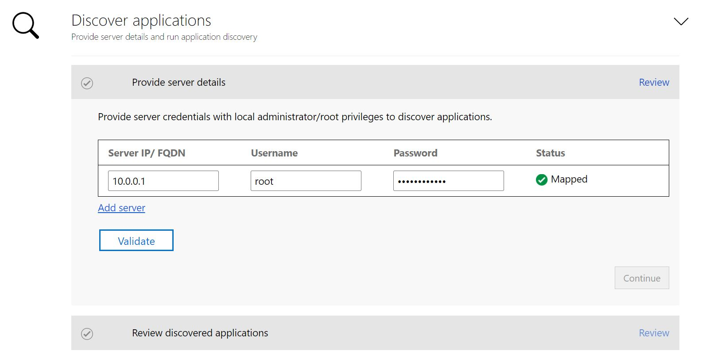
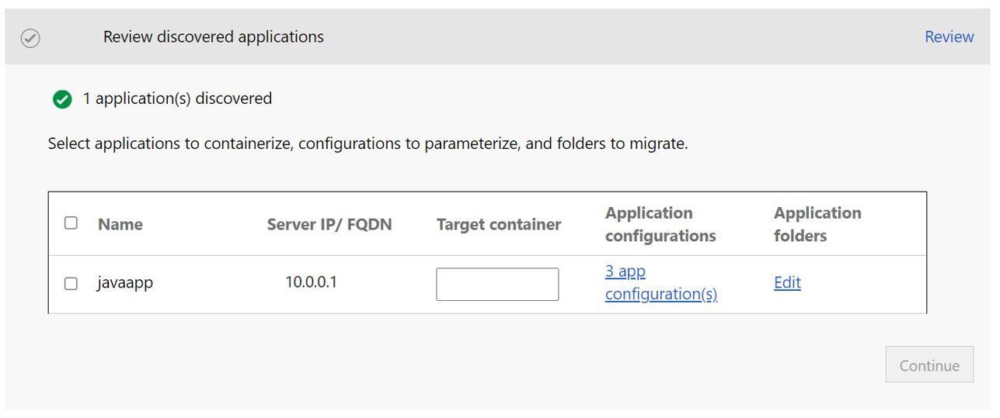
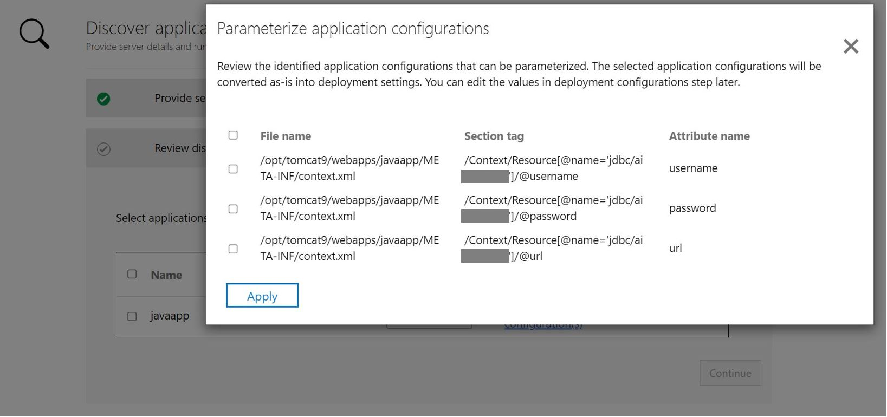
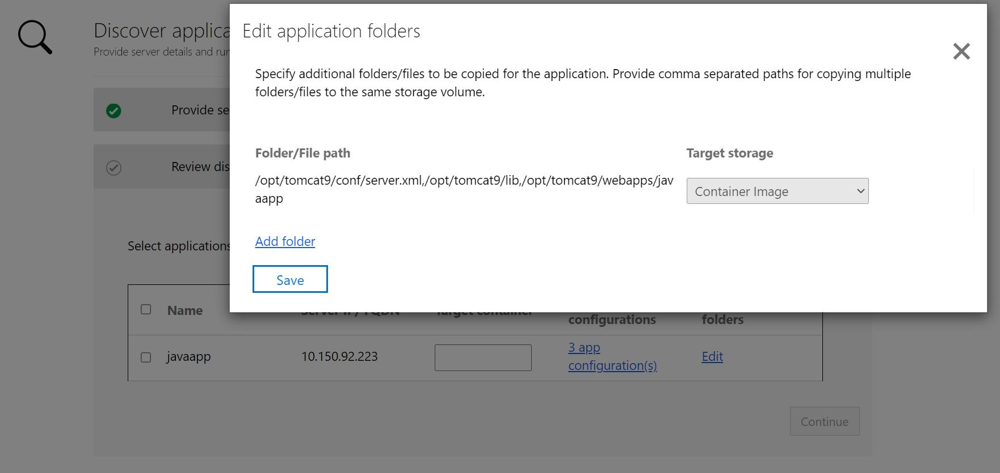
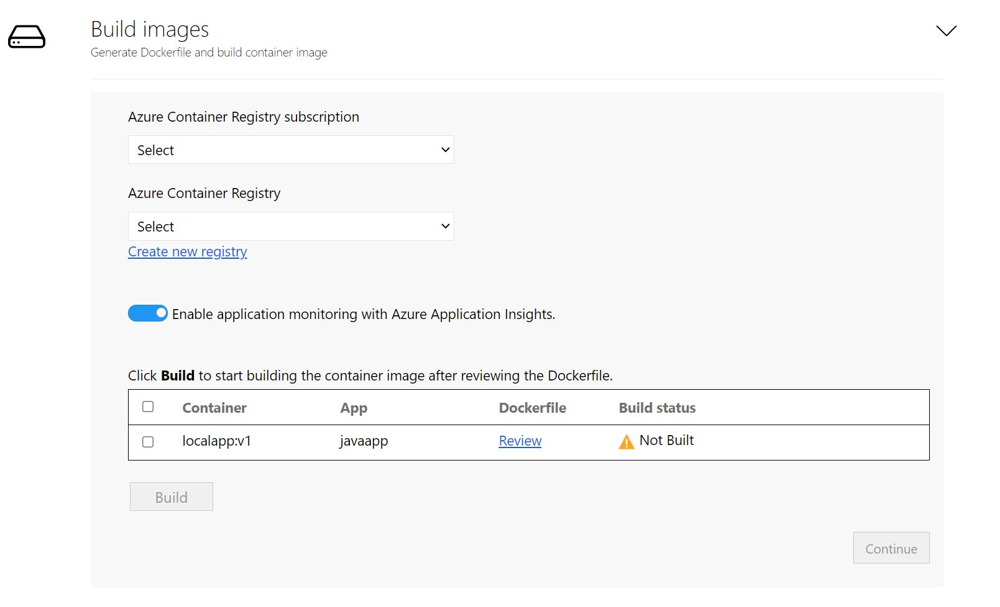
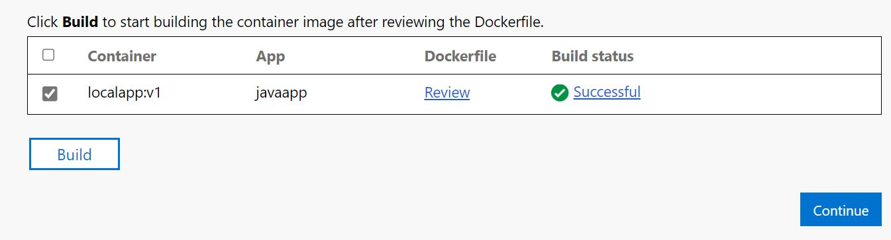
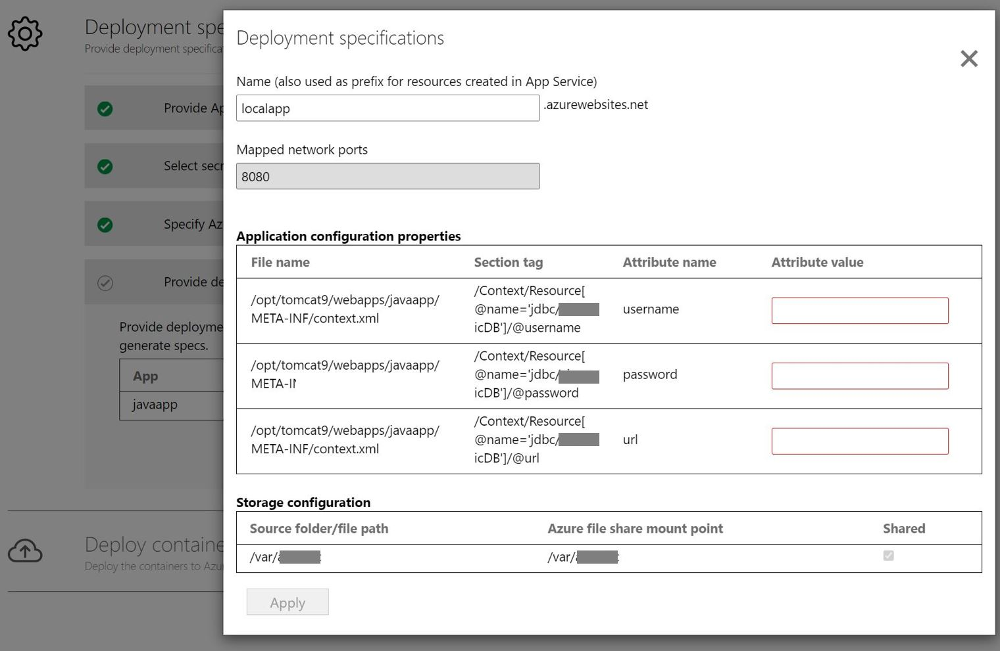
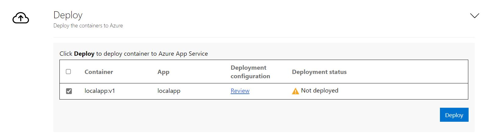

# <a name="java-web-app-containerization-and-migration-to-azure-app-service"></a>容器化 Java Web 应用并将其迁移到 Azure 应用服务

在本文中，你将学习如何容器化 Java Web 应用程序（在 Apache Tomcat 上运行）并使用“Azure Migrate：应用容器化工具”将其迁移到 [Azure 应用服务](https://azure.microsoft.com/services/app-service/)。 容器化过程不需要访问代码库，并提供了一种简单的方法来容器化现有应用程序。 该工具的工作原理是使用服务器上应用程序的运行状态来确定应用程序组件，并帮助你将它们打包到容器映像中。 然后可将已容器化的应用程序部署到 Azure 应用服务。

Azure Migrate: 应用容器化工具当前支持 -

- 在 Apache Tomcat（在 Linux 服务器上）上容器化 Java Web 应用，并将其部署到应用服务上的 Linux 容器中。
- 在 Apache Tomcat（在 Linux 服务器上）上容器化 Java Web 应用，并将其部署到 AKS 上的 Linux 容器中。 [了解详细信息](./tutorial-app-containerization-java-kubernetes.md)
- 容器化 ASP.NET 应用并将其部署到 AKS 上的 Windows 容器。 [了解详细信息](./tutorial-app-containerization-aspnet-kubernetes.md)
- 容器化 ASP.NET 应用并将其部署到应用服务上的 Windows 容器中。 [了解详细信息](./tutorial-app-containerization-aspnet-app-service.md)


Azure Migrate: 应用容器化工具可帮助你 -

- 发现应用程序：该工具远程连接到运行 Java Web 应用程序的应用程序服务器（在 Apache Tomcat 上运行），并发现应用程序组件。 该工具将创建一个可用于为应用程序创建容器映像的 Dockerfile。
- **生成容器映像**：可以根据应用程序要求检查并进一步自定义 Dockerfile，并使用它来生成应用程序容器映像。 应用程序容器映像会被推送到指定的 Azure 容器注册表。
- 部署到 Azure 应用服务：然后，该工具会生成将已容器化的应用程序部署到 Azure 应用服务所需的部署文件。

> [!NOTE]
> Azure Migrate: 应用容器化工具可帮助你发现特定应用程序类型（Apache Tomcat 上的 ASP.NET 和 Java Web 应用）以及它们在应用服务器上的组件。 若要发现服务器以及在本地计算机上运行的应用、角色和功能的清单，请使用 Azure Migrate: 发现和评估功能。 [了解详细信息](./tutorial-discover-vmware.md)

虽然在不进行重大重构的情况下直接迁移到容器并不能使所有应用程序获益，但不进行重写地将现有应用迁移到容器中的一些好处包括：

- **提高基础结构利用率**：借助容器，多个应用程序可以共享资源，并托管在同一基础结构上。 这有助于整合基础结构并提高利用率。
- 简化的管理：在新式托管平台（如 AKS 和应用服务）上托管应用程序可以简化管理实践。 可以通过停用或减少通常使用拥有的基础结构执行的基础结构维护和管理过程来实现此目的。
- 应用程序可移植性：随着容器规范格式逐渐普及和业务流程平台标准化程度的提高，应用程序的可移植性不再是问题。
- 采用 DevOps 的新式管理：帮助你在管理、安全性和过渡到 DevOps 的过程中采用新式做法并加以标准化。


本教程介绍以下操作：

> [!div class="checklist"]
> * 设置 Azure 帐户。
> * 安装 Azure Migrate: 应用容器化工具。
> * 发现 Java Web 应用程序。
> * 生成容器映像。
> * 在应用服务上部署容器化应用程序。

> [!NOTE]
> 教程中演示了方案的最简单部署路径，使你能够快速设置概念证明。 教程尽可能使用默认选项，不会演示所有可能的设置和路径。

## <a name="prerequisites"></a>先决条件

开始学习本教程之前，应做好以下准备：

**要求** | **详细信息**
--- | ---
**确定要安装工具的计算机** | 用于安装和运行 Azure Migrate: 应用容器化工具的 Windows 计算机。 Windows 计算机可以是服务器（Windows Server 2016 或更高版本）或客户端 (Windows 10) 操作系统，这意味着该工具也可在桌面上运行。 <br/><br/> 运行该工具的 Windows 计算机应该可以通过网络连接到那些托管要容器化的 Java Web 应用程序的服务器/虚拟机。<br/><br/> 确保运行 Azure Migrate: 应用容器化工具的 Windows 计算机上有 6 GB 的可用空间，用于存储应用程序项目。 <br/><br/> Windows 计算机应可以直接或通过代理访问 Internet。
**应用程序服务器** | - 在运行要容器化的 Java 应用程序的服务器的端口 22 上启用安全外壳 (SSH) 连接。 <br/>
**Java Web 应用程序** | 该工具当前支持 <br/><br/> - 在 Tomcat 8 或更高版本上运行的应用程序。<br/> - Ubuntu Linux 16.04/18.04/20.04、Debian 7/8、CentOS 6/7、Red Hat Enterprise Linux 5/6/7 上的应用程序服务器。 <br/> - 使用 Java 7 或更高版本的应用程序。  <br/><br/> 该工具当前不支持 <br/><br/> - 运行多个 Tomcat 实例的应用程序服务器 <br/>  


## <a name="prepare-an-azure-user-account"></a>准备 Azure 用户帐户

如果没有 Azure 订阅，请在开始之前创建一个[免费帐户](https://azure.microsoft.com/pricing/free-trial/)。

订阅设置完成后，你将需要一个拥有以下权限的 Azure 用户帐户：
- Azure 订阅的所有者权限
- 注册 Azure Active Directory 应用的权限

如果你刚刚创建了免费的 Azure 帐户，那么你就是订阅的所有者。 如果你不是订阅所有者，请让所有者分配权限，如下所示：

1. 在 Azure 门户中，搜索“订阅”，然后在“服务”下选择“订阅” 。

    

2. 在“订阅”页上，选择要在其中创建 Azure Migrate 项目的订阅。
3. 在“订阅”中，选择“访问控制 (IAM)” > “检查访问权限” 。
4. 在“检查访问权限”中，搜索相关的用户帐户。
5. 在“添加角色分配”中，单击“添加” 。

    

6. 在“添加角色分配”中，选择“所有者”角色，然后选择帐户（本例中为 azmigrateuser）。 然后单击“保存”  。

    

7. Azure 帐户还需要注册 Azure Active Directory 应用的权限。
8. 在 Azure 门户中，导航到“Azure Active Directory” > “用户” > “用户设置”  。
9. 在“用户设置”中，验证 Azure AD 用户是否可以注册应用程序（默认情况下设置为“是”） 。

      

10. 如果“应用注册”设置设置为“否”，请请求租户/全局管理员分配所需的权限。 或者，租户/全局管理员可将“应用程序开发人员”角色分配给帐户，以允许注册 Azure Active Directory 应用。 [了解详细信息](../active-directory/fundamentals/active-directory-users-assign-role-azure-portal.md)。

## <a name="download-and-install-azure-migrate-app-containerization-tool"></a>下载并安装 Azure Migrate: 应用容器化工具

1. 在 Windows 计算机上[下载](https://go.microsoft.com/fwlink/?linkid=2134571) Azure Migrate: 应用容器化安装程序。
2. 在管理员模式下启动 PowerShell，并将 PowerShell 目录更改为包含安装程序的文件夹。
3. 使用命令运行安装脚本

   ```powershell
   .\AppContainerizationInstaller.ps1
   ```

## <a name="launch-the-app-containerization-tool"></a>启动应用容器化工具

1. 在可连接到运行应用容器化工具的 Windows 计算机的任何计算机上打开浏览器，并打开工具 URL： https://计算机名称或 IP 地址: 44369。

   或者，可以在桌面上选择应用快捷方式打开该应用。

2. 如果你看到一条警告，指出连接不是专用连接，则单击“高级”，然后选择转到网站。 Web 界面使用自签名 TLS/SSL 证书时，将显示此警告。
3. 在登录屏幕上，使用计算机上的本地管理员帐户进行登录。
4. 选择“Tomcat 上的 Java Web 应用”作为要容器化的应用程序类型。
5. 若要指定目标 Azure 服务，请选择“Azure 应用服务上的容器”。


### <a name="complete-tool-pre-requisites"></a>完整工具必备组件
1. 接受许可条款，并阅读第三方信息。
6. 在工具 Web 应用 >“设置必备组件”中执行以下步骤：
   - **连接**：工具将检查 Windows 计算机是否可访问 Internet。 如果计算机使用代理：
     - 单击“设置代理”，指定代理地址（格式为 IP 地址或 FQDN）以及侦听端口。
     - 如果代理需要身份验证，请指定凭据。
     - 仅支持 HTTP 代理。
     - 如果已添加代理详细信息或已禁用代理和/或身份验证，请单击“保存”以再次触发连接性检查。
   - **安装更新**：该工具将自动检查最新更新并安装它们。 也可以在[此处](https://go.microsoft.com/fwlink/?linkid=2134571)手动安装最新版本工具。
   - 启用安全外壳 (SSH)：该工具将通知你确保在运行要容器化的 Java Web 应用程序的应用程序服务器上启用安全外壳 (SSH)。


## <a name="sign-in-to-azure"></a>登录 Azure

单击“登录”以登录 Azure 帐户。

1. 需要使用设备代码向 Azure 进行身份验证。 单击“登录”将打开一个包含设备代码的模式。
2. 单击“复制代码并登录”以复制设备代码，并在新的浏览器选项卡中打开 Azure 登录提示窗口。如果该窗口未显示，请确保已在浏览器中禁用弹出窗口阻止程序。

    

3. 在新选项卡中，粘贴设备代码，并使用 Azure 帐户凭证完成登录。 登录完成后，可以关闭浏览器选项卡，然后返回到应用容器化工具的 Web 界面。
4. 选择要使用的 Azure 租户。
5. 选择要使用的 Azure 订阅。

## <a name="discover-java-web-applications"></a>发现 Java Web 应用程序

应用容器化帮助程序工具使用提供的凭据远程连接到应用程序服务器，并尝试发现在应用程序服务器上托管的 Java Web 应用程序（在 Apache Tomcat 上运行）。

1. 指定运行 Java Web 应用程序的服务器的 IP 地址/FQDN 和凭据，该服务器应用于远程连接到服务器以进行应用程序发现。
    - 所提供的凭据必须是应用程序服务器上的根帐户 (Linux)。
    - 对于域帐户（用户必须是应用程序服务器上的管理员），以 <domain\username> 格式的域名作为用户名前缀。
    - 一次最多可运行 5 个服务器的应用程序发现。

2. 单击“验证”，验证是否可以从运行该工具的计算机访问应用程序服务器，以及凭据是否有效。 验证成功后，“状态”列会将状态显示为“已映射”。  

    

3. 单击“继续”，在选定的应用程序服务器上启动应用程序发现。

4. 成功完成应用程序发现后，可以选择要容器化的应用程序列表。

    


4. 使用复选框选择要容器化的应用程序。
5. **指定容器名称**：为每个选定的应用程序指定目标容器的名称。 容器名称应指定为 <名称:标记>，其中标记用于容器映像。 例如，可以将目标容器名称指定为 appname:v1。   

### <a name="parameterize-application-configurations"></a>参数化应用程序配置
参数化配置，使其可用作部署时间参数。 这使你可以在部署应用程序时配置此设置，而不是将其硬编码为容器映像中的特定值。 例如，此选项对数据库连接字符串等参数非常有用。
1. 单击“应用配置”以查看检测到的配置。
2. 选中此复选框以参数化检测到的应用程序配置。
3. 选择要参数化的配置后，单击“应用”。

   

### <a name="externalize-file-system-dependencies"></a>外部化文件系统依赖项

 可以添加应用程序使用的其他文件夹。 指定文件夹是否应为容器映像的一部分，或者是否要通过 Azure 文件共享将文件夹外部化到永久性存储中。 对于将状态存储在容器外部或将其他静态内容存储在文件系统上的有状态应用程序，使用外部永久性存储非常有用。

1. 单击“应用文件夹”下的“编辑”，查看检测到的应用程序文件夹。 检测到的应用程序文件夹已被识别为应用程序所需的必需项目，并将复制到容器映像中。

2. 单击“添加文件夹”，并指定要添加的文件夹路径。
3. 若要将多个文件夹添加到同一个卷，请提供以逗号 (`,`) 分隔的值。
4. 如果希望将文件夹存储在容器外部的永久性存储中，请选择“Azure 文件共享”作为存储选项。
5. 查看应用程序文件夹后，单击“保存”。
   

6. 单击“继续”以转到容器映像生成阶段。

## <a name="build-container-image"></a>生成容器映像


1. **选择 Azure 容器注册表**：使用下拉列表选择将用于生成和存储应用容器映像的 [Azure 容器注册表](../container-registry/index.yml)。 可以使用现有的 Azure 容器注册表，也可以选择使用“新建注册表”选项创建一个新的注册表。

    

> [!NOTE]
> 仅显示启用了管理员用户的 Azure 容器注册表。 当前需要管理员帐户才能将 Azure 容器注册表中的映像部署到 Azure 应用服务。 [了解详细信息](../container-registry/container-registry-authentication.md#admin-account)

2. **查看 Dockerfile**：为每个所选应用程序生成容器映像所需的 Dockerfile 是在生成步骤开始时生成的。 单击“查看”以查看 Dockerfile。 还可以在查看步骤中将任何必要的自定义添加到 Dockerfile，并在开始生成过程之前保存更改。

3. 配置 Application Insights：可以为在应用服务上运行的 Java 应用启用监视，而无需检测代码。 该工具将安装 Java 独立代理，作为容器映像的一部分。 在部署过程中进行配置后，Java 代理会自动为应用程序收集可用于使用 Application Insights 进行监视的各项请求、依赖项、日志和指标。 默认情况下，所有 Java 应用程序均启用此选项。  

4. **触发生成过程** ：选择要为其生成映像的应用程序，然后单击“生成”。 单击“生成”将为每个应用程序启动容器映像生成。 该工具会持续监视生成状态，并使你能够在成功完成生成后继续执行下一步。

5. **跟踪生成状态** ：通过单击“状态”列下的“正在进行的生成”链接，还可以监视生成步骤的进度。 触发生成过程后，该链接需要几分钟时间才能生效。  

6. 完成生成后，单击“继续”以指定部署设置。

    

## <a name="deploy-the-containerized-app-on-azure-app-service"></a>在 Azure 应用服务上部署容器化应用

生成容器映像后，下一步是将应用程序作为容器部署到 [Azure 应用服务](https://azure.microsoft.com/services/app-service/)上。

1. 选择 Azure 应用服务计划：指定应用程序应使用的 Azure 应用服务计划。

     - 如果没有应用服务计划，或想要创建新的应用服务计划以供使用，则可通过单击“创建新的应用服务计划”从工具中创建。      
     - 选择应用服务计划后，单击“继续”。

2. 指定机密存储和监视工作区：如已选择参数化应用程序配置，请指定要用于该应用程序的机密存储。 你可以选择 Azure Key Vault 或应用服务应用程序设置来管理你的应用程序密钥。 [了解详细信息](../app-service/configure-common.md#configure-connection-strings)

     - 如果已选择用于管理机密的应用服务应用程序设置，请单击“继续”。
     - 如果要使用 Azure Key Vault 来管理应用程序密钥，请指定要使用的 Azure Key Vault。     
         - 如果没有 Azure Key Vault 或想创建新的 Key Vault，则可以通过单击“新建”从工具创建。
         - 该工具会自动分配必要的权限，以便通过 Key Vault 管理密钥。
    - 监视工作区：如已选择使用 Application Insights 进行监视，请指定要使用的 Application Insights 资源。 如已禁用监视集成，则此选项将不可见。
         - 如果没有 Application Insights 资源或想创建新的资源，则可以通过单击“新建”从工具创建。

3. 指定 Azure 文件共享：如果你已添加更多目录/文件夹，并选择了“Azure 文件共享”用于永久性存储，则使用“Azure Migrate：应用容器化工具”在部署过程中指定要使用的 Azure 文件共享。 该工具将复制为 Azure 文件存储配置的应用程序目录/文件夹，并在部署过程中将它们装载到应用程序容器中。 

     - 如果没有 Azure 文件共享，或者想要创建新的 Azure 文件共享，则可以选择在工具中单击“新建存储帐户和文件共享”进行创建。  

4. **应用程序部署配置**：完成上述步骤后，需指定应用程序的部署配置。 单击“配置”以自定义应用程序部署。 在配置步骤中，可以提供下列自定义项：
     - 名称：为应用程序指定唯一的应用名称。 此名称将用于生成应用程序 URL，并用作在此部署中创建的其他资源的前缀。
     - 应用程序配置：对于已参数化的任何应用程序配置，请提供要用于当前部署的值。
     - 存储配置：查看为永久性存储配置的任何应用程序目录/文件夹的信息。

    

5. **部署应用程序**：保存应用程序的部署配置后，该工具将为应用程序生成 Kubernetes 部署 YAML。
     - 单击“查看”以查看应用程序的部署配置。
     - 选择要部署的应用程序。
     - 单击“部署”以启动所选应用程序的部署

         

     - 部署应用程序后，可以单击“部署状态”列以跟踪为该应用程序部署的资源。


## <a name="troubleshoot-issues"></a>排查问题

若要解决此工具的任何问题，可以查看运行应用容器化工具的 Windows 计算机上的日志文件。 工具日志文件位于 C:\ProgramData\Microsoft Azure Migrate App Containerization\Logs 文件夹。

## <a name="next-steps"></a>后续步骤

- 在 Apache Tomcat（在 Linux 服务器上）上容器化 Java Web 应用，并将其部署到 AKS 上的 Linux 容器中。 [了解详细信息](./tutorial-app-containerization-java-kubernetes.md)
- 容器化 ASP.NET Web 应用并将其部署到 AKS 上的 Windows 容器中。 [了解详细信息](./tutorial-app-containerization-aspnet-kubernetes.md)
- 容器化 ASP.NET Web 应用并将其部署到 Azure 应用服务上的 Windows 容器中。 [了解详细信息](./tutorial-app-containerization-aspnet-app-service.md)