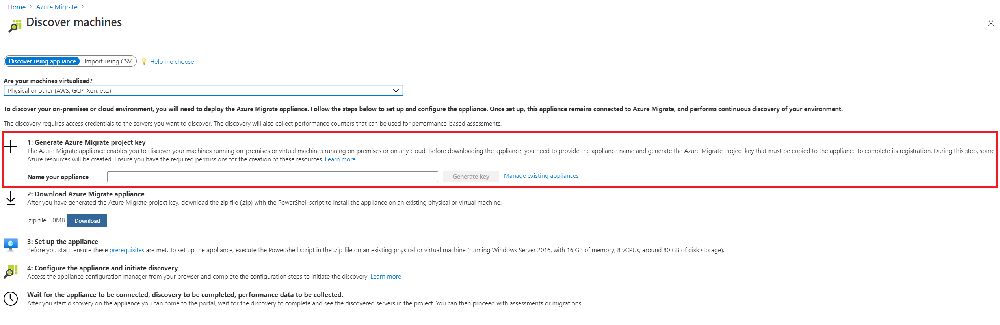

# <a name="tutorial-discover-physical-servers-with-azure-migrate-discovery-and-assessment"></a>教程：使用 Azure Migrate：发现和评估发现物理服务器

在迁移到 Azure 的过程中，你将发现用于评估和迁移的服务器。

本教程演示如何使用 Azure Migrate：发现和评估工具发现本地物理服务器：服务器评估工具，使用轻型 Azure Migrate 设备。 需要将设备部署为物理服务器，以持续发现服务器和性能元数据。

在本教程中，你将了解如何执行以下操作：

> [!div class="checklist"]
> * 设置 Azure 帐户。
> * 准备物理服务器以进行发现。
> * 创建项目。
> * 设置 Azure Migrate 设备。
> * 启动持续发现。

> [!NOTE]
> 教程显示尝试方案的最快路径，并使用默认选项。  

如果没有 Azure 订阅，请在开始之前创建一个[免费帐户](https://azure.microsoft.com/pricing/free-trial/)。

## <a name="prerequisites"></a>先决条件

在开始本教程之前，请先检查是否已满足这些先决条件。

**要求** | **详细信息**
--- | ---
**设备** | 需要一台服务器以运行 Azure Migrate 设备。 服务器应拥有：<br/><br/> - 已安装 Windows Server 2016。<br/> _（目前只有 Windows Server 2016 支持设备部署。）_<br/><br/> - 16 GB RAM，8 个 vCPU，约 80 GB 磁盘存储<br/><br/> - 静态或动态 IP 地址，可直接访问或通过代理访问 Internet。<br/><br/> - 从设备到所需 [URL](migrate-appliance.md#url-access) 的出站 Internet 连接。
**Windows 服务器** | 允许 WinRM 端口 5985 (HTTP) 上的入站连接，使设备可以拉取配置和性能元数据。
**Linux 服务器** | 允许端口 22 (TCP) 上的入站连接。

> [!NOTE]
> 不支持在安装了[复制设备](migrate-replication-appliance.md)或移动服务代理的服务器上安装 Azure Migrate 设备。  确保以前未使用设备服务器来设置复制设备，也未在服务器上安装移动服务代理。

## <a name="prepare-an-azure-user-account"></a>准备 Azure 用户帐户

若要创建项目并注册 Azure Migrate 设备，需要一个具有以下权限的帐户：
- Azure 订阅的参与者或所有者权限。
- 用于注册 Azure Active Directory (AAD) 应用的权限。

如果你刚刚创建了免费的 Azure 帐户，那么你就是订阅的所有者。 如果你不是订阅所有者，请让所有者分配权限，如下所示：

1. 在 Azure 门户中，搜索“订阅”，然后在“服务”下选择“订阅” 。

    

2. 在“订阅”页上，选择要在其中创建项目的订阅。
3. 在“订阅”中，选择“访问控制 (IAM)” > “检查访问权限” 。
4. 在“检查访问权限”中，搜索相关的用户帐户。
5. 在“添加角色分配”中，单击“添加” 。

    

6. 在“添加角色分配”中，选择“参与者”或“所有者”角色，然后选择帐户（在我们的示例中为 azmigrateuser）。 然后单击“保存”  。

    

1. 若要注册设备，你的 Azure 帐户需要具有注册 AAD 应用的权限。
1. 在 Azure 门户中，导航到“Azure Active Directory” > “用户” > “用户设置”  。
1. 在“用户设置”中，验证 Azure AD 用户是否可以注册应用程序（默认情况下设置为“是”） 。

    

9. 如果“应用注册”设置设置为“否”，请请求租户/全局管理员分配所需的权限。 或者，租户/全局管理员可将“应用程序开发人员”角色分配给帐户，以允许注册 AAD 应用。 [了解详细信息](../active-directory/fundamentals/active-directory-users-assign-role-azure-portal.md)。

## <a name="prepare-physical-servers"></a>准备物理服务器

设置一个可供设备用于访问物理服务器的帐户。

**Windows 服务器**

- 对于 Windows 服务器，针对已加入域的服务器使用域帐户，针对未加入域的服务器使用本地帐户。 
- 应将用户帐户添加到这些组：远程管理用户、性能监视器用户和性能日志用户。 
- 如果远程管理用户组不存在，请将用户帐户添加到以下组：WinRMRemoteWMIUsers_。
- 该帐户需要拥有这些权限才能让设备创建与服务器的 CIM 连接，并从此处列出的 WMI 类中拉取所需的配置和性能元数据。
- 在某些情况下，将帐户添加到这些组可能不会从 WMI 类返回所需的数据，因为该帐户可能由 [UAC](/windows/win32/wmisdk/user-account-control-and-wmi) 筛选。 要绕过 UAC 筛选，用户帐户需在目标服务器上的 CIMV2 命名空间和子命名空间中拥有所需的权限。 可按[此处](troubleshoot-appliance.md)所述的步骤启用所需的权限。

    > [!Note]
    > 对于 Windows Server 2008 和 2008 R2，请确保在服务器上安装了 WMF 3.0。

**Linux 服务器**

- 在要发现的服务器上需有一个根帐户。 也可提供拥有 sudo 权限的用户帐户。
- 2021 年 7 月 20 日之后从门户下载的新设备安装程序脚本默认支持添加具有 sudo 访问权限的用户帐户。
- 对于较旧的设备，可按照以下步骤来启用该功能：
    1. 在运行设备的服务器上，打开注册表编辑器。
    1. 导航到 HKEY_LOCAL_MACHINE\SOFTWARE\Microsoft\AzureAppliance。
    1. 创建 DWORD 值为 1 的注册表项“isSudo”。

    :::image type="content" source="./media/tutorial-discover-physical/issudo-reg-key.png" alt-text="显示如何启用 sudo 支持的屏幕截图。":::

- 要发现目标服务器中的配置和性能元数据，需要为[此处](migrate-appliance.md#linux-server-metadata)列出的命令启用 sudo 访问权限。 确保已启用“NOPASSWD”，使帐户能够运行所需的命令，且不会在每次调用 sudo 命令时都提示用户输入密码。
- 以下 Linux OS 发行版支持使用拥有 sudo 访问权限的帐户通过 Azure Migrate 进行发现：

    操作系统 | 版本 
    --- | ---
    Red Hat Enterprise Linux | 6、7、8
    Cent OS | 6.6、8.2
    Ubuntu | 14.04、16.04、18.04
    SUSE Linux | 11.4、12.4
    Debian | 7、10
    Amazon Linux | 2.0.2021
    CoreOS 容器 | 2345.3.0

- 如果无法提供具有 sudo 访问权限的根帐户或用户帐户，则可以在 HKEY_LOCAL_MACHINE\SOFTWARE\Microsoft\AzureAppliance 注册表中将“isSudo”注册表项的值设置为“0”，并使用以下命令为非根帐户提供所需的功能：

**命令** | **用途**
--- | --- |
setcap CAP_DAC_READ_SEARCH+eip /usr/sbin/fdisk <br></br> setcap CAP_DAC_READ_SEARCH+eip /sbin/fdisk _(if /usr/sbin/fdisk is not present)_ | 收集磁盘配置
setcap "cap_dac_override,cap_dac_read_search,cap_fowner,cap_fsetid,cap_setuid,<br>cap_setpcap,cap_net_bind_service,cap_net_admin,cap_sys_chroot,cap_sys_admin,<br>cap_sys_resource,cap_audit_control,cap_setfcap=+eip" /sbin/lvm | 收集磁盘性能数据
setcap CAP_DAC_READ_SEARCH+eip /usr/sbin/dmidecode | 收集 BIOS 序列号
chmod a+r /sys/class/dmi/id/product_uuid | 收集 BIOS GUID

## <a name="set-up-a-project"></a>设置项目

设置新项目。

1. 在 Azure 门户中选择“所有服务”，然后搜索 **Azure Migrate**。
2. 在“服务”下选择“Azure Migrate”。 
3. 在“概述”中，选择“创建项目” 。
5. 在“创建项目”中，选择 Azure 订阅和资源组。 如果没有资源组，请创建一个资源组。
6. 在“项目详细信息”中，指定项目名称以及要在其中创建项目的地理位置。 查看[公有云](migrate-support-matrix.md#supported-geographies-public-cloud)和[政府云](migrate-support-matrix.md#supported-geographies-azure-government)支持的地理位置。

   

7. 选择“创建”。
8. 等待几分钟，让项目完成部署。 默认会将“Azure Migrate：发现和评估”工具添加到新项目。


> [!NOTE]
> 如果你已经创建了一个项目，则可以使用同一个项目注册其他设备，以发现和评估更多服务器。[了解更多](create-manage-projects.md#find-a-project)

## <a name="set-up-the-appliance"></a>设置设备

Azure Migrate 设备执行服务器发现并将服务器配置和性能元数据发送到 Azure Migrate。 可以通过执行 PowerShell 脚本来设置设备，该脚本可从项目下载。

若要设置该设备，请执行以下操作：

1. 提供设备名称，并在门户中生成项目密钥。
2. 从 Azure 门户下载带有 Azure Migrate 安装程序脚本的压缩文件。
3. 从压缩文件中提取内容。 使用管理权限启动 PowerShell 控制台。
4. 执行 PowerShell 脚本以启动设备配置管理器。
5. 完成设备的首次配置，并使用项目密钥将其注册到项目。

### <a name="1-generate-the-project-key"></a>1.生成项目密钥

1. 在 **迁移目标**  >  **服务器**  >  **Azure Migrate：发现和评估** 中，选择 **发现**。
2. 在“发现服务器” > “服务器是否已虚拟化?”中，选择“物理或其他（AWS、GCP、Xen 等）”  。
3. 在“1: 生成项目密钥”中，提供将为发现物理或虚拟服务器而设置的 Azure Migrate 设备的名称。 该名称应是字母数字，长度为 14 个或更少的字符。
1. 单击“生成密钥”，开始创建所需的 Azure 资源。 在创建资源期间，请不要关闭发现服务器页。
1. 成功创建 Azure 资源后，会生成一个 **项目密钥**。
1. 复制密钥，因为配置设备时需要输入该密钥才能完成设备注册。

  [ ](./media/tutorial-assess-physical/generate-key-physical-expanded-1.png#lightbox)

### <a name="2-download-the-installer-script"></a>2.下载安装程序脚本

在“2:下载 Azure Migrate 设备”中，单击“下载”。

### <a name="verify-security"></a>验证安全性

在部署压缩文件之前检查其安全性。

1. 在下载文件的服务器上，打开管理员命令窗口。
2. 运行以下命令以生成 zip 文件的哈希：
    - ```C:\>CertUtil -HashFile <file_location> [Hashing Algorithm]```
    - 用法示例：```C:\>CertUtil -HashFile C:\Users\administrator\Desktop\AzureMigrateInstaller.zip SHA256 ```
3.  验证最新设备版本和哈希值：

    **下载** | **哈希值**
    --- | ---
    [最新版本](https://go.microsoft.com/fwlink/?linkid=2140334) | 15a94b637a39c53ac91a2d8b21cc3cca8905187e4d9fb4d895f4fa6fd2f30b9f

> [!NOTE]
> 可以使用同一脚本为已连接到公共或专用终结点的 Azure 公有云或 Azure 政府云设置物理设备。


### <a name="3-run-the-azure-migrate-installer-script"></a>3.运行 Azure Migrate 安装程序脚本

1. 将压缩文件解压缩到托管设备的服务器上的某个文件夹中。  请确保不要在现有 Azure Migrate 设备上的服务器上运行该脚本。
2. 使用管理（提升）权限在上述服务器上启动 PowerShell。
3. 将 PowerShell 目录更改为从下载的压缩文件中提取内容的文件夹。
4. 通过运行以下命令，运行名为“AzureMigrateInstaller.ps1”的脚本：

    
    ``` PS C:\Users\administrator\Desktop\AzureMigrateInstaller> .\AzureMigrateInstaller.ps1 ```

5. 从方案、云和连接选项中进行选择，以部署具有所需配置的设备。 例如，下面所示的选择会在 Azure 公有云上已建立默认（公共终结点）连接的 Azure Migrate 项目中，设置一个设备用于发现和评估物理服务器（或在 AWS、GCP、Xen 等其他云上运行的服务器） 。

    :::image type="content" source="./media/tutorial-discover-physical/script-physical-default-inline.png" alt-text="显示如何设置具有所需配置的设备的屏幕截图" lightbox="./media/tutorial-discover-physical/script-physical-default-expanded.png":::

6. 此安装程序脚本执行以下操作：

 - 安装代理和 Web 应用程序。
 - 安装 Windows 角色，包括 Windows 激活服务、IIS 和 PowerShell ISE。
 - 下载并安装 IIS 可重写模块。
 - 更新 Azure Migrate 的注册表项 (HKLM) 和永久性设置详细信息。
 - 在路径下创建以下文件：
    - **配置文件**：%Programdata%\Microsoft Azure\Config
    - **日志文件**：%Programdata%\Microsoft Azure\Logs

成功执行脚本后，设备配置管理器将自动启动。

> [!NOTE]
> 如果遇到任何问题，可以访问位于 C:\ProgramData\Microsoft Azure\Logs\AzureMigrateScenarioInstaller_<em>Timestamp</em>.log 的脚本日志来进行故障排除。

### <a name="verify-appliance-access-to-azure"></a>验证设备的 Azure 访问权限

确保设备可以连接到[公有云](migrate-appliance.md#public-cloud-urls)和[政府云](migrate-appliance.md#government-cloud-urls)的 Azure URL。

### <a name="4-configure-the-appliance"></a>4.配置设备

首次设置设备。

1. 在可连接到该设备的任一服务器上打开浏览器，然后打开设备 Web 应用的 URL：**https://*设备名称或 IP 地址*: 44368**。

   或者，可以在桌面上单击应用快捷方式打开该应用。
2. 接受许可条款，并阅读第三方信息。
1. 在 Web 应用 >“设置必备组件”中执行以下操作：
    - **连接**：应用将检查服务器是否可访问 Internet。 如果服务器使用代理：
        - 单击“设置代理”，并指定代理地址（格式为 http://ProxyIPAddress 或 http://ProxyFQDN) ）和侦听端口。
        - 如果代理需要身份验证，请指定凭据。
        - 仅支持 HTTP 代理。
        - 如果已添加代理详细信息或已禁用代理和/或身份验证，请单击“保存”，再次触发连接性检查。
    - **时间同步**：将验证时间。 设备上的时间应与 Internet 时间同步，这样才能正常发现服务器。
    - **安装更新**：Azure Migrate：发现和评估将检查设备上是否安装了最新更新。 检查完成后，可以单击“查看设备服务”查看设备上运行的组件的状态和版本。

### <a name="register-the-appliance-with-azure-migrate"></a>将设备注册到 Azure Migrate

1. 粘贴从门户复制的 **项目密钥**。 如果没有密钥，请转到 **Azure Migrate：发现和评估 > 发现 > 管理现有设备**，选择在生成密钥时提供的设备名称，然后复制相应的密钥。
1. 需要使用设备代码对 Azure 进行身份验证。 单击“登录”将打开包含设备代码的模式，如下所示。

    

1. 单击“复制代码并登录”以复制设备代码，并在新的浏览器选项卡中打开 Azure 登录提示。如果未显示该按钮，请确保已在浏览器中禁用弹出窗口阻止程序。
1. 在新选项卡上，粘贴设备代码并使用 Azure 用户名和密码登录。
   
   不支持使用 PIN 登录。
3. 如果在未登录的情况下意外关闭了登录选项卡，则需要刷新设备配置管理器的浏览器选项卡以再次启用“登录”按钮。
1. 成功登录后，使用设备配置管理器返回到上一个选项卡。
4. 如果用于登录的 Azure 用户帐户对在密钥生成过程中创建的 Azure 资源具有恰当的[权限]()，会启动设备注册。
1. 成功注册设备后，可以通过单击“查看详细信息”来查看注册详细信息。


## <a name="start-continuous-discovery"></a>启动持续发现

现在，从设备连接到要发现的物理服务器，并启动发现。

1. 在 **步骤 1：提供用于发现 Windows 和 Linux 物理服务器或虚拟服务器的凭据，单击“添加凭据”** 。
1. 对于 Windows 服务器，选择作为 **Windows 服务器** 的源类型，指定凭据的友好名称，添加用户名和密码。 单击“保存” 。
1. 如果将基于密码的身份验证用于 Linux 服务器，请选择“Linux 服务器（基于密码）”作为源类型，为凭据指定易用名称，添加用户名和密码。 单击“保存” 。
1. 如果将基于 SSH 密钥的身份验证用于 Linux 服务器，可选择“Linux 服务器(基于 SSH 密钥)”作为源类型，为凭据指定易用名称，添加用户名，浏览并选择 SSH 私钥文件。 单击“保存” 。

    - Azure Migrate 支持由 ssh-keygen 命令使用 RSA、DSA、ECDSA 和 ed25519 算法生成的 SSH 私钥。
    - 目前 Azure Migrate 不支持基于密码的 SSH 密钥。 使用不含密码的 SSH 密钥。
    - 目前 Azure Migrate 不支持 PuTTY 生成的 SSH 私钥文件。
    - Azure Migrate 支持 SSH 私钥文件的 OpenSSH 格式，如下所示：
    
    

1. 如果要一次添加多个凭据，请单击“添加更多”，以保存和添加更多凭据。 物理服务器发现支持多个凭据。
1. 在“步骤 2：提供物理服务器或虚拟服务器详细信息”中，单击“添加发现源”，以指定服务器 IP地址/FQDN 以及为用于连接到服务器的凭据指定易记名称  。
1. 可以一次“添加单个项目”，也可以一次“添加多个项目” 。 还有一个选项是通过“导入 CSV”提供服务器详细信息。


    - 如果选择“添加单个项目”，则可以选择 OS 类型，为凭据指定一个易记名称，并添加服务器“IP 地址/FQDN”，然后单击“保存”  。
    - 如果选择 **添加多个项目**，则可以通过在文本框中指定服务器 **IP 地址/FQDN** 并为凭据指定一个易记名称来一次添加多个记录。 验证**已添加的记录，然后单击 **保存**。
    - 如果选择“导入 CSV”（默认已选），可以下载 CSV 模板文件，并使用服务器 IP地址/FQDN 和凭据的易记名称填充文件。 然后，将该文件导入设备，验证文件中的记录，然后单击“保存” 。

1. 单击保存后，设备将尝试验证与已添加服务器的连接，并在每个服务器的表中显示“验证状态”。
    - 如果服务器验证失败，请通过单击表中“状态”列中的“验证失败”来查看错误。 解决此问题，然后再次验证。
    - 若要删除服务器，请单击“删除”。
1. 在开始发现之前，可以随时 **重新验证** 与服务器之间的连接。
1. 单击“开始发现”，开始发现已成功验证的服务器。 成功启动发现后，你可以针对表中的每个服务器检查发现状态。


随即会启动发现。 每台服务器大约需要 2 分钟，才能将已发现的服务器的元数据显示在 Azure 门户中。

## <a name="verify-servers-in-the-portal"></a>验证门户中的服务器

发现完成后，可以验证服务器是否出现在门户中。

1. 打开 Azure Migrate 仪表板。
2. 在 **Azure Migrate - 服务器**  >  **Azure Migrate：发现和评估** 页中，单击显示了 **已发现服务器** 计数的图标。
## <a name="next-steps"></a>后续步骤

- [评估物理服务器](tutorial-assess-physical.md)以便迁移到 Azure VM。
- [查看设备在发现期间收集的数据](migrate-appliance.md#collected-data---physical)。
