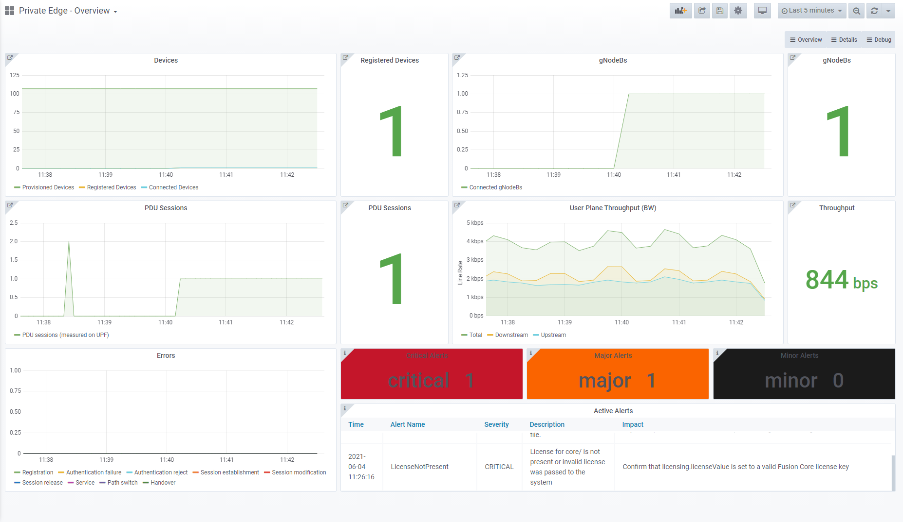

# 什么是 Fusion Core？

Fusion Core 是 3GPP 标准定义的 5G 下一代核心（5G NGC 或 5GC）的云原生实现，使 5G 网络运营商能够通过多种无线和固定接入技术聚合来自所有终端设备的数据流量。 它包括高性能且高度可编程的 5G 用户平面功能 (UPF)、核心控制平面功能、一系列基于服务的体系结构元素和用于网络监视的管理组件。

Fusion Core 可以部署在纯 5G 场景中，也可以与 4G 网络互通。

Fusion Core 实现了以下 5G 网络功能。

|网络功能  |说明  |
|---------|---------|
|**AMF**  访问和移动性管理功能     |此功能支持以下内容。 <ul> <li>终止来自 gNB 的 NAS 信号</li><li>NAS 加密和完整性保护</li><li>注册管理</li><li>连接管理</li><li>移动性管理</li><li>访问身份验证和授权</li><li>安全性上下文管理</li></ul>         |
|**SMF**  会话管理功能     |SMF 支持会话设置、修改和发布。  作为其中的一部分，它提供 UE IP 地址分配和管理，包括 DHCP，以及与会话管理相关的 NAS 信号的终止。  它还为分页设备提供下行链路数据流量的支持，并提供流量引导配置作为会话管理的一部分。         |
|**UPF**  用户平面功能     |UPF 负责处理数据包数据流量。 这包括处理数据包数据流量的路由、转发、检查和 QoS。  它充当数据网络 (DN) 流量以及在不同无线电网络之间进行切换的定位点。         |
|**PCF**  策略控制功能     |PCF 为流量提供中心策略框架，从而提供用于控制平面功能的策略规则并充当订阅信息的源。         |
|**AUSF**  身份验证服务器功能     |AUSF 是 5G 订阅者的身份验证服务器。         |
|**UDM**  统一数据管理     |UDM 支持生成 AKA 凭据、用户标识、访问授权和订阅者管理。         |
|**UDR**  统一数据存储库     |UDR 是聚合所有订阅者信息的存储库。         |
|**NRF**  网络存储库功能     |NRF 为 NF 提供服务发现。         |

在与 4G 网络互通时，它还实现以下网络功能。

|网络功能  |说明  |
|---------|---------|
|**MME**  移动性管理实体     |MME 是 LTE 接入网络的关键控制节点，负责控制 UE 接入网络的各个方面。         |
|**S11-IWF**  S11 互通功能 |S11-IWF 向 4G 移动性管理实体 (MME) 公开 S11 接口，并提供用于支持功能的协议转换。         |
|**UDR**  统一数据存储库     |UDR 是聚合所有订阅者信息的存储库。 Fusion Core 的 UDR 所担任的工作在 4G 场景中通常是由归属用户存储 (HSS) 担任的。 它使用 S6a 接口与 MME 进行交互。         |

下图显示了每个网络功能以及它们用于与第三方组件进行交互的接口。

:::image type="content" source="./media/metaswitch-overview/fusion-core-architecture.png" alt-text="Fusion Core 体系结构":::

Fusion Core 在称为 Fusion Core 基础 VM 的虚拟机 (VM) 上提供。 Fusion Core 基础 VM 旨在部署为 Azure Stack Edge (ASE) 上的 Azure 托管应用程序。 提供 Fusion Core 功能所需的网络功能和基础结构组件作为容器部署在 Fusion Core 基础 VM 上，并由 Kubernetes 进行编排。

:::image type="content" source="./media/metaswitch-overview/fusion-core-base-vm-azure-stack-edge-with-networking.png" alt-text="Azure Stack Edge 上的 Fusion Core 基础 VM":::

## 为什么使用 Fusion Core？

### 在专用网络中部署

Fusion Core 使用 Azure 专用多接入边缘计算的功能为企业提供 5G 解决方案，该解决方案结合了支持工业 4.0 用例所需的边缘计算资源的性能和低延迟，并通过 Azure 进行一致的集中管理。 有关专用多接入边缘计算的详细信息，请参阅[什么是 Azure 专用多接入边缘计算？](overview.md)

在企业边缘部署 Fusion Core 可确保它尽可能靠近它所服务的设备，当与同一位置中的应用程序逻辑结合时，这使它可以通过本地数据处理提供低延迟级别以及缩短的回程。 这为企业提供了大量有价值的好处，包括以下各项。

- **自动化** - 可以实时处理来自自动化系统（例如机器人）的命令和控制消息以防止停滞，确保更高的生产力。
- **遥测** - 可以实时处理用于运行状况评估和自动化系统操作的遥测数据，以防止事故并确保现场安全。
- **分析** - 可以以最小支出传输大量操作和诊断数据，确保至关重要的操作不会出现延迟。

:::image type="content" source="./media/metaswitch-overview/enterprise-edge-latency.png" alt-text="专用 5G 边缘的 Fusion Core":::

Fusion Core 可以利用此低延迟以及专用 5G 网络提供的安全性和高带宽，从而实现对工业 4.0 用例的最优支持，例如以下各项。

- **制造** - 使用机器人实现生产线分析和仓库自动化。
- **公共安全** - 应急人员和灾难恢复人员的移动性和连接性。
- **能源和公用事业** - 用于智能电表和网络切片/控制的回程网络。
- **防御** - 通过实时分析连接指挥所和战场。
- **智能农场** - 用于农场运营的连接设备。

### 纯 5G 和 4G 互通支持

Fusion Core 可以部署在纯 5G 场景中。 在这种情况下，Fusion Core 以 5G 独立模式运行。

Fusion Core 还支持 4G 互通，通过云原生核心为 4G UE 提供服务。 这称为 4G 模式。 对于全新和现有的网络运营商而言，4G 模式可提供到 5G 的直接途径，这使他们无需继续在维护 4G 核心上投入资金。

### 服务保证和 KPI 指标

Fusion Core 与 Metaswitch 的 Service Assurance Server (SAS) 集成，从而提供对所有消息流量主动且实时的分析，包括 NGAP/NAS 消息和 HTTP 请求和响应。

Service Assurance Server 提供了一个 Web GUI，你可以用来收集涉及 Fusion Core 的信号流的详细跟踪信息。 这些信息可用于诊断影响用户服务的许多常见配置、网络和互操作性问题。

:::image type="content" source="./media/metaswitch-overview/service-assurance-server-detailed-timeline.png" alt-text="Service Assurance Server Web GUI 中的详细时间线视图":::

Fusion Core 还与 Metaswitch ServiceIQ Monitoring 集成，后者可提供行业标准云原生监视工具，例如 Prometheus 和 Grafana，从而实现实时分析系统性能、故障识别和故障排除。

ServiceIQ Monitoring 在 Fusion Core VM 上运行，使你能够访问大量 Fusion Core 仪表板，通过这些仪表板，可以灵活地监视与 Fusion Core 部署相关的关键指标。 还可以通过它们查看有关触发警报的信息，确保可以对新出现的问题做出快速反应。

### 其他功能

|功能  |说明  |
|---------|---------|
|**网络切片**     |可以将 Fusion Core 部署配置为提供多个网络切片来多路复用独立的逻辑网络。 单一 Fusion Core 部署中的所有网络功能都为所有配置的切片提供服务。  可以选择为订阅者预配他们允许和默认的切片，并定义切片特定的策略 (QoS)，从而提供一种简单且通用的机制来维护订阅者组的管理分离。         |
|**支持的 5G 流程**     |当作为更广泛的专用 5G 解决方案的一部分运行时，Fusion Core 在以下流程中符合 3GPP TS 23.502 标准。<ul><li>UE 注册/注销</li><li>移动性注册更新/定期注册更新</li><li>UE 发起的服务请求（信号/数据）</li><li>AN/网络发起的 UE 上下文发布</li><li>PDU 会话建立</li><li>PDU 会话发布</li><li>基于 N2 的 NG-RAN 节点间切换</li><li>基于 Xn 的 NG-RAN 间切换</li><li>网络发起的下行链路数据通知/分页</li>        |
|**UE 身份验证**     |<ul><li>安全定位点功能 (SEAF) 支持在服务网络中提供身份验证功能。</li><li>使用订阅永久标识符 (SUPI)、订阅隐藏标识符 (SUCI) 和全局唯一的临时标识 (5G-GUTI) 进行身份验证。</li><li>向 UE 分配或重新分配 5G-GUTI。</li><li>第三代移动通信技术身份验证和密钥协议 (EAP-AKA) 和 5G 身份验证和密钥协议 (5G-AKA) 用于 UE 和网络之间的相互身份验证。</li><li>基于演进式封包系统的身份验证和密钥协议 (EPS-AKA) 用于在 4G 模式下运行的部署。</li>         |
|**UE 安全性上下文管理**     |Fusion Core 的 AMF 对 5G NAS 执行加密和完整性保护。 在 UE 注册期间，UE 通过 128 位密钥将它用于 5G NAS 的安全功能包含在内。  Fusion Core 支持用于加密和完整性保护的算法包括以下各项。<ul><li>5GS 空加密算法</li><li>128 位 Snow3G</li><li>128 位 AES</li><li>128 位 ZUC</li>        |
|**UE MTU 配置**     |作为 PDU 会话建立过程的一部分，Fusion Core 的 SMF 根据请求将数据网络的 MTU 通过信号发送给 UE 以避免碎片化。         |
|**策略控制**     |Fusion Core 基于每个 PDU 会话和每个流应用端到端策略控制决策和执行措施。 这提供了将不同的 QoS 级别应用于特定流或 UE 所需的灵活性，并使你可以有选择地向 UE 组公开服务或数据网络，并控制流经网络的流量类型。         |
|**UPF 访问控制列表 (ACL)**     |ACL 可用于允许或阻止源自特定 IPv4 地址范围或流向特定 IPv4 地址范围的流量。 可以在 Fusion Core 的访问 (N3) 和核心 (N6) 接口中配置 ACL。         |
|**RAT/频率选择优先级 (RFSP) 的索引**     |Fusion Core 的 AMF 可以提供具有 RFSP 索引的 RAN，使 RAN 可以与其本地配置相匹配以应用特定的无线电资源管理策略，例如小区重选或频率层重定向。         |

## 后续步骤

- 了解如何[部署 Fusion Core](deploy-metaswitch-fusion-core-solution.md)

