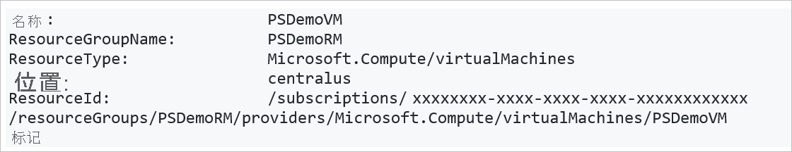
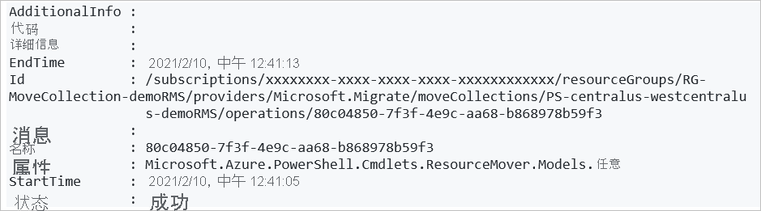

# <a name="move-resources-across-regions-in-powershell"></a>使用 PowerShell 在区域之间移动资源

本文介绍如何使用 [Azure 资源转移器](overview.md)中的 PowerShell 将 Azure 资源转移到其他 Azure 区域。

在本教程中，你将了解如何执行以下操作：

> [!div class="checklist"]
> * 查看先决条件和要求。
> * 设置移动集合。
> * 将资源添加到移动集合，并解析依赖项。
> * 准备并移动源资源组。 
> * 准备并移动其他资源。
> * 确定是放弃还是提交移动。 
> * 移动后，可以选择删除源区域中的资源。

> [!NOTE]
> 教程显示尝试方案的最快路径，并使用默认选项。 

如果没有 Azure 订阅，请在开始之前创建一个[免费帐户](https://azure.microsoft.com/pricing/free-trial/)。 然后登录到 [Azure 门户](https://portal.azure.com)。

## <a name="prerequisites"></a>先决条件
**要求** | **说明**
--- | ---
**订阅权限** | 请检查你对包含待移动资源的订阅是否具有“所有者”访问权限<br/><br/> 为什么需要“所有者”访问权限？ 首次为 Azure 订阅中的特定源和目标对添加资源时，资源转移器将创建受订阅信任的[系统分配的托管标识](../active-directory/managed-identities-azure-resources/overview.md#managed-identity-types)（以前称为托管服务标识 (MSI)）。 若要创建标识，并为其分配所需的角色（来源订阅中的参与者或用户访问管理员），用于添加资源的帐户需要对订阅的“所有者”权限。 [详细了解](../role-based-access-control/rbac-and-directory-admin-roles.md#azure-roles) Azure 角色。
资源移动器支持 | [查看](common-questions.md)支持的区域和其他常见问题。
**VM 支持** |  检查要移动的 VM 是否受支持。<br/><br/> - [验证](support-matrix-move-region-azure-vm.md#windows-vm-support)受支持的 Windows VM。<br/><br/> - [验证](support-matrix-move-region-azure-vm.md#linux-vm-support)受支持的 Linux VM 和内核版本。<br/><br/> - 检查受支持的[计算](support-matrix-move-region-azure-vm.md#supported-vm-compute-settings)、[存储](support-matrix-move-region-azure-vm.md#supported-vm-storage-settings)和[网络](support-matrix-move-region-azure-vm.md#supported-vm-networking-settings)设置。
**SQL 支持** | 如果想要移动 SQL 资源，请查看 [SQL 要求列表](tutorial-move-region-sql.md#check-sql-requirements)。
目标订阅 | 目标区域中的订阅需要足够的配额来创建要在目标区域中移动的资源。 如果没有配额，请[请求其他限制](../azure-resource-manager/management/azure-subscription-service-limits.md)。
目标区域费用 | 验证与要将 VM 移动到的目标区域关联的定价和费用。 请使用[定价计算器](https://azure.microsoft.com/pricing/calculator/)来帮助你。

### <a name="review-powershell-requirements"></a>查看 PowerShell 要求

无论是使用 Azure 门户还是 PowerShell，大多数移动资源操作是相同的，只有几个例外。

**操作** | **Portal** | **PowerShell**
--- | --- | ---
创建移动集合 | 移动集合（要移动的所有资源的列表）会自动创建。 所需的标识权限会由门户在后端中分配。 | 使用 PowerShell cmdlet 执行以下操作：<br/><br/> - 为移动集合创建资源组，并指定其位置。<br/><br/> - 为集合分配托管标识。<br/><br/> - 为集合添加资源。
删除移动集合 | 无法直接在门户中删除移动集合。 | 使用 PowerShell cmdlet 删除移动集合。
资源移动操作<br/><br/> （准备、启动移动和提交等）。| 资源移动器自动验证的单个步骤。 | PowerShell cmdlet 可以：<br/><br/> 1) 验证依赖项。<br/><br/> 2) 执行移动。
**删除源资源** | 直接在资源移动器门户中。 | 资源类型级别的 PowerShell cmdlet。


### <a name="sample-values"></a>示例值

在脚本示例中使用以下值：

**设置** | **值** 
--- | ---
订阅 ID | subscription-id
源区域 |  美国中部
目标区域 | 美国中西部
资源组（为移动集合保留元数据） | RG-MoveCollection-demoRMS
移动集合名称 | PS-centralus-westcentralus-demoRMS
资源组（源区域） | PSDemoRM 
资源组（目标区域） | PSDemoRM-target
资源移动服务位置 | 美国东部 2
IdentityType | SystemAssigned
要移动的 VM | PSDemoVM


## <a name="sign-into-azure"></a>登录 Azure

使用 Connect-AzAccount cmdlet 登录到 Azure 订阅：

```azurepowershell-interactive
Connect-AzAccount – Subscription "<subscription-id>"
```

## <a name="set-up-the-move-collection"></a>设置移动集合

MoveCollection 对象存储有关要移动的资源的元数据和配置信息。 若要设置移动集合，请执行以下操作：

- 为移动集合创建资源组。
- 将服务提供程序注册到订阅，以便可以创建 MoveCollection 资源。
- 创建具有托管标识的 MoveCollection 对象。 为使 MoveCollection 对象能够访问资源转移器服务所在的订阅，它需要一个受订阅信任的[系统分配的托管标识](../active-directory/managed-identities-azure-resources/overview.md#managed-identity-types)（以前称为托管服务标识，MSI）。
- 为托管标识授予访问资源移动器订阅的权限。

### <a name="create-the-resource-group"></a>创建资源组

为移动集合元数据和配置信息创建资源组，如下所示：

```azurepowershell-interactive
New-AzResourceGroup -Name "RG-MoveCollection-demoRMS" -Location "East US 2"
```
**输出**：


### <a name="register-the-resource-provider"></a>注册资源提供程序

1. 注册资源提供程序 Microsoft.Migrate，以便可以创建 MoveCollection 资源，如下所示：

    ```azurepowershell-interactive
    Register-AzResourceProvider -ProviderNamespace Microsoft.Migrate
    
2. Wait for registration:

    ```azurepowershell-interactive 
    While(((Get-AzResourceProvider -ProviderNamespace Microsoft.Migrate)| where {$_.RegistrationState -eq "Registered" -and $_.ResourceTypes.ResourceTypeName -eq "moveCollections"}|measure).Count -eq 0)
    {
        Start-Sleep -Seconds 5
        Write-Output "Waiting for registration to complete."
    }
    ```
### <a name="create-a-movecollection-object"></a>创建 MoveCollection 对象

创建 MoveCollection 对象，并为其分配托管标识，如下所示： 

```azurepowershell-interactive
New-AzResourceMoverMoveCollection -Name "PS-centralus-westcentralus-demoRMS"  -ResourceGroupName "RG-MoveCollection-demoRMS" -SourceRegion "centralus" -TargetRegion "westcentralus" -Location "centraluseuap" -IdentityType "SystemAssigned"
```

**输出**：


### <a name="grant-access-to-the-managed-identity"></a>为托管标识授予访问权限

为托管标识授予访问资源移动器订阅的权限，如下所示。 你必须是订阅所有者。

1. 检索 MoveCollection 对象的标识详细信息。

    ```azurepowershell-interactive
    $moveCollection = Get-AzResourceMoverMoveCollection -SubscriptionId $subscriptionId -ResourceGroupName "RG-MoveCollection-demoRMS" -Name "PS-centralus-westcentralus-demoRMS"

    $identityPrincipalId = $moveCollection.IdentityPrincipalId   
    ``` 

2. 为标识分配所需角色，以便 Azure 资源移动器可以访问你的订阅，以帮助移动资源。

    ```azurepowershell-interactive
    New-AzRoleAssignment -ObjectId $identityPrincipalId -RoleDefinitionName Contributor -Scope "/subscriptions/$subscriptionId"

    New-AzRoleAssignment -ObjectId $identityPrincipalId -RoleDefinitionName "User Access Administrator" -Scope "/subscriptions/$subscriptionId"
    ``` 

## <a name="add-resources-to-the-move-collection"></a>将资源添加到移动集合

检索想要移动的现有源资源的 ID。 创建目标资源设置对象，然后将资源添加到移动集合。

> [!NOTE]
> 添加到移动集合的资源必须在同一订阅中，但可以在不同的资源组中。

添加资源，如下所示：

1. 获取源资源 ID：

    ```azurepowershell-interactive
    Get-AzResource -Name PSDemoVM -ResourceGroupName PSDemoRM
    ```

    **输出**

    

2. 根据要移动的资源，创建目标资源设置对象。 在本例中，它是一个 VM。

    ```azurepowershell-interactive
    $targetResourceSettingsObj = New-Object Microsoft.Azure.PowerShell.Cmdlets.ResourceMover.Models.Api202101.VirtualMachineResourceSettings
    ```

3. 为对象设置资源类型和目标资源名称。

    ```azurepowershell-interactive
    $targetResourceSettingsObj.ResourceType = "Microsoft.Compute/virtualMachines"
    $targetResourceSettingsObj.TargetResourceName = "PSDemoVM"
    ```
    > [!NOTE]
    > 我们的目标 VM 与源区域中的 VM 具有相同的名称。 你可以选择其他名称。

4. 使用已检索/创建的资源 ID 和目标设置对象，将源资源添加到移动集合。

    ```azurepowershell-interactive
    Add-AzResourceMoverMoveResource -ResourceGroupName "RG-MoveCollection-demoRMS" -MoveCollectionName "PS-centralus-westcentralus-demoRMS" -SourceId "/subscriptions/xxxxxxxx-xxxx-xxxx-xxxx xxxxxxxxxxxx/resourceGroups/
    PSDemoRM/providers/Microsoft.Compute/virtualMachines/PSDemoVM" -Name "PSDemoVM" -ResourceSetting $targetResourceSettingsObj
    ```

    输出 

## <a name="validate-and-add-dependencies"></a>验证并添加依赖项

检查已添加的资源是否对其他资源具有依赖性，并根据需要添加。 

1. 验证依赖项，如下所示：

    ```azurepowershell-interactive
    Resolve-AzResourceMoverMoveCollectionDependency -ResourceGroupName "RG-MoveCollection-demoRMS" -MoveCollectionName "PS-centralus-westcentralus-demoRMS"
    ```
    输出（如果依赖项存在）

    

2. 缺少依赖项的标识：

    - 若要检索所有缺失的依赖项的列表：

        ```azurepowershell-interactive
        Get-AzResourceMoverUnresolvedDependency -MoveCollectionName "PS-centralus-westcentralus-demoRMS" -ResourceGroupName "RG-MoveCollection-demoRMS" -DependencyLevel Descendant"
        ```
        输出   

    - 若要仅检索第一级别的依赖项（资源的直接依赖项）：

        ```azurepowershell-interactive
        Get-AzResourceMoverUnresolvedDependency -MoveCollectionName "PS-centralus-westcentralus-demoRMS" -ResourceGroupName "RG-MoveCollection-demoRMS" -DependencyLevel Direct
        ```
        输出   

3. 若要添加任何未完成的缺失的依赖项，请重复上述说明，[将资源添加到移动集合](#add-resources-to-the-move-collection)，并重新验证，直到没有未完成的资源。

> [!NOTE]
> 如果出于任何原因，你需要从资源集合删除资源，请遵循[本文](remove-move-resources.md)中的说明。

## <a name="add-the-source-resource-group"></a>添加源资源组

添加源资源组，该资源组包含你想要移动到移动集合的资源。

1. 检索资源组的 ID。

    ```azurepowershell-interactive
    Get-AzResourceMoverUnresolvedDependency -MoveCollectionName "PS-centralus-westcentralus-demoRMS" -ResourceGroupName "RG-MoveCollection-demoRMS" -DependencyLevel Direct
    ```
    输出   

    > [!NOTE]
    > 我们将使用已在目标区域中的资源组。

 
2. 使用检索的 ID 将资源组添加到集合。

    ```azurepowershell-interactive
    Add-AzResourceMoverMoveResource -ResourceGroupName "RG-MoveCollection-demoRMS"  -MoveCollectionName "PS-centralus-westcentralus-demoRMS" -SourceId "/subscriptions/xxxxxxxx-xxxx-xxxx-xxxx-xxxxxxxxxxxx/resourcegroups/psdemorm"  -Name "psdemorm"  -ExistingTargetId "/subscriptions/xxxxxxxx-xxxx-xxxx-xxxx-xxxxxxxxxxxx/resourcegroups/PSDemoRM-target"
    ```
    输出 

3. 验证依赖项，以确保在添加资源组后没有缺少任何依赖项。

    ```azurepowershell-interactive
    Resolve-AzResourceMoverMoveCollectionDependency -ResourceGroupName "RG-MoveCollection-demoRMS" -MoveCollectionName "PS-centralus-westcentralus-demoRMS"
    ```
4. 我们发现不存在未完成的依赖项。

    输出 


## <a name="prepare-resources"></a>准备资源

在移动之前，通常需要在源区域中准备资源。 例如：

- 若要移动 Azure 虚拟网络、网络适配器、负载均衡器和网络安全组等无状态资源，可能需要导出 Azure 资源管理器模板。
- 若要移动 Azure VM 和 SQL 数据库等有状态的资源，可能需要开始将资源从源复制到目标区域。

在本教程中，由于我们要移动 VM，因此在开始准备 VM 前，我们需要准备源资源组，并且启用并提交其移动。

> [!NOTE]
> 如果你有现有的目标资源组，则可以直接为源资源组提交移动，并跳过准备和启动移动阶段。

  
### <a name="prepare-the-source-resource-group"></a>准备源资源组：

1. 准备资源组：

    ```azurepowershell-interactive
    Invoke-AzResourceMoverPrepare -ResourceGroupName "RG-MoveCollection-demoRMS" -MoveCollectionName "PS-centralus-westcentralus-demoRMS"  -MoveResource “PSDemoRM”
    ```
    **输出**

    

2. 启动源资源组的移动。

    ```azurepowershell-interactive
    "RG-MoveCollection-demoRMS" -MoveCollectionName "PS-centralus-westcentralus-demoRMS"  -MoveResource “PSDemoRM”
    ```
    

3. 为源资源组提交移动。

    ```azurepowershell-interactive
    Invoke-AzResourceMoverCommit -ResourceGroupName "RG-MoveCollection-demoRMS" -MoveCollectionName "PS-centralus-westcentralus-demoRMS"  -MoveResource “PSDemoRM”
    ```
    **输出**

    


### <a name="prepare-vm-resources"></a>准备 VM 资源

准备并移动源资源组后，我们可以为移动准备 VM 资源。

1. 在准备 VM 资源前，验证依赖项。

    ```azurepowershell-interactive
    $resp = Invoke-AzResourceMoverPrepare -ResourceGroupName "RG-MoveCollection-demoRMS" -MoveCollectionName "PS-centralus-westcentralus-demoRMS"  -MoveResource $('psdemovm') -ValidateOnly
    ```
    **输出**

    

2. 获取需要与 VM 一起准备的依赖性资源。

    ```azurepowershell-interactive
    $resp.AdditionalInfo[0].InfoMoveResource
    ```
    **输出**

    

3. 为所有依赖性资源启动准备过程。

    ```azurepowershell-interactive
    Invoke-AzResourceMoverPrepare -ResourceGroupName "RG-MoveCollection-demoRMS" -MoveCollectionName "PS-centralus-westcentralus-demoRMS"  -MoveResource $('PSDemoVM','psdemovm111', 'PSDemoRM-vnet','PSDemoVM-nsg')
    ```
    **输出**

    


    > [!NOTE]
    > 可以提供源资源 ID（而不是资源名称）作为准备 cmdlet 的输入参数，在启动移动和提交 cmdlet 中同样如此。 若要执行此操作，请运行：


    ```azurepowershell-interactive
        Invoke-AzResourceMoverPrepare -ResourceGroupName "RG-MoveCollection-demoRMS" -MoveCollectionName "PS-centralus-westcentralus-demoRMS" -MoveResourceInputType MoveResourceSourceId  -MoveResource $('/subscriptions/xxxxxxxx-xxxx-xxxx-xxxx-xxxxxxxxxxxx/resourceGroups/PSDemoRMS/providers/Microsoft.Network/networkSecurityGroups/PSDemoVM-nsg')
    ```

## <a name="initiate-move-of-vm-resources"></a>启动 VM 资源的移动

1. 验证 VM 资源是否处于启动移动挂起状态：

    ```azurepowershell-interactive
    Get-AzResourceMoverMoveResource  -SubscriptionId “ xxxxxxxx-xxxx-xxxx-xxxx-xxxxxxxxxxxx “ -ResourceGroupName “RG-MoveCollection-demoRMS” -MoveCollectionName “PS-centralus-westcentralus-demoRMS ”   | Where-Object {  $_.MoveStatusMoveState -eq “InitiateMovePending” } | Select Name
    ```    

    **输出**

    

2. 启动移动：

    ```azurepowershell-interactive
    Invoke-AzResourceMoverInitiateMove -ResourceGroupName "RG-MoveCollection-demoRMS" -MoveCollectionName "PS-centralus-westcentralus-demoRMS"  -MoveResource $('psdemovm111', 'PSDemoRM-vnet','PSDemoVM-nsg', ‘PSDemoVM’) -MoveResourceInputType "MoveResourceId"
    ```    

    **输出**

    


## <a name="discard-or-commit"></a>放弃还是提交？

初始移动后，你可以决定是提交移动，还是放弃它。 

- **放弃**：如果要测试，并且不想实际移动源资源，则可能需要放弃移动。 放弃移动会将资源返回到“启动移动挂起”状态。 然后可以根据需要再次启动移动。
- **提交**：提交即完成移动到目标区域的操作。 提交后，源资源将处于“删除源挂起”状态，你可以决定是否要删除它。

### <a name="discard-the-move"></a>放弃移动

放弃移动：

```azurepowershell-interactive
Invoke-AzResourceMoverDiscard -ResourceGroupName "RG-MoveCollection-demoRMS" -MoveCollectionName "PS-centralus-westcentralus-demoRMS"  -MoveResource $('psdemovm111', 'PSDemoRM-vnet','PSDemoVM-nsg', ‘PSDemoVM’) -MoveResourceInputType "MoveResourceId"
```
**输出**


### <a name="commit-the-move"></a>提交移动

1. 提交移动，如下所示：

    ```azurepowershell-interactive
    Invoke-AzResourceMoverCommit -ResourceGroupName "RG-MoveCollection-demoRMS" -MoveCollectionName "PS-centralus-westcentralus-demoRMS"  -MoveResource $('psdemovm111', 'PSDemoRM-vnet','PSDemoVM-nsg', ‘PSDemoVM’) -MoveResourceInputType "MoveResourceId"
    ```
    **输出**

    

2. 验证是否所有资源都已移动到目标区域：

    ```azurepowershell-interactive
    Get-AzResourceMoverMoveResource  -ResourceGroupName “RG-MoveCollection-demoRMS ” -MoveCollectionName “PS-centralus-westcentralus-demoRMS”   
    ```
    所有资源在目标区域中现在都处于“删除源挂起”状态。

## <a name="delete-source-resources"></a>删除源资源

提交移动并验证资源可在目标区域中按预期工作后，可以使用 [PowerShell](../azure-resource-manager/management/manage-resources-powershell.md#delete-resources) 或 [Azure CLI](../azure-resource-manager/management/manage-resources-cli.md#delete-resources) 删除 [Azure 门户](../azure-resource-manager/management/manage-resources-portal.md#delete-resources)中的每个源资源。

## <a name="next-steps"></a>后续步骤

在本教程中，你将了解：

> [!div class="checklist"]
> * 使用 PowerShell 将 Azure VM 移动到了其他 Azure 区域。
> * 将与 VM 关联的资源移动到其他区域。

现在，尝试使用门户移动 Azure VM

> [!div class="nextstepaction"]
> [在门户中移动 Azure VM](./tutorial-move-region-virtual-machines.md)


