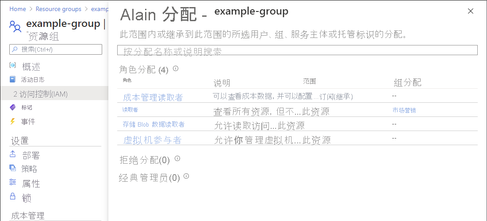
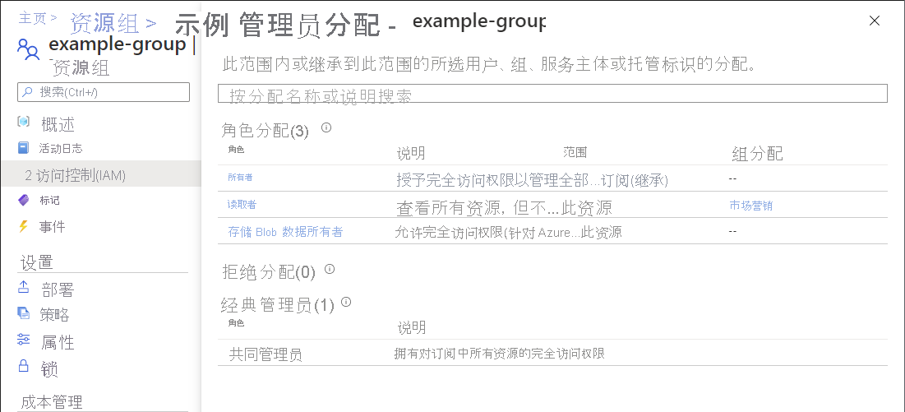

# 快速入门：检查用户对 Azure 资源的访问权限

有时，需检查用户对一组 Azure 资源的访问权限。 可通过列出用户的分配来检查其拥有的访问权限。 使用访问控制 (IAM) 页上的“检查访问权限”功能可快速检查单个用户的访问权限 。

## 步骤 1：打开 Azure 资源

若要检查用户的访问权限，首先需打开要检查其访问权限的 Azure 资源。 Azure 资源分为多个级别，这些级别通常称为范围。 在 Azure 中，可在从广义到狭义的四个级别指定范围：管理组、订阅、资源组或资源。

请按照以下步骤打开要检查其访问权限的 Azure 资源集。

1. 打开 [Azure 门户](https://portal.azure.com)。

1. 打开 Azure 资源集，例如管理组、订阅、资源组或特定资源  。

1. 单击该范围内的特定资源。

    下面展示了一个示例资源组。

    

## 步骤 2：查看用户的访问权限

请按照以下步骤检查单个用户、组、服务主体或托管标识对先前选择的 Azure 资源的访问权限。

1. 单击“访问控制(IAM)”。

    下面显示了资源组的“访问控制(IAM)”页的示例。

    

1. 在“检查访问权限”选项卡上的“查找”列表中，选择要检查其访问权限的用户、组、服务主体或托管标识 。

1. 在搜索框中，输入字符串以在目录中搜索显示名称、电子邮件地址或对象标识符。

    

1. 单击安全主体以打开“分配”窗格。

    在此窗格上，可以查看在此范围和继承到此范围的所选安全主体的访问权限。 未列出在子范围的分配。 你会看到以下分配：

    - 通过 Azure RBAC 添加的角色分配。
    - 使用 Azure 蓝图或 Azure 托管应用添加的拒绝分配。
    - 经典部署的经典服务管理员或共同管理员分配。 

    

## 步骤 3：检查访问权限

请按照以下步骤检查对先前选择的 Azure 资源的访问权限。

1. 单击“访问控制(IAM)”。

1. 在“检查访问权限”选项卡上，单击“查看我的访问权限”按钮 。

    此时会出现“分配”窗格，其中列出了在此范围和继承到此范围的访问权限。 未列出在子范围的分配。

    

## 后续步骤

> [!div class="nextstepaction"]
> [使用 Azure 门户列出 Azure 角色分配](role-assignments-list-portal.md)
